---
title: macOS CatalinaでEnterprise Architect + RDRA2.0アドイン環境の構築
tags:
- wine
- RDRA2.0
- ICONIX
date: 2020-05-01T00:00:00+09:00
URL: https://wand-ta.hatenablog.com/entry/2020/04/24/000000
EditURL: https://blog.hatena.ne.jp/wand_ta/wand-ta.hatenablog.com/atom/entry/26006613559399824
-------------------------------------


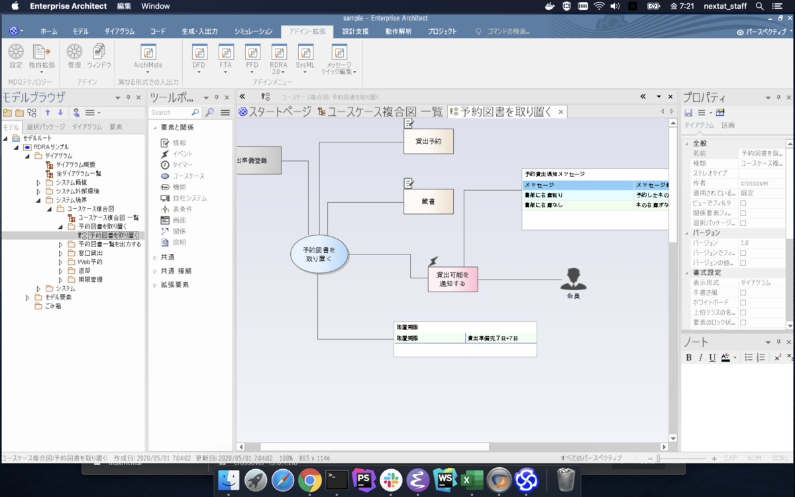

# 環境 #

- macOS Catalina 10.15.4
- Enterprise Architect 15.0
  - RDRA2.0プラグインの動作のために15.0以降が必要
  - 長いので以下EAとする
- CrossOver 19.0.1
  - EA公式サイトにて「Catalinaで動かすにはCrossOver mac 19が必要」と明言されている


## Enterprise Architect ##

[https://www.sparxsystems.jp/products/EA/ea.htm:embed:cite]

- ICONIXやRDRA2.0を描きたいので触っている
  - 特にRDRA2.0は他にツールがない
    - PowerPoint + VBAで頑張るという道もあるが…


## CrossOver mac ##

[https://www.codeweavers.com/products/download_trial/download_links:embed:cite]

- 有償版[wine](https://wiki.archlinux.jp/index.php/Wine)
- 自分でビルドしたwineにEnterprise Architectをインストールできなかったので、CrossOver mac 19.0.1を購入
  - `wine32on64` というのがミソのよう
    - EA自体は32bit
    - macOS Catalinaは64bitしか動かない

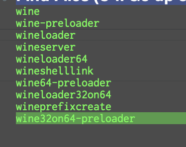


# CrossOverインストール・ボトル作成 #


- あらかじめ`システム環境設定 > セキュリティとプライバシー > プライバシー` から、フルアクセス権限など与えておくとよい

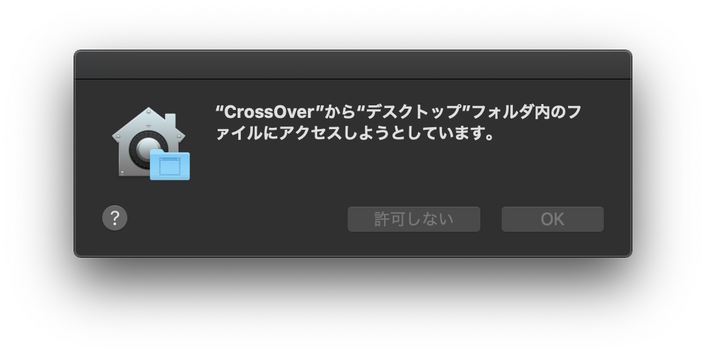

- 空のWindows10 (**64bitでない**)を作る

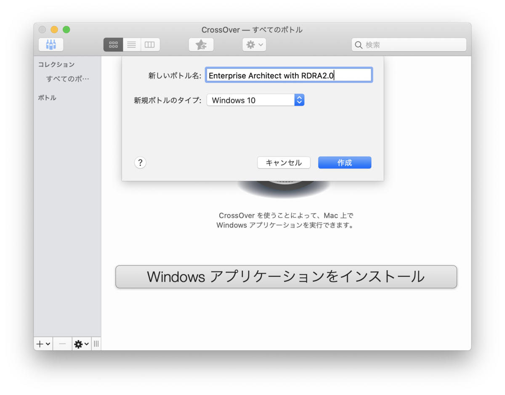

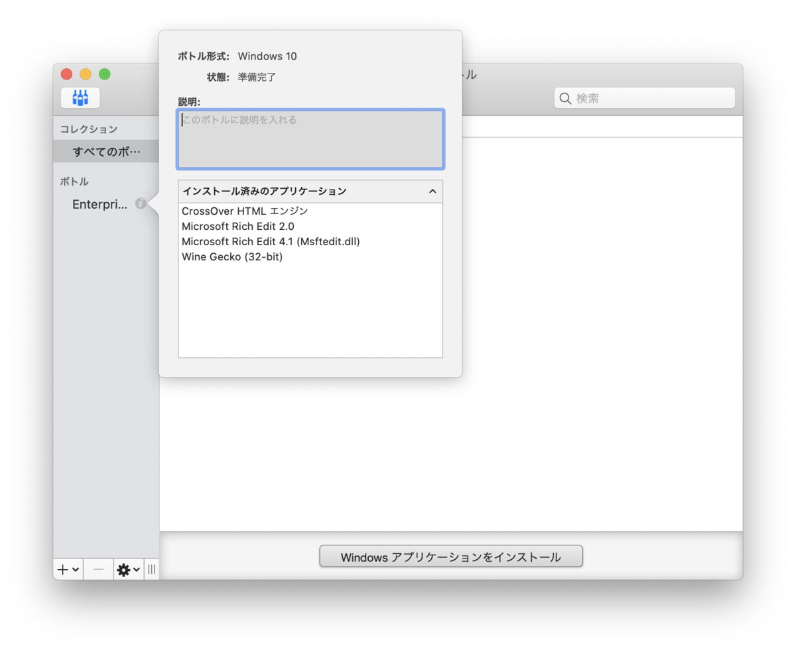


# EAのインストール #

- 買うか試用版(英語)のmsiで入れる

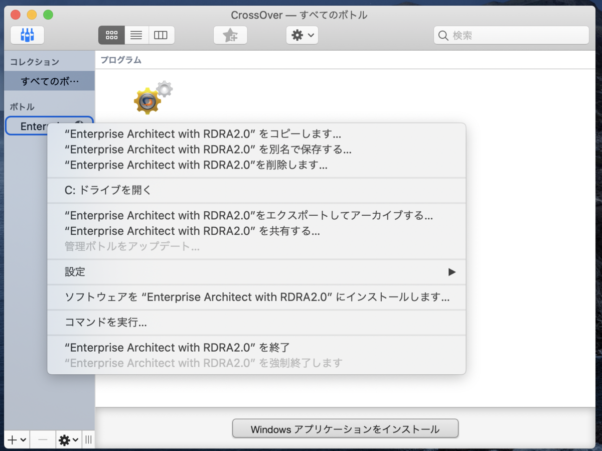

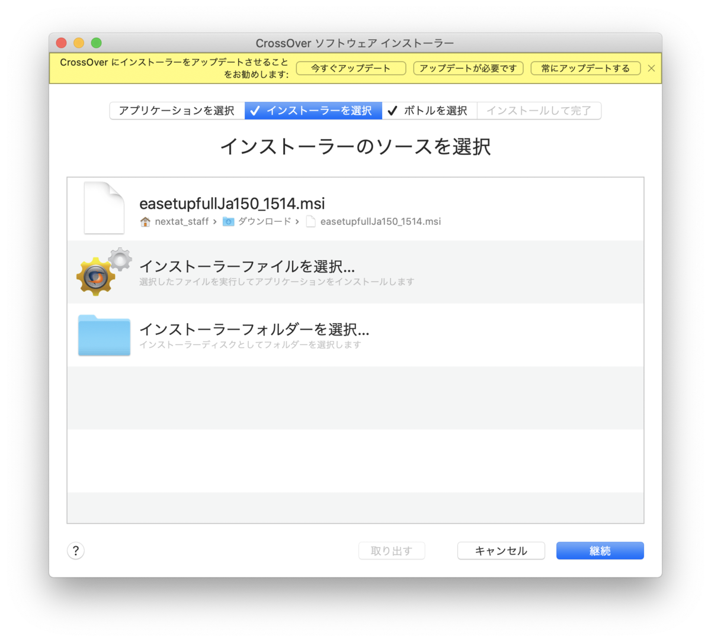


# RDRA2.0アドインのインストール #


[https://www.sparxsystems.jp/products/EA/tech/RDRA.htm:embed:cite]

- msiで入れる
- EAをインストールしたボトルと同じボトルにインストールする
  - ボトルごとにCドライブが切られるので
- 試用版EAの場合、インストール先が異なることに注意

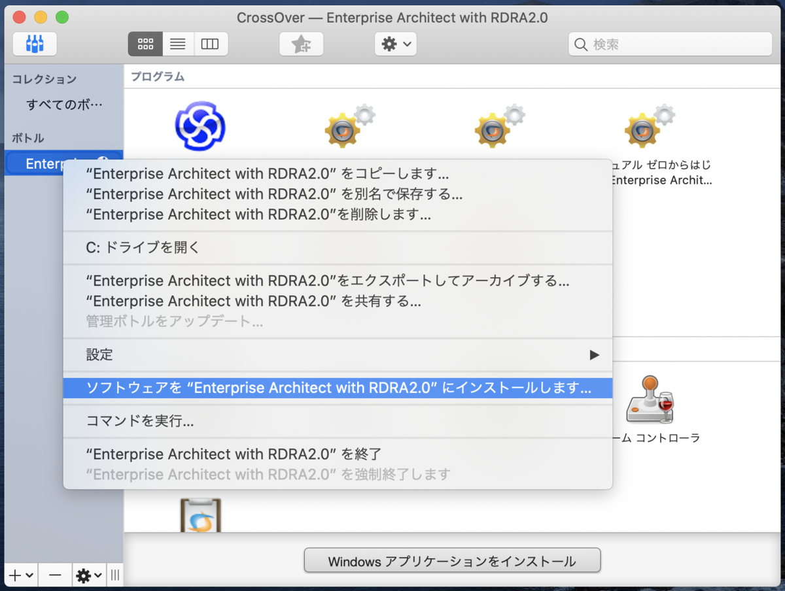

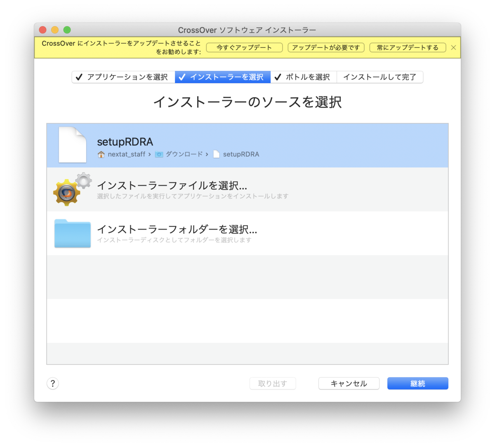


# 必要なライブラリ等のインストール #

- この時点でのボトルのインストール状況はこんな感じ:

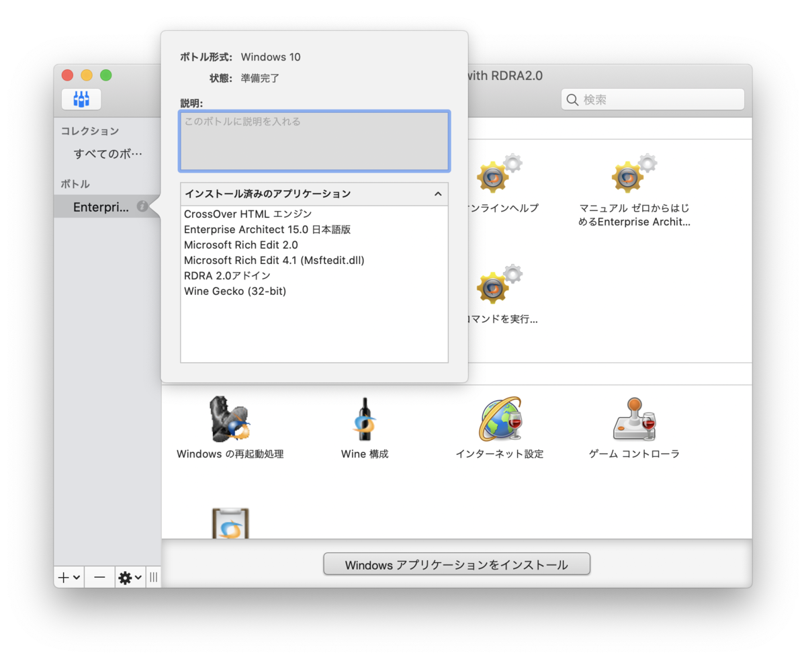

- このままだと下記のような現象が起きる:
  - プロジェクトの作成・読み込みができない
  - RDRA2.0プラグインが読み込まれない


## winetricksの準備 ##

[https://github.com/Winetricks/winetricks:embed:cite]

- winetricks: wineのためにいろいろインストールするやつ

```sh
cd workspace # どこでも
curl -o winetricks https://raw.githubusercontent.com/Winetricks/winetricks/master/src/winetricks
chmod +x winetricks
```

- winetricksを使うために環境変数を設定する
  - `WINEPREFIX`
    - wineのボトルの場所
  - `WINE`
    - wine実行ファイルの場所

~/.zshrc


```sh
export WINEPREFIX="/Users/nextat_staff/Library/Application Support/CrossOver/Bottles/Enterprise Architect with RDRA2.0"
export WINE="/Applications/CrossOver.app/Contents/SharedSupport/CrossOver/bin/wine"
```

## winetricksで必要なものインストール ##

- 作ったボトルを「デフォルトのボトル」にする

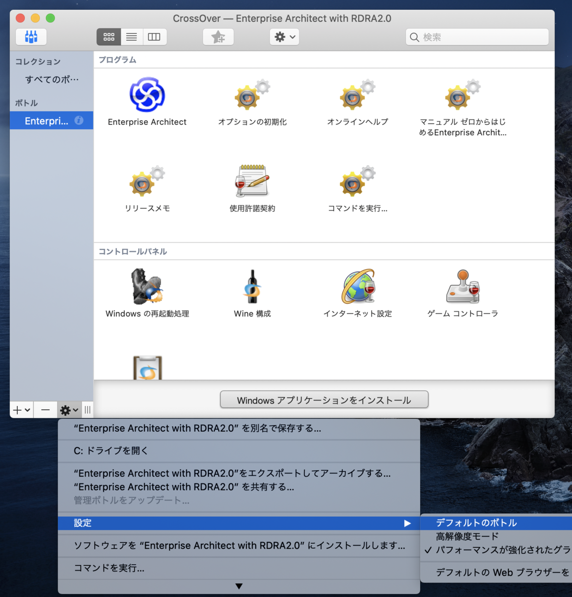

- [公式](https://www.sparxsystems.jp/help/15.0/enterprise_architect_macos.html)より、下記コマンドで必要なモジュールをインストールする


```sh
./winetricks msxml3 \
msxml4 \
jet40 \
mdac28 \
dotnet40 \
dotnet452
```


- `msxml3`, `msxml4`
  - xmlのパーサ
  - `msxml6`はリンク切れにつきスキップした
    - 一応動いている
- `jet40`
  - JET 4.0
  - Microsoft Accessなどで使われているMS製RDBMS
  - Enterprise Architectのプロジェクトデータをこれで管理していると思われる
- `mdac28`
  - MDAC 2.8 (Microsoft Data Access Components)
  - データベースアクセスするためのコンポーネント
- `dotnet40`, `dotnet452`
  - .NET
  - RDRA2.0アドインの読み込みに.NET 4.0が必要
  - 公式に従って、4.5.2も一応入れておく
- 一通り入れた後のボトルのインストール状況はこんな感じ:


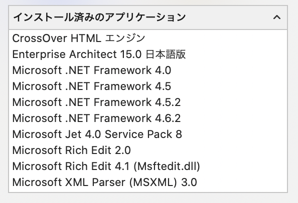

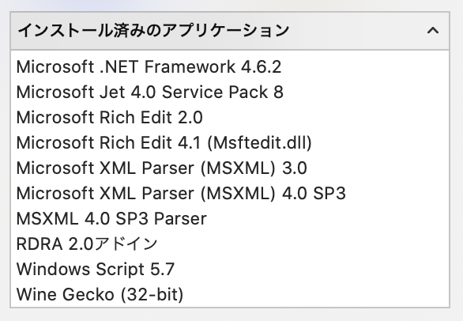
