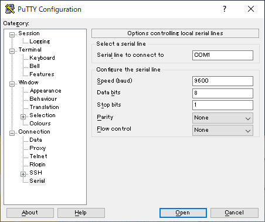

---
title: CCNA試験対策  ch4 Using the Command-Line Interface
tags:
- CCNA
- ネットワーク
- 勉強メモ
date: 2020-05-02T14:23:09+09:00
URL: https://wand-ta.hatenablog.com/entry/2020/05/02/142309
EditURL: https://blog.hatena.ne.jp/wand_ta/wand-ta.hatenablog.com/atom/entry/26006613560067265
-------------------------------------


# Accessing the Sisco Catalyst Switch CLI #


## Cisco Catalyst Switches ##

- Cisco製品ではswitchの物理的な接続部をinterfaceまたはportと呼ぶ
  - 10/100/10000 interface: 10Mbps, 100Mbps, 1000Mbpsで動作する
    - 実際に使っているのが10MbpsでもGitabitEthernetとよぶ
- インタフェースのユニーク名
  - 昔: `x/y`
  - あたらしい: `x/y/z`
- 例えばGigabitEthernetが2つ生えていれば
  - 昔: `G0/0`, `G0/1`
  - あたらしい: `1/0/1`, `1/0/2`

## Accessing the Cisco IOS CLI ##

- IOS: Internetwork Operating System
  - Cisco製品のOS
- TelnetやSSHでつなぐ

### Cabling the Console Connection ###

- USBの台頭により、USB対応のswitchも出てきた
- TelnetやSSHで接続する場合の設定
  - 9600 bps
  - No H/W flow control
  - 8N1
    - 8-bit ascii
    - No parity bit
    - 1 stop bit



### User and Enable (Privileged) Modes ###

- user EXEC mode
  - user mode とも
  - `>`
  - コマンドを入力すると、実行し、結果を表示するモード
- enable mode
  - privileged mode, privileged EXEC mode とも
  - `#`
  - `enable`コマンドでこのモードに遷移する
  - `reload`コマンドでCisco IOSのリブートができるのはこのモードだけ

```
Switch>reload
Translating "reload"...domain server (255.255.255.255) % Name lookup aborted
Switch>
Switch>enable
Switch#reload
Proceed with reload? [confirm]yC2960 Boot Loader (C2960-HBOOT-M) Version 12.2(25r)FX, RELEASE SOFTWARE (fc4)
Cisco WS-C2960-24TT (RC32300) processor (revision C0) with 21039K bytes of memory.
2960-24TT starting...
Base ethernet MAC Address: 0004.9AB2.B116
Xmodem file system is available.
Initializing Flash...
flashfs[0]: 1 files, 0 directories
flashfs[0]: 0 orphaned files, 0 orphaned directories
flashfs[0]: Total bytes: 64016384
flashfs[0]: Bytes used: 4414921
flashfs[0]: Bytes available: 59601463
flashfs[0]: flashfs fsck took 1 seconds.
...done Initializing Flash.

Boot Sector Filesystem (bs:) installed, fsid: 3
Parameter Block Filesystem (pb:) installed, fsid: 4


Loading "flash:/c2960-lanbase-mz.122-25.FX.bin"...
########################################################################## [OK]
              Restricted Rights Legend

Use, duplication, or disclosure by the Government is
subject to restrictions as set forth in subparagraph
(c) of the Commercial Computer Software - Restricted
Rights clause at FAR sec. 52.227-19 and subparagraph
(c) (1) (ii) of the Rights in Technical Data and Computer
Software clause at DFARS sec. 252.227-7013.

           cisco Systems, Inc.
           170 West Tasman Drive
           San Jose, California 95134-1706


Cisco IOS Software, C2960 Software (C2960-LANBASE-M), Version 12.2(25)FX, RELEASE SOFTWARE (fc1)
Copyright (c) 1986-2005 by Cisco Systems, Inc.
Compiled Wed 12-Oct-05 22:05 by pt_team
Image text-base: 0x80008098, data-base: 0x814129C4


Cisco WS-C2960-24TT (RC32300) processor (revision C0) with 21039K bytes of memory.


24 FastEthernet/IEEE 802.3 interface(s)
2 Gigabit Ethernet/IEEE 802.3 interface(s)

63488K bytes of flash-simulated non-volatile configuration memory.
Base ethernet MAC Address       : 0004.9AB2.B116
Motherboard assembly number     : 73-9832-06
Power supply part number        : 341-0097-02
Motherboard serial number       : FOC103248MJ
Power supply serial number      : DCA102133JA
Model revision number           : B0
Motherboard revision number     : C0
Model number                    : WS-C2960-24TT
System serial number            : FOC1033Z1EY
Top Assembly Part Number        : 800-26671-02
Top Assembly Revision Number    : B0
Version ID                      : V02
CLEI Code Number                : COM3K00BRA
Hardware Board Revision Number  : 0x01


Switch   Ports  Model              SW Version              SW Image
------   -----  -----              ----------              ----------
*    1   26     WS-C2960-24TT      12.2                    C2960-LANBASE-M

Cisco IOS Software, C2960 Software (C2960-LANBASE-M), Version 12.2(25)FX, RELEASE SOFTWARE (fc1)
Copyright (c) 1986-2005 by Cisco Systems, Inc.
Compiled Wed 12-Oct-05 22:05 by pt_team

Press RETURN to get started!


Switch>
```

- 【補】 `ctrl + shift + 6` でキャンセル


### Password Security for CLI Access from the Console ###

```
Switch>show running-config
            ^
% Invalid input detected at '^' marker.
	
Switch>enable
Switch#show running-config
Building configuration...

Current configuration : 1080 bytes
!
version 12.2
no service timestamps log datetime msec
no service timestamps debug datetime msec
no service password-encryption
!
hostname Switch
!
!
!
!
!
!
spanning-tree mode pvst
spanning-tree extend system-id
!
interface FastEthernet0/1
!
interface FastEthernet0/2
!
interface FastEthernet0/3
!
interface FastEthernet0/4
!
interface FastEthernet0/5
!
interface FastEthernet0/6
!
interface FastEthernet0/7
!
interface FastEthernet0/8
!
interface FastEthernet0/9
!
interface FastEthernet0/10
!
interface FastEthernet0/11
!
interface FastEthernet0/12
!
interface FastEthernet0/13
!
interface FastEthernet0/14
!
interface FastEthernet0/15
!
interface FastEthernet0/16
!
interface FastEthernet0/17
!
interface FastEthernet0/18
!
interface FastEthernet0/19
!
interface FastEthernet0/20
!
interface FastEthernet0/21
!
interface FastEthernet0/22
!
interface FastEthernet0/23
!
interface FastEthernet0/24
!
interface GigabitEthernet0/1
!
interface GigabitEthernet0/2
!
interface Vlan1
 no ip address
 shutdown
!
!
!
!
line con 0
!
line vty 0 4
 login
line vty 5 15
 login
!
!
!
!
end
```

- enable modeで`show running-config`すると設定が表示される
  - `!`で始まるのはコメント行

```
...
line con 0
!
line vty 0 4
 login
line vty 5 15
 login
...
```

- 基本的なコンフィグ

```
enable secret love

line console 0
 login
 password faith
```

- `enable secret love`
  - `enable`時のパスワードを`love`に設定
- `line console 0`
  - "these next commands apply to the console only."の意
- `login`
  - IOSにパスワードチェックさせる
- `password faith`
  - パスワードを`faith`に設定


## CLI Help Feature ##

- `?`でヘルプ・入力候補表示
- カーソル移動はemacsとおなじ

## The debug and show Commands ##

- `show`コマンド: いろいろ表示

```
Switch>show ?
  arp                Arp table
  cdp                CDP information
  clock              Display the system clock
  crypto             Encryption module
  dtp                DTP information
  etherchannel       EtherChannel information
  flash:             display information about flash: file system
  history            Display the session command history
  interfaces         Interface status and configuration
  ip                 IP information
  lldp               LLDP information
  mac                MAC configuration
  mac-address-table  MAC forwarding table
  mls                Show MultiLayer Switching information
  privilege          Show current privilege level
  sessions           Information about Telnet connections
  ssh                Status of SSH server connections
  tcp                Status of TCP connections
  terminal           Display terminal configuration parameters
  users              Display information about terminal lines
  version            System hardware and software status
  vlan               VTP VLAN status
```

- macアドレステーブル表示

```
Switch>show mac ?
  address-table  MAC forwarding table
Switch>show mac addre
Switch>show mac address-table ?
  dynamic     Dynamic entry type
  interfaces  Interface entry type
  static      static entry type
  <cr>
Switch>show mac address-table dy
Switch>show mac address-table dynamic ?
  <cr>
Switch>show mac address-table dynamic 
          Mac Address Table
-------------------------------------------

Vlan    Mac Address       Type        Ports
----    -----------       --------    -----

```

- まだなにもない
- `debug`
  - enableモードでのみ
  - リアルタイム

```
Switch>debug ?
% Unrecognized command
Switch>enable
Switch>enable 
Switch#debug ?
  ip       IP information
  sw-vlan  vlan manager
Switch#debug 
```

# Configuring Cisco IOS Software #

- enableモードで`configure terminal`

```
Switch#configure terminal 
Enter configuration commands, one per line.  End with CNTL/Z.
Switch(config)#enable secret hoge
Switch(config)#^Z
Switch#
%SYS-5-CONFIG_I: Configured from console by console

Switch#
Switch#disable
Switch>enable
Password: (hoge)
Switch#

Switch#disable
Switch>enable
Password: (piyo)
Password: (piyo)
Password: (piyo)
% Bad secrets
```

## Configuration Submodes and Contexts ##

```
Switch(config)#enable secret hoge
```

- これはglobal config mode
- 個別のconfig modeもある

```
Switch#configure terminal 
Enter configuration commands, one per line.  End with CNTL/Z.
Switch(config)#
Switch(config)#
Switch(config)#hostname fred
fred(config)#line console 0
fred(config-line)#password hope
fred(config-line)#interface FastEthernet 0/1
fred(config-if)#speed 100
fred(config-if)#exit
fred(config)#end
fred#
%SYS-5-CONFIG_I: Configured from console by console

fred#
```

- config-line: console line mode
- config-if: interface mode


## Storing Switch Configuration Files ##

- RAM
  - working memory and running configuration
- Flash memory
  - IOS
- ROM
  - bootstrap program
- NVRAM (non-volatile RAM)
  - startup configuration

## Copying and Erasing Configuration Files ##

- running-config (volatile)をstartup-config (non-volatile)に書き出す

```
fred#copy running-config startup-config 
Destination filename [startup-config]? 
Building configuration...
[OK]
fred#
```

- けす

```
fred#write erase
Erasing the nvram filesystem will remove all configuration files! Continue? [confirm]y[OK]
Erase of nvram: complete
%SYS-7-NV_BLOCK_INIT: Initialized the geometry of nvram
fred#erase startup-config
Erasing the nvram filesystem will remove all configuration files! Continue? [confirm]y[OK]
Erase of nvram: complete
%SYS-7-NV_BLOCK_INIT: Initialized the geometry of nvram
fred#
```


----------------------------------------

# 英語 #

- outwardly
