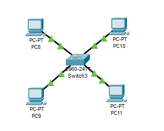
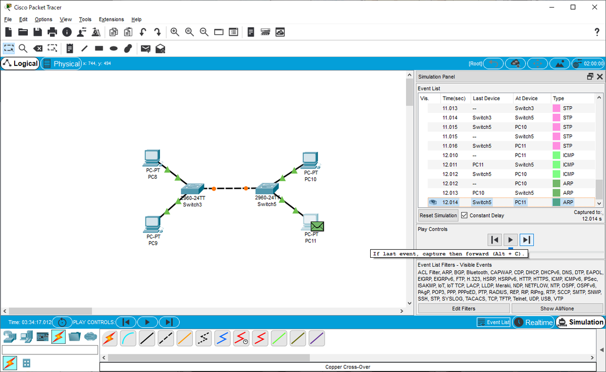

---
title: CCNA試験対策 ch5 Analyzing Ethenet LAN Switching
tags:
- CCNA
- ネットワーク
- 勉強メモ
date: 2020-05-02T16:50:57+09:00
URL: https://wand-ta.hatenablog.com/entry/2020/05/02/165057
EditURL: https://blog.hatena.ne.jp/wand_ta/wand-ta.hatenablog.com/atom/entry/26006613560147765
-------------------------------------


# LAN Switching Concepts #


## Forwarding Known Unicast Frames ##

- forward-versus-filter decision
  - 宛先MACアドレスに基づいて、フレームをforwardすること
  - 宛先以外に送らない(filter)ことでもある
- address table
  - 「0200.2222.2222宛ならばF0/2に送る」
  - 「0200.3333.3333宛ならばG0/1に送る」


## Learning MAC Addresses ##

- address tableをどうやって構成するの
- LAN switchが自ら学習する
  - フレームが入ってきたportと、source MAC Addressに基づいて


## Flooding Unknown Unicast and Broadcast Frames ##

- MAC address tableに、宛先MACアドレスに対応する情報がない場合、どうするの？
- とりあえずincoming interface以外すべてにforwardする
  - この処理をfloodという
  - このフレームをunknown unicast frameという
    - または単にunknown unicast
  - そのうち返信のフレームが来るはずなので、そうしたらそのsource MAC Addressをaddress tableに登録する
- multicast frame, broadcast frameもfloodされる


## Avoiding Loops Using Spanning Tree Protocol ##

- ループがあるとフレームが永久に回り続ける
  - 【補】IPとの比較
    - IP (L3) にはルータホップ数のカウントなどがあるのでそうはならない
    - Ethernet (L2) はそんな高級なことは考えない。所定のMACアドレスにフレームを送ることしか考えない
- Spanning Tree ProtocolでSpanning Tree (全域木、ループがない)を担保する


# Verifying and Analyzing Ethernet Switching #


## Demonstrating MAC Learning ##



```
SW1#show mac address-table dynamic 
          Mac Address Table
-------------------------------------------

Vlan    Mac Address       Type        Ports
----    -----------       --------    -----

   1    0200.1111.1111    DYNAMIC      Fa0/1
   1    0200.2222.2222    DYNAMIC      Fa0/2
   1    0200.3333.3333    DYNAMIC      Fa0/3
   1    0200.4444.4444    DYNAMIC      Fa0/4
```

- 適当にIPを振って`ping`でブロードキャストとかするとswitchはaddress tableを学習する
- `clear mac-address-table`でまっさらに

```
SW1#clear mac-address-table 
SW1#show mac address-table dynamic 
          Mac Address Table
-------------------------------------------

Vlan    Mac Address       Type        Ports
----    -----------       --------    -----

```


## Switch Interfaces ##

```
SW1#show interfaces status 
Port      Name               Status       Vlan       Duplex  Speed Type
Fa0/1                        connected    1          auto    auto  10/100BaseTX
Fa0/2                        connected    1          auto    auto  10/100BaseTX
Fa0/3                        connected    1          auto    auto  10/100BaseTX
Fa0/4                        connected    1          auto    auto  10/100BaseTX
Fa0/5                        notconnect   1          auto    auto  10/100BaseTX
Fa0/6                        notconnect   1          auto    auto  10/100BaseTX
Fa0/7                        notconnect   1          auto    auto  10/100BaseTX
Fa0/8                        notconnect   1          auto    auto  10/100BaseTX
Fa0/9                        notconnect   1          auto    auto  10/100BaseTX
Fa0/10                       notconnect   1          auto    auto  10/100BaseTX
Fa0/11                       notconnect   1          auto    auto  10/100BaseTX
Fa0/12                       notconnect   1          auto    auto  10/100BaseTX
Fa0/13                       notconnect   1          auto    auto  10/100BaseTX
Fa0/14                       notconnect   1          auto    auto  10/100BaseTX
Fa0/15                       notconnect   1          auto    auto  10/100BaseTX
Fa0/16                       notconnect   1          auto    auto  10/100BaseTX
Fa0/17                       notconnect   1          auto    auto  10/100BaseTX
Fa0/18                       notconnect   1          auto    auto  10/100BaseTX
Fa0/19                       notconnect   1          auto    auto  10/100BaseTX
Fa0/20                       notconnect   1          auto    auto  10/100BaseTX
Fa0/21                       notconnect   1          auto    auto  10/100BaseTX
Fa0/22                       notconnect   1          auto    auto  10/100BaseTX
Fa0/23                       notconnect   1          auto    auto  10/100BaseTX
Fa0/24                       notconnect   1          auto    auto  10/100BaseTX
Gig0/1                       notconnect   1          auto    auto  10/100BaseTX
Gig0/2                       notconnect   1          auto    auto  10/100BaseTX
```

- 特定のinterfaceだけ知りたいとき:

```
SW1#show interfaces Fa0/1 status
Port      Name               Status       Vlan       Duplex  Speed Type
Fa0/1                        connected    1          auto    auto  10/100BaseTX
```

- `counters`オプションでパケット数の統計も見られるらしいが、Packet Tracerではできなかった


## Finding Entries in the MAC Address Table ##

- `vlan`や`address`オブションでフィルタリングできるらしいがPacket Tracerではできなかった


## Managing the MAC Address Table (Aging, Clearing) ##

- aging out
  - address tableのエントリのTTL的な概念
    - デフォルト300秒


## MAC Address Tables with Multiple Switches ##



- いい感じに同じセグのIPアドレスを振って

```sh
ping 0.0.0.0
```

- arpのbroad castやらunknown unicastやらのfloodingでswitchがaddress tableを学習する

左スイッチ

```
SW1#show mac address-table dynamic
          Mac Address Table
-------------------------------------------

Vlan    Mac Address       Type        Ports
----    -----------       --------    -----

   1    0001.97d4.4219    DYNAMIC      Gig0/1
   1    0200.1111.1111    DYNAMIC      Fa0/1
   1    0200.2222.2222    DYNAMIC      Fa0/2
   1    0200.3333.3333    DYNAMIC      Gig0/1
   1    0200.4444.4444    DYNAMIC      Gig0/1
```

右スイッチ

```
Switch>show mac address-table dynamic 
          Mac Address Table
-------------------------------------------

Vlan    Mac Address       Type        Ports
----    -----------       --------    -----

   1    000b.be8d.a319    DYNAMIC      Gig0/1
   1    0200.1111.1111    DYNAMIC      Gig0/1
   1    0200.2222.2222    DYNAMIC      Gig0/1
   1    0200.3333.3333    DYNAMIC      Fa0/1
   1    0200.4444.4444    DYNAMIC      Fa0/2
```


