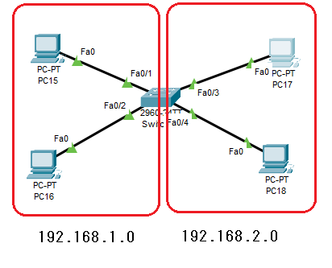
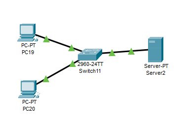

---
title: CCNA試験対策 ch6 Configuing Basic Switch Management
tags:
- CCNA
- ネットワーク
- 勉強メモ
date: 2020-05-02T22:29:04+09:00
URL: https://wand-ta.hatenablog.com/entry/2020/05/02/222904
EditURL: https://blog.hatena.ne.jp/wand_ta/wand-ta.hatenablog.com/atom/entry/26006613560298775
-------------------------------------


# Securing the Switch CLI #

- デフォルトで誰でもつなげてしまう
- 誰でもenable modeに入れるのは危険
  - reloadとかされる
- user modeを防御するのも必要
  - 攻撃のための情報源になる


## Securing User Mode and Privileged Mode with Simple Passwords ##

- enableモードにパスワード`love`設定
- consoleログインにパスワード`faith`設定
- 仮想端末(telnetとか)ログインにパスワード`faith`設定

```
SW1>
SW1>enable
SW1#configure terminal
Enter configuration commands, one per line.  End with CNTL/Z.
SW1(config)#
SW1(config)#enable secret love
SW1(config)#
SW1(config)#line con 0
SW1(config-line)#password faith
SW1(config-line)#login
SW1(config-line)#exit
SW1(config)#
SW1(config)#line vty 0 15
SW1(config-line)#password faith
SW1(config-line)#login
SW1(config-line)#exit
SW1(config)#end
SW1#
```

- 設定内容の確認

```
SW1#show running-config
Building configuration...

Current configuration : 1181 bytes
!
version 12.2
no service timestamps log datetime msec
no service timestamps debug datetime msec
no service password-encryption
!
hostname SW1
!
enable secret 5 $1$mERr$wgCxZNZPm.wN81mUI/lF7/
!
!
!
!
!
!
spanning-tree mode pvst
spanning-tree extend system-id
!
interface FastEthernet0/1
!
...
!
interface GigabitEthernet0/1
!
interface GigabitEthernet0/2
!
interface Vlan1
 no ip address
 shutdown
!
!
!
!
line con 0
 password faith
 login
!
line vty 0 4
 password faith
 login
line vty 5 15
 password faith
 login
!
!
!
!
end
```

## Securing User Mode Acess with Local Usernames and Paswords ##

- shared passwordをやめたい
- ユーザ名 + パスワード認証にする

```
SW1(config)#username foo secret bar
SW1(config)#line con 0
SW1(config-line)#login local
SW1(config-line)#no password
SW1(config-line)#exit
SW1(config)#line vty 0 15
SW1(config-line)#login local
SW1(config-line)#no password
SW1(config-line)#exit
SW1(config)#end
SW1#
%SYS-5-CONFIG_I: Configured from console by console

SW1#show running-config 
Building configuration...

Current configuration : 1206 bytes
!
version 12.2
no service timestamps log datetime msec
no service timestamps debug datetime msec
no service password-encryption
!
hostname SW1
!
enable secret 5 $1$mERr$wgCxZNZPm.wN81mUI/lF7/
!
!
!
!
username foo secret 5 $1$mERr$UiUNEbtx5zBHRgHRCsJK8/
!
!
!
spanning-tree mode pvst
spanning-tree extend system-id
!
interface FastEthernet0/1
!
...
!
interface GigabitEthernet0/2
!
interface Vlan1
 no ip address
 shutdown
!
!
!
!
line con 0
 login local
!
line vty 0 4
 login local
line vty 5 15
 login local
!
!
!
!
end
```

- コンソールでログインしてみる

```
Press RETURN to get started!


User Access Verification

Username: foo
Password: (bar)

SW1>
SW1>enable
Password: (love)
SW1#
```


## 【補】switchのvlanにIPを割り当てて、telnetで繋いでみる ##

```
SW1(config)#int vlan 1
SW1(config-if)#ip address 192.168.11.129 255.255.255.0
SW1(config-if)#no shutdown

SW1(config-if)#
%LINK-5-CHANGED: Interface Vlan1, changed state to up

%LINEPROTO-5-UPDOWN: Line protocol on Interface Vlan1, changed state to up

SW1(config-if)#end
SW1#
%SYS-5-CONFIG_I: Configured from console by console

SW1#show int vlan 1
Vlan1 is up, line protocol is up
  Hardware is CPU Interface, address is 0002.16c3.ce75 (bia 0002.16c3.ce75)
  Internet address is 192.168.11.129/24
  MTU 1500 bytes, BW 100000 Kbit, DLY 1000000 usec,
     reliability 255/255, txload 1/255, rxload 1/255
  Encapsulation ARPA, loopback not set
  ARP type: ARPA, ARP Timeout 04:00:00
  Last input 21:40:21, output never, output hang never
  Last clearing of "show interface" counters never
  Input queue: 0/75/0/0 (size/max/drops/flushes); Total output drops: 0
  Queueing strategy: fifo
  Output queue: 0/40 (size/max)
  5 minute input rate 0 bits/sec, 0 packets/sec
  5 minute output rate 0 bits/sec, 0 packets/sec
     1682 packets input, 530955 bytes, 0 no buffer
     Received 0 broadcasts (0 IP multicast)
     0 runts, 0 giants, 0 throttles
     0 input errors, 0 CRC, 0 frame, 0 overrun, 0 ignored
     563859 packets output, 0 bytes, 0 underruns
     0 output errors, 23 interface resets
     0 output buffer failures, 0 output buffers swapped out

SW1#
```

- `SW1(config-if)#ip address 192.168.11.129 255.255.255.0`
  - 何も考えずにホストに1から振ってしまったのでなんとなく129にした
- `SW1(config-if)#no shutdown`
  - デフォルトでvlanはシャットダウン状態なので、`no shutdown`で立ち上げる
- Windows cmdから接続確認


```
Packet Tracer PC Command Line 1.0
C:\>ping 192.168.11.129

Pinging 192.168.11.129 with 32 bytes of data:

Request timed out.
Reply from 192.168.11.129: bytes=32 time=1ms TTL=255
Reply from 192.168.11.129: bytes=32 time<1ms TTL=255
Reply from 192.168.11.129: bytes=32 time<1ms TTL=255

Ping statistics for 192.168.11.129:
    Packets: Sent = 4, Received = 3, Lost = 1 (25% loss),
Approximate round trip times in milli-seconds:
    Minimum = 0ms, Maximum = 1ms, Average = 0ms

C:\>telnet 192.168.11.129
Trying 192.168.11.129 ...Open


User Access Verification

Username: foo
Password: (bar)
SW1>
```


## Securing User Mode Access with External Authentication Servers ##

- RADIUS/TACACS+ などを使ってAAAサーバーに認証認可を任せるのがさらによい
- AAA: Authentication, Authorization and Accounting server
  - 認証
  - 認可
  - 課金やユーザーのアクセス情報の収集

| protocol | port                                     | encryption     | others    |
|----------|------------------------------------------|----------------|-----------|
| RADIUS   | UDP 1812(auth)<br />UDP 1813(accounting) | パスワードのみ | IETF標準  |
| TACACS+  | TCP 49                                   | パケット全体   | Cisco独自 |

- RADIUS: Remote Authentication Dial-In User Service
  - AAAモデル確立前に開発
  - そのため認証認可が組み合わさっている
- TACACS+: Terminal Access Controller Access Control System
  - 3つのAが分離している


## Securing Remote Access with Secure Shell ##

- Telnetは盗聴やMITM攻撃などの脆弱性がある
- SSHを使うための設定


```
SW1(config)#hostname SW1
SW1(config)#ip domain-name example.com
SW1(config)#crypto key generate rsa
The name for the keys will be: SW1.example.com
Choose the size of the key modulus in the range of 360 to 2048 for your
  General Purpose Keys. Choosing a key modulus greater than 512 may take
  a few minutes.

How many bits in the modulus [512]: 1024
% Generating 1024 bit RSA keys, keys will be non-exportable...[OK]

SW1(config)#ip ssh version 2
*3 1 0:13:55.481: %SSH-5-ENABLED: SSH 1.99 has been enabled
SW1(config)#line vty 0 15
SW1(config-line)#login local
SW1(config-line)#exit
SW1(config)#username daiki password boob
SW1(config)#end
SW1#
%SYS-5-CONFIG_I: Configured from console by console
```

- SSHのバージョンとSSH接続状況の確認をできる

```
SW1(config)#ip ssh version 2
*3 1 0:13:55.481: %SSH-5-ENABLED: SSH 1.99 has been enabled
SW1(config)#line vty 0 15
SW1(config-line)#login local
SW1(config-line)#exit
SW1(config)#username daiki password boob
SW1(config)#end
SW1#
%SYS-5-CONFIG_I: Configured from console by console

SW1#
SW1#
SW1#show ip ssh
SSH Enabled - version 2.0
Authentication timeout: 120 secs; Authentication retries: 3
SW1#show ssh
%No SSHv2 server connections running.
%No SSHv1 server connections running.
```

- Windowsのcmdから接続してみる

```
C:\>ssh -l foo 192.168.11.129

Password: (bar)


SW1>
```


# Enabling IPv4 for Remote Access #

- Telnet/SSHアクセスや、SNMPのようなIPベースの管理プロトコルを利用するために設定が必要


## Host and Switch IP Settings ##

- SwitchにもIPが欲しいという話
- VLAN interface
  - SVI: Switched Virtual Interfaceとも
  - PCのNICとおなじようなもの
    - switchのそれは仮想的
  - 直接接続しているサブネットごとに設定する
- 直接接続していないサブネットへのデータ転送のためにdefault gatewayの設定も必要


## Configuring IPv4 on a Switch ##



- まずinterface Fa0/1, Fa0/2にvlan 1, Fa0/3 Fa0/4にvlan 2を割り当てる
  - vlan 2がないので作られる


```
Switch#configure terminal
Enter configuration commands, one per line.  End with CNTL/Z.
Switch(config)#interface fastEthernet 0/1
Switch(config-if)#switchport access vlan 1
Switch(config-if)#interface fastEthernet 0/2
Switch(config-if)#switchport access vlan 1
Switch(config-if)#interface fastEthernet 0/3
Switch(config-if)#switchport access vlan 2
% Access VLAN does not exist. Creating vlan 2
Switch(config-if)#interface fastEthernet 0/4
Switch(config-if)#switchport access vlan 2
```

- 各vlanのVLAN interfaceにIPアドレス割り当て

```
Switch(config-if)#
Switch(config-if)#interface vlan 1
Switch(config-if)#ip address 192.168.1.1 255.255.255.0
Switch(config-if)#no shutdown

Switch(config-if)#
Switch(config-if)#interface vlan 2
Switch(config-if)#ip address 192.168.2.1 255.255.255.0
Switch(config-if)#no shutdown
Switch(config-if)#
Switch(config-if)#end
```

- 設定確認

```
Switch#show interfaces status
Port      Name               Status       Vlan       Duplex  Speed Type
Fa0/1                        connected    1          auto    auto  10/100BaseTX
Fa0/2                        connected    1          auto    auto  10/100BaseTX
Fa0/3                        connected    2          auto    auto  10/100BaseTX
Fa0/4                        connected    2          auto    auto  10/100BaseTX
Fa0/5                        notconnect   1          auto    auto  10/100BaseTX
...
```

- PCから疎通確認

from 192.168.1.11

```
ping 0.0.0.0
```

```
Pinging 0.0.0.0 with 32 bytes of data:

Reply from 192.168.1.12: bytes=32 time<1ms TTL=128
Reply from 192.168.1.1: bytes=32 time<1ms TTL=255
Reply from 192.168.1.12: bytes=32 time<1ms TTL=128
Reply from 192.168.1.1: bytes=32 time<1ms TTL=255
Reply from 192.168.1.12: bytes=32 time<1ms TTL=128
Reply from 192.168.1.1: bytes=32 time<1ms TTL=255
Reply from 192.168.1.12: bytes=32 time<1ms TTL=128

Ping statistics for 0.0.0.0:
    Packets: Sent = 4, Received = 7, Lost = 0 (0% loss),
Approximate round trip times in milli-seconds:
    Minimum = 0ms, Maximum = 0ms, Average = 0ms
```

from 192.168.2.11

```
Pinging 0.0.0.0 with 32 bytes of data:

Reply from 192.168.2.12: bytes=32 time<1ms TTL=128
Reply from 192.168.2.1: bytes=32 time<1ms TTL=255
Reply from 192.168.2.12: bytes=32 time<1ms TTL=128
Reply from 192.168.2.1: bytes=32 time<1ms TTL=255
Reply from 192.168.2.12: bytes=32 time<1ms TTL=128
Reply from 192.168.2.1: bytes=32 time<1ms TTL=255
Reply from 192.168.2.12: bytes=32 time<1ms TTL=128

Ping statistics for 0.0.0.0:
    Packets: Sent = 4, Received = 7, Lost = 0 (0% loss),
Approximate round trip times in milli-seconds:
    Minimum = 0ms, Maximum = 0ms, Average = 0ms
```


## Configuring a Switch to Learn Its IP Address with DHCP ##




- DHCPサーバーを`192.168.11.1`で立てる

```
Switch(config)#interface vlan 1
Switch(config-if)#ip address dhcp
Switch(config-if)#no shutdown

Switch(config-if)#
%LINK-5-CHANGED: Interface Vlan1, changed state to up

%LINEPROTO-5-UPDOWN: Line protocol on Interface Vlan1, changed state to up

%DHCP-6-ADDRESS_ASSIGN: Interface Vlan1 assigned DHCP address 192.168.11.2, mask 255.255.255.0, hostname Switch11


Switch(config-if)#^Z
Switch#
%SYS-5-CONFIG_I: Configured from console by console
```

- PCから疎通確認


```
ping 0.0.0.0
```

```
Pinging 0.0.0.0 with 32 bytes of data:

Request timed out.
Reply from 192.168.11.1: bytes=32 time<1ms TTL=128
Reply from 192.168.11.4: bytes=32 time<1ms TTL=128
Reply from 192.168.11.2: bytes=32 time<1ms TTL=255
Reply from 192.168.11.1: bytes=32 time<1ms TTL=128
Reply from 192.168.11.4: bytes=32 time<1ms TTL=128
Reply from 192.168.11.2: bytes=32 time<1ms TTL=255
Reply from 192.168.11.1: bytes=32 time<1ms TTL=128
Reply from 192.168.11.4: bytes=32 time<1ms TTL=128

Ping statistics for 0.0.0.0:
    Packets: Sent = 4, Received = 8, Lost = 0 (0% loss),
Approximate round trip times in milli-seconds:
    Minimum = 0ms, Maximum = 0ms, Average = 0ms
```


## Verifying IPv4 on a Switch ##


- 払い出してもらったIPアドレスの確認

```
Switch#show dhcp lease
Temp IP addr: 192.168.11.2 for peer on Interface: Vlan1
Temp sub net mask: 255.255.255.0
   DHCP Lease server: 192.168.11.1 , state: Bound
   DHCP Transaction id: D63D40C4
   Lease: 86400 secs,  Renewal: 43200 secs,  Rebind: 75600 secs
Temp default-gateway addr: 0.0.0.0
   Next timer fires after: 11:57:07
   Retry count: 0  Client-ID:cisco-00D0.58BA.3251-Vlan
   Client-ID hex dump: 636973636F2D303044302E353842412E
                       33235312D566C616E
   Hostname: Switch
```


# Miscellaneous Settings Useful in the Lab #

## History Buffer Commands ##

```
Switch#show history
  enable
  configure terminal
  show dhcp lease
  configure terminal
  show dhcp lease
  show history
Switch#terminal history size 3
Switch#show history
  terminal history size 
  terminal history size 3
  show history
```

- `show history`
  - コマンド履歴表示
- `terminal history size x`
  - そのセッションでのコマンド履歴件数設定
- `history size x`
  - デフォルトのコマンド履歴件数設定

## The Logging syhchronous, exec-timeout, and no ip domain-lookup Commands ##

### logging console, logging synchronous ###

- ログ出力がコマンド入力の妨げになることがある
  - no logging console
    - global config
    - コンソール出力しなくする
  - logging synchronous
    - console, vtyの設定
    - コマンド入力中にログ出力されたとき、入力中だったコマンドを再表示してくれる


### exec-timeout ###

- 接続したまま放置した時に接続が切れるまでの時間(min sec)
- 0 0で接続切れなし

### no ip domain-lookup ###

- 存在しないコマンドを打ち込んだときに名前解決を試みてしまうのをやめさせる

```
Switch>hoge
Translating "hoge"...domain server (255.255.255.255) % Name lookup aborted
Switch>
Switch>
Switch>enable
Switch#configure terminal
Enter configuration commands, one per line.  End with CNTL/Z.
Switch(config)#no ip domain-lookup
Switch(config)#end
Switch#
%SYS-5-CONFIG_I: Configured from console by console

Switch#hoge
Translating "hoge"
% Unknown command or computer name, or unable to find computer address
```


----------------------------------------

# 英語 #

- unsolicited
  - 頼んでもいない
