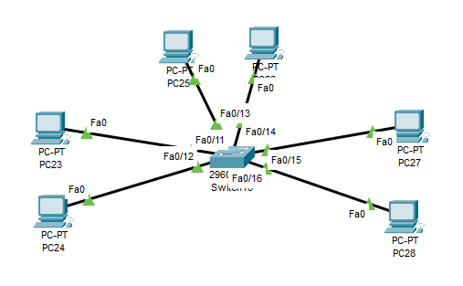
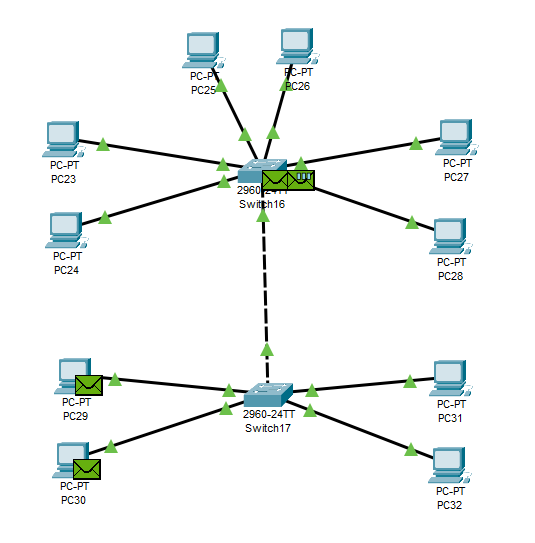
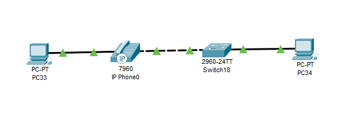

---
title: CCNA試験対策 ch8 Implementing Ethernet Virtual LANs
tags:
- CCNA
- ネットワーク
- 勉強メモ
date: 2020-05-03T16:06:18+09:00
URL: https://wand-ta.hatenablog.com/entry/2020/05/03/160618
EditURL: https://blog.hatena.ne.jp/wand_ta/wand-ta.hatenablog.com/atom/entry/26006613560750049
-------------------------------------

ch8 Implementing Ethernet Virtual LANs


# Virtual LAN Concepts #

- そもそもLANってなに？

> A LAN includes all devices in the same broadcast domain.

- デフォルト設定だと、1台のswitchのすべてのinterfaceが同一のbroadcast domain
- 1台のswitchでbroadcast domainを区切るのがVLAN: virtual LAN
- 小さなboradcast domainsに区切る効能
  - 各デバイスのCPUオーバヘッドの低減
  - セキュリティリスクの低減
  - ユーザのグルーピングの柔軟性の向上
  - 問題発生時の切り分けが速くなる
  - Spanning Tree Protocolのワークロードの低減


## Creating Multiswitch VLANs Using Trunking ##

- switch間の通信のことを考える必要がある
- VLAN trunking
  - 各VLANで単一の物理接続を使用
  - VLAN IDをタグ付けしてフレームを伝送する

### The 802.1Q and ISL VLAN Trunking Protocols ###

- VTP: VLAN Trunking Protocol
- Ciscoは2種類サポートしてきた
  - ISL: Inter-Switch Link
    - Cisco製
  - IEEE 802.1Q
    - こちらがメジャー
- 12ビットのVLAN IDでタグ付けする
  - [0;4096)
  - うち、0, 4095は予約
  - IEEE802.1Qでは、通常の802.3 frame headerに加え、4バイトの802.1Q headerが加わる
- Cisco製品では[1;4094]を分割
  - normal-range
    - [1;1005]
  - extended-range
    - [1006;4094]
- IEEE 802.1Q native VLAN
  - VLAN 1がデフォルト
  - trunkingを理解していないデバイスとの接続も担う


## Forwarding Data Between VLANs ##

### The Need for Routing Between VLANs ###

- 同一switch上のVLAN1からVLAN2へはトラフィックが漏れ出さない
  - そのためのVLANなので
- VLANをまたぐためには別途routerが要る
  - 本機能を備えたswitchをmultilayer switch, layer 3 switchという


# VLAN and VLAN Trunking Configuration and Verification #

## Creating VLANS and Assigning Access VLANs to an Interface ##



- 各interfaceをvlanに割り当てる

```
Switch>enable
Switch#configure terminal
Enter configuration commands, one per line.  End with CNTL/Z.
Switch(config)#interface range f0/11-12
Switch(config-if-range)#switchport access vlan 1
Switch(config-if-range)#switchport mode access
Switch(config-if-range)#exit
Switch(config)#interface range f0/13-14
Switch(config-if-range)#switchport access vlan 2
% Access VLAN does not exist. Creating vlan 2
Switch(config-if-range)#switchport mode access
Switch(config-if-range)#exit
Switch(config)#interface range f0/15-16
Switch(config-if-range)#switchport access vlan 3
% Access VLAN does not exist. Creating vlan 3
Switch(config-if-range)#switchport mode access
Switch(config-if-range)#end
Switch#
%SYS-5-CONFIG_I: Configured from console by console
```

- 設定確認

```
Switch#show vlan brief

VLAN Name                             Status    Ports
---- -------------------------------- --------- -------------------------------
1    default                          active    Fa0/1, Fa0/2, Fa0/3, Fa0/4
                                                Fa0/5, Fa0/6, Fa0/7, Fa0/8
                                                Fa0/9, Fa0/10, Fa0/11, Fa0/12
                                                Fa0/17, Fa0/18, Fa0/19, Fa0/20
                                                Fa0/21, Fa0/22, Fa0/23, Fa0/24
                                                Gig0/1, Gig0/2
2    VLAN0002                         active    Fa0/13, Fa0/14
3    VLAN0003                         active    Fa0/15, Fa0/16
1002 fddi-default                     active    
1003 token-ring-default               active    
1004 fddinet-default                  active    
1005 trnet-default                    active    
```

- 個別

```
Switch#show vlan id 2

VLAN Name                             Status    Ports
---- -------------------------------- --------- -------------------------------
2    VLAN0002                         active    Fa0/13, Fa0/14

VLAN Type  SAID       MTU   Parent RingNo BridgeNo Stp  BrdgMode Trans1 Trans2
---- ----- ---------- ----- ------ ------ -------- ---- -------- ------ ------
2    enet  100002     1500  -      -      -        -    -        0      0

Switch#show vlan id 3

VLAN Name                             Status    Ports
---- -------------------------------- --------- -------------------------------
3    VLAN0003                         active    Fa0/15, Fa0/16

VLAN Type  SAID       MTU   Parent RingNo BridgeNo Stp  BrdgMode Trans1 Trans2
---- ----- ---------- ----- ------ ------ -------- ---- -------- ------ ------
3    enet  100003     1500  -      -      -        -    -        0      0

```


- `switchport mode access`
  - access mode port、の意
    - trunk port mode、ではなく
- vlanを作っておくこともできる

```
Switch(config)#vlan 4
Switch(config-vlan)#name hoge
Switch(config-vlan)#exit
Switch(config)#
```

- 作っていない場合、デフォルト名`VLANxxxx`で作られる


## VLAN Trunking Protocol ##

- 詳しい内容はCCNPの範囲
- 本章の領域ではOFFにしよう

```
Switch#show vtp status
VTP Version                     : 2
Configuration Revision          : 4
Maximum VLANs supported locally : 255
Number of existing VLANs        : 8
VTP Operating Mode              : Server
VTP Domain Name                 : 
VTP Pruning Mode                : Disabled
VTP V2 Mode                     : Disabled
VTP Traps Generation            : Disabled
MD5 digest                      : 0x22 0x44 0xB8 0xAE 0x30 0x0A 0x81 0xC4 
Configuration last modified by 0.0.0.0 at 3-1-93 00:11:21
Local updater ID is 0.0.0.0 (no valid interface found)
```

- serverやclientになっているのはNG

```
VTP Operating Mode              : Server
```

- 1006番以降を作れなかったりする

```
Switch(config-vlan)#vlan 1006
VLAN_CREATE_FAIL: Failed to create VLANs 1006 : extended VLAN(s) not allowed in current VTP mode
Switch(config)#end
```

- 無効化する

```
Switch#configure terminal
Enter configuration commands, one per line.  End with CNTL/Z.
Switch(config)#
Switch(config)#
Switch(config)#vtp mode transparent
Setting device to VTP TRANSPARENT mode.
```

- 1006番を作れる


```
Switch(config)#vlan 1006
Switch(config-vlan)#end
```


## VLAN Trunking Configuration ##



- trunk未設定の初期状態確認

```
Switch>enable
Switch#show interfaces gigabit 0/1 switchport
Name: Gig0/1
Switchport: Enabled
Administrative Mode: dynamic auto
Operational Mode: static access
Administrative Trunking Encapsulation: dot1q
Operational Trunking Encapsulation: native
Negotiation of Trunking: On
Access Mode VLAN: 1 (default)
Trunking Native Mode VLAN: 1 (default)
Voice VLAN: none
Administrative private-vlan host-association: none
Administrative private-vlan mapping: none
Administrative private-vlan trunk native VLAN: none
Administrative private-vlan trunk encapsulation: dot1q
Administrative private-vlan trunk normal VLANs: none
Administrative private-vlan trunk private VLANs: none
Operational private-vlan: none
Trunking VLANs Enabled: All
Pruning VLANs Enabled: 2-1001
Capture Mode Disabled
Capture VLANs Allowed: ALL
Protected: false
Unknown unicast blocked: disabled
Unknown multicast blocked: disabled
Appliance trust: none


Switch#
Switch#show interfaces trunk


Switch#
```

- trunkの設定

```
Switch#configure terminal
Enter configuration commands, one per line.  End with CNTL/Z.
Switch(config)#interface g0/1
Switch(config-if)#switchport mode dynamic desirable

Switch(config-if)#
%LINEPROTO-5-UPDOWN: Line protocol on Interface GigabitEthernet0/1, changed state to up

%LINEPROTO-5-UPDOWN: Line protocol on Interface GigabitEthernet0/1, changed state to down

%LINEPROTO-5-UPDOWN: Line protocol on Interface GigabitEthernet0/1, changed state to up

Switch(config-if)#
Switch(config-if)#^Z
Switch#
%SYS-5-CONFIG_I: Configured from console by console
```

- 設定確認

```
Switch#show interface gigabit 0/1 switchport
Name: Gig0/1
Switchport: Enabled
Administrative Mode: dynamic desirable
Operational Mode: trunk
Administrative Trunking Encapsulation: dot1q
Operational Trunking Encapsulation: dot1q
Negotiation of Trunking: On
Access Mode VLAN: 1 (default)
Trunking Native Mode VLAN: 1 (default)
Voice VLAN: none
Administrative private-vlan host-association: none
Administrative private-vlan mapping: none
Administrative private-vlan trunk native VLAN: none
Administrative private-vlan trunk encapsulation: dot1q
Administrative private-vlan trunk normal VLANs: none
Administrative private-vlan trunk private VLANs: none
Operational private-vlan: none
Trunking VLANs Enabled: All
Pruning VLANs Enabled: 2-1001
Capture Mode Disabled
Capture VLANs Allowed: ALL
Protected: false
Unknown unicast blocked: disabled
Unknown multicast blocked: disabled
Appliance trust: none


Switch#
```


```diff
  Switchport: Enabled
- Administrative Mode: dynamic auto
- Operational Mode: static access
- Administrative Trunking Encapsulation: dot1q
- Operational Trunking Encapsulation: native
+ Administrative Mode: dynamic desirable
+ Operational Mode: trunk
+ Administrative Trunking Encapsulation: dot1q
+ Operational Trunking Encapsulation: dot1q
  Negotiation of Trunking: On
```

```
Switch#show interfaces trunk
Port        Mode         Encapsulation  Status        Native vlan
Gig0/1      desirable    n-802.1q       trunking      1

Port        Vlans allowed on trunk
Gig0/1      1-1005

Port        Vlans allowed and active in management domain
Gig0/1      1,2,3,4

Port        Vlans in spanning tree forwarding state and not pruned
Gig0/1      1,2,3,4

Switch#
```

```
Switch#show vlan id 2

VLAN Name                             Status    Ports
---- -------------------------------- --------- -------------------------------
2    VLAN0002                         active    Fa0/13, Fa0/14

VLAN Type  SAID       MTU   Parent RingNo BridgeNo Stp  BrdgMode Trans1 Trans2
---- ----- ---------- ----- ------ ------ -------- ---- -------- ------ ------
2    enet  100002     1500  -      -      -        -    -        0      0

Switch#
```

- trunkの設定について

```
Switch(config-if)#switchport mode dynamic desirable
```

- Administrative Modeの設定値は4種類ある
  - access
  - dynamic auto
  - trunk
  - dynamic desirable
- 2つのswitch間の組み合わせによりaccess/trunkがきまる

|                   | access | dynamic auto | trunk | dynamic desirable |
|-------------------|--------|--------------|-------|-------------------|
| access            | access | access       | x     | access            |
| dynamic auto      | access | access       | trunk | trunk             |
| trunk             | x      | trunk        | trunk | trunk             |
| dynamic desirable | access | trunk        | trunk | trunk             |

- 一方でaccess,他方でtrunkを設定するのはNG


## Implementing Interfaces Connected to Phones ##

### Data and Voice VLAN Concepts ###

- むかし: 電話用のUTPケーブルとEthernet用のUTPケーブルをデスクに引いてきていた
  - 電話はPBX (voiece switch)に繋がれていた
- IP telephony
  - 電話をEthernet switchにつなぐ
    - 音声はIPパケットで伝送する
    - PBX相当の機能はソフトウェアで行う
- CiscoのIP電話は小さなswitchを兼ねる
  - IP電話(の内蔵switch)にPCをつなぐ
    - Voice VLAN
    - Data VLAN


### Data and Voice VLAN Configuration and Verification ###



```
Switch>enable
Switch#configure terminal
Enter configuration commands, one per line.  End with CNTL/Z.
Switch(config)#vlan 10
Switch(config-vlan)#vlan 11
Switch(config-vlan)#interface range FastEthernet0/1 - 4
Switch(config-if-range)#switchport mode access
Switch(config-if-range)#switchport access vlan 10
Switch(config-if-range)#switchport voice vlan 11
Switch(config-if-range)#^Z
Switch#
%SYS-5-CONFIG_I: Configured from console by console
```

- 確認

```
Switch#show interface f0/1 switchport
Name: Fa0/1
Switchport: Enabled
Administrative Mode: static access
Operational Mode: static access
Administrative Trunking Encapsulation: dot1q
Operational Trunking Encapsulation: native
Negotiation of Trunking: Off
Access Mode VLAN: 10 (VLAN0010)
Trunking Native Mode VLAN: 1 (default)
Voice VLAN: 11
Administrative private-vlan host-association: none
Administrative private-vlan mapping: none
Administrative private-vlan trunk native VLAN: none
Administrative private-vlan trunk encapsulation: dot1q
Administrative private-vlan trunk normal VLANs: none
Administrative private-vlan trunk private VLANs: none
Operational private-vlan: none
Trunking VLANs Enabled: All
Pruning VLANs Enabled: 2-1001
Capture Mode Disabled
Capture VLANs Allowed: ALL
Protected: false
Unknown unicast blocked: disabled
Unknown multicast blocked: disabled
Appliance trust: none
```

```
...
Administrative Mode: static access
Operational Mode: static access
...
Access Mode VLAN: 10 (VLAN0010)
...
Voice VLAN: 11
...
```

### Summary: IP Telephony Ports on Switches ###

- 通常のstatic access portと同じように設定する
- `switchport voice vlan vlan-id`が必要


# Troubleshooting VLANs and VLAN Trunks #

## Access VLANs Undefined or Disabled ##

```
Switch#show vlan brief

VLAN Name                             Status    Ports
---- -------------------------------- --------- -------------------------------
1    default                          active    Fa0/5, Fa0/6, Fa0/7, Fa0/8
                                                Fa0/9, Fa0/10, Fa0/11, Fa0/12
                                                Fa0/13, Fa0/14, Fa0/15, Fa0/16
                                                Fa0/17, Fa0/18, Fa0/19, Fa0/20
                                                Fa0/21, Fa0/22, Fa0/23, Fa0/24
                                                Gig0/1, Gig0/2
10   VLAN0010                         active    Fa0/1, Fa0/2, Fa0/3, Fa0/4
11   VLAN0011                         active    Fa0/1, Fa0/2, Fa0/3, Fa0/4
13   VLAN0013                         active    
1002 fddi-default                     active    
1003 token-ring-default               active    
1004 fddinet-default                  active    
1005 trnet-default                    active    
1006 VLAN1006                         active    
```

- shutdownされているとStatusが`act/lshut`になるはずだが、Packet Tracerだとならなかった
 

## Mismatched Trunking Operational States ##

- 一方がtrunk、他方がaccessモードだと通信に失敗する
  - accessモード側からみれば、余計な802.1Qヘッダがついているので


## The Supported VLAN List on Trunks ##

```
Switch#show interfaces trunk
Port        Mode         Encapsulation  Status        Native vlan
Gig0/1      desirable    n-802.1q       trunking      1

Port        Vlans allowed on trunk
Gig0/1      1-1005

Port        Vlans allowed and active in management domain
Gig0/1      1,2,3,4

Port        Vlans in spanning tree forwarding state and not pruned
Gig0/1      1,2,3,4

Switch#
```

- Vlans allowed on trunk
  - 可能なVLAN ID
    - 1-4094
    - VTPを切っていないと1-1005だったりする
- Vlans allowed and active in management domain
  - Vlans allowed on trunkのうち、activeなもの
- Vlans in spanning tree forwarding state and not pruned
  - Vlans allowed on trunkのうち、Spanning Tree Protocolでブロッキングされなかったもの
    - ループを解消するためにブロックされたりする

## Mismatches Native VLAN on a Trunk ##

- VLANホッピング
  - ルータを使うこと無く、通常アクセスできない別VLANにアクセスする
- タグを付けない
  - SW1のnative VLANが1、SW2のnative VLANが2のとき
  - タグのついていないフレームがVLAN1 -> VLAN2 に流れてしまう
- 【補】2重タグ攻撃
  - SW1,SW2の設定がデフォルト(native VLANが1)のとき
  - タグ1, タグ2を付けたフレームがVLAN1 -> VLAN2に流れてしまう
    - SW1は「VLAN1タグ」を外してフレームを送信する
    - SW2は「VLAN2タグ」のついたフレームを受け取って、VLAN 2に流してしまう
