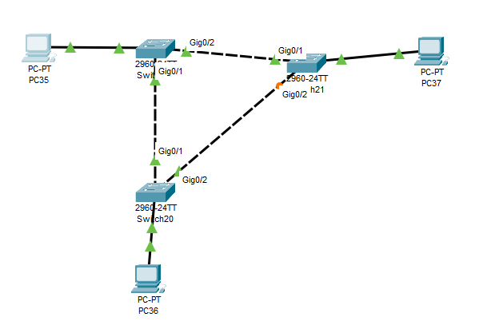
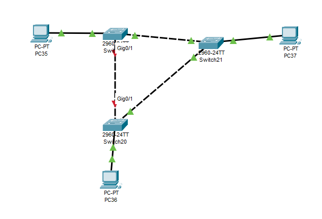
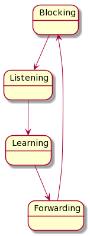

---
title: CCNA試験対策 ch9 Spanning Tree Protocol Concepts
tags:
- CCNA
- 勉強メモ
- ネットワーク
date: 2020-05-03T21:14:59+09:00
URL: https://wand-ta.hatenablog.com/entry/2020/05/03/211459
EditURL: https://blog.hatena.ne.jp/wand_ta/wand-ta.hatenablog.com/atom/entry/26006613561146477
-------------------------------------

- SPOFのなきよう、LANは冗長化すべき
- だが、ループがあるとフレームが永久に回り続ける
- これを解決するのがSTP
- STPの歴史
  - 1990年、STP標準化(IEEE 802.1D)
  - だんだんRSTP: Rapid Spanning Tree Protocolに置き換わる
  - RSTP標準化(IEEE 802.1w)
  - 2004年、RSTPがIEEE 802.1Dに統合される
- きょうび使われるのはRSTP
  - Cisco製品のデフォルトはSTPではなくRSTP
  - CCNA試験でもRSTPが名指し

# STP and RSTP Basics #

- forwarding/blocking state
  - STP/RSTPによる、interfaceごとのフレーム送受信前チェック
    - forwarding stateならふつう
    - blocking stateならば、そのinterfaceでは送受信しない

## The Need for Spaning Tree ##

- LANにループがあると生じる不具合
  - Broadcast storms
  - MAC table instability
  - Multiple frame transmission
    - floodしたやつが同一hostに複数届いちやう

## What Spanning Tree Does ##

- STP convergence
  - LANトポロジの変化を検知し、forwarding/blocking stateを良しなに切り替える
  - 使用中の接続が切断され、全域木でなくなったり、冗長ケーブルを使用して全域木の再構成をはかる

## How Spanning Tree Works ##

- STPはL2 switch登場以前から存在した
  - ので、STPの文脈では「bridge」という言葉がswitchと同義で用いられたりする
    - switchに機能が組み込まれている
- アルゴリズム(STA: Spanning Tree Algorithm)概要
  - root switchが選出される
  - root switchからのコストが最小になる感じに全域木のエッジが選ばれる
    - designated switch
      - 選ばれたエッジに繋がっているノード
    - designated port
      - designated switchの、選ばれたエッジに繋がっているport
      - root switchのportはすべてこれ
    - root port
      - rootへとつながるポート

### The STP Bridge IP and Hello PDU ###

- BID: bridge ID (8バイト)
  - priority (2バイト)
  - system ID (6バイト)
    - burnt-in address
- BPDU: Bridge Protocol Data Units

### Elcting the Root Switch ###

- priorityの最も低いもの
- priorityがタイならば、MACアドレスの最も低いもの

### Choosing Each Switch's Root Port ###

- root bridgeに最も近いポートを選ぶ
- なにをもって近いとするか
- root path cost が最小であること
  - root bridgeに至るまでの経路のコストの最小値

## Configuring to Influence the STP Topology ##

- switchのpriority
  - 他のどのswitchよりも小さな値に設定することで、root switchに選出させる
- port costs
  - 設定可能
  - IEEE標準のデフォルト:

| speed    | IEEE Cost(~1998) | IEEE Cost (2004~) |
|----------|------------------|-------------------|
| 10 MBps  | 100              | 2,000,000         |
| 100 Mbps | 19               | 200,000           |
| 1 Gbps   | 4                | 20,000            |
| 10Gbps   | 2                | 2,000             |
| 100 Gbps | -                | 200               |
| 1 Tbps   | -                | 20                |

- 実際の速度に基づくことに注意
  - 10/100/1000ポートでも10 Mbpsで使用していれば一番上のコスト

# Details Specific to STP (and Not RSTP) #

- ひとたびSTPの設定が完了すると、ネットワークトポロジーが変わるまではそのままであり続ける
- トポロジーが変われば設定も変わる

## STP Activity When the Network Remains Stable ##

1. rootがforwarding stateな全interfaceにHello BPDUを送出
2. nonroot switchたちはroot portでHello BPDUを受信し、下記情報を含めてHelloをdesignated portsに送出
   - 送信者のBID
   - 自身のBID
   - コスト
3. 繰り返す

## STP Timers That Manage STP Convergence ##

- 全switch共通でroot switchのタイマー設定を用いる
  - Hello BPDUに含まれているということ

| timer         | default value | description                                                                 |
|---------------|---------------|-----------------------------------------------------------------------------|
| Hello         | 2 sec         | Hello周期                                                                   |
| MaxAge        | Hello 10回分  | Helloが途絶えた後、STPトポロジを変更するまでの時間                          |
| Forward delay | 15 sec        | blocking -> forwarding の変更の際の、interim listening/learning stateの時間 |

## Changing Interface States with STP ##

- forwarding -> blocking は即座
- blocking -> forwardingは中間状態をともなう
  - temporary loopを防ぐため
- 中間状態
  - Listening
    - frameをforwardingしない
    - 古くなったMAC address tableを削除する
  - Learning
    - frameをforwardingしない
    - MACアドレスの学習を始める
- listening/learningそれぞれにforward delayだけの時間をかける
- デフォルト設定で、接続断からトポロジー変更・再疎通にかかる時間は50秒
  - MaxAge 20秒
  - listening 15秒
  - learning 15秒

| State      | Forward | Learn Mac Addresses | Stable/Transitory |
|------------|---------|---------------------|-------------------|
| Blocking   | No      | No                  | Stable            |
| Listening  | No      | No                  | Transitory        |
| Learning   | No      | Yes                 | Transitory        |
| Forwarding | Yes     | Yes                 | Stable            |
| Disabled   | No      | No                  | Stable            |

# Rapid STP Concepts #

- H/W,S/Wの向上にともない登場
- 何がrapidか？
- Convergenceが速い
  - 全体的にタイマー待ちが減っている

## Comparing STP and RSTP ##

- 同じ
  - rootの選出方法
  - root portの選び方
  - designated portの選び方
  - ポートごとにforwarding/blocking state
    - ただし、RSTPではblocking stateではなくdiscarding stateという
- RSTP特有のところ
  - forwarding stateを待つこと無くroot port切り替え可能
  - forwarding stateを待つこと無くdesignated port切り替え可能
  - タイマー待ち時間の低減
    - タイマーを待たずに隣のswitchに問題を問い合わせたりする

## RSTP and the Alternate (Root) Port Role ##

| port role       | 機能                          |
|-----------------|-------------------------------|
| root port       |                               |
| alternate port  | root port不良時のかわり       |
| designated port |                               |
| backup port     | designated port不良時のかわり |
| disabled port   |                               |

## RSTP States and Processes ##

| RSTP State | STP State  |
|------------|------------|
| Discarding | Disabled   |
| Discarding | Blocking   |
| -          | Listening  |
| Learning   | Learning   |
| Forwarding | Forwarding |

- disabled: administratively disabled
  - shutdownとか？
- Listening Stateの廃止について
  - STPではMAC Address Tableの不要エントリが消えるのをタイマーで待っていた
  - RSTPでは、ループになりそうなエントリを即座に消す

## RSTP and the Backup (Designated) Port Role ##

- designated port不良時、即座に切り替える

## RSTP Port Types ##

- 2種類の分類がある
  - point-to-point ports
    - 2つのswitchを2点間接続するポート
  - point-to-point edge ports, edge ports
    - endpoint device(PCやサーバなど)と2点間接続するポート
- shared port
  - LAN hubに接続されたhalf duplexなポート

## Optional STP Features ##

### EtherChannel ###

- STP Convergenceの時間を減らすにはどうすればよいか？
- convergeしなければいい
  - ポートやケーブルが1箇所くらい不良になってもconvergeしなくてすむような構成
- EtherChannel
  - 複数のEthernet接続をひとまとめにして並列に使う
    - 8本まで
  - CCNA範囲としてはL2/L3両方の設定がある

### PortFast ###

- blocking->forwardingに即座に遷移する機能
- そもそもなぜ listening/learning 中間状態が必要か？
- temporary loopを避けるため
- したがって、この機能を使えるのは、temporary loopが生じえないポートのみ
  - bridgeに繋がっていない
  - switchに繋がっていない
  - その他STP-speaking deviceに繋がっていない
- RSTPでいうpoint-to-point edge portで使える

### BPDU Guard ###
  
- STP/RSTPの脆弱性
  - 攻撃者がpriorityの低いswitchを繋ぐと、そのswitchがrootになる
    - ネットワーク管理者の期待通りのパフォーマンスが出なくなる
    - rootを盗聴されると、そのLANの多くのフレームが盗聴される
  - STP/RSTP機能非搭載の安価なLANスイッチを勝手につなぐ人がいると、loopが生じてしまいうる
- 対策: Cisco BPDU Guard
  - 他のswitchと繋がずaccess portとしてしか使用しないportでは、BPDUを遮断する
