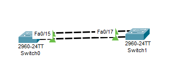
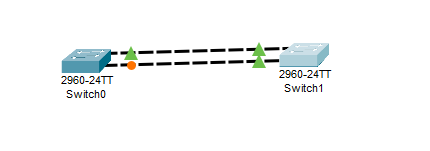

---
title: CCNA試験対策 ch10 RSTP and EtherChannel Configuration
tags:
- CCNA
- ネットワーク
- 勉強メモ
date: 2020-05-04T00:50:31+09:00
URL: https://wand-ta.hatenablog.com/entry/2020/05/04/005031
EditURL: https://blog.hatena.ne.jp/wand_ta/wand-ta.hatenablog.com/atom/entry/26006613561245325
-------------------------------------


# Understanding RSTP Through Configuration #

- Cisco製品はデフォルトコンフィグでも(R)STPが動作する
- それでも、STPのコンフィグを行えると利点がある
  - 所望のswitchをSTP root switchに選出させることができるなどの利点がある


## The Need for Multiple Spanning Trees ##

- VLANの出現前までは CST: common spanning tree トポロジーを考えればよかった
- VLANの登場により、負荷分散の検知から、同一の物理接続上で複数の論理的なspanning treeを考えるべきになった


## STP Modes and Standards ##

```
Switch>enable
Switch#configure terminal
Enter configuration commands, one per line.  End with CNTL/Z.
Switch(config)#spanning-tree mode ?
  pvst        Per-Vlan spanning tree mode
  rapid-pvst  Per-Vlan rapid spanning tree mode
Switch(config)#spanning-tree mode 
```

種類

| Name       | Base | # Trees   | Original IEEE Standard | Config Parameter |
|------------|------|-----------|------------------------|------------------|
| STP        | STP  | 1 (CST)   | 802.1D                 |                  |
| PVST+      | STP  | 1/VLAN    | 802.1D                 | pvst             |
| RSTP       | RSTP | 1 (CST)   | 802.1w                 |                  |
| Rapid PVST | RSTP | 1/VLAN    | 802.1w                 | rapid-pvst       |
| MSTP       | RSTP | 1 or more | 802.1s                 | mst              |

- Packet Tracerではmstは無かった
- MSTI: Multi Spanning Tree Instances
  - 複数のSTを選べるが、VLANごとに1つを要求するものではない


```
SW2#show spanning-tree vlan 1
VLAN0001
  Spanning tree enabled protocol rstp
  Root ID    Priority    24577
             Address     0090.0CA7.83C1
             This bridge is the root
             Hello Time  2 sec  Max Age 20 sec  Forward Delay 15 sec

  Bridge ID  Priority    24577  (priority 24576 sys-id-ext 1)
             Address     0090.0CA7.83C1
             Hello Time  2 sec  Max Age 20 sec  Forward Delay 15 sec
             Aging Time  20

Interface        Role Sts Cost      Prio.Nbr Type
---------------- ---- --- --------- -------- --------------------------------
Fa0/11           Desg BLK 19        128.11   P2p
Gi0/1            Desg BLK 4         128.25   P2p
Gi0/2            Desg BLK 4         128.26   P2p

SW2#
```

- これ:

```
  Spanning tree enabled protocol rstp
```


## The Bridge ID and System ID Extension ##

- per-VLANであれMSTであれ、複数のSpanning Treeを扱うとなると、VLANとVLAN trunkingを考える必要が出てくる
  - ゆえに、現在ではRSTPとMSTPは802.1Q標準の一部
    - VLAN taggingの標準
- BIDを拡張する
  - Priority 2バイト(16ビット)の内訳
    - 上位4ビット: priority
    - 下位12ビット: System ID Extension
      - 典型的にはVLANのID(12bit)を格納する


```
Switch#show spanning-tree vlan 1
VLAN0001
  Spanning tree enabled protocol ieee
  Root ID    Priority    32769
             Address     0001.428C.987C
             Cost        4
             Port        25(GigabitEthernet0/1)
             Hello Time  2 sec  Max Age 20 sec  Forward Delay 15 sec

  Bridge ID  Priority    32769  (priority 32768 sys-id-ext 1)
             Address     0030.A396.EE00
             Hello Time  2 sec  Max Age 20 sec  Forward Delay 15 sec
             Aging Time  20

Interface        Role Sts Cost      Prio.Nbr Type
---------------- ---- --- --------- -------- --------------------------------
Fa0/11           Desg FWD 19        128.11   P2p
Gi0/1            Root FWD 4         128.25   P2p
Gi0/2            Desg FWD 4         128.26   P2p

Switch#
```

```
  Bridge ID  Priority    32769  (priority 32768 sys-id-ext 1)
```
      
- こうした経緯により、priorityには4096(2\^12)の倍数しか設定できない

```
Switch(config)#spanning-tree vlan 1 priority ?
  <0-61440>  bridge priority in increments of 4096
```

- 数値を直接指定するのではなく、便利なエイリアスがある
- `root primary`
  - 24576 (32768 - 8192)
    - デフォルト値32768よりも小さい = 優先される


```
Switch#show spanning-tree vlan 1
VLAN0001
  Spanning tree enabled protocol ieee
  Root ID    Priority    24577
...
```

- `root secondary`
  - 28672 (32768 - 4096)
    - デフォルト値32768よりも小さい = 優先される
    - primaryよりは大きい = 優先されない

```
Switch(config)#spanning-tree vlan 1 root secondary
Switch(config)#end
Switch#show spanning-tree vlan 1
VLAN0001
  Spanning tree enabled protocol ieee
  Root ID    Priority    28673
...
```

- `root primary`は、現rootが24576以下をすでに使用していれば、4096を用いることになっているらしい
  - 【補】Packet Tracerでは、rootを24576にして試したら、20480になった


## How Switches Use the Priority and System ID Extension ##

```
SW2#configure terminal
Enter configuration commands, one per line.  End with CNTL/Z.
SW2(config)#spanning-tree vlan 1 priority 24576
SW2(config)#end
SW2#
```

```
SW2#show spanning-tree vlan 1
VLAN0001
  Spanning tree enabled protocol ieee
  Root ID    Priority    24577
...
```

- 抜粋

```
...
SW2(config)#spanning-tree vlan 1 priority 24576
...
  Root ID    Priority    24577
...
```

```
24577 = 0b(0110 | 0000 0000 0001)
```

- VLAN IDが12bitなので単純足し算


## RSTP Methods to Support Multiple Spanning Trees ##

- IEEE標準のRSTPとCisco独自のRPVST+の違い


|                                     | RSTP             | RPVST+                 |
|-------------------------------------|------------------|------------------------|
| # tree                              | 1 (CST)          | 1 / VLAN               |
| # message / network                 | 1                | 1 / VLAN               |
| Destination MAC Address (multicast) | `0180.C200.0000` | `0100.0CCC.CCCD`       |
| VLAN tagging (802.1Q header)        | なし             | あり                   |
| extra TLV: type-length value        | なし             | あり (VLAN IDの識別用) |
| 12-bit System ID Extension部分の解釈    | VLANなし         | VLAN ID                |


## Other RSTP Configuration Options ##

- Switch Priority
  - `spanning-tree vlan x priority y`
- Primary and Secondary Root Switches
  - `spanning-tree vlan x root (primary|secondary)`
- Port Costs
  - `spanning-tree [vlan x] cost y`
    - Packet Tracerには無さげ


# Configuring Layer 2 EtherChannel #

- 複数のinterfaceを論理的にまとめるやつ
  - すべてをパラレルに用いる
    - 負荷分散
    - 障害時のSTP convergenceの回避

## Configuring a Manual Layer 2 EtherChannel ##

- これになりたい:



- 設定を行わない場合、たんにSTPによって片方がblocking (discarding) stateによる



- 設定

```
SW1#configure terminal
Enter configuration commands, one per line.  End with CNTL/Z.
SW1(config)#interface fa0/14
SW1(config-if)#channel-group 1 mode on
SW1(config-if)#
Creating a port-channel interface Port-channel 1

%LINK-5-CHANGED: Interface Port-channel1, changed state to up

%LINEPROTO-5-UPDOWN: Line protocol on Interface Port-channel1, changed state to up

SW1(config-if)#interface fa 0/15
SW1(config-if)#channel-group 1 mode on
SW1(config-if)#end
SW1#
%SYS-5-CONFIG_I: Configured from console by console
```

- 確認

```
SW1#show spanning-tree vlan 1
VLAN0001
  Spanning tree enabled protocol ieee
  Root ID    Priority    32769
             Address     00E0.F786.AD08
             Cost        9
             Port        27(Port-channel1)
             Hello Time  2 sec  Max Age 20 sec  Forward Delay 15 sec

  Bridge ID  Priority    32769  (priority 32768 sys-id-ext 1)
             Address     00E0.F795.E265
             Hello Time  2 sec  Max Age 20 sec  Forward Delay 15 sec
             Aging Time  20

Interface        Role Sts Cost      Prio.Nbr Type
---------------- ---- --- --------- -------- --------------------------------
Po1              Root LRN 9         128.27   Shr
```

- cf. 未設定

```
SW2#show spanning-tree vlan 1
VLAN0001
  Spanning tree enabled protocol ieee
  Root ID    Priority    32769
             Address     00E0.F786.AD08
             This bridge is the root
             Hello Time  2 sec  Max Age 20 sec  Forward Delay 15 sec

  Bridge ID  Priority    32769  (priority 32768 sys-id-ext 1)
             Address     00E0.F786.AD08
             Hello Time  2 sec  Max Age 20 sec  Forward Delay 15 sec
             Aging Time  20

Interface        Role Sts Cost      Prio.Nbr Type
---------------- ---- --- --------- -------- --------------------------------
Fa0/17           Desg FWD 19        128.17   P2p
Fa0/16           Desg FWD 19        128.16   P2p
```

- Po

```
...
             Port        27(Port-channel1)
...
Interface        Role Sts Cost      Prio.Nbr Type
---------------- ---- --- --------- -------- --------------------------------
Po1              Root LRN 9         128.27   Shr
```

- port-channel interface `Po1`ができている


```
SW1#show etherchannel summary
Flags:  D - down        P - in port-channel
        I - stand-alone s - suspended
        H - Hot-standby (LACP only)
        R - Layer3      S - Layer2
        U - in use      f - failed to allocate aggregator
        u - unsuitable for bundling
        w - waiting to be aggregated
        d - default port


Number of channel-groups in use: 1
Number of aggregators:           1

Group  Port-channel  Protocol    Ports
------+-------------+-----------+----------------------------------------------

1      Po1(SU)           -      Fa0/14(P) Fa0/15(P) 

```


## Configuring Dynamic EtherChannels ##

```
SW1(config-if)#channel-group 1 mode ?
  active     Enable LACP unconditionally
  auto       Enable PAgP only if a PAgP device is detected
  desirable  Enable PAgP unconditionally
  on         Enable Etherchannel only
  passive    Enable LACP only if a LACP device is detected
SW1(config-if)#channel-group 1 mode 
```

- `active`, `auto`, `desirable`, `passive` は動的にEtherChannelを設定する
- 動的にnegotiateするプロトコルは2種類ある:
  - PAgP: Port Aggregation Protocol
    - Cisco独自
    - 8本まで
  - LACP: Link Aggregation Control Protocol
    - based on IEEE 802.3ad
    - アクティブ8本 + スタンバイ8本まで

|           | on                  | desirable  | auto       | active     | passive    |
|-----------|---------------------|------------|------------|------------|------------|
| on        | static EtherChannel | Do Not Use | Do Not Use | Do Not Use | Do Not Use |
| desirable | Do Not Use          | PAgP       | PAgP       |            |            |
| auto      | Do Not Use          | PAgP       |            |            |            |
| active    | Do Not Use          |            |            | LACP       | LACP       |
| passive   | Do Not Use          |            |            | LACP       |            |


- desirable - autoで設定してみる

SW1: desirable

```
SW1(config)#interface f0/14
SW1(config-if)#channel-group 1 mode desirable
SW1(config-if)#exit
SW1(config-if)#interface f0/15
SW1(config-if)#channel-group 1 mode desirable
SW1(config-if)#
%LINK-3-UPDOWN: Interface Port-channel1, changed state to down

%LINEPROTO-5-UPDOWN: Line protocol on Interface Port-channel1, changed state to down

SW1(config-if)#
```

SW2: auto

```
SW2(config)#interface f0/16
SW2(config-if)#channel-group 1 mode auto
SW2(config-if)#
Creating a port-channel interface Port-channel 1

%LINEPROTO-5-UPDOWN: Line protocol on Interface FastEthernet0/16, changed state to down

%LINEPROTO-5-UPDOWN: Line protocol on Interface FastEthernet0/16, changed state to up

SW2(config-if)#exit
SW2(config)#interface f0/17
SW2(config-if)#channel-group 1 mode auto
SW2(config-if)#
%LINEPROTO-5-UPDOWN: Line protocol on Interface FastEthernet0/17, changed state to down

%LINEPROTO-5-UPDOWN: Line protocol on Interface FastEthernet0/17, changed state to up

%LINK-5-CHANGED: Interface Port-channel1, changed state to up

%LINEPROTO-5-UPDOWN: Line protocol on Interface Port-channel1, changed state to up

SW2(config-if)#
SW2(config-if)#end
SW2#
%SYS-5-CONFIG_I: Configured from console by console
```


- 確認

SW1

```
SW1#show etherchannel port-channel 
                Channel-group listing:
                ----------------------

Group: 1
----------
                Port-channels in the group:
                ---------------------------

Port-channel: Po1
------------

Age of the Port-channel   = 00d:00h:30m:25s
Logical slot/port   = 2/1       Number of ports = 2
GC                  = 0x00000000      HotStandBy port = null
Port state          = Port-channel 
Protocol            =   PAGP
Port Security       = Disabled

Ports in the Port-channel:

Index   Load   Port     EC state        No of bits
------+------+------+------------------+-----------
  0     00     Fa0/14   Desirable-Sl       0
  0     00     Fa0/15   Desirable-Sl       0
Time since last port bundled:    00d:00h:02m:21s    Fa0/15
```

SW2

```
SW2#show etherchannel port-channel 
                Channel-group listing:
                ----------------------

Group: 1
----------
                Port-channels in the group:
                ---------------------------

Port-channel: Po1
------------

Age of the Port-channel   = 00d:00h:03m:19s
Logical slot/port   = 2/1       Number of ports = 2
GC                  = 0x00000000      HotStandBy port = null
Port state          = Port-channel 
Protocol            =   PAGP
Port Security       = Disabled

Ports in the Port-channel:

Index   Load   Port     EC state        No of bits
------+------+------+------------------+-----------
  0     00     Fa0/16   Automatic          0
  0     00     Fa0/17   Automatic          0
Time since last port bundled:    00d:00h:02m:59s    Fa0/17
```


## Physical Interface Configuration and EtherChannels ##

- 新しい物理interfaceをPort Channelに追加するとき、Port Channel内の既存のinterfaceと設定が一致していないといけない
  - speed
  - duplex
  - などなど
- 【補】
  - Packet Tracerでは全然違ってもPort Channelを組めてしまった

## EtherChannel Load Distribution ##

- MACアドレスの学習プロセスは、物理的なinterfaceではなく、PortChannel interfaceにより行われるようになる
  - 「このMACアドレスのデバイスは、このPortChannelの向こうにいる」
- ではPortChannel interfaceからframeを送出するさい、どの物理interfaceを使うか？
- 負荷分散の話になってくる

### Configuration Options for EtherChannel Load Distribution ###

- global configで、`(src|dst|src-dst)-(mac|ip|port)` による負荷分散が利用可能
  - source/destination/両方の
    - 【疑問点】テキストには「Both」、Packet Tracerのヘルプには「XOR」と書いてある…
  - MACアドレス/IPアドレス/TCP・UDPポート番号
- 【補】Packet TracerではL4の情報による負荷分散はサポートされていなかった

```
Switch(config)#port-channel load-balance ?
  dst-ip       Dst IP Addr
  dst-mac      Dst Mac Addr
  src-dst-ip   Src XOR Dst IP Addr
  src-dst-mac  Src XOR Dst Mac Addr
  src-ip       Src IP Addr
  src-mac      Src Mac Addr
```

### The Effects of the EtherChannel Load Distribution Algorithm ###


```
SW1(config)#port-channel load-balance src-mac
SW1(config)#end
SW1#
%SYS-5-CONFIG_I: Configured from console by console
SW1#show etherchannel load-balance 
EtherChannel Load-Balancing Operational State (src-mac):
Non-IP: Source MAC address
  IPv4: Source MAC address
  IPv6: Source MAC address
```

- 下記コマンドでロードバランシングのテストができるらしいが、Packet Tracerではできなかった

```
SW1#test etherchannel load-balance interface po1 mac 0200.0000.0001 0200.1111.1111
         ^
% Invalid input detected at '^' marker.
	
SW1#test etherchannel
```
