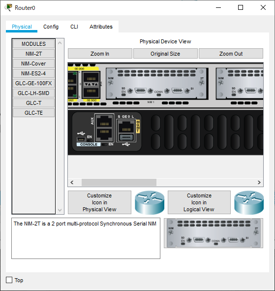
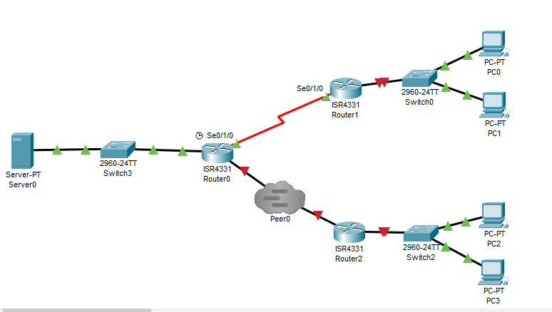

---
title: CCNA試験対策 ch15 operating cisco routers
tags:
- CCNA
- ネットワーク
- 勉強メモ
date: 2020-05-04T16:53:17+09:00
URL: https://wand-ta.hatenablog.com/entry/2020/05/04/165317
EditURL: https://blog.hatena.ne.jp/wand_ta/wand-ta.hatenablog.com/atom/entry/26006613561554490
-------------------------------------


# Installing Cisco Routers #


## Installing Enterprise Routers ##

- CSU/DSU: Channel Service Unit/Data Service Unit
  - LAN/WANのフレームを相互変換するやつ


## Installing SOHO Routers ##

- (略)


# Enabling IPv4 Support on Cisco Router Interfaces #

## Access the Router CLI ##

## Router Interfaces ##

### Interface Status Codes ###

```
R1#show interfaces g0/0/0
GigabitEthernet0/0/0 is up, line protocol is up (connected)
  Hardware is ISR4331-3x1GE, address is 0050.0fd9.a701 (bia 0050.0fd9.a701)
  Internet address is 172.16.1.1/24
  MTU 1500 bytes, BW 1000000 Kbit, DLY 10 usec,
     reliability 255/255, txload 1/255, rxload 1/255
  Encapsulation ARPA, loopback not set
  Keepalive not supported
  Full Duplex, 1000Mbps, link type is auto,  media type is Auto Select
  output flow-control is on, input flow-control is on
  ARP type: ARPA, ARP Timeout 04:00:00, 
  Last input 00:00:08, output 00:00:05, output hang never
  Last clearing of "show interface" counters never
  Input queue: 0/375/0 (size/max/drops); Total output drops: 0
  Queueing strategy: fifo
  Output queue :0/40 (size/max)
  5 minute input rate 0 bits/sec, 0 packets/sec
  5 minute output rate 0 bits/sec, 0 packets/sec
     0 packets input, 0 bytes, 0 no buffer
     Received 0 broadcasts (0 IP multicasts)
     0 runts, 0 giants, 0 throttles
     0 input errors, 0 CRC, 0 frame, 0 overrun, 0 ignored
     0 watchdog, 1017 multicast, 0 pause input
     0 input packets with dribble condition detected
     0 packets output, 0 bytes, 0 underruns
     0 output errors, 0 collisions, 1 interface resets
     0 unknown protocol drops
     0 babbles, 0 late collision, 0 deferred
     0 lost carrier, 0 no carrier
     0 output buffer failures, 0 output buffers swapped out
```

```
GigabitEthernet0/0/0 is up, line protocol is up (connected)
```

- up/upってやつ
  - L1/L2


### Router Inteface IP Addresses ###

- packet tracer上でrouterにserial接続するには電鍵を落としてNIM(Network Interface Module)を挿す必要がある





- 各interfaceにIPアドレス割り当て

```
Router#configure terminal
Enter configuration commands, one per line.  End with CNTL/Z.
Router(config)#interface g0/0/0
Router(config-if)#ip address 172.16.1.1 255.255.255.0
Router(config-if)#no shutdown

Router(config-if)#
%LINK-5-CHANGED: Interface GigabitEthernet0/0/0, changed state to up

%LINEPROTO-5-UPDOWN: Line protocol on Interface GigabitEthernet0/0/0, changed state to up
```

```
Router(config-if)#interface s0/1/0
Router(config-if)#ip address 172.16.4.1 255.255.255.0
Router(config-if)#no shutdown

%LINK-5-CHANGED: Interface Serial0/1/0, changed state to down
Router(config-if)#
```

```
Router(config-if)#interface g0/0/1
Router(config-if)#ip address 172.16.5.1 255.255.255.0
Router(config-if)#no shutdown

Router(config-if)#
%LINK-5-CHANGED: Interface GigabitEthernet0/0/1, changed state to up

Router(config-if)#end
Router#
%SYS-5-CONFIG_I: Configured from console by console
```

- serialは両端でno shutdownしないと`line protocol is down`になる
- 各種interfaceが使えること・割り当てたIPアドレスの確認

```
Router#show protocols 
Global values:
  Internet Protocol routing is enabled
GigabitEthernet0/0/0 is up, line protocol is up
  Internet address is 172.16.1.1/24
GigabitEthernet0/0/1 is up, line protocol is down
  Internet address is 172.16.5.1/24
GigabitEthernet0/0/2 is administratively down, line protocol is down
Serial0/1/0 is up, line protocol is up
  Internet address is 172.16.4.1/24
Serial0/1/1 is administratively down, line protocol is down
Serial0/2/0 is administratively down, line protocol is down
Serial0/2/1 is administratively down, line protocol is down
Vlan1 is administratively down, line protocol is down
```

```
Router#show ip interface brief
Interface              IP-Address      OK? Method Status                Protocol 
GigabitEthernet0/0/0   unassigned      YES unset  administratively down down 
GigabitEthernet0/0/1   unassigned      YES unset  administratively down down 
GigabitEthernet0/0/2   unassigned      YES unset  administratively down down 
Serial0/1/0            unassigned      YES unset  administratively down down 
Serial0/1/1            unassigned      YES unset  administratively down down 
Serial0/2/0            unassigned      YES unset  administratively down down 
Serial0/2/1            unassigned      YES unset  administratively down down 
Vlan1                  unassigned      YES unset  administratively down down
```


## Router Auxiliary Port ##

- line aux 0からログインとかできる
  - con 0などと同様のlogin設定などが可能

