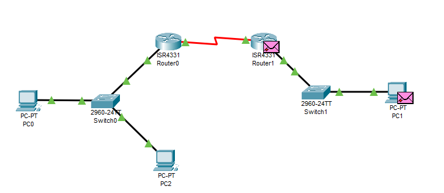

---
title: CCNA試験対策 ch16 Configuring IPv4 Addresses and Static Routes
tags:
- CCNA
- ネットワーク
- 勉強メモ
date: 2020-05-04T20:03:36+09:00
URL: https://wand-ta.hatenablog.com/entry/2020/05/04/200336
EditURL: https://blog.hatena.ne.jp/wand_ta/wand-ta.hatenablog.com/atom/entry/26006613561647571
-------------------------------------


# IP Routing #

## IPv4 Routing Process Reference ##

- destination IP Addressがローカル: 直接送る
  - MACアドレス取得
    - ARPテーブルにエントリがすでにあればそれを使う、なければARPメッセージ送出
  - IPパケットを802.3フレームでくるんで宛先hostへ送出
- destination IP Addressがローカルでない: デフォルトゲートウェイに送る
  - MACアドレス取得
    - ARPテーブルにエントリがすでにあればそれを使う、なければARPメッセージ送出
  - IPパケットを802.3フレームでくるんでデフォルトゲートウェイへ送出


## An Example of IP Routing ##

### Host Forwards the IP Packet to the Default Router (Gateway) ###

- routing tableにしたがってルータホップする
  1. Decide Whether to Process the Incoming Frame
  1. De-Encapsulation of the IP Packet
  1. Choosing Where to Forward the Packet
  1. Encapsulating the Packet in a New Frame


# Configuring IP Addresses and Connected Routes #

## Connected Routes and the ip address Command ##

- 各interfaceに割り当てたIPv4アドレスの確認

```
Router#show running-config 
Building configuration...

...
!
interface GigabitEthernet0/0/0
 ip address 192.168.1.21 255.255.255.0
 duplex auto
 speed auto
!
interface GigabitEthernet0/0/1
 ip address 192.168.2.21 255.255.255.0
 duplex auto
 speed auto
!
interface GigabitEthernet0/0/2
 no ip address
 duplex auto
 speed auto
 shutdown
!
interface Vlan1
 no ip address
 shutdown
!
...
```


```
Router>show ip route 
Codes: L - local, C - connected, S - static, R - RIP, M - mobile, B - BGP
       D - EIGRP, EX - EIGRP external, O - OSPF, IA - OSPF inter area
       N1 - OSPF NSSA external type 1, N2 - OSPF NSSA external type 2
       E1 - OSPF external type 1, E2 - OSPF external type 2, E - EGP
       i - IS-IS, L1 - IS-IS level-1, L2 - IS-IS level-2, ia - IS-IS inter area
       * - candidate default, U - per-user static route, o - ODR
       P - periodic downloaded static route

Gateway of last resort is not set

     192.168.1.0/24 is variably subnetted, 2 subnets, 2 masks
C       192.168.1.0/24 is directly connected, GigabitEthernet0/0/0
L       192.168.1.21/32 is directly connected, GigabitEthernet0/0/0
     192.168.2.0/24 is variably subnetted, 2 subnets, 2 masks
C       192.168.2.0/24 is directly connected, GigabitEthernet0/0/1
L       192.168.2.21/32 is directly connected, GigabitEthernet0/0/1

Router>
```


## The ARP Table on a Cisco Router ##

```
Router>show ip arp 
Protocol  Address          Age (min)  Hardware Addr   Type   Interface
Internet  192.168.1.11            28  00D0.BC92.ADC9  ARPA   GigabitEthernet0/0/0
Internet  192.168.1.21            -   0002.16D5.8701  ARPA   GigabitEthernet0/0/0
Internet  192.168.2.11            27  0090.2BBE.8756  ARPA   GigabitEthernet0/0/1
Internet  192.168.2.21            -   0002.16D5.8702  ARPA   GigabitEthernet0/0/1
```


# Configuring Static Routes #

- CCNAではstatic routesは4つのトピックに分類される
  - network routes
  - host routes
  - floating static routes
  - default routes


## Static Network Routes ##



- routingが定義されていないので、サブネット越えができない

```
R1#show ip route static
R1#
```

- static routingを設定する

```
R1#configure terminal 
Enter configuration commands, one per line.  End with CNTL/Z.
R1(config)#ip route 192.168.2.0 255.255.255.0 172.16.1.21
R1(config)#
%SYS-5-CONFIG_I: Configured from console by console

R1(config)#
R1(config)#end
R1#
R1#
R1#show ip route static 
S    192.168.2.0/24 [1/0] via 172.16.1.21

R1#
```


```
R2#configure
Configuring from terminal, memory, or network [terminal]? 
Enter configuration commands, one per line.  End with CNTL/Z.
R2(config)#
R2(config)#
R2(config)#ip route 192.168.1.0 255.255.255.0 172.16.1.11
R2(config)#
R2(config)#end
R2#show ip route st
R2#show ip route static 
S    192.168.1.0/24 [1/0] via 172.16.1.11
```

- サブネット越えできるようになる


```
C:\>ping 192.168.2.11

Pinging 192.168.2.11 with 32 bytes of data:

Reply from 192.168.2.11: bytes=32 time=1ms TTL=126
Reply from 192.168.2.11: bytes=32 time=1ms TTL=126
Reply from 192.168.2.11: bytes=32 time=1ms TTL=126
Reply from 192.168.2.11: bytes=32 time=1ms TTL=126

Ping statistics for 192.168.2.11:
    Packets: Sent = 4, Received = 4, Lost = 0 (0% loss),
Approximate round trip times in milli-seconds:
    Minimum = 1ms, Maximum = 1ms, Average = 1ms
```

- ip routeの書式

```
R1(config)#ip route  ?
  A.B.C.D  Destination prefix
R1(config)#ip route  172.16.1.11 255.255.255.0 ?
  A.B.C.D          Forwarding router's address
  Dialer           Dialer interface
  Ethernet         IEEE 802.3
  FastEthernet     FastEthernet IEEE 802.3
  GigabitEthernet  GigabitEthernet IEEE 802.3z
  Loopback         Loopback interface
  Null             Null interface
  Serial           Serial
  Vlan             Catalyst Vlans
R1(config)#ip route  172.16.1.11 255.255.255.0 
```

- 第1引数: 宛先サブネット
  - `A.B.C.D  Destination prefix`
- 第2引数: いろいろ
  - `A.B.C.D          Forwarding router's address`
    - 上で指定したのはこれ
  - interfaceを設定することもできる

```
R1(config)#ip route 192.168.2.0 255.255.255.0 S0/1/0
%Default route without gateway, if not a point-to-point interface, may impact performance
R1(config)#
R1(config)#
R1(config)#end
R1#
%SYS-5-CONFIG_I: Configured from console by console
show ip route st
R1#show ip route static 
S    192.168.2.0/24 [1/0] via 172.16.1.21
                    is directly connected, Serial0/1/0

R1#
```


## Static Host Routes ##

```
ip route 10.1.1.0 255.255.255.0 10.2.2.2
ip route 10.1.1.9 255.255.255.255 10.9.9.9
```

- 2つめは1つめと競合している
- 2つめのほうが詳細なのでこちらが優先される


## Floating Static Routes ##


- あるstatic routeが別のstatic routeや、routing protocolにより学習されたrouteと競合したら？
  - OSPFとか
- administrative distance に基づいてどれを使用するか決定される
- デフォルトでは、static routeがOSPFで学習されたrouteよりも優先
  - staticのadministrative distance: 1
  - OSPFで学習されたroute: 110


```
R1>show ip route static 
S    192.168.2.0/24 [1/0] via 172.16.1.21
                    is directly connected, Serial0/1/0
```

```
R1>show ip route 192.168.2.0
Routing entry for 192.168.2.0/24
Known via "static", distance 1, metric 0 (connected)
  Routing Descriptor Blocks:
  * 172.16.1.21
      Route metric is 0, traffic share count is 1
    directly connected, via Serial0/1/0
      Route metric is 0, traffic share count is 1

R1>
```

- administrative distance: 1

```
Known via "static", distance 1, metric 0 (connected)
```

- ip routeコマンドで administrative distanceを指定できる


```
R1#configure  terminal 
Enter configuration commands, one per line.  End with CNTL/Z.
R1(config)#ip route 192.168.2.0 255.255.255.0 172.16.1.21 130
R1(config)#end
%SYS-5-CONFIG_I: Configured from console by console
```

```
R1#show ip route 192.168.2.0
Routing entry for 192.168.2.0/24
Known via "static", distance 130, metric 0 (connected)
  Routing Descriptor Blocks:
  * directly connected, via Serial0/1/0
      Route metric is 0, traffic share count is 1
    172.16.1.21
      Route metric is 0, traffic share count is 1

R1#show ip route static
S    192.168.2.0/24 is directly connected, Serial0/1/0
                    [130/0] via 172.16.1.21
```

## Static Default Routes ##

- 「Gateway of last resort」

```
R1#configure terminal 
Enter configuration commands, one per line.  End with CNTL/Z.
R1(config)#
R1(config)#
R1(config)#ip route 0.0.0.0 0.0.0.0 s0/1/0
%Default route without gateway, if not a point-to-point interface, may impact performance
R1(config)#end
R1#
%SYS-5-CONFIG_I: Configured from console by console
```

```
R1#show ip route
Codes: L - local, C - connected, S - static, R - RIP, M - mobile, B - BGP
       D - EIGRP, EX - EIGRP external, O - OSPF, IA - OSPF inter area
       N1 - OSPF NSSA external type 1, N2 - OSPF NSSA external type 2
       E1 - OSPF external type 1, E2 - OSPF external type 2, E - EGP
       i - IS-IS, L1 - IS-IS level-1, L2 - IS-IS level-2, ia - IS-IS inter area
       * - candidate default, U - per-user static route, o - ODR
       P - periodic downloaded static route

Gateway of last resort is 0.0.0.0 to network 0.0.0.0

     172.16.0.0/16 is variably subnetted, 2 subnets, 2 masks
C       172.16.1.0/24 is directly connected, Serial0/1/0
L       172.16.1.11/32 is directly connected, Serial0/1/0
     192.168.1.0/24 is variably subnetted, 2 subnets, 2 masks
C       192.168.1.0/24 is directly connected, GigabitEthernet0/0/0
L       192.168.1.21/32 is directly connected, GigabitEthernet0/0/0
S    192.168.2.0/24 is directly connected, Serial0/1/0
                    [130/0] via 172.16.1.21
S*   0.0.0.0/0 is directly connected, Serial0/1/0

R1#
```

```
Gateway of last resort is 0.0.0.0 to network 0.0.0.0
```

- 他のどれにもマッチしなければここに送る


## Troubleshooting Static Routes ##

- routeの設定誤り
- routeの設定がない
- 設定は正しいがパケットがとどかない


### Troubleshooting Incorrect Static Routes That Appear in the IP Routing Table ###


### The Static Route Dows Not Appear in the IP Routing Table ###

- up/up でないとrouting tableに現れなくなる

```
R1#
%LINK-3-UPDOWN: Interface Serial0/1/0, changed state to down

%LINEPROTO-5-UPDOWN: Line protocol on Interface Serial0/1/0, changed state to down

%LINK-5-CHANGED: Interface Serial0/1/0, changed state to up
show ip route
Codes: L - local, C - connected, S - static, R - RIP, M - mobile, B - BGP
       D - EIGRP, EX - EIGRP external, O - OSPF, IA - OSPF inter area
       N1 - OSPF NSSA external type 1, N2 - OSPF NSSA external type 2
       E1 - OSPF external type 1, E2 - OSPF external type 2, E - EGP
       i - IS-IS, L1 - IS-IS level-1, L2 - IS-IS level-2, ia - IS-IS inter area
       * - candidate default, U - per-user static route, o - ODR
       P - periodic downloaded static route

Gateway of last resort is not set

     192.168.1.0/24 is variably subnetted, 2 subnets, 2 masks
C       192.168.1.0/24 is directly connected, GigabitEthernet0/0/0
L       192.168.1.21/32 is directly connected, GigabitEthernet0/0/0

```

- up/upでなくても残す場合はpermanentをつけるらしい
  - Packet Tracerでは動作せず


```
R1(config)#ip route 192.168.2.0 255.255.255.0 s0/1/0 permanent
                                                     ^
% Invalid input detected at '^' marker.
	
```


### The Correct Static Route Appears but Works Poorly ###


- routingは悪くないかも
  - 【所感】end device側のデフォゲ設定忘れとかね


# IP Forwarding with the Longest Prefix Match #

## Using show ip route to Find the Best Route ##

```
R1#show ip route static
S    192.168.2.0/24 is directly connected, Serial0/1/0
S*   0.0.0.0/0 is directly connected, Serial0/1/0

```

- いちばんマッチする部分が長いrouteが選択される

## Using show ip route address to Find the Best Route ##

```
R1#show ip route 192.168.2.11
Routing entry for 192.168.2.0/24
Known via "static", distance 1, metric 0 (connected)
  Routing Descriptor Blocks:
  * directly connected, via Serial0/1/0
      Route metric is 0, traffic share count is 1

R1#
```

- 指定のアドレスやsubnet宛のパケットがどのrouteで伝送されるか

## Interpreting The IP Routing Table ##


```
R1#show ip route
Codes: L - local, C - connected, S - static, R - RIP, M - mobile, B - BGP
       D - EIGRP, EX - EIGRP external, O - OSPF, IA - OSPF inter area
       N1 - OSPF NSSA external type 1, N2 - OSPF NSSA external type 2
       E1 - OSPF external type 1, E2 - OSPF external type 2, E - EGP
       i - IS-IS, L1 - IS-IS level-1, L2 - IS-IS level-2, ia - IS-IS inter area
       * - candidate default, U - per-user static route, o - ODR
       P - periodic downloaded static route

Gateway of last resort is 0.0.0.0 to network 0.0.0.0

     172.16.0.0/16 is variably subnetted, 2 subnets, 2 masks
C       172.16.1.0/24 is directly connected, Serial0/1/0
L       172.16.1.11/32 is directly connected, Serial0/1/0
     192.168.1.0/24 is variably subnetted, 2 subnets, 2 masks
C       192.168.1.0/24 is directly connected, GigabitEthernet0/0/0
L       192.168.1.21/32 is directly connected, GigabitEthernet0/0/0
S    192.168.2.0/24 is directly connected, Serial0/1/0
                    [130/0] via 172.16.1.21
S*   0.0.0.0/0 is directly connected, Serial0/1/0

R1#
```


| idea                    | value in example | description                        |
|-------------------------|------------------|------------------------------------|
| Classful Network        | 172.16.0.0/16    |                                    |
| # subnets               | 2 subnets        |                                    |
| # masks                 | 2 masks          |                                    |
| prefix/prefix length    | 172.16.1.0/24    |                                    |
| administrative distance | 130              |                                    |
| metric                  | 130/0 の 0       |                                    |
| next-hop router         | via 172.16.1.21  | このルータにホップするよ、ってやつ |
| outgoing interface      | Serial0/1/0      |                                    |


