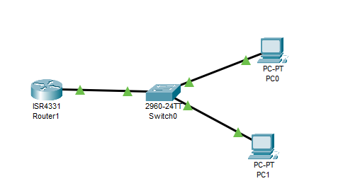
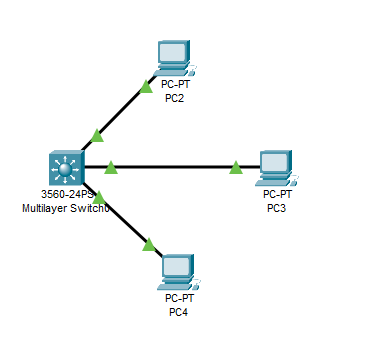
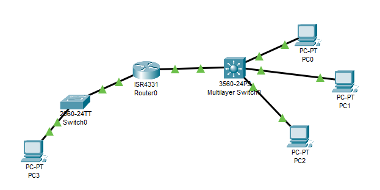
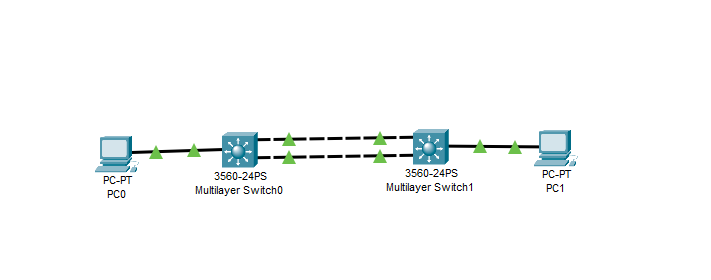

---
title: CCNA試験対策 ch17 IP Routing in the LAN
tags:
- CCNA
- ネットワーク
- 勉強メモ
date: 2020-05-05T08:54:24+09:00
URL: https://wand-ta.hatenablog.com/entry/2020/05/05/085424
EditURL: https://blog.hatena.ne.jp/wand_ta/wand-ta.hatenablog.com/atom/entry/26006613562029235
-------------------------------------


# VLAN Routing with Router 802.1Q Trunks #

- いくつかのつなぎ方がある
  - routerとswitchをVLAN1つごとにケーブル1本で接続
    - あまりやらない
  - ROAS: router-on-a-stick
    - routerとLANスイッチをtrunkで接続
  - L3 switch with SVI: Switched Virtual Interfaces
  - L3 switch with routed interfaces


## Configuring ROAS ##




- ROAS: router-on-a-stick
  - router-switch間の物理接続は1本
  - 複数のVLANをtrunk接続
- switchのVLANと、switch-router間のtrunk linkを構成する


```
Switch#configure 
Configuring from terminal, memory, or network [terminal]? 
Enter configuration commands, one per line.  End with CNTL/Z.
Switch(config)#
Switch(config)#int
Switch(config)#interface f0/11
Switch(config-if)#switchport access vlan 10
% Access VLAN does not exist. Creating vlan 10
Switch(config-if)#int f0/12
Switch(config-if)#switchport access vlan 20
% Access VLAN does not exist. Creating vlan 20
Switch(config-if)#int g0/1
Switch(config-if)#switchport mode trunk
Switch(config-if)#
Switch(config-if)#end
Switch#
%SYS-5-CONFIG_I: Configured from console by console

Switch#
%LINK-5-CHANGED: Interface GigabitEthernet0/1, changed state to up

%LINEPROTO-5-UPDOWN: Line protocol on Interface GigabitEthernet0/1, changed state to up
```

- router側設定
  - vlan-idを添えてsubinterfaceのコンフィグを設定する


```
Router#configure terminal 
Enter configuration commands, one per line.  End with CNTL/Z.
Router(config)#
Router(config)#int g0/0/0
Router(config-if)#no shutdown

Router(config-if)#
%LINK-5-CHANGED: Interface GigabitEthernet0/0/0, changed state to up

%LINEPROTO-5-UPDOWN: Line protocol on Interface GigabitEthernet0/0/0, changed state to up

Router(config-if)#
Router(config-if)#int g0/0/0.10
Router(config-subif)#
%LINK-5-CHANGED: Interface GigabitEthernet0/0/0.10, changed state to up

%LINEPROTO-5-UPDOWN: Line protocol on Interface GigabitEthernet0/0/0.10, changed state to up

Router(config-subif)#encapsulation dot1q 10
Router(config-subif)#ip address 10.0.10.1 255.255.255.0
Router(config-subif)#
Router(config-subif)#int g0/0/0.20
Router(config-subif)#
%LINK-5-CHANGED: Interface GigabitEthernet0/0/0.20, changed state to up

%LINEPROTO-5-UPDOWN: Line protocol on Interface GigabitEthernet0/0/0.20, changed state to up

Router(config-subif)#encapsulation dot1q 20
Router(config-subif)#ip address 10.0.20.1 255.255.255.0
Router(config-subif)#end
Router#
%SYS-5-CONFIG_I: Configured from console by console

Router#
```


- native VLANのときは`encapsulation dot1q vlan-id native`を使用する
- 疎通確認

```
C:\>ping 0.0.0.0

Pinging 0.0.0.0 with 32 bytes of data:

Reply from 10.0.10.1: bytes=32 time<1ms TTL=255
Reply from 10.0.10.1: bytes=32 time<1ms TTL=255
Reply from 10.0.10.1: bytes=32 time<1ms TTL=255
Reply from 10.0.10.1: bytes=32 time=1ms TTL=255

Ping statistics for 0.0.0.0:
    Packets: Sent = 4, Received = 4, Lost = 0 (0% loss),
Approximate round trip times in milli-seconds:
    Minimum = 0ms, Maximum = 1ms, Average = 0ms

C:\>ping 10.0.20.11

Pinging 10.0.20.11 with 32 bytes of data:

Reply from 10.0.20.11: bytes=32 time=1ms TTL=127
Reply from 10.0.20.11: bytes=32 time<1ms TTL=127
Reply from 10.0.20.11: bytes=32 time=1ms TTL=127
Reply from 10.0.20.11: bytes=32 time<1ms TTL=127

Ping statistics for 10.0.20.11:
    Packets: Sent = 4, Received = 4, Lost = 0 (0% loss),
Approximate round trip times in milli-seconds:
    Minimum = 0ms, Maximum = 1ms, Average = 0ms
```


## Verifying ROAS ##

```
Router>show ip route
Codes: L - local, C - connected, S - static, R - RIP, M - mobile, B - BGP
       D - EIGRP, EX - EIGRP external, O - OSPF, IA - OSPF inter area
       N1 - OSPF NSSA external type 1, N2 - OSPF NSSA external type 2
       E1 - OSPF external type 1, E2 - OSPF external type 2, E - EGP
       i - IS-IS, L1 - IS-IS level-1, L2 - IS-IS level-2, ia - IS-IS inter area
       * - candidate default, U - per-user static route, o - ODR
       P - periodic downloaded static route

Gateway of last resort is not set

     10.0.0.0/8 is variably subnetted, 4 subnets, 2 masks
C       10.0.10.0/24 is directly connected, GigabitEthernet0/0/0.10
L       10.0.10.1/32 is directly connected, GigabitEthernet0/0/0.10
C       10.0.20.0/24 is directly connected, GigabitEthernet0/0/0.20
L       10.0.20.1/32 is directly connected, GigabitEthernet0/0/0.20

Router>
```


```
Router#show ip interface brief | include 0/0
GigabitEthernet0/0/0   unassigned      YES unset  up                    up 
GigabitEthernet0/0/0.1010.0.10.1       YES manual up                    up 
GigabitEthernet0/0/0.2010.0.20.1       YES manual up                    up 
GigabitEthernet0/0/1   unassigned      YES unset  administratively down down 
GigabitEthernet0/0/2   unassigned      YES unset  administratively down down 
Router#
```

- `show vlans`コマンドが使えるはずだがPacket Tracerでは動作せず...
  - どのtrunk interfaceがどのVLANを使っているか
  - どのVLANがnative VLANか
  - パケット統計情報


## Troubleshooting ROAS ##

- 確認事項
  - nativeでないVLANをsubinterfaceで`encapsulation dot1q vlan-id`で設定しているか
  - show interfaces trunk
    - VLANが確かにtrunkに含まれているか
    - VTP(VLAN Trunking Protocol)で枝切りされていたり、STPでブロックされていないか
  - 各subinterfaceにIPアドレスを付与したか
  - native LANをsubinterfaceで`encapsulation dot1q vlan-id native`、もしくは物理interfaceで設定しているか
  - switch側のtrunk設定のnative VLANと、router側のnative VLAN設定が一致しているか
  - ちゃんと`no shutdown`しているか
  

# VLAN Routing with Layer 3 Switch SVIs #

## Configuring Routing Using Switch SVIs ##



- L3 Switch
  - SVI: Switched Virtual Interfaces をもつ
    - routerのinterface同様、IPアドレスとマスクをもつinterface
  - IP routing tableをもつ
- VLANを作り、interfaceにIPアドレスを振る

```
Switch#configure terminal
Enter configuration commands, one per line.  End with CNTL/Z.
Switch(config)#
Switch(config)#ip routing
Switch(config)#interface vlan 10
Switch(config-if)#ip address 10.1.10.1 255.255.255.0
Switch(config-if)#
Switch(config-if)#interface vlan 20
Switch(config-if)#ip address 10.1.20.1 255.255.255.0
Switch(config-if)#
Switch(config-if)#interface vlan 30
Switch(config-if)#ip address 10.1.30.1 255.255.255.0
Switch(config-if)#
```

- 各interfaceをvlanに割り当てる

```
Switch(config-if)#interface f0/11
Switch(config-if)#switchport access vlan 10
% Access VLAN does not exist. Creating vlan 10
Switch(config-if)#
%LINK-5-CHANGED: Interface Vlan10, changed state to up

%LINEPROTO-5-UPDOWN: Line protocol on Interface Vlan10, changed state to up

Switch(config-if)#
Switch(config-if)#interface f0/12
Switch(config-if)#switchport access vlan 20
% Access VLAN does not exist. Creating vlan 20
Switch(config-if)#
%LINK-5-CHANGED: Interface Vlan20, changed state to up

%LINEPROTO-5-UPDOWN: Line protocol on Interface Vlan20, changed state to up

Switch(config-if)#
Switch(config-if)#interface f0/13
Switch(config-if)#switchport access vlan 30
% Access VLAN does not exist. Creating vlan 30
Switch(config-if)#
%LINK-5-CHANGED: Interface Vlan30, changed state to up

%LINEPROTO-5-UPDOWN: Line protocol on Interface Vlan30, changed state to up

Switch(config-if)#
Switch(config-if)#end
Switch#
%SYS-5-CONFIG_I: Configured from console by console

Switch#
```

```
Switch#show interfaces status
Port      Name               Status       Vlan       Duplex  Speed Type
Fa0/1                        notconnect   1          auto    auto  10/100BaseTX
Fa0/2                        notconnect   1          auto    auto  10/100BaseTX
Fa0/3                        notconnect   1          auto    auto  10/100BaseTX
Fa0/4                        notconnect   1          auto    auto  10/100BaseTX
Fa0/5                        notconnect   1          auto    auto  10/100BaseTX
Fa0/6                        notconnect   1          auto    auto  10/100BaseTX
Fa0/7                        notconnect   1          auto    auto  10/100BaseTX
Fa0/8                        notconnect   1          auto    auto  10/100BaseTX
Fa0/9                        notconnect   1          auto    auto  10/100BaseTX
Fa0/10                       notconnect   1          auto    auto  10/100BaseTX
Fa0/11                       connected    10         auto    auto  10/100BaseTX
Fa0/12                       connected    20         auto    auto  10/100BaseTX
Fa0/13                       connected    30         auto    auto  10/100BaseTX
Fa0/14                       notconnect   1          auto    auto  10/100BaseTX
Fa0/15                       notconnect   1          auto    auto  10/100BaseTX
Fa0/16                       notconnect   1          auto    auto  10/100BaseTX
Fa0/17                       notconnect   1          auto    auto  10/100BaseTX
Fa0/18                       notconnect   1          auto    auto  10/100BaseTX
Fa0/19                       notconnect   1          auto    auto  10/100BaseTX
Fa0/20                       notconnect   1          auto    auto  10/100BaseTX
Fa0/21                       notconnect   1          auto    auto  10/100BaseTX
Fa0/22                       notconnect   1          auto    auto  10/100BaseTX
Fa0/23                       notconnect   1          auto    auto  10/100BaseTX
Fa0/24                       notconnect   1          auto    auto  10/100BaseTX
Gig0/1                       notconnect   1          auto    auto  10/100BaseTX
Gig0/2                       notconnect   1          auto    auto  10/100BaseTX
```

- 疎通確認
- `10.1.10.0/24`の`10.1.10.11` から

```
C:\>ping 0.0.0.0

Pinging 0.0.0.0 with 32 bytes of data:

Reply from 10.1.10.1: bytes=32 time<1ms TTL=255
Reply from 10.1.10.1: bytes=32 time<1ms TTL=255
Reply from 10.1.10.1: bytes=32 time<1ms TTL=255
Reply from 10.1.10.1: bytes=32 time<1ms TTL=255

Ping statistics for 0.0.0.0:
    Packets: Sent = 4, Received = 4, Lost = 0 (0% loss),
Approximate round trip times in milli-seconds:
    Minimum = 0ms, Maximum = 0ms, Average = 0ms
```

- `10.1.20.11`, `10.1.30.11`へ

```
C:\>ping 10.1.20.11

Pinging 10.1.20.11 with 32 bytes of data:

Request timed out.
Reply from 10.1.20.11: bytes=32 time=4ms TTL=127
Reply from 10.1.20.11: bytes=32 time=4ms TTL=127
Reply from 10.1.20.11: bytes=32 time=4ms TTL=127

Ping statistics for 10.1.20.11:
    Packets: Sent = 4, Received = 3, Lost = 1 (25% loss),
Approximate round trip times in milli-seconds:
    Minimum = 4ms, Maximum = 4ms, Average = 4ms

C:\>ping 10.1.30.11

Pinging 10.1.30.11 with 32 bytes of data:

Request timed out.
Reply from 10.1.30.11: bytes=32 time=4ms TTL=127
Reply from 10.1.30.11: bytes=32 time<1ms TTL=127
Reply from 10.1.30.11: bytes=32 time=4ms TTL=127

Ping statistics for 10.1.30.11:
    Packets: Sent = 4, Received = 3, Lost = 1 (25% loss),
Approximate round trip times in milli-seconds:
    Minimum = 0ms, Maximum = 4ms, Average = 2ms
```


## Verifying Routing with SVIs ##

```
Switch#show ip route
Codes: C - connected, S - static, I - IGRP, R - RIP, M - mobile, B - BGP
       D - EIGRP, EX - EIGRP external, O - OSPF, IA - OSPF inter area
       N1 - OSPF NSSA external type 1, N2 - OSPF NSSA external type 2
       E1 - OSPF external type 1, E2 - OSPF external type 2, E - EGP
       i - IS-IS, L1 - IS-IS level-1, L2 - IS-IS level-2, ia - IS-IS inter area
       * - candidate default, U - per-user static route, o - ODR
       P - periodic downloaded static route

Gateway of last resort is not set

     10.0.0.0/24 is subnetted, 3 subnets
C       10.1.10.0 is directly connected, Vlan10
C       10.1.20.0 is directly connected, Vlan20
C       10.1.30.0 is directly connected, Vlan30
```


## Troubleshooting Routing with SVIs ##

- 確認事項
  - VLANを定義していること
  - VLANには少なくとも1本のup/up interfaceが含まれること
    - VTPで枝切りされたりSTPでblockingされていないこと
  - VLANのno shutdown
  - VLANに含まれているinterfaceのno shutdown

```
Switch#show ip interface brief | include Vlan
Vlan1                  unassigned      YES unset  administratively down down 
Vlan10                 10.1.10.1       YES manual up                    up 
Vlan20                 10.1.20.1       YES manual up                    up 
Vlan30                 10.1.30.1       YES manual up                    up
```


# VLAN Routing with Layer 3 Switch Routed Ports #

## Implementing Routed Interfaces on Switches ##



- `10.2.0.0/16`のネットワークが別にあったケースを想定 (図左下)

```
Router(config)#interface g0/0/1
Router(config-if)#ip address 10.2.10.1 255.255.255.0
Router(config-if)#no shutdown

Router(config-if)#
Router(config-if)#
%LINK-5-CHANGED: Interface GigabitEthernet0/0/1, changed state to up

%LINEPROTO-5-UPDOWN: Line protocol on Interface GigabitEthernet0/0/1, changed state to up
```

- router - L3 switchをつなぐネットワーク`10.10.0.0/16`を作成


```
Router(config)#interface g0/0/0
Router(config-if)#no shutdown

Router(config-if)#
%LINK-5-CHANGED: Interface GigabitEthernet0/0/0, changed state to up

%LINEPROTO-5-UPDOWN: Line protocol on Interface GigabitEthernet0/0/0, changed state to up
Router(config-if)#ip address 10.10.1.2 255.255.255.0
```

```
Switch#configure terminal
Enter configuration commands, one per line.  End with CNTL/Z.
Switch(config)#
Switch(config)#interface g0/1
Switch(config-if)#no switchport
Switch(config-if)#
%LINEPROTO-5-UPDOWN: Line protocol on Interface GigabitEthernet0/1, changed state to down

%LINEPROTO-5-UPDOWN: Line protocol on Interface GigabitEthernet0/1, changed state to up

Switch(config-if)#ip address 10.10.1.1 255.255.255.0
Switch(config-if)#
Switch(config-if)#end
Switch#
%SYS-5-CONFIG_I: Configured from console by console

Switch#
```

- route table登録
- L3 Switch

```
Switch(config)#ip route 10.2.0.0 255.255.0.0 g0/1
```

- Router

```
Router(config)#ip route 10.1.0.0 255.255.0.0 g0/0/0
%Default route without gateway, if not a point-to-point interface, may impact performance
```


- 疎通
  - `10.2.10.11` -> `10.1.10.11`


```
C:\>ping 10.1.10.11

Pinging 10.1.10.11 with 32 bytes of data:

Reply from 10.1.10.11: bytes=32 time=8ms TTL=126

Ping statistics for 10.1.10.11:
    Packets: Sent = 1, Received = 1, Lost = 0 (0% loss),
Approximate round trip times in milli-seconds:
    Minimum = 8ms, Maximum = 8ms, Average = 8ms
```


- 設定確認
- `Vlan`がroutedになる
  - VLANじゃないので


```
Switch#show interface status
Port      Name               Status       Vlan       Duplex  Speed Type
Fa0/1                        notconnect   1          auto    auto  10/100BaseTX
Fa0/2                        notconnect   1          auto    auto  10/100BaseTX
Fa0/3                        notconnect   1          auto    auto  10/100BaseTX
Fa0/4                        notconnect   1          auto    auto  10/100BaseTX
Fa0/5                        notconnect   1          auto    auto  10/100BaseTX
Fa0/6                        notconnect   1          auto    auto  10/100BaseTX
Fa0/7                        notconnect   1          auto    auto  10/100BaseTX
Fa0/8                        notconnect   1          auto    auto  10/100BaseTX
Fa0/9                        notconnect   1          auto    auto  10/100BaseTX
Fa0/10                       notconnect   1          auto    auto  10/100BaseTX
Fa0/11                       connected    10         auto    auto  10/100BaseTX
Fa0/12                       connected    20         auto    auto  10/100BaseTX
Fa0/13                       connected    30         auto    auto  10/100BaseTX
Fa0/14                       notconnect   1          auto    auto  10/100BaseTX
Fa0/15                       notconnect   1          auto    auto  10/100BaseTX
Fa0/16                       notconnect   1          auto    auto  10/100BaseTX
Fa0/17                       notconnect   1          auto    auto  10/100BaseTX
Fa0/18                       notconnect   1          auto    auto  10/100BaseTX
Fa0/19                       notconnect   1          auto    auto  10/100BaseTX
Fa0/20                       notconnect   1          auto    auto  10/100BaseTX
Fa0/21                       notconnect   1          auto    auto  10/100BaseTX
Fa0/22                       notconnect   1          auto    auto  10/100BaseTX
Fa0/23                       notconnect   1          auto    auto  10/100BaseTX
Fa0/24                       notconnect   1          auto    auto  10/100BaseTX
Gig0/1                       connected    routed     auto    auto  10/100BaseTX
Gig0/2                       notconnect   1          auto    auto  10/100BaseTX
```

- Switchport: Disabled になるはずだがPacket TracerだからかEnabledだった

```
Switch#show interfaces g0/1 switchport
Name: Gig0/1
Switchport: Enabled
...
```


- SVIとrouted interfaceどちらを使う？
  - 両方
  - core/distribution/access デザインでは...
    - L3 distribution/coreはrouted interface
    - L2 accessはSVI

## Implementing Layer 3 EtherChannels ##



- no switchportしつつEtherChannel
- PCに面している側: SVI (L2)
  - VLANにIPアドレスを振る


```
L3SW2(config)#
L3SW2(config)#interface f0/11
L3SW2(config-if)#switchport access vlan 3
% Access VLAN does not exist. Creating vlan 3
L3SW2(config-if)#interface vlan 3
L3SW2(config-if)#
%LINK-5-CHANGED: Interface Vlan3, changed state to up

%LINEPROTO-5-UPDOWN: Line protocol on Interface Vlan3, changed state to up

L3SW2(config-if)#
L3SW2(config-if)#ip address 10.1.3.1 255.255.255.0
L3SW2(config-if)#
```

- 別のL3SWに面している側: 2本の routed portをEtherChannelでまとめる (L3 EtherChannel)
- L3なのでinterfaceにIPアドレスを振る

```
L3SW2(config-if)#interface range g0/1-2
L3SW2(config-if-range)#no switchport
L3SW2(config-if-range)#no ip address
L3SW2(config-if-range)#channel-group 12 mode on
L3SW2(config-if-range)#
Creating a port-channel interface Port-channel 12

%LINK-5-CHANGED: Interface Port-channel12, changed state to up

%LINEPROTO-5-UPDOWN: Line protocol on Interface Port-channel12, changed state to up

L3SW2(config-if-range)#
L3SW2(config-if-range)#interface port-channel 12
L3SW2(config-if)#ip address 10.1.12.2 255.255.255.0
L3SW2(config-if)#
L3SW2(config-if)#exit
```

- route設定(static)
  - `ip routing` を指定しないと、コンフィグを記述してもroute tableにエントリが現れないことに注意する


```
L3SW2(config)#ip routing
L3SW2(config)#
L3SW2(config)#ip route 10.1.2.0 255.255.255.0 10.1.12.1
L3SW2(config)#
L3SW2(config)#end
L3SW2#
%SYS-5-CONFIG_I: Configured from console by console
```

- route確認

```
L3SW2#show ip route
Codes: C - connected, S - static, I - IGRP, R - RIP, M - mobile, B - BGP
       D - EIGRP, EX - EIGRP external, O - OSPF, IA - OSPF inter area
       N1 - OSPF NSSA external type 1, N2 - OSPF NSSA external type 2
       E1 - OSPF external type 1, E2 - OSPF external type 2, E - EGP
       i - IS-IS, L1 - IS-IS level-1, L2 - IS-IS level-2, ia - IS-IS inter area
       * - candidate default, U - per-user static route, o - ODR
       P - periodic downloaded static route

Gateway of last resort is not set

     10.0.0.0/24 is subnetted, 3 subnets
S       10.1.2.0 [1/0] via 10.1.12.1
C       10.1.3.0 is directly connected, Vlan3
C       10.1.12.0 is directly connected, Port-channel12

L3SW2#
```

- 疎通確認

```
C:\>ping 10.1.3.11

Pinging 10.1.3.11 with 32 bytes of data:

Reply from 10.1.3.11: bytes=32 time=6ms TTL=126
Reply from 10.1.3.11: bytes=32 time<1ms TTL=126

Ping statistics for 10.1.3.11:
    Packets: Sent = 2, Received = 2, Lost = 0 (0% loss),
Approximate round trip times in milli-seconds:
    Minimum = 0ms, Maximum = 6ms, Average = 3ms

Control-C
^C
C:\>ping 0.0.0.0

Pinging 0.0.0.0 with 32 bytes of data:

Reply from 10.1.2.1: bytes=32 time<1ms TTL=255

Ping statistics for 0.0.0.0:
    Packets: Sent = 1, Received = 1, Lost = 0 (0% loss),
Approximate round trip times in milli-seconds:
    Minimum = 0ms, Maximum = 0ms, Average = 0ms

Control-C
^C
C:\>
```

