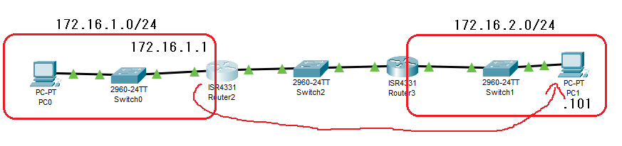
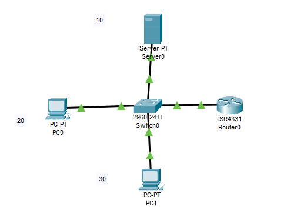

---
title: 'CCNA試験対策 ch18 Troubleshooting IPv4 Routing '
tags:
- CCNA
- 勉強メモ
- ネットワーク
date: 2020-05-05T15:10:34+09:00
URL: https://wand-ta.hatenablog.com/entry/2020/05/05/151034
EditURL: https://blog.hatena.ne.jp/wand_ta/wand-ta.hatenablog.com/atom/entry/26006613562246744
-------------------------------------


# Problem Isolation Using the ping Command #

## Ping Command Basics ##

```
L3SW1>ping 
% Incomplete command.
L3SW1>ping 10.1.12.2

Type escape sequence to abort.
Sending 5, 100-byte ICMP Echos to 10.1.12.2, timeout is 2 seconds:
!!!!!
Success rate is 100 percent (5/5), round-trip min/avg/max = 0/0/1 ms

L3SW1>
L3SW1>
L3SW1>
L3SW1>ping 10.1.12.3

Type escape sequence to abort.
Sending 5, 100-byte ICMP Echos to 10.1.12.3, timeout is 2 seconds:
.....
Success rate is 0 percent (0/5)

L3SW1>
```

- IOS上でpingが使える


## Strategies and Results When Testing with the ping Command ##

### Testing Longer Routes from Near the Source of the Problem ###

### Using Extended Ping to Test the Reserve Route ###



- 引数指定せず`ping`するといろいろ指定できる
  - extended commndsをyにするとsource ip addressなども指定できる

```
R1#ping
Protocol [ip]: ip
Target IP address: 172.16.2.101
Repeat count [5]: 
Datagram size [100]: 
Timeout in seconds [2]: 
Extended commands [n]: y
Source address or interface: 172.16.1.1
Type of service [0]: 
Set DF bit in IP header? [no]: 
Validate reply data? [no]: 
Data pattern [0xABCD]: 
Loose, Strict, Record, Timestamp, Verbose[none]: 
Sweep range of sizes [n]: 
Type escape sequence to abort.
Sending 5, 100-byte ICMP Echos to 172.16.2.101, timeout is 2 seconds:
Packet sent with a source address of 172.16.1.1
.....
Success rate is 0 percent (0/5)

R1#
```


- route tableを設定できていないな、になる

```
R1(config)#ip route 172.16.2.0 255.255.255.0 172.16.4.2
R1(config)#end
```


```
R2(config)#ip route 172.16.1.0 255.255.255.0 172.16.4.1
R2(config)#end
```

- 疎通再確認

```
R1#ping
Protocol [ip]: ip
Target IP address: 172.16.2.101
Repeat count [5]: 
Datagram size [100]: 
Timeout in seconds [2]: 
Extended commands [n]: y
Source address or interface: 172.16.1.1
Type of service [0]: 
Set DF bit in IP header? [no]: 
Validate reply data? [no]: 
Data pattern [0xABCD]: 
Loose, Strict, Record, Timestamp, Verbose[none]: 
Sweep range of sizes [n]: 
Type escape sequence to abort.
Sending 5, 100-byte ICMP Echos to 172.16.2.101, timeout is 2 seconds:
Packet sent with a source address of 172.16.1.1
!!!!!
Success rate is 100 percent (5/5), round-trip min/avg/max = 0/0/1 ms

R1#
```


### Testing LAN Neighbors with Standard Ping ###

### Testing LAN Neighbors with Extended Ping ###

## Using Ping with Names and with IP Addresses ##




```
C:\>ping www.example.com

Pinging 172.16.30.11 with 32 bytes of data:

Reply from 172.16.30.11: bytes=32 time=8ms TTL=127
Reply from 172.16.30.11: bytes=32 time<1ms TTL=127
Reply from 172.16.30.11: bytes=32 time=1ms TTL=127
Reply from 172.16.30.11: bytes=32 time=42ms TTL=127

Ping statistics for 172.16.30.11:
    Packets: Sent = 4, Received = 4, Lost = 0 (0% loss),
Approximate round trip times in milli-seconds:
    Minimum = 0ms, Maximum = 42ms, Average = 12ms
```


# Problem Isolation Using the traceroute Command #

## traceroute Basics ##


- ホストOSの`traceroute`コマンドとIOSの`traceroute`の違い
  - ホストOSのものはICMP packet (Network)
  - IOSのものはUDPヘッダつき (Transport)
- ACLが絡んだときの挙動が異なることがある


# Telnet and SSH #

- 多段SSHしたりする
