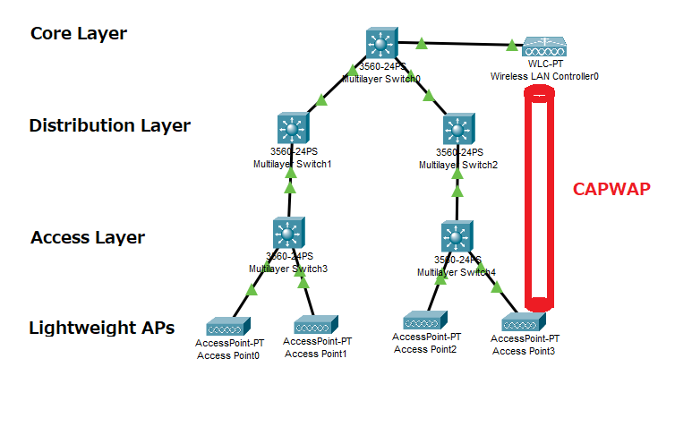

---
title: CCNA試験対策 ch27 Analyzing Cisco Wireless Architectures
tags:
- CCNA
- ネットワーク
- 勉強メモ
date: 2020-05-06T04:23:24+09:00
URL: https://wand-ta.hatenablog.com/entry/2020/05/06/042324
EditURL: https://blog.hatena.ne.jp/wand_ta/wand-ta.hatenablog.com/atom/entry/26006613562588162
-------------------------------------

# Autonomous AP Architecture #

- 自律型
- 各L3switchどうしをtrunk linkで結び、APごとにVLANの設定を行う
  - データ用VLAN10
  - データ用VLAN20
  - AP設定管理用VLAN30
    - 帯域やchannelの設定用
- VLANを増やす時に地獄

# Cloud-based AP Architecturea #

- Cisco Merakiという製品の宣伝
  - 全APの設定を一元化する

# Split-MAC Architectures #

- Autonomous APの機能の分類
  - Management Function
    - 電波の設定
    - 接続・ローミングの管理
    - クライアント認証
    - セキュリティ
    - QoS
  - Real-Time Functions
    - 電波の送受信
    - MAC管理
    - 暗号化
- SPlit-MAC Architectures
  - 各機能ごとにAPを分離するアーキテクチャ
  - WLC: wireless LAN controller
    - Management Function
  - lightweight AP
    - Real-Time Functions
  - まったく異なるIP subnetに置けるべき
- CAPWAP: Control and Provisioning of Wireless Access Points tunneling protocol
  -  WLCとlightweight AP間のデータを新しいIPパケットで包んで、WLCとLAPを別々のsubnetに置けるようにする
- CAPWAP relationshipは2つの別々のtunnelからなる
  - CAPWAP control messages
    - on UDP 5246
    - 認証あり
      - X.509証明書
    - 暗号化あり
  - CAPWAP data
    - on UDP 5247
    - デフォルトで暗号化なしだが、DTLS: Datagram TLSが有効化可能
- WLC側から遠隔でできること
  - Dynamic channel assignment
  - Transmit power optimization
  - Self-healing wireless coverage
  - Flexible client roaming
  - Dynamic client load balancing
    - 最も使われていないAPにassociateする
  - RF monitoring
  - Security management
  - wireless intrusion protection system

# Comparing Wireless LAN Controller Deployments #

| Deployment Model | WLCの場所                        | # APs | # Clients | Typical Use          |
|------------------|----------------------------------|-------|-----------|----------------------|
| Unified          | Coreに接続                       | 6000  | 64000     | 大企業               |
| Cloud            | データセンター                   | 3000  | 32000     | プライベートクラウド |
| Embedded         | Access layer                     | 200   | 4000      | 小さなキャンパス　   |
| Mobility Express | 他(特定の部署のAPに併置するなど) | 100   | 2000      | 部署                 |

## Cisco AP Modes ##

- Local
  - デフォルトのLightweight mode
- Monitor
  - receiverのみ動作
  - IDS
- FlexConnect
  - CAPWAPトンネルが確立されていればよしなにWLCの設定に従う
- Sniffer
  - Wiresharkとかでパケットキャプチャする用
- Rogue detector
  - wiredのデバイスとin airのデバイスのMACアドレスの相関をとって、わるいデバイスを見つける
- Bridge
  - AP-AP間のブリッジ接続 (point-to-point, point-to-multipoint)
  - indoor/outdoor mesh networkの構築でつかう
- Flex+Bridge
- SE-Connect
  - 周波数スペクトラム解析できるやつ
