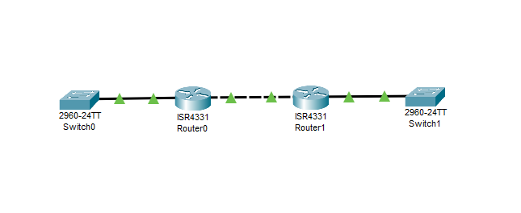

---
title: CCNA試験対策 ch24 Implementing IPv6 Addressing on Routers
tags:
- CCNA
- ネットワーク
- 勉強メモ
date: 2020-05-06T19:08:53+09:00
URL: https://wand-ta.hatenablog.com/entry/2020/05/06/190853
EditURL: https://blog.hatena.ne.jp/wand_ta/wand-ta.hatenablog.com/atom/entry/26006613562950433
-------------------------------------


# Implementing Unicast IPv6 Addresses on Routers #

- 1980s ~ 2000s にかけて、vendor-specific -> TCP/IP (IPv4)に置き換わった
- これから IPv4 -> IPv4 + IPv6 -> IPv6 に移り変わっていく
  - IPv4 + IPv6 : dual-stack


## Static Unicast Address Configuration ##



### configuring the full 128-bit address ###

```
R2(config)#ipv6 unicast-routing
R2(config)#interface g0/0/0
R2(config-if)#ipv6 address 2001:db8:1111:2::2/64
R2(config-if)#no shutdown

R2(config-if)#
%LINK-5-CHANGED: Interface GigabitEthernet0/0/0, changed state to up

%LINEPROTO-5-UPDOWN: Line protocol on Interface GigabitEthernet0/0/0, changed state to up

R2(config-if)#interface g0/0/1
R2(config-if)#ipv6 address 2001:db8:1111:4::2/64
R2(config-if)#
R2(config-if)#no shutdown

R2(config-if)#
%LINK-5-CHANGED: Interface GigabitEthernet0/0/1, changed state to up

%LINEPROTO-5-UPDOWN: Line protocol on Interface GigabitEthernet0/0/1, changed state to up

R2(config-if)#
```


### Enabling IPv6 Routing ###

```
R2(config)#ipv6 unicast-routing
```

これ必要


### Verifying the IPv6 Address Configuration ###

- interfaceに割り当てられたIPv6アドレスの確認

```
R1#show ipv6 interface g0/0/0
GigabitEthernet0/0/0 is up, line protocol is up
  IPv6 is enabled, link-local address is FE80::260:47FF:FE56:3C01
  No Virtual link-local address(es):
  Global unicast address(es):
    2001:DB8:1111:1::1, subnet is 2001:DB8:1111:1::/64
  Joined group address(es):
    FF02::1
    FF02::2
    FF02::1:FF00:1
    FF02::1:FF56:3C01
  MTU is 1500 bytes
  ICMP error messages limited to one every 100 milliseconds
  ICMP redirects are enabled
  ICMP unreachables are sent
  ND DAD is enabled, number of DAD attempts: 1
  ND reachable time is 30000 milliseconds
  ND advertised reachable time is 0 (unspecified)
  ND advertised retransmit interval is 0 (unspecified)
  ND router advertisements are sent every 200 seconds
  ND router advertisements live for 1800 seconds
  ND advertised default router preference is Medium
  Hosts use stateless autoconfig for addresses.
R1#
R1#
R1#
R1#show ipv6 interface g0/0/1
GigabitEthernet0/0/1 is up, line protocol is up
  IPv6 is enabled, link-local address is FE80::260:47FF:FE56:3C02
  No Virtual link-local address(es):
  Global unicast address(es):
    2001:DB8:1111:4::1, subnet is 2001:DB8:1111:4::/64
  Joined group address(es):
    FF02::1
    FF02::2
    FF02::1:FF00:1
    FF02::1:FF56:3C02
  MTU is 1500 bytes
  ICMP error messages limited to one every 100 milliseconds
  ICMP redirects are enabled
  ICMP unreachables are sent
  ND DAD is enabled, number of DAD attempts: 1
  ND reachable time is 30000 milliseconds
  ND advertised reachable time is 0 (unspecified)
  ND advertised retransmit interval is 0 (unspecified)
  ND router advertisements are sent every 200 seconds
  ND router advertisements live for 1800 seconds
  ND advertised default router preference is Medium
  Hosts use stateless autoconfig for addresses.
R1#
```

- brief

```
R1#show ipv6 interface brief
GigabitEthernet0/0/0       [up/up]
    FE80::260:47FF:FE56:3C01
    2001:DB8:1111:1::1
GigabitEthernet0/0/1       [up/up]
    FE80::260:47FF:FE56:3C02
    2001:DB8:1111:4::1
GigabitEthernet0/0/2       [administratively down/down]
    unassigned
Vlan1                      [administratively down/down]
    unassigned
R1#
```

- connected routeの確認

```
R1#show ipv6 route
IPv6 Routing Table - 5 entries
Codes: C - Connected, L - Local, S - Static, R - RIP, B - BGP
       U - Per-user Static route, M - MIPv6
       I1 - ISIS L1, I2 - ISIS L2, IA - ISIS interarea, IS - ISIS summary
       O - OSPF intra, OI - OSPF inter, OE1 - OSPF ext 1, OE2 - OSPF ext 2
       ON1 - OSPF NSSA ext 1, ON2 - OSPF NSSA ext 2
       D - EIGRP, EX - EIGRP external
C   2001:DB8:1111:1::/64 [0/0]
     via GigabitEthernet0/0/0, directly connected
L   2001:DB8:1111:1::1/128 [0/0]
     via GigabitEthernet0/0/0, receive
C   2001:DB8:1111:4::/64 [0/0]
     via GigabitEthernet0/0/1, directly connected
L   2001:DB8:1111:4::1/128 [0/0]
     via GigabitEthernet0/0/1, receive
L   FF00::/8 [0/0]
     via Null0, receive
R1#
```


### Generating a Unique Interface ID Using Modified EUI-64 ###

- uniqueなinterface IDをMACアドレスから生成する
  1. MACアドレスを半分に切って`FFFE`を挿入する
  2. 7番めのビットを反転

```
1122.3344.5566
↓
1122:33FF:FE44:5566
↓
1322:33FF:FE44:5566
```

- EUI-64に基づいたInterface ID生成

```
R1#configure terminal
Enter configuration commands, one per line.  End with CNTL/Z.
R1(config)#interface g0/0/0
R1(config-if)#mac-address 0201.aa00.0001
R1(config-if)#ipv6 address 2001:DB8:1111:1::/64 eui-64
R1(config-if)#
R1(config-if)#end
R1#
%SYS-5-CONFIG_I: Configured from console by console

R1#show ipv6 interface brief 
GigabitEthernet0/0/0       [up/up]
    FE80::201:AAFF:FE00:1
    2001:DB8:1111:1:1:AAFF:FE00:1
GigabitEthernet0/0/1       [up/up]
    FE80::260:47FF:FE56:3C02
    2001:DB8:1111:4::1
GigabitEthernet0/0/2       [administratively down/down]
    unassigned
Vlan1                      [administratively down/down]
    unassigned
R1#
```

```
    2001:DB8:1111:1:1:AAFF:FE00:1
```


## Dynamic Unicast Address Configuration ##

- 2種類
  - DHCP
    - stateful
  - SLAAC: Stateless Address Autoconfiguration
    - stateless
- `ipv6 address dhcp` もしくは `ipv6 address autoconfig`で設定する


# Special Addresses Used by Routers #

## Link-Local Addresses ##

- link-local addressの性質
  - unicast
  - routerにforwardingされない
  - 自動生成される
  - ローカルLANでしか使わないIPアドレスとして普遍的に使う
- 用例
  - NDP: Neighbor Discovery Protocol
    - IPv4でいうところのARP


```
R1#show ipv6 interface brief
GigabitEthernet0/0/0       [up/up]
    FE80::2D0:BAFF:FE39:501
    2001:DB8:1111:1::1
GigabitEthernet0/0/1       [up/up]
    FE80::2D0:BAFF:FE39:502
    2001:DB8:1111:4::1
GigabitEthernet0/0/2       [administratively down/down]
    unassigned
Vlan1                      [administratively down/down]
    unassigned
R1#
```

- これ
  - 勝手にできてる

```
FE80::2D0:BAFF:FE39:501
```

- 当該interfaceのMACアドレス:

```
00D0.BA39.0501
```

- リンクローカルアドレスのInterface IDはEUI-64で生成されている


### Routing IPv6 with Only Link-Local Addresses on an Interface ###

- G0/0/1にIPアドレスを振っていない状態

```
R1#show ipv6 interface brief
GigabitEthernet0/0/0       [up/up]
    FE80::2D0:BAFF:FE39:501
    2001:DB8:1111:1::1
GigabitEthernet0/0/1       [up/up]
    unassigned
GigabitEthernet0/0/2       [administratively down/down]
    unassigned
Vlan1                      [administratively down/down]
    unassigned
```

- `ipv6 enable`: リンクローカルアドレスのみ割り当てる

```
R1#configure terminal
Enter configuration commands, one per line.  End with CNTL/Z.
R1(config)#
R1(config)#interface g0/0/1
R1(config-if)#ipv6 enable
R1(config-if)#end
R1#
%SYS-5-CONFIG_I: Configured from console by console
```

```
R1#show ipv6 interface brief
GigabitEthernet0/0/0       [up/up]
    FE80::2D0:BAFF:FE39:501
    2001:DB8:1111:1::1
GigabitEthernet0/0/1       [up/up]
    FE80::2D0:BAFF:FE39:502
GigabitEthernet0/0/2       [administratively down/down]
    unassigned
Vlan1                      [administratively down/down]
    unassigned
R1#
```

## IPv6 Multicast Addresses ##

- IPv6にbroadcast addressはない

### Reserved Multicast Addresses ###

```
R2#show ipv6 interface g0/0/0
GigabitEthernet0/0/0 is up, line protocol is up
  IPv6 is enabled, link-local address is FE80::210:11FF:FED5:5701
  No Virtual link-local address(es):
  Global unicast address(es):
    2001:DB8:1111:2::2, subnet is 2001:DB8:1111:2::/64
  Joined group address(es):
    FF02::1
    FF02::2
    FF02::1:FF00:2
    FF02::1:FFD5:5701
  MTU is 1500 bytes
  ICMP error messages limited to one every 100 milliseconds
  ICMP redirects are enabled
  ICMP unreachables are sent
  ND DAD is enabled, number of DAD attempts: 1
  ND reachable time is 30000 milliseconds
  ND advertised reachable time is 0 (unspecified)
  ND advertised retransmit interval is 0 (unspecified)
  ND router advertisements are sent every 200 seconds
  ND router advertisements live for 1800 seconds
  ND advertised default router preference is Medium
  Hosts use stateless autoconfig for addresses.
R2#
```

- これらは予約されたmulticast addresses

```
    FF02::1
    FF02::2
```

| Short Name            | IPv6 Multicast Address | Meaning                               | IPv4 Equavalent      |
|-----------------------|------------------------|---------------------------------------|----------------------|
| All-nodes             | FF02::1                | IPv6を使用している全interface         | 224.0.0.1            |
| All-routers           | FF02::2                | 全IPv6router                          | 224.0.0.2            |
| All-OSPF, All-OSPF-DR | FF02::5, FF02::6       | 全OSPF router, OSPF designated router | 224.0.0.5, 224.0.0.6 |
| RIPng Routers         | FF02::9                | 全RIPng router                        | 224.0.0.9            |
| EIGRPv6 Routers       | FF02::A                | EIGRPv6 router                        | 224.0.0.10           |
| DHCP Relay Agent      | FF02::1:2              | DHCPv6 router                         | -                    |


### Multicast Address Scopes ###

- RFC4291により、IPv6 multicast addressのスコープが定義されている

| Scpope Name        | First Quartet | Scope Defined by...      | Meaning                                                                    |
|--------------------|---------------|--------------------------|----------------------------------------------------------------------------|
| Interface-Local    | FF01          | Derived by Device        | 同一ホスト上の別サービスにパケットを送る場合などに                        |
| Link-Local         | FF02          | Derived by Device        | Routerでforwardしない。<br />前述のReserved IPv6 Multicast Addressesはこれ |
| Site-Local         | FF05          | Configuration on Routers | Routerでforwardはするが、WANはまたがない                                   |
| Organization-Local | FF08          | Configuration on Routers | Site-Localよりも広い。WANをまたいだ企業ネットワーク全体、など              |
| Globa              | FF0E          | No Boundaries            |                                                                            |


### Solicited-Node Multicast Addresses ###

- IPv6ではNDP:Neighbor Discovery ProtocolがARPに取って代わっている
  - MACアドレスのディスカバリをIPv6 multicast packetで行う
    - broadcastでなく
- solicited-node multicast addresses
  - NDP用に自動的に割り当てられたのlink-local multicast address

```
R2#show ipv6 interface g0/0/0
GigabitEthernet0/0/0 is up, line protocol is up
  IPv6 is enabled, link-local address is FE80::210:11FF:FED5:5701
  No Virtual link-local address(es):
  Global unicast address(es):
    2001:DB8:1111:2::2, subnet is 2001:DB8:1111:2::/64
  Joined group address(es):
    FF02::1
    FF02::2
    FF02::1:FF00:2
    FF02::1:FFD5:5701
  MTU is 1500 bytes
  ICMP error messages limited to one every 100 milliseconds
  ICMP redirects are enabled
  ICMP unreachables are sent
  ND DAD is enabled, number of DAD attempts: 1
  ND reachable time is 30000 milliseconds
  ND advertised reachable time is 0 (unspecified)
  ND advertised retransmit interval is 0 (unspecified)
  ND router advertisements are sent every 200 seconds
  ND router advertisements live for 1800 seconds
  ND advertised default router preference is Medium
  Hosts use stateless autoconfig for addresses.
```

- interface `g0/0/0` は2つのIPv6アドレスをもつ
  - `FE80::210:11FF:FED5:5701`
    - ipv6 enableで割り当てられる
  - `2001:DB8:1111:2::2/64`
    - 自分で`ipv6 address`で割り当てたもの
- これらに対応するsolicited-node multicast addresses

```
    FF02::1:FF00:2
    FF02::1:FFD5:5701
```

- 下位3バイト以外の部分はRFCで定義されている

```
FF02:0000:0000:0000:0000:0001:FFxx:xxxx
```

- `xxxxxx`部分にはunicast addressの下位6バイトが入る


## Miscellaneous IPv6 Addresses ##

- unknown: `::`
- loopback: `::1` 


## Anycast Addresses ##

- 複数ノードで同一のIPv6 unicast addressを指定する
  - 【補】DNSのサーバーの冗長化などに用いられる

 ```
R2(config)#interface g0/0/0
R2(config-if)#ipv6 address 2001:DB8:1111:1::1/64 anycast
R2(config-if)#
R2(config-if)#end
R2#
%SYS-5-CONFIG_I: Configured from console by console
```

```
R2#show ipv6 interface brief
GigabitEthernet0/0/0       [up/up]
    FE80::210:11FF:FED5:5701
    2001:DB8:1111:1::1
    2001:DB8:1111:2::2
GigabitEthernet0/0/1       [up/up]
    FE80::210:11FF:FED5:5702
GigabitEthernet0/0/2       [administratively down/down]
    unassigned
Vlan1                      [administratively down/down]
    unassigned
```

```
R2#show ipv6 interface g0/0/0
GigabitEthernet0/0/0 is up, line protocol is up
  IPv6 is enabled, link-local address is FE80::210:11FF:FED5:5701
  No Virtual link-local address(es):
  Global unicast address(es):
    2001:DB8:1111:1::1, subnet is 2001:DB8:1111:1::/64 [ANY]
    2001:DB8:1111:2::2, subnet is 2001:DB8:1111:2::/64
  Joined group address(es):
    FF02::1
    FF02::2
    FF02::1:FF00:1
    FF02::1:FF00:2
    FF02::1:FFD5:5701
...
 ```


----------------------------------------


# 英語 #

- solicited
  - 要請された
