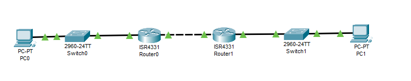
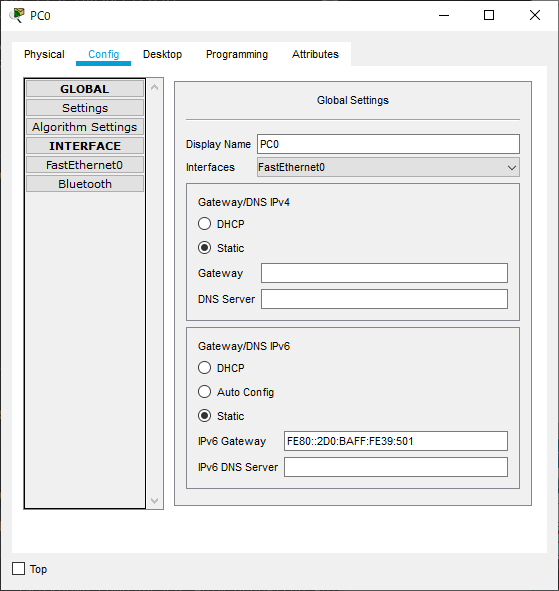
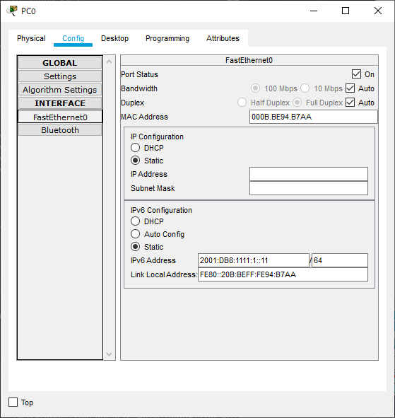

---
title: CCNA試験対策 ch25 Implementing IPv6 Routing
tags:
- CCNA
- ネットワーク
- 勉強メモ
date: 2020-05-06T23:43:39+09:00
URL: https://wand-ta.hatenablog.com/entry/2020/05/06/234339
EditURL: https://blog.hatena.ne.jp/wand_ta/wand-ta.hatenablog.com/atom/entry/26006613563107780
-------------------------------------


# Connected and Local IPv6 Routes #


```
R1#show ipv6 route
IPv6 Routing Table - 5 entries
Codes: C - Connected, L - Local, S - Static, R - RIP, B - BGP
       U - Per-user Static route, M - MIPv6
       I1 - ISIS L1, I2 - ISIS L2, IA - ISIS interarea, IS - ISIS summary
       O - OSPF intra, OI - OSPF inter, OE1 - OSPF ext 1, OE2 - OSPF ext 2
       ON1 - OSPF NSSA ext 1, ON2 - OSPF NSSA ext 2
       D - EIGRP, EX - EIGRP external
C   2001:DB8:1111:1::/64 [0/0]
     via GigabitEthernet0/0/0, directly connected
L   2001:DB8:1111:1::1/128 [0/0]
     via GigabitEthernet0/0/0, receive
C   2001:DB8:1111:4::/64 [0/0]
     via GigabitEthernet0/0/1, directly connected
L   2001:DB8:1111:4::1/128 [0/0]
     via GigabitEthernet0/0/1, receive
L   FF00::/8 [0/0]
     via Null0, receive
R1#
```


# Static IPv6 Routes #




```
R1#show ipv6 interface g0/0/0
GigabitEthernet0/0/0 is up, line protocol is up
  IPv6 is enabled, link-local address is FE80::2D0:BAFF:FE39:501
  No Virtual link-local address(es):
  Global unicast address(es):
    2001:DB8:1111:1::1, subnet is 2001:DB8:1111:1::/64
  Joined group address(es):
    FF02::1
    FF02::2
    FF02::1:FF00:1
    FF02::1:FF39:501
  MTU is 1500 bytes
  ICMP error messages limited to one every 100 milliseconds
  ICMP redirects are enabled
  ICMP unreachables are sent
  ND DAD is enabled, number of DAD attempts: 1
  ND reachable time is 30000 milliseconds
  ND advertised reachable time is 0 (unspecified)
  ND advertised retransmit interval is 0 (unspecified)
  ND router advertisements are sent every 200 seconds
  ND router advertisements live for 1800 seconds
  ND advertised default router preference is Medium
  Hosts use stateless autoconfig for addresses.
R1#
```

- PC0のdefault gatewayにはR1のg0/0/0 (Switch側) interfaceのリンクローカルアドレスを指定する
- PC0自身のIPアドレスには`2001:DB8:1111:1::11/64`を指定







on PC0:

```
C:\>ping 2001:DB8:1111:1::1

Pinging 2001:DB8:1111:1::1 with 32 bytes of data:

Reply from 2001:DB8:1111:1::1: bytes=32 time<1ms TTL=255
Reply from 2001:DB8:1111:1::1: bytes=32 time=1ms TTL=255
Reply from 2001:DB8:1111:1::1: bytes=32 time<1ms TTL=255
Reply from 2001:DB8:1111:1::1: bytes=32 time=1ms TTL=255

Ping statistics for 2001:DB8:1111:1::1:
    Packets: Sent = 4, Received = 4, Lost = 0 (0% loss),
Approximate round trip times in milli-seconds:
    Minimum = 0ms, Maximum = 1ms, Average = 0ms

```

- R2,PC1も同様に設定する
- R1->R2 ping

```
R1#ping 2001:DB8:1111:2::1

Type escape sequence to abort.
Sending 5, 100-byte ICMP Echos to 2001:DB8:1111:2::1, timeout is 2 seconds:
.....
Success rate is 0 percent (0/5)

R1#
```

- routingが設定されていないので当然疎通しない
- R1のroutingを設定する必要がある

## Static Routes Using the Outgoing Interface ##


- 次のように設定するやつ

```
R1(config)#ipv6 route 2001:db8:1111:2::/64 s0/1
```

- serialでのみ動く
  - ethernet interfaceではIPv6 addressの指定が必要 (後述)


## Static Routes Using Next-Hop IPv6 Address ##


```
R1(config)#ipv6 route 2001:db8:1111:2::/64 2001:db8:1111:4::2
R1(config)#end
R1#
%SYS-5-CONFIG_I: Configured from console by console
```

```
R1#show ipv6 route 
IPv6 Routing Table - 6 entries
Codes: C - Connected, L - Local, S - Static, R - RIP, B - BGP
       U - Per-user Static route, M - MIPv6
       I1 - ISIS L1, I2 - ISIS L2, IA - ISIS interarea, IS - ISIS summary
       O - OSPF intra, OI - OSPF inter, OE1 - OSPF ext 1, OE2 - OSPF ext 2
       ON1 - OSPF NSSA ext 1, ON2 - OSPF NSSA ext 2
       D - EIGRP, EX - EIGRP external
C   2001:DB8:1111:1::/64 [0/0]
     via GigabitEthernet0/0/0, directly connected
L   2001:DB8:1111:1::1/128 [0/0]
     via GigabitEthernet0/0/0, receive
S   2001:DB8:1111:2::/64 [1/0]
     via 2001:DB8:1111:4::2
C   2001:DB8:1111:4::/64 [0/0]
     via GigabitEthernet0/0/1, directly connected
L   2001:DB8:1111:4::1/128 [0/0]
     via GigabitEthernet0/0/1, receive
L   FF00::/8 [0/0]
     via Null0, receive
R1#
```

- R2も同様に設定する
- from `2001:db8:1111:1::11`

```
C:\>ping 2001:db8:1111:2::11

Pinging 2001:db8:1111:2::11 with 32 bytes of data:

Reply from 2001:DB8:1111:2::11: bytes=32 time<1ms TTL=126
Reply from 2001:DB8:1111:2::11: bytes=32 time<1ms TTL=126
Reply from 2001:DB8:1111:2::11: bytes=32 time<1ms TTL=126
Reply from 2001:DB8:1111:2::11: bytes=32 time<1ms TTL=126

Ping statistics for 2001:DB8:1111:2::11:
    Packets: Sent = 4, Received = 4, Lost = 0 (0% loss),
Approximate round trip times in milli-seconds:
    Minimum = 0ms, Maximum = 0ms, Average = 0ms

```


- link local addressを指定する場合は、outgoing interfaceの指定が必要

```
R1(config)#no ipv6 route 2001:db8:1111:2::/64
R1(config)#ipv6 route 2001:db8:1111:2::/64 g0/0/1 FE80::210:11FF:FED5:5702
```

```
R1#show ipv6 route
IPv6 Routing Table - 6 entries
Codes: C - Connected, L - Local, S - Static, R - RIP, B - BGP
       U - Per-user Static route, M - MIPv6
       I1 - ISIS L1, I2 - ISIS L2, IA - ISIS interarea, IS - ISIS summary
       O - OSPF intra, OI - OSPF inter, OE1 - OSPF ext 1, OE2 - OSPF ext 2
       ON1 - OSPF NSSA ext 1, ON2 - OSPF NSSA ext 2
       D - EIGRP, EX - EIGRP external
C   2001:DB8:1111:1::/64 [0/0]
     via GigabitEthernet0/0/0, directly connected
L   2001:DB8:1111:1::1/128 [0/0]
     via GigabitEthernet0/0/0, receive
S   2001:DB8:1111:2::/64 [1/0]
     via FE80::210:11FF:FED5:5702, GigabitEthernet0/0/1
C   2001:DB8:1111:4::/64 [0/0]
     via GigabitEthernet0/0/1, directly connected
L   2001:DB8:1111:4::1/128 [0/0]
     via GigabitEthernet0/0/1, receive
L   FF00::/8 [0/0]
     via Null0, receive
R1#
```

- outgoint interface + unicast address でもよいが冗長


## Static Default Routes ##

- last resort route的なやつ
- `::/0`


## Sttaic IPv6 Host Routes ##

- destinationをsubnetではなく`/128`まで指定するやつ


## Floating Static Ipv6 Routes ##

- static route、各種routing protocol等を併用するさい、AD: administrative distance に基づいて優先度が変わるやつ
- 小さいもの優先n
- デフォルト値

| Route Source            | Administrative Distance |
|-------------------------|-------------------------|
| Connected routes        | 0                       |
| Static routes           | 1                       |
| NDP                     | 2                       |
| EIGRP                   | 90                      |
| OSPF                    | 110                     |
| RIP                     | 120                     |
| unknown or unbelievable | 255                     |


# The Neighbor Discovery Protocol #

## Discovering Neighbor Link Addresses with NDP NS and NA ##

- IPv4のARPに相当
- NS: Neighbor Solicitation
  - MACアドレスの問い合わせ
  - solicited-node multicast addressに送信される
    - つまり、リンクローカルで、16進表記で末尾6文字が一致するホストにのみ問い合わせる
    - 無差別に送りつけないということ
- NA: Neighbor Advertisement
  - MACアドレスの返信


## Discovering Routers with NDP RS and RA ##

- RS: Router Solicitation
  - 「全IPv6ルーター」のlocal-scope multi-cast addressに問い合わせ
    - `FF02::2`
- RA: Router Advertisement
  - IPv6 link local addressを返信、もしくは全IPv6ホスト(`FF02::1`)に送信する

## Using SLAAC with NDP RS and RA ##

- SLAAC: Stateless Address Autoconfiguration
- DHCPと異なり、サーバーが不要なのが特徴
  - state = address poolが要らないということ
- 処理の流れ
  1. NDP RAメッセージを用いてIPv6アドレスのPrefix部を取得する
  1. 各hostでInterface ID部を生成する
     - EUI-64 または乱数
  1. PrefixとInterface IDでIPv6アドレスを組み立てる
  1. IPv6アドレスを使用する前に、DAD: Duplicate Address Detection で重複のなきことを確認する

## Discovering Dupliate Addresses Using NDP NS and NA ##

- DAD: Duplicate Address Detection
- 自分のIPv6アドレスでNSメッセージを送信する
- NAレスポンスが帰ってきたら、IPv6アドレスが重複しているということ

## NDP Summary ##


| Protocol Message | Who Discovers Info | Who Supplies Info | Info                             |
|------------------|--------------------|-------------------|----------------------------------|
| RS/RA            | Any IPv6 host      | Any IPv6 router   | 各Routerのリンクローカルアドレス |
| RS/RA            | Any IPv6 host      | Any IPv6 router   | ローカルリンクのPrefix/length    |
| NS/NA            | Any IPv6 host      | Any IPv6 host     | 隣接ホストのMACアドレス          |
| NS/NA            | Any IPv6 host      | Any IPv6 host     | IPv6アドレスの重複                 |

