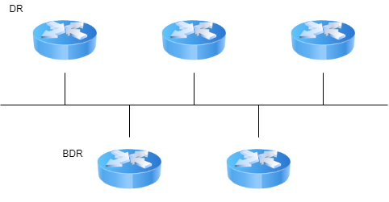
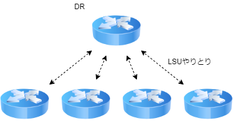
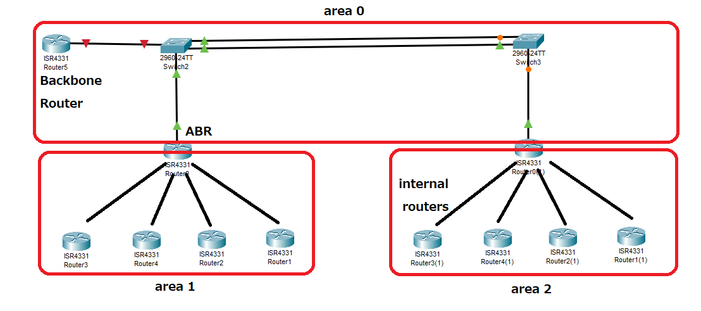
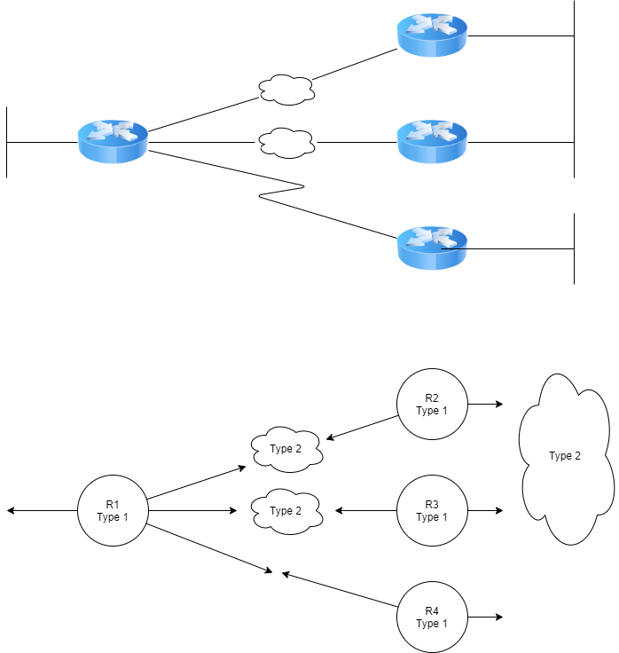

---
title: CCNA試験対策 ch19 Understanding OSPF Concepts
tags:
- CCNA
- 勉強メモ
- ネットワーク
date: 2020-05-07T00:00:00+09:00
URL: https://wand-ta.hatenablog.com/entry/2020/05/07/000000
EditURL: https://blog.hatena.ne.jp/wand_ta/wand-ta.hatenablog.com/atom/entry/26006613564416878
-------------------------------------

# Comparing Dynamic Routing Protocol Features #

- routing tableにIP routeを追加する3つの方法
  - connected routes
  - static routes
  - dynamic routing protocolによる学習
- 語彙
  - Routing protocol
    - routeの学習のためのプロトコル
      - メッセージ
      - ルール
      - アルゴリズム
    - 例
      - RIP
      - EIGRP
      - OSPF
      - BGP
  - Routed protocol, routable protocol
    - routeにしたがってパケットをやりとりするプロトコル
    - IPv4やIPv6のこと


## Routing Protocol Functions ##

- 流れ
  1. 隣のrouterからIPサブネットの情報を学習
  2. 隣のrouterに伝える
  3. 可能なrouteが複数あれば、メトリクスに基づいて最善のものを選定
  4. convergence
     - トポロジーが変わったらその旨を伝える
     - 最善のrouteを再選定


## Interior and Exterior Routing Protocols ##

- IGP: Interrior Gateway Protocols
  - AS: Autonomous System 内でのrouting
- EGP: Exterior Gateway Protocols
  - AS間でのrouting

## Comparing IGPs ##

- 3つの主要なプロトコルがある

### IGP Routing Protocol Algorithms ###

- IGPの分類
  - Distance vector
    - ベルマンフォードとも
  - Advanced distance vector
    - balanced hybridとも
  - Link-state
- Distance vector protocolが最初に発明された
  - RIP: Routing Information Protocol
  - IGRP: Interior Gateway Routing Protocol
    - Cisco製
- Distance vector protocolではconvergenceが遅いことがわかりはじめた
- Link-state protocolが開発されるに至った
  - OSPF: Open Shortest Path First
  - IS-IS: Intermediate System to Intermediate System
- convergenceが遅いという問題は解消したが、CPU/メモリ消費というコストが生じた
- 中くらいなAdvanced distance vector protocolがうまれた
  - EIGRP: Enhanced Interior Gateway Routing Protocol
    - Cisco製
    - のちRFC化


### Metrics ###

| IGP   | Metric                     |
|-------|----------------------------|
| RIPv2 | hop count                  |
| OSPF  | cost                       |
| EIGRP | 帯域幅と遅延に基づいた計算 |


### Other IGP Comparisons ###

| Feature                                       | RIPv2 | EIGRP       | OSPF |
|-----------------------------------------------|-------|-------------|------|
| Classless/sends mask in updates/supports VLSM | yes   | yes         | yes  |
| Algorithm                                     | DV    | Advanced DV | LS   |
| Supports manual summarization                 | yes   | yes         | yes  |
| Cisco独自                                     | no    | yes         | no   |
| Routingの更新をIPマルチキャストで送信         | yes   | yes         | yes  |
| Convergence                                   | 遅い  | 速い        | 速い |

- RIPv1など古いプロトコルはClassful IP アドレスだけだったりする


## Administrative Distance ##

- 複数のrouting protocolを併用することがある
- route redistribution
  - OSPFで学習したRouteをEIGRPに伝えるなど
- あるsubnetに対して、1つのrouting protocolで複数のrouteが候補になった場合は、metricsに基づいて最善のrouteが選定される
- 複数のrouting protocolで別々のrouteが候補になったらどうする？
- AD: Administrative Distance
  - 異なるmetricsの単純比較はできないので、プロトコルごとにデフォルトの重みがついている
  - 小さいもの優先


| Route Type                   | Administrative Distance |
|------------------------------|-------------------------|
| Connected                    | 0                       |
| Static                       | 1                       |
| BGP (external routes [iBGP]) | 20                      |
| EIGRP (internal routes)      | 90                      |
| IGRP                         | 100                     |
| OSPF                         | 110                     |
| IS-IS                        | 115                     |
| RIP                          | 120                     |
| EIGRP (external routes)      | 170                     |
| BGP (internal routes [iBGP]) | 200                     |
| DHCP default route           | 254                     |
| Unusable                     | 255                     |

- ルーティングテーブルの優先順位
 1. longest match
 1. それが同じなら、administrative distance
 1. それが同じなら、metric


# OSPF Concepts and Operation #

## OSPF Overview ##

### Topology information and LSAs ###

- LSAs: link-state advertisements
  - リンク状態の通知
  - floodingで通知する
    - 30分に1回とか
- LSDB: link-state database
  - routerが知っているLSAのコレクション


### Applying Dijkstra SPF Math to Find the Best Routes ###

- 前の処理により、全routerがLSDBのコピーを手にした
- ここにおいて、全routerはグラフ構造を完全に知っている
- Dijkstra法によりShortest Pathを調べ、次にhopすべきrouterをrouting tableに登録する


## Becoming OSPF Neighbors ##

### The Basics of OSPF Neighbors ###

- OSPF neightborになるには
  - 同一のデータリンクにいること
    - 同じVLAN
    - 同じシリアル接続
    - 同じEthernet WAN接続
  - OSPF Helloを送り合い、OSPF neighborになることを合意すること
- `show ip ospf neighbor`コマンドでneighborをリストできる

```
R1#show ip ospf neighbor 

R1#
```

- デフォルトでneighborなし


### Meeting Neighbors and Learning Their Router ID ###


- OSPF RID
  - Router ID
  - 32 bit数値
  - 大抵IPv4アドレスのDDNが出力される
- Helloパケットのやりとり
  1. `224.0.0.5`にOSPF Hello (IP protocol type 89) 送信
     - `224.0.0.5`はOSPF-speaking routersを表すマルチキャストアドレス
  2. OSPF routerは`224.0.0.5`をリッスンし、neighborを学習する

```
      R1  -- Hello, Seen [null], My RID 1.1.1.1  -> R2 
                                                                   init 
      R1  <- Hello, Seen [1.1.1.1], My RID 2.2.2.2 -- R2
2-way
      R1  -- Hello, Seen [1.1.1.1, 2.2.2.2], My RID 1.1.1.1  -> R2
                                                                   2-way
```

- 自分が送出したRIDがlistされて返ってきたら2-way stateになる
- 2-way stateだと成り立つこと
  - 相手がOSPF neighborになる気があるということ
  - 両routerが2-way stateになったら、neighborになる準備完了

## Exchanging the LSDB Between Neighbors ##

### Fully Exchanging LSAs with Neighbors ###

- 2-way stateになったら、LSDBの交換の準備万端
- DD: Database Description
  - LSDBの交換の前にやり取りするパケット
  - 「10個のLSAを送りますよ」みたいな情報
- LSU: Link-State Update
  - いくつかのLSAを格納するパケット
- LSAs: Link-State Advertisements
  - LSDB中のデータ構造で、ネットワークのトポロジーを表す

```
ExStart R1 ----DD---> R2 
        R1 <---DD---- R2 Exchange
Loading R1 <--LSU---> R2 Loading
        R1 <--LSU---> R2
              ...
Full                     Full
```


### Maintaining Neighbors and the LSDB ###

- Full Stateの維持
  - Hello Interval/Dead Interval
    - Hello IntervalごとにHello送信
    - Dead Intervalの間Helloが届かなければ、そのneighborに障害があったとみなす
      - デフォルトでHello Intervalの4倍
  - ネットワークトポロジーの変化を検出したら、変化したLSAをfloodする
  - ネットワークがstableな状態でも、たまにLSAをrefloodする
    - デフォルトで30分間隔


### Using Designated Routes on Ethernet Links ###






- DR: Designated Router
  - 同一のVLANで複数のRouterがある場合、DRをひとつ選出し、LSUのやりとりはDRとその他との間で行われる
- BDR: backup DR
  - DRは要となるので、控えも選出される
  - DRの障害時にはBDRが引き継ぐ
- `224.0.0.5`
  - All SPF Routers
  - DRからOSPF speaking routersにパケットを送信するために予約されているマルチキャストアドレス
- `224.0.0.6`
  - All SPF DRs
  - OSPF speaking routersからDR・BDRにパケットを送信するために予約されているマルチキャストアドレス
- DR/BDRでないものはDROthersという

| Neighbor State | Term for Neighbor                            | Term for Relationship |
|----------------|----------------------------------------------|-----------------------|
| 2-way          | Neighbor                                     | Neighbor Relationship |
| Full           | Adjacent Neighbor<br>Fully Adjacent Neighbor | Adjacency             |
 

- AdjacentはNeighborのうちFull Stateのもの
  - DR-BDRなど
- DROthers同士はAdjacentでない
 

## Calculatinig the Best Routes with SPF ##

- outgoing interfaceのコストを足し合わせて最小のコストになる経路を選ぶ


# OSPF Areas nad LSAs #

- router数が増えると生じる問題
  - 各routerでSPF計算に使用するLSDBが巨大になるので、メモリ・プロセッサを食う
  - 巨大なinternetworkの中で、router1台でも障害が発生すると、ほか全routerでSPF再計算が必要になる
- LSDBを小さく分割することでこれを解決する

## OSPF Areas ##



## How Areas Reduces SPF Calculation Time ##

- LSDBに格納される情報
  - 自身のエリアの全subnetのトポロジーの全ノード・エッジの情報
  - 他エリアの全subnetのIDとマスク
    - subnet中のノード・エッジの情報は要らない！
- 全ネットワークの全ノード・エッジの情報を格納するよりも低負荷ですむ
- ルーター1台が落ちたとき、SPFを再計算しなければならないルーターの台数が少なくて済む
  - 別のsubnetのルーターは影響を受けない
- LSU送受信の帯域節約


## (OSPFv2) Link-State Advertisements ##

- LSAは3タイプ

| LSA Name | LSA Type | Primary Purpose                        | Contents of LSA                                     |
|----------|----------|----------------------------------------|-----------------------------------------------------|
| Router   | 1        | 各ルーターの情報の通知                 | RID, interfaces, IPアドレス/マスク, interfaceの状態 |
| Network  | 2        | DRと各ルーターのネットワーク情報の通知 | DR/BDRのIPアドレス、subnet ID、マスク               |
| Summary  | 3        | 別エリアのsubnetの情報の通知           | subnet ID、マスク、ABRのRID                         |





----------------------------------------

# 英語 #

- run low on
  - ...が欠乏する
