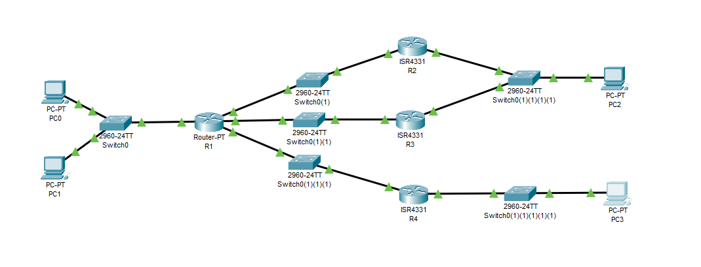
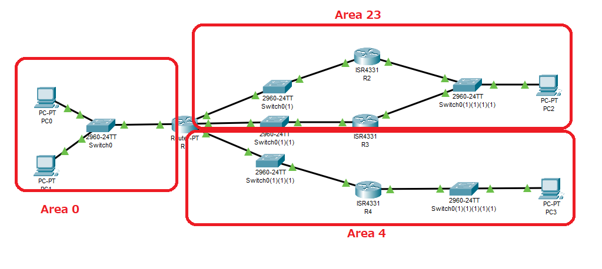
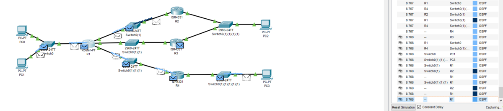
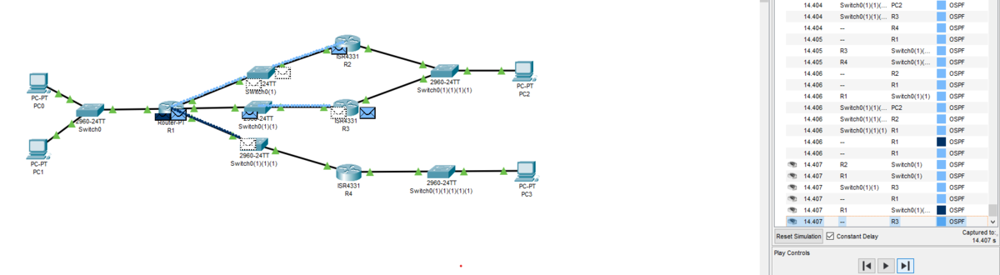
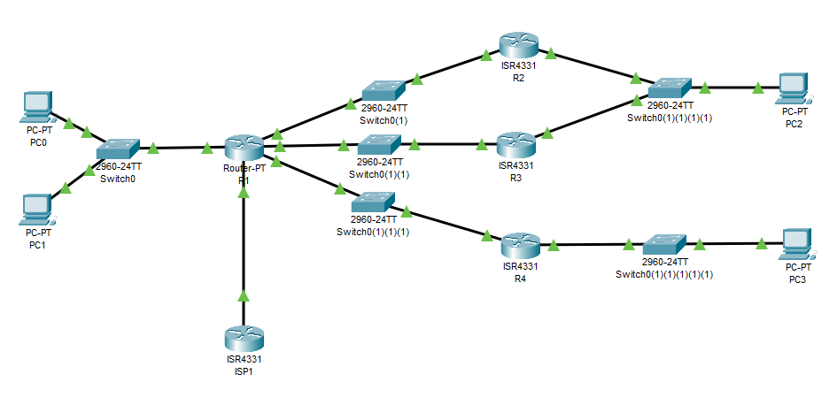
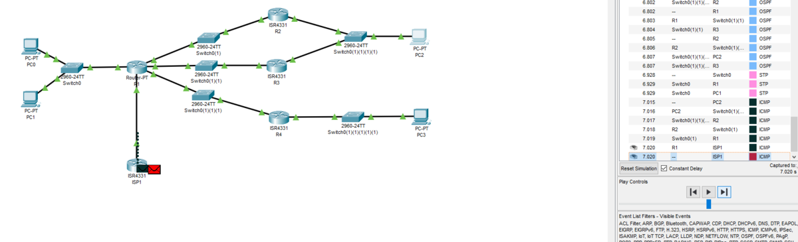

---
title: CCNA試験対策 ch20 Implementing OSPF
tags:
- CCNA
- ネットワーク
- 勉強メモ
date: 2020-05-08T00:00:00+09:00
URL: https://wand-ta.hatenablog.com/entry/2020/05/08/000000
EditURL: https://blog.hatena.ne.jp/wand_ta/wand-ta.hatenablog.com/atom/entry/26006613564718792
-------------------------------------


# Implementing Single-Area OSPFv2 #

## OSPF Single-Area Configuration ##



- R2の設定

```
R2#configure terminal 
Enter configuration commands, one per line.  End with CNTL/Z.
R2(config)#router ospf 1
R2(config-router)#network 10.0.0.0 0.255.255.255 area 0
```

- `router ospf 1`
  - process id
  - 1-65535のなんでもいい
- `0.255.255.255`: wildcard mask

## Wikdcard Matching with the network Command ##

- `0.255.255.255`
  - 下位3オクテットは問わない、の意
- R3も設定

```
R3#config terminal
Enter configuration commands, one per line.  End with CNTL/Z.
R3(config)#router ospf 1
R3(config-router)#network 10.1.13.0 0.0.0.255 area 0
R3(config-router)#network 10.1.23.0 0.0.0.255 area 0
```

- R2とR3がfull stateになる

```
%SYS-5-CONFIG_I: Configured from console by console

00:17:11: %OSPF-5-ADJCHG: Process 1, Nbr 10.1.23.2 on GigabitEthernet0/0/1 from LOADING to FULL, Loading Done
```

- R4も設定

```
R4(config)#router ospf 1
R4(config-router)#network 10.1.14.4 0.0.0.0 area 0
R4(config-router)#network 10.1.4.4 0.0.0.0 area 0
```


- R1も設定、全router設定完了

```
R1(config)#router ospf 1
R1(config-router)#network 10.0.0.0 0.255.255.255 area 0
R1(config-router)#
```


## Verifying OSPF Operation ##


```
R1#show ip ospf neighbor


Neighbor ID     Pri   State           Dead Time   Address         Interface
10.1.23.2         1   FULL/DR         00:00:33    10.1.12.2       GigabitEthernet4/0
10.1.23.3         1   FULL/DR         00:00:32    10.1.13.3       GigabitEthernet5/0
10.1.14.4         1   FULL/DR         00:00:38    10.1.14.4       GigabitEthernet6/0
R1#
```

```
R2#show ip ospf neighbor 


Neighbor ID     Pri   State           Dead Time   Address         Interface
10.1.14.1         1   FULL/BDR        00:00:35    10.1.12.1       GigabitEthernet0/0/0
10.1.23.3         1   FULL/BDR        00:00:31    10.1.23.3       GigabitEthernet0/0/1
R2#
```

```
R3>show ip ospf neighbor 


Neighbor ID     Pri   State           Dead Time   Address         Interface
10.1.14.1         1   FULL/BDR        00:00:33    10.1.13.1       GigabitEthernet0/0/0
10.1.23.2         1   FULL/DR         00:00:38    10.1.23.2       GigabitEthernet0/0/1
R3>
```

```
Neighbor ID     Pri   State           Dead Time   Address         Interface
10.1.14.1         1   FULL/BDR        00:00:33    10.1.14.1       GigabitEthernet0/0/0
R4>
```

- `FULL/DR`: full stateで、相手がDRの意
- `FULL/BDR`: full stateで、相手がBDRの意


```
R1#show ip route
Codes: C - connected, S - static, I - IGRP, R - RIP, M - mobile, B - BGP
       D - EIGRP, EX - EIGRP external, O - OSPF, IA - OSPF inter area
       N1 - OSPF NSSA external type 1, N2 - OSPF NSSA external type 2
       E1 - OSPF external type 1, E2 - OSPF external type 2, E - EGP
       i - IS-IS, L1 - IS-IS level-1, L2 - IS-IS level-2, ia - IS-IS inter area
       * - candidate default, U - per-user static route, o - ODR
       P - periodic downloaded static route

Gateway of last resort is not set

     10.0.0.0/24 is subnetted, 7 subnets
C       10.1.1.0 is directly connected, GigabitEthernet2/0.10
C       10.1.2.0 is directly connected, GigabitEthernet2/0.20
O       10.1.4.0 [110/2] via 10.1.14.4, 00:06:15, GigabitEthernet6/0
C       10.1.12.0 is directly connected, GigabitEthernet4/0
C       10.1.13.0 is directly connected, GigabitEthernet5/0
C       10.1.14.0 is directly connected, GigabitEthernet6/0
O       10.1.23.0 [110/2] via 10.1.12.2, 00:06:15, GigabitEthernet4/0
                  [110/2] via 10.1.13.3, 00:06:15, GigabitEthernet5/0

R1#
```

- PC0(`10.1.1.11`)からPC3(`10.1.4.11`)にpingしてみる

```
C:\>ping 10.1.4.11

Pinging 10.1.4.11 with 32 bytes of data:

Reply from 10.1.4.11: bytes=32 time<1ms TTL=126
Reply from 10.1.4.11: bytes=32 time<1ms TTL=126
Reply from 10.1.4.11: bytes=32 time<1ms TTL=126
Reply from 10.1.4.11: bytes=32 time<1ms TTL=126

Ping statistics for 10.1.4.11:
    Packets: Sent = 4, Received = 4, Lost = 0 (0% loss),
Approximate round trip times in milli-seconds:
    Minimum = 0ms, Maximum = 0ms, Average = 0ms
```


## Verifying OSPF Configuration ##

- `show running-command`が一番
- `show ip protocols `も使える
  - enable不要

```
R3>show ip protocols 

Routing Protocol is "ospf 1"
  Outgoing update filter list for all interfaces is not set 
  Incoming update filter list for all interfaces is not set 
  Router ID 10.1.23.3
  Number of areas in this router is 1. 1 normal 0 stub 0 nssa
  Maximum path: 4
  Routing for Networks:
    10.1.13.0 0.0.0.255 area 0
    10.1.23.0 0.0.0.255 area 0
  Routing Information Sources:  
    Gateway         Distance      Last Update 
    10.1.14.1            110      00:11:39
    10.1.14.4            110      00:11:40
    10.1.23.2            110      00:11:44
    10.1.23.3            110      00:11:39
  Distance: (default is 110)

R3>
```

```
R3>show ip ospf interface g0/0/0

GigabitEthernet0/0/0 is up, line protocol is up
  Internet address is 10.1.13.3/24, Area 0
  Process ID 1, Router ID 10.1.23.3, Network Type BROADCAST, Cost: 1
  Transmit Delay is 1 sec, State DR, Priority 1
  Designated Router (ID) 10.1.23.3, Interface address 10.1.13.3
  Backup Designated Router (ID) 10.1.14.1, Interface address 10.1.13.1
  Timer intervals configured, Hello 10, Dead 40, Wait 40, Retransmit 5
    Hello due in 00:00:01
  Index 1/1, flood queue length 0
  Next 0x0(0)/0x0(0)
  Last flood scan length is 1, maximum is 1
  Last flood scan time is 0 msec, maximum is 0 msec
  Neighbor Count is 1, Adjacent neighbor count is 1
    Adjacent with neighbor 10.1.14.1  (Backup Designated Router)
  Suppress hello for 0 neighbor(s)
R3>
```

- `show ip ospf interface brief`でinterfaceをリストできるはずだがPacket Tracerでは動作せず
  - networkコンフィグで意図せぬinterfaceが設定されていないことの確認
    - ワイルドカードマスク設定間違いなど


## Configurating the OSPF Router ID ##

```
R1#show ip ospf neighbor 


Neighbor ID     Pri   State           Dead Time   Address         Interface
10.1.23.2         1   FULL/DR         00:00:33    10.1.12.2       GigabitEthernet4/0
10.1.23.3         1   FULL/DR         00:00:33    10.1.13.3       GigabitEthernet5/0
10.1.14.4         1   FULL/DR         00:00:39    10.1.14.4       GigabitEthernet6/0
R1#
```

- ↑のNeighbor IDを設定できる


```
R1(config)#router ospf 1
R1(config-router)#router-id 1.1.1.1
R1(config-router)#Reload or use "clear ip ospf process" command, for this to take effect


R1(config-router)#end
R1#
%SYS-5-CONFIG_I: Configured from console by console
```

- 設定を反映するためにリロード

```
R1#clear ip ospf process
Reset ALL OSPF processes? [no]: yes

R1#
00:54:02: %OSPF-5-ADJCHG: Process 1, Nbr 10.1.23.2 on GigabitEthernet4/0 from FULL to DOWN, Neighbor Down: Adjacency forced to reset

00:54:02: %OSPF-5-ADJCHG: Process 1, Nbr 10.1.23.2 on GigabitEthernet4/0 from FULL to DOWN, Neighbor Down: Interface down or detached

00:54:02: %OSPF-5-ADJCHG: Process 1, Nbr 10.1.23.3 on GigabitEthernet5/0 from FULL to DOWN, Neighbor Down: Adjacency forced to reset

00:54:02: %OSPF-5-ADJCHG: Process 1, Nbr 10.1.23.3 on GigabitEthernet5/0 from FULL to DOWN, Neighbor Down: Interface down or detached

00:54:02: %OSPF-5-ADJCHG: Process 1, Nbr 10.1.14.4 on GigabitEthernet6/0 from FULL to DOWN, Neighbor Down: Adjacency forced to reset

00:54:02: %OSPF-5-ADJCHG: Process 1, Nbr 10.1.14.4 on GigabitEthernet6/0 from FULL to DOWN, Neighbor Down: Interface down or detached

R1#
R1#
R1#
00:54:07: %OSPF-5-ADJCHG: Process 1, Nbr 10.1.14.4 on GigabitEthernet6/0 from LOADING to FULL, Loading Done

00:54:12: %OSPF-5-ADJCHG: Process 1, Nbr 10.1.23.3 on GigabitEthernet5/0 from LOADING to FULL, Loading Done

00:54:13: %OSPF-5-ADJCHG: Process 1, Nbr 10.1.23.2 on GigabitEthernet4/0 from LOADING to FULL, Loading Done
```

- 他のルータから見たR1のRIDが変わる

```
00:54:13: %OSPF-5-ADJCHG: Process 1, Nbr 1.1.1.1 on GigabitEthernet0/0/0 from LOADING to FULL, Loading Done


R2#show ip ospf neighbor


Neighbor ID     Pri   State           Dead Time   Address         Interface
1.1.1.1           1   FULL/BDR        00:00:30    10.1.12.1       GigabitEthernet0/0/0
10.1.23.3         1   FULL/BDR        00:00:37    10.1.23.3       GigabitEthernet0/0/1
R2#
```

- loopback interfaceにRIDとして使いたいIPアドレスを振っておくという方法もある

```
R2#configure terminal
Enter configuration commands, one per line.  End with CNTL/Z.
R2(config)#interface loopback2
R2(config-if)#ip address 2.2.2.2 255.255.255.255
R2(config-if)#
```

- 所定のRIDになっていることの確認

```
R1#show ip ospf
 Routing Process "ospf 1" with ID 1.1.1.1
 Supports only single TOS(TOS0) routes
 Supports opaque LSA
 SPF schedule delay 5 secs, Hold time between two SPFs 10 secs
 Minimum LSA interval 5 secs. Minimum LSA arrival 1 secs
 Number of external LSA 0. Checksum Sum 0x000000
 Number of opaque AS LSA 0. Checksum Sum 0x000000
 Number of DCbitless external and opaque AS LSA 0
 Number of DoNotAge external and opaque AS LSA 0
 Number of areas in this router is 1. 1 normal 0 stub 0 nssa
 External flood list length 0
    Area BACKBONE(0)
        Number of interfaces in this area is 5
        Area has no authentication
        SPF algorithm executed 9 times
        Area ranges are
        Number of LSA 9. Checksum Sum 0x049cdd
        Number of opaque link LSA 0. Checksum Sum 0x000000
        Number of DCbitless LSA 0
        Number of indication LSA 0
        Number of DoNotAge LSA 0
        Flood list length 0

R1#
```


## Implementing Multiarea OSPF ##



```
R1(config)#no router ospf 1
R1(config)#router ospf 1
R1(config-router)#network 10.1.1.1 0.0.0.0 area 0
R1(config-router)#network 10.1.2.1 0.0.0.0 area 0
R1(config-router)#network 10.1.12.1 0.0.0.0 area 23
R1(config-router)#network 10.1.13.1 0.0.0.0 area 23
R1(config-router)#network 10.1.14.1 0.0.0.0 area 4
```

```
R2(config)#no router ospf 1
R2(config)#router ospf 1
R2(config-router)#network 10.0.0.0 0.255.255.255 area 23
```

```
R3(config)#no router ospf 1
R3(config)#router ospf 1
R3(config-router)#network 10.0.0.0 0.255.255.255 area 23
```

```
R4(config)#no router ospf 1
R4(config)#router ospf 1
R4(config-router)#network 10.0.0.0 0.255.255.255 area 4
```

- 確認

```
R1>show ip protocols

Routing Protocol is "ospf 1"
  Outgoing update filter list for all interfaces is not set 
  Incoming update filter list for all interfaces is not set 
  Router ID 1.1.1.1
  Number of areas in this router is 3. 3 normal 0 stub 0 nssa
  Maximum path: 4
  Routing for Networks:
    10.1.1.1 0.0.0.0 area 0
    10.1.2.1 0.0.0.0 area 0
    10.1.12.1 0.0.0.0 area 23
    10.1.13.1 0.0.0.0 area 23
    10.1.14.1 0.0.0.0 area 4
  Routing Information Sources:  
    Gateway         Distance      Last Update 
    1.1.1.1              110      00:00:31
    2.2.2.2              110      00:00:21
    3.3.3.3              110      00:00:26
    4.4.4.4              110      00:00:31
  Distance: (default is 110)

R1>enable
R1#show ip ospf neighbor


Neighbor ID     Pri   State           Dead Time   Address         Interface
3.3.3.3           1   FULL/DR         00:00:34    10.1.13.3       GigabitEthernet5/0
2.2.2.2           1   FULL/DR         00:00:34    10.1.12.2       GigabitEthernet4/0
4.4.4.4           1   FULL/DR         00:00:34    10.1.14.4       GigabitEthernet6/0
R1#
```


# Using OSPFv2 Interface Subcommands #

- `router ospf 1`とか`network`とか使うのは古いですよという話

## OSPF Interface Configuration Example ##

- まずまっさらに

```
R1(config)#no router ospf 1
```

- 各interfaceで`ip ospf <process_id> area <area_id>`

```
R1(config)#interface g2/0.10
R1(config-subif)#ip ospf 1 area 0
R1(config-subif)#interface g2/0.20
R1(config-subif)#ip ospf 1 area 0
R1(config-subif)#interface g4/0
R1(config-if)#ip ospf 1 area 23
R1(config-if)#interface g5/0
R1(config-if)#ip ospf 1 area 23
R1(config-if)#interface g6/0
R1(config-if)#ip ospf 1 area 4
```

- 他のルータも

```
R4(config-if)#ip address 4.4.4.4 255.255.255.0
R4(config-if)#
R4(config-if)#no router ospf 1
R4(config)#interface range g0/0/0-1
R4(config-if-range)#ip ospf 1 area 4
```

### Verifying OSPF Interface Configuration ###

- 設定確認

```
R1>show ip protocols

Routing Protocol is "ospf 1"
  Outgoing update filter list for all interfaces is not set 
  Incoming update filter list for all interfaces is not set 
  Router ID 1.1.1.1
  Number of areas in this router is 3. 3 normal 0 stub 0 nssa
  Maximum path: 4
  Routing for Networks:
  Routing Information Sources:  
    Gateway         Distance      Last Update 
    1.1.1.1              110      00:01:12
    2.2.2.2              110      00:01:07
    3.3.3.3              110      00:01:07
    4.4.4.4              110      00:01:12
  Distance: (default is 110)
```

- `Routing for Networks:`の後に`Routing on Interfaces Configures Explicitly (Area 0)`とか出るはずなのだがPacket Tracerだからか出てこず
- 設定確認2


```
R1#show ip ospf interface g4/0

GigabitEthernet4/0 is up, line protocol is up
  Internet address is 10.1.12.1/24, Area 23
  Process ID 1, Router ID 1.1.1.1, Network Type BROADCAST, Cost: 1
  Transmit Delay is 1 sec, State BDR, Priority 1
  Designated Router (ID) 2.2.2.2, Interface address 10.1.12.2
  Backup Designated Router (ID) 1.1.1.1, Interface address 10.1.12.1
  Timer intervals configured, Hello 10, Dead 40, Wait 40, Retransmit 5
    Hello due in 00:00:07
  Index 3/3, flood queue length 0
  Next 0x0(0)/0x0(0)
  Last flood scan length is 1, maximum is 1
  Last flood scan time is 0 msec, maximum is 0 msec
  Neighbor Count is 1, Adjacent neighbor count is 1
    Adjacent with neighbor 2.2.2.2  (Designated Router)
  Suppress hello for 0 neighbor(s)
R1#
```

- `  Internet address is 10.1.12.1/24, Area 23`の後に`Attached via Interface Enable`とか出るはずなのだがやはり出てこず
  - `router ospf`,`network`で指定した場合は`Attached via Network Statement`

# Additional OSPFv2 Features #

## OSPF Passive Interfaces ##

- OSPFがenabledになったinterfaceは、Hello送出・リッスンするようになる
- Hello送出・リッスンをやめたいケースがある
  - 例:R1の`g2/0` (左), R4の`g0/0/1` (右)
    - subnetの情報は必要なので、`network`や`ip ospf <process_id> area <area_id>`などの設定自体は必要
    - が、その先にrouterがいないので、Helloを送るだけ無駄



- Passive Interfacesの設定


```
R1(config)#router ospf 1
R1(config-router)#passive-interface g2/0.10
R1(config-router)#passive-interface g2/0.20
```

```
R4(config)#router ospf 1
R4(config-router)#passive-interface g0/0/1
```

- 無駄なHelloが飛ばなくなる



- 設定確認

```
R1#show ip ospf interface g2/0
%OSPF: OSPF not enabled on GigabitEthernet2/0
R1#show ip ospf interface g2/0.10

GigabitEthernet2/0.10 is up, line protocol is up
  Internet address is 10.1.1.1/24, Area 0
  Process ID 1, Router ID 1.1.1.1, Network Type BROADCAST, Cost: 1
  Transmit Delay is 1 sec, State WAITING, Priority 1
  No designated router on this network
  No backup designated router on this network
  Timer intervals configured, Hello 10, Dead 40, Wait 40, Retransmit 5
    No Hellos (Passive interface)
  Index 1/1, flood queue length 0
  Next 0x0(0)/0x0(0)
  Last flood scan length is 1, maximum is 1
  Last flood scan time is 0 msec, maximum is 0 msec
  Neighbor Count is 0, Adjacent neighbor count is 0
  Suppress hello for 0 neighbor(s)
R1#
```

```
    No Hellos (Passive interface)
```

## OSPF Default Routes ##

- インターネットに面しているrouterを新たに設置したとする



```
ISP1(config-if)#interface g0/0/0
ISP1(config-if)#no shutdown
ISP1(config-if)#ip address 192.168.11.1 255.255.255.0
ISP1(config-if)#ip route 10.0.0.0 255.0.0.0 192.168.11.2
```

```
ISP1#show ip route
...
S    10.0.0.0/8 [1/0] via 192.168.11.2
     192.168.11.0/24 is variably subnetted, 2 subnets, 2 masks
...
```

- 新たなISP1をR1の`g9/0`に繋いだ

```
R1(config-router)#interface g9/0
R1(config-if)#ip address 192.168.11.2 255.255.255.0
R1(config-if)#no shutdown
R1(config-if)#ip route 0.0.0.0 0.0.0.0 192.168.11.1
```


```
R1#show ip route
...
S*   0.0.0.0/0 [1/0] via 192.168.11.1
```


- インターネット上のIPアドレスにアクセスするときは、ISP1ルータにルーティングするようにR1に設定した (last resort gateway)
- last resort gatewayを他のrouterにも教えてあげたいとき:

```
R1(config-router)#default-information originate 
```

- R2のrouting tableの確認

```
R2>show ip route
Codes: L - local, C - connected, S - static, R - RIP, M - mobile, B - BGP
       D - EIGRP, EX - EIGRP external, O - OSPF, IA - OSPF inter area
       N1 - OSPF NSSA external type 1, N2 - OSPF NSSA external type 2
       E1 - OSPF external type 1, E2 - OSPF external type 2, E - EGP
       i - IS-IS, L1 - IS-IS level-1, L2 - IS-IS level-2, ia - IS-IS inter area
       * - candidate default, U - per-user static route, o - ODR
       P - periodic downloaded static route

Gateway of last resort is 10.1.12.1 to network 0.0.0.0

     2.0.0.0/32 is subnetted, 1 subnets
C       2.2.2.2/32 is directly connected, Loopback2
     10.0.0.0/8 is variably subnetted, 9 subnets, 2 masks
O IA    10.1.1.0/24 [110/2] via 10.1.12.1, 00:22:08, GigabitEthernet0/0/0
O IA    10.1.2.0/24 [110/2] via 10.1.12.1, 00:22:08, GigabitEthernet0/0/0
O IA    10.1.4.0/24 [110/3] via 10.1.12.1, 00:22:08, GigabitEthernet0/0/0
C       10.1.12.0/24 is directly connected, GigabitEthernet0/0/0
L       10.1.12.2/32 is directly connected, GigabitEthernet0/0/0
O       10.1.13.0/24 [110/2] via 10.1.12.1, 00:19:30, GigabitEthernet0/0/0
                     [110/2] via 10.1.23.3, 00:19:30, GigabitEthernet0/0/1
O IA    10.1.14.0/24 [110/2] via 10.1.12.1, 00:22:08, GigabitEthernet0/0/0
C       10.1.23.0/24 is directly connected, GigabitEthernet0/0/1
L       10.1.23.2/32 is directly connected, GigabitEthernet0/0/1
O*E2 0.0.0.0/0 [110/1] via 10.1.12.1, 00:05:11, GigabitEthernet0/0/0
```

- R2にもlast resort gatewayが追加されている！

```
O*E2 0.0.0.0/0 [110/1] via 10.1.12.1, 00:05:11, GigabitEthernet0/0/0
```

- PCで`ping 8.8.8.8`とかやると、ちゃんとISP1までパケットが届く





## OSPF Metrics (Cost) ##

```
R1#show ip ospf interface g2/0.10

GigabitEthernet2/0.10 is up, line protocol is up
  Internet address is 10.1.1.1/24, Area 0
  Process ID 1, Router ID 1.1.1.1, Network Type BROADCAST, Cost: 1
...  
```

- これ: `Cost: 1`
- 算出の公式

```
ospf_cost = ceil(reference_bandwidth / interface_bandwidth)
```

- コストの設定方法
  - interfaceごとに直接costを設定する
  - interface bandwidthを設定し、cost算出は公式に委ねる
  - reference bandwidthを設定し、cost算出は公式に委ねる
    - デフォルト100,000 kbps
- 直接設定

```
R1(config)#interface g2/0.10
R1(config-subif)#ip ospf cost 10
```

```
R1#show ip ospf interface g2/0.10

GigabitEthernet2/0.10 is up, line protocol is up
  Internet address is 10.1.1.1/24, Area 0
  Process ID 1, Router ID 1.1.1.1, Network Type BROADCAST, Cost: 10
```

- interfaceのbandwidth設定
  - kbps単位

```
R1(config)#interface g2/0.10
R1(config-subif)#bandwidth 1000
R1(config-subif)#interface g2/0.20
R1(config-subif)#bandwidth 1000
R1(config-subif)#end
```

- `100000`/`1000`で100になるはず

```
R1#show ip ospf interface g2/0.10

GigabitEthernet2/0.10 is up, line protocol is up
  Internet address is 10.1.1.1/24, Area 0
  Process ID 1, Router ID 1.1.1.1, Network Type BROADCAST, Cost: 10
  ...
```

- R1はcost直接指定(10)のほうが強い

```
R1#show ip ospf interface g2/0.20

GigabitEthernet2/0.20 is up, line protocol is up
  Internet address is 10.1.2.1/24, Area 0
  Process ID 1, Router ID 1.1.1.1, Network Type BROADCAST, Cost: 100
  ...
```

- R2は計算通り
- 続いて、reference bandwidthの設定
  - こちらはMbps単位

```
R1(config)#router ospf 1
R1(config-router)#auto-cost reference-bandwidth 50
% OSPF: Reference bandwidth is changed.
        Please ensure reference bandwidth is consistent across all routers.
```

- 全routerで揃えてね、と言われる

```
R1#show ip ospf interface g2/0.20

GigabitEthernet2/0.20 is up, line protocol is up
  Internet address is 10.1.2.1/24, Area 0
  Process ID 1, Router ID 1.1.1.1, Network Type BROADCAST, Cost: 50
```

- 50Mbps / 1000kbps = 50になった


## OSPF Load Balancing ##

- メトリクスの等しいrouteが複数ある場合、負荷分散される
- 「メトリクスの等しいroute」はデフォルトで4本までだったりする
- これを増やすには`router ospf`の下で`maximum-paths <number>`を設定する
- 負荷分散方式はデフォルトでper-destination IP
