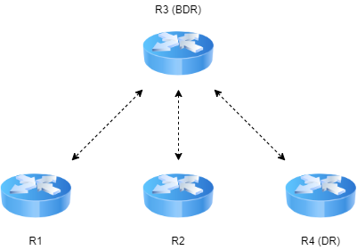

---
title: CCNA試験対策 ch21 OSPF Network Types and Neighbors
tags:
- CCNA
- ネットワーク
- 勉強メモ
date: 2020-05-09T00:00:00+09:00
URL: https://wand-ta.hatenablog.com/entry/2020/05/09/000000
EditURL: https://blog.hatena.ne.jp/wand_ta/wand-ta.hatenablog.com/atom/entry/26006613565103887
-------------------------------------


# OSPF Network Types #

- OSPFのinterfaceごとの設定

| Network Type Keyword | Dynamically Discovers Neighbors | Use a DR/BDR |
|----------------------|---------------------------------|--------------|
| broadcast            | yes                             | yes          |
| point-to-point       | yes                             | no           |


## The OSPF Broadcast Network Type ##

- デフォルトでbroadcast
  - ch20の設定はこれに基づいている

```
R3(config)#router ospf 1
OSPF process 1 cannot start. There must be at least one "up" IP interface
R3(config-router)#router-id 3.3.3.3
R3(config-router)#passive-interface g0/0/1
R3(config-router)#exit
R3(config)#interface g0/0/0
R3(config-if)#no shutdown
R3(config-if)#ip address 10.1.1.3 255.255.255.0
R3(config-if)#ip ospf 1 area 0
R3(config-if)#exit
R3(config)#interface g0/0/1
R3(config-if)#no shutdown
R3(config-if)#ip address 10.1.33.3 255.255.255.0
R3(config-if)#ip ospf 1 area 0
R3(config-if)#end
```

- R1,2,4もいい感じに設定する
- neighbor確認


```
R1#show ip ospf neighbor


Neighbor ID     Pri   State           Dead Time   Address         Interface
3.3.3.3           1   FULL/BDR        00:00:38    10.1.1.3        GigabitEthernet0/0/0
4.4.4.4           1   FULL/DR         00:00:38    10.1.1.4        GigabitEthernet0/0/0
2.2.2.2           1   2WAY/DROTHER    00:00:38    10.1.1.2        GigabitEthernet0/0/0
R1#
```

- `4.4.4.4`がDR、`3.3.3.3`がBDR、になった
- `1.1.1.1`と`2.2.2.2`はDROthersなので2way stateどまり
- 何が起きているか
  1. `224.0.0.5`マルチキャストアドレスにOSPF Hello送信してneighbor発見
  2. DR/BDR interfaceの選出
  3. 他にrouterのいないネットワークに面しているinterfaceは無条件にDR
     - R1のg0/0/1 (左)など
     - 【補】今回はpassive interfaceを設定したので関係ないかも
  4. 中央のネットワークでは、今回は R4 g0/0/1がDR、R3 g0/0/1がBDR
  5. DR/BDRにメッセージを送信するときは、`224.0.0.6`マルチキャストアドレスを用いる


### Verifying Operations with Network Type Broadcast ###

```
R4#show ip ospf neighbor


Neighbor ID     Pri   State           Dead Time   Address         Interface
2.2.2.2           1   FULL/DROTHER    00:00:34    10.1.1.2        GigabitEthernet0/0/0
1.1.1.1           1   FULL/DROTHER    00:00:34    10.1.1.1        GigabitEthernet0/0/0
3.3.3.3           1   FULL/BDR        00:00:34    10.1.1.3        GigabitEthernet0/0/0
```


```
R3#show ip ospf neighbor


Neighbor ID     Pri   State           Dead Time   Address         Interface
4.4.4.4           1   FULL/DR         00:00:31    10.1.1.4        GigabitEthernet0/0/0
2.2.2.2           1   FULL/DROTHER    00:00:31    10.1.1.2        GigabitEthernet0/0/0
1.1.1.1           1   FULL/DROTHER    00:00:31    10.1.1.1        GigabitEthernet0/0/0
```



- 本当は `show ip ospf interface brief`が見たいのだがPacket Tracerだと動かないので代用:


```
R1#show ip ospf interface

GigabitEthernet0/0/0 is up, line protocol is up
  Internet address is 10.1.1.1/24, Area 0
  Process ID 1, Router ID 1.1.1.1, Network Type BROADCAST, Cost: 1
  Transmit Delay is 1 sec, State DROTHER, Priority 1
  Designated Router (ID) 4.4.4.4, Interface address 10.1.1.4
  Backup Designated Router (ID) 3.3.3.3, Interface address 10.1.1.3
  Timer intervals configured, Hello 10, Dead 40, Wait 40, Retransmit 5
    Hello due in 00:00:08
  Index 1/1, flood queue length 0
  Next 0x0(0)/0x0(0)
  Last flood scan length is 1, maximum is 1
  Last flood scan time is 0 msec, maximum is 0 msec
  Neighbor Count is 3, Adjacent neighbor count is 2
    Adjacent with neighbor 4.4.4.4  (Designated Router)
    Adjacent with neighbor 3.3.3.3  (Backup Designated Router)
  Suppress hello for 0 neighbor(s)
GigabitEthernet0/0/1 is up, line protocol is up
  Internet address is 10.1.11.1/24, Area 0
  Process ID 1, Router ID 1.1.1.1, Network Type BROADCAST, Cost: 1
  Transmit Delay is 1 sec, State DR, Priority 1
  Designated Router (ID) 1.1.1.1, Interface address 10.1.11.1
  No backup designated router on this network
  Timer intervals configured, Hello 10, Dead 40, Wait 40, Retransmit 5
    No Hellos (Passive interface)
  Index 2/2, flood queue length 0
  Next 0x0(0)/0x0(0)
  Last flood scan length is 1, maximum is 1
  Last flood scan time is 0 msec, maximum is 0 msec
  Neighbor Count is 0, Adjacent neighbor count is 0
  Suppress hello for 0 neighbor(s)
```

- g0/0/0 抜粋

```
GigabitEthernet0/0/0 is up, line protocol is up
  Internet address is 10.1.1.1/24, Area 0
  Process ID 1, Router ID 1.1.1.1, Network Type BROADCAST, Cost: 1
  Transmit Delay is 1 sec, State DROTHER, Priority 1
  Designated Router (ID) 4.4.4.4, Interface address 10.1.1.4
  Backup Designated Router (ID) 3.3.3.3, Interface address 10.1.1.3
  Timer intervals configured, Hello 10, Dead 40, Wait 40, Retransmit 5
    Hello due in 00:00:08
  Index 1/1, flood queue length 0
  Next 0x0(0)/0x0(0)
  Last flood scan length is 1, maximum is 1
  Last flood scan time is 0 msec, maximum is 0 msec
  Neighbor Count is 3, Adjacent neighbor count is 2
    Adjacent with neighbor 4.4.4.4  (Designated Router)
    Adjacent with neighbor 3.3.3.3  (Backup Designated Router)
  Suppress hello for 0 neighbor(s)
```

- `State DROTHER`
  - DRでもBDRでもない
- `Neighbor Count is 3, Adjacent neighbor count is 2`
  - briefで`Nbrs F/C`として表示されるはずの部分
- `Network Type BROADCAST`
  - network typeがデフォルトのbroadcast
    - 昔の機種だと違ったりする
    - その場合は`ip ospf network broadcast` interface subcommand で設定する


### Configuring to Influence the DR/BDR Election ###

- DR/BDR選出後の挙動
  - DR障害時、BDRが引き継いで、新たにBDRが選出される
  - より適任なrouterがsubnetに参入しても、DR/BDRの差し替えはおきない
- つまり、新しいrouterの優先度を高くしてDR/BDRに選出させようとしても、現DR/BDRに障害が発生しない限り、新しく追加したrouterがDR/BDRになることはない
- STPのroot選出との比較

|                       | OSPFのDR/BDR選出          | cf. STPのroot選出         |
|-----------------------|---------------------------|---------------------------|
| priority              | 0-255                     | 0-65535の範囲で4096の倍数 |
| priorityの解釈        | highest-is-best           | lowest-is-best            |
| priorityがタイのとき  | Router IDが最も大きいもの | System IDが最も小さいもの |
| preemption (差し替え) | ない                      | ある                      |

- コスト設定

```
R1(config)#interface g0/0/0
R1(config-if)#ip ospf priority 99
R1(config-if)#
R1(config-if)#^Z
R1#
%SYS-5-CONFIG_I: Configured from console by console
```

- 確かに設定されている

```

R1#show ip ospf interface g0/0/0

GigabitEthernet0/0/0 is up, line protocol is up
  Internet address is 10.1.1.1/24, Area 0
  Process ID 1, Router ID 1.1.1.1, Network Type BROADCAST, Cost: 1
  Transmit Delay is 1 sec, State DROTHER, Priority 99
  Designated Router (ID) 4.4.4.4, Interface address 10.1.1.4
  Backup Designated Router (ID) 3.3.3.3, Interface address 10.1.1.3
  Timer intervals configured, Hello 10, Dead 40, Wait 40, Retransmit 5
    Hello due in 00:00:05
  Index 1/1, flood queue length 0
  Next 0x0(0)/0x0(0)
  Last flood scan length is 1, maximum is 1
  Last flood scan time is 0 msec, maximum is 0 msec
  Neighbor Count is 3, Adjacent neighbor count is 2
    Adjacent with neighbor 4.4.4.4  (Designated Router)
    Adjacent with neighbor 3.3.3.3  (Backup Designated Router)
  Suppress hello for 0 neighbor(s)
```

- show ip ospf neighborの情報にも反映されるが、DR/BDRは変わらない

```
R4#show ip ospf neighbor


Neighbor ID     Pri   State           Dead Time   Address         Interface
3.3.3.3           1   FULL/BDR        00:00:36    10.1.1.3        GigabitEthernet0/0/0
1.1.1.1          99   FULL/DROTHER    00:00:36    10.1.1.1        GigabitEthernet0/0/0
2.2.2.2           1   FULL/DROTHER    00:00:36    10.1.1.2        GigabitEthernet0/0/0
```


- R4のg0/0/0 (DR)を`shutdown`してみる

```
R4(config-if)#shutdown
R4(config-if)#no shutdown
```

```
R4#show ip ospf neighbor


Neighbor ID     Pri   State           Dead Time   Address         Interface
1.1.1.1          99   FULL/BDR        00:00:31    10.1.1.1        GigabitEthernet0/0/0
2.2.2.2           1   2WAY/DROTHER    00:00:31    10.1.1.2        GigabitEthernet0/0/0
3.3.3.3           1   FULL/DR         00:00:31    10.1.1.3        GigabitEthernet0/0/0
```

- BDRだったR3がDRになった
- 新たなBDRとして、priority99のR1が選出された


## The OSPF Point-to-Point Network Type ##


- リンクに2ルータしかないときに有用
  - シリアル通信
  - WAN
    - HDLC
    - PPPoE

```
Router(config)#interface Serial9/0
Router(config-if)#ip address 10.1.14.1 255.255.255.0
Router(config-if)#ip ospf 1 area 4
Router(config-if)#ip ospf network point-to-point
```


```
show ip ospf interface s9/0

Serial9/0 is up, line protocol is up
  Internet address is 10.1.14.1/24, Area 4
  Process ID 1, Router ID 10.1.14.1, Network Type POINT-TO-POINT, Cost: 64
  Transmit Delay is 1 sec, State POINT-TO-POINT,
  Timer intervals configured, Hello 10, Dead 40, Wait 40, Retransmit 5
    Hello due in 00:00:07
  Index 1/1, flood queue length 0
  Next 0x0(0)/0x0(0)
  Last flood scan length is 1, maximum is 1
  Last flood scan time is 0 msec, maximum is 0 msec
  Neighbor Count is 1 , Adjacent neighbor count is 1
    Adjacent with neighbor 10.1.14.4
  Suppress hello for 0 neighbor(s)
```

- これ

```
...
Network Type POINT-TO-POINT
...
State POINT-TO-POINT
...
```

- DRとかBDRとかいう概念もない


# OSPF Neighbor Relationships #

## OSPF Neighbor Requirements ##

| requirement                                        | required for ospf | neighbor missing if incorrect |
|----------------------------------------------------|-------------------|-------------------------------|
| up/up                                              | yes               | yes                           |
| aclでフィルターされない                            | yes               | yes                           |
| 同一subnet                                         | yes               | yes                           |
| routing protocol neighbor authenticationが通ること | yes               | yes                           |
| hello/dead timerの一致                             | yes               | yes                           |
| RIDの重複がなきこと                                | yes               | yes                           |
| 同一エリア                                         | yes               | yes                           |
| OSPFプロセスがshutdownでなきこと                   | yes               | yes                           |
| MTU一致                                            | yes               | no                            |
| OSPF Network Type一致                              | yes               | no                            |

- トラブルは2種類
  - neighborになれない
  - neighborになれるが正しくroutingされない
- トラブルシューティング用コマンド
- `show ip ospf`
  - RID確認
  - OSPF processがshutdownしてないこと

```
R2#show ip ospf
 Routing Process "ospf 1" with ID 2.2.2.2
 Supports only single TOS(TOS0) routes
 Supports opaque LSA
 SPF schedule delay 5 secs, Hold time between two SPFs 10 secs
 Minimum LSA interval 5 secs. Minimum LSA arrival 1 secs
 Number of external LSA 0. Checksum Sum 0x000000
 Number of opaque AS LSA 0. Checksum Sum 0x000000
 Number of DCbitless external and opaque AS LSA 0
 Number of DoNotAge external and opaque AS LSA 0
 Number of areas in this router is 1. 1 normal 0 stub 0 nssa
 External flood list length 0
```

- `show ip ospf interface gigabitEthernet 0/0/0`
  - neighbor authentication
  - hello/dead timer
  - OSPF processがshutdownしてないこと

```
R2#show ip ospf interface gigabitEthernet 0/0/0

GigabitEthernet0/0/0 is up, line protocol is up
  Internet address is 10.1.12.2/24, Area 23
  Process ID 1, Router ID 2.2.2.2, Network Type BROADCAST, Cost: 1
  Transmit Delay is 1 sec, State DR, Priority 1
  Designated Router (ID) 2.2.2.2, Interface address 10.1.12.2
  No backup designated router on this network
  Timer intervals configured, Hello 10, Dead 40, Wait 40, Retransmit 5
    Hello due in 00:00:04
  Index 1/1, flood queue length 0
  Next 0x0(0)/0x0(0)
  Last flood scan length is 1, maximum is 1
  Last flood scan time is 0 msec, maximum is 0 msec
  Neighbor Count is 0, Adjacent neighbor count is 0
  Suppress hello for 0 neighbor(s)
```


- `show ip ospf interface brief`
  - area一致


## Issues That Prevent Neighbor Adjacencies ##

- area不一致
- RID重複
- hello/dead interval不一致
- routerサブコマンドで`shutdown`されている


## Issues That Allow Adjacencies but Prevent IP Routes ##

- MTU不一致
- OSPF network type不一致


----------------------------------------

# 英語 #

- preemption
  - 先買権、優先買取権
  - 差し替え
    - 本文の文脈ではたぶんこっち

