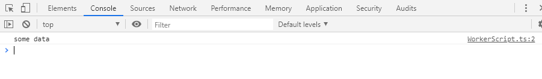

---
title: Programming TypeScript ch8 Asynchronous Programming, Concurrency, and Parallelism (2/2)
tags:
- 勉強メモ
- TypeScript
date: 2020-05-17T04:32:33+09:00
URL: https://wand-ta.hatenablog.com/entry/2020/05/17/043233
EditURL: https://blog.hatena.ne.jp/wand_ta/wand-ta.hatenablog.com/atom/entry/26006613568975349
bibliography: https://www.oreilly.com/library/view/programming-typescript/9781492037644/
-------------------------------------


# Typesafe Multithreading #

- 非同期プログラミング自体はシングルスレッド・イベントループで実現できる
- が、 CPU-intensive なタスクではマルチスレッドによる並列コンピューティングを選ぶこともある
  - メインスレッドの応答性を保つために他のスレッドに負荷を逃がす


## In the Browser: With Web Workers ##

- メインスレッドがブロックされるとUIの応答性を損なうので、Web Workerに逃がす
- 

``` json
{
  "compilerOptions": {
    "lib": ["es2015", "webworker"],
...
```

- 並列プログラミングの実装として、共有メモリの読み書きは並列性の問題に陥りがち
  - 非決定性
  - デッドロック
  - etc.
- Web Workerはブラウザで動くので、メモリ安全性を念頭に、メッセージパッシングで設計されている


MainThread.ts

``` typescript
const worker = new Worker('WorkerScript.js')

worker.postMessage('some data')
```


WorkerScript.ts

``` typescript
onmessage = e => {
  console.log(e.data)
  postMessage("Ack: ${e.data}")
}
```

- event emitterと同じ感じ

``` html
<!doctype html>
<html>
  <head>
    <title>title</title>
    <script src="MainThread.js"></script>
  </head>
  <body>
  </body>
</html>
```




### 型付け ###

MainThread.ts

``` typescript
type Message = string
type ThreadID = number
type UserID = number
type Participants = UserID[]


type Commands = {
  sendMessageToThread: [ThreadID, Message]
  createThread: [Participants]
  addUserToThread: [ThreadID, UserID]
  removedUserFromThread: [ThreadID, UserID]
}

type Events = {
  receivedMessage: [ThreadID, UserID, Message]
  createdThread: [ThreadID, Participants]
  addedUserToThread: [ThreadID, UserID]
  removedUserFromThread: [ThreadID, UserID]
}
```

WorkerScript.ts

``` typescript
type Command =
  | { type: 'sendMessageToThread', data: [ThreadID, Message] }
  | { type: 'createThread', data: [Participants] }
  | { type: 'addUserToThread', data: [ThreadID, UserID] }
  | { type: 'removeUserFromThread', data: [ThreadID, UserID] }


onmessage = e => processCommandFromMainThread(e.data)

function processCommandFromMainThread(
  command: Command
) {
  switch (command.type) {
    case 'sendMessageToThread':
      let [threadID, message] = command.data
      console.log(message)
  }
}
```

- 問題点
  - 型定義が冗長
  - Commandの種類が増えるたびにonmessageリスナに手を加える必要がある
- EventEmitterを使ってきれいにする

``` json
{
  "compilerOptions": {
    "lib": ["es2015", "webworker"],
    "esModuleInterop": true,
    "keyofStringsOnly": false,
...
```

SafeEmitter.ts


``` typescript
import {EventEmitter} from 'events'

type StringAndSymbolKeys<T> = Exclude<keyof T, number>

export default class SafeEmitter<
  Events extends Record<PropertyKey, unknown[]>
  > {
    private emitter = new EventEmitter

    emit<K extends StringAndSymbolKeys<Events>> (
      channel: K,
      ...data: Events[K]
    ) {
      return this.emitter.emit(channel, ...data)
    }

    on<K extends StringAndSymbolKeys<Events>> (
      channel: K,
      listener: (...data: Events[K]) => void
    ){
      return this.emitter.on(channel, listener as ((...data: any[]) => void))
    }
  }
```

- 【補】書籍通りだといろいろ通らなかったので改造した
  - `EventEmitter.emit, on`が`string|symbol`しか受け取らないので`number`を`Exclude`
  - `listener: (..data: any[]) => void`に`listener: (..data: Events[K]) => void`を渡せないので`as`

WorkerScript.ts

``` typescript
import SafeEmitter from './SafeEmitter'

const commandEmitter = new SafeEmitter<Commands>()
const eventEmitter = new SafeEmitter<Events>()

onmessage = command =>
  commandEmitter.emit(   // 型引数はanyに推論される
    command.data.type,   // any
    ...command.data.data // any
  )

eventEmitter.on(
  'receivedMessage',
  data =>
    postMessage({type: 'receivedMessage', data}) // ここは補完効かない
)
eventEmitter.on(
  'createdThread',
  data =>
    postMessage({type: 'createdThread', data}) // ここは補完効かない
)

commandEmitter.on(
  'sendMessageToThread',
  (threadID, message) =>
    console.log(`OK, I will send a message to threadID ${threadID}`)
)

eventEmitter.emit('createdThread', 123, [456, 789])
```

- 【所感】型安全性が完全ではないなぁという感じ
  - postMessageのところとか


### Typesafe protocols ###

``` typescript
type Protocol = {
  [command: string]: {
    in: unknown[]
    out: unknown
  }
}

function createProtocol<P extends Protocol>(script: string) {
  return <K extends keyof P>(command: K) =>
    (...args: P[K]['in']) =>
      new Promise<P[K]['out']>((resolve, reject) => {
        const worker = new Worker(script)
        worker.onerror = reject
        worker.onmessage = event => resolve(event.data.data)
        worker.postMessage({ command, args })
      })
}


type Matrix = number[][]

type MatrixProtocol = {
  determinant: {
    in: [Matrix]
    out: number
  }
  'dot-product': {
    in: [Matrix, Matrix]
    out: Matrix
  }
  invert: {
    in: [Matrix]
    out: Matrix
  }
}


const runWithMatrixProtocol = createProtocol<MatrixProtocol>(
  'MatrixWorkerScript.js'
)
const parallelDeterminant = runWithMatrixProtocol('determinant');

(async () => {
  const determinant = await parallelDeterminant([[1, 2], [3, 4]])
  console.log(determinant)
})()
```

- MatrixWorkerScript.js はexercisesで


## In NodeJS: With Child Processes ##

- fork
- `process.on/send`でやりとり


# Exercises #

## General-Purpose promisify ##

``` typescript
import { readFile } from 'fs'

function promisify<First, E, R>(
  fn: (first: First, callback: (err: E, data: R) => void) => any
): (first: First) => Promise<R> {
  return first => new Promise<R>(
    (resolve, reject) =>
      fn(first, (err: E | null, data: R) =>
         err ? reject(err) : resolve(data)))
}

const readFilePromise = promisify(readFile);
(async () => {
  try {
    const data = await readFilePromise('./myFile.ts')
    console.log('success reading file', data.toString())
  } catch (error) {
    console.error('error reading file', error)
  }
})()
```


``` sh
node dist/index.js
```

```
error reading file [Error: ENOENT: no such file or directory, open './myFile.ts'] {
  errno: -2,
  code: 'ENOENT',
  syscall: 'open',
  path: './myFile.ts'
}
```

```sh
touch dist/myFile.ts
node dist/index.js
```

``` typescript
node dist/index.js
success reading file 
```


## MatrixProtocolの残り半分 ##

MatrixWorkerScript.js

``` typescript
import {EventEmitter} from 'events'

type StringAndSymbolKeys<T> = Exclude<keyof T, number>

export default class SafeEmitter<
  Events extends Record<PropertyKey, unknown[]>
  > {
    private emitter = new EventEmitter

    emit<K extends StringAndSymbolKeys<Events>> (
      channel: K,
      ...data: Events[K]
    ) {
      return this.emitter.emit(channel, ...data)
    }

    on<K extends StringAndSymbolKeys<Events>> (
      channel: K,
      listener: (...data: Events[K]) => void
    ){
      return this.emitter.on(channel, listener as ((...data: any[]) => void))
    }
  }
```

- bundle しないと動かない
