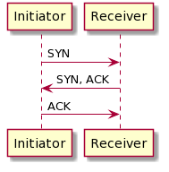
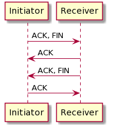
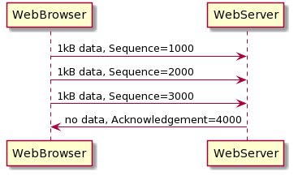
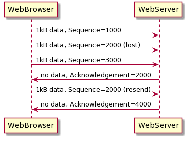
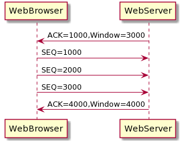

---
title: 'CCNA試験対策 下巻ch1: Introduction to TCP/IP Transport and Applications'
tags:
- CCNA
- ネットワーク
- 勉強メモ
date: 2020-06-05T00:00:00+09:00
URL: https://wand-ta.hatenablog.com/entry/2020/06/05/000000
EditURL: https://blog.hatena.ne.jp/wand_ta/wand-ta.hatenablog.com/atom/entry/26006613585640297
bibliography: https://www.ciscopress.com/store/ccna-200-301-official-cert-guide-volume-2-9781587147135
-------------------------------------


# TCP/IP Layer 4 Protocols: TCP and UDP #

- Application層にいろいろなサービスを提供する
- 例: Error recovery(TCPのみ)
  - packet (L3PDU)はrouterで諸々の理由で破棄されることがある
    - 誤り
    - 輻輳
    - 正しいrouteがわからない
  - L2でもフレームが失われることあり
- TCPは機能面にすぐれ、UDPは非機能(性能)面にすぐれる

| Function                                    | UDP | TCP |
|---------------------------------------------|-----|-----|
| Multiplexing using ports                    | o   | o   |
| Error recovery                              |     | o   |
| Flow control using windowing                |     | o   |
| Connection establishment and termination    |     | o   |
| Ordered data transfer and data segmentation |     | o   |


## Transmission Control Protocol ##

### Multiplexing Using TCP Port Numbers ###

- どのアプリケーションにデータを渡せばいいかをport numberで識別
- port number
  - Well Known Ports
    - System Portsとも
    - 0-1023
    - IANAが割り当てる(assign)やつ
  - User Ports
    - Registered Portsとも
    - 1024-49151 (0xBFFF)
    - IANAにより割り当てられるが、well-known portsほど厳格でないもの
  - Ephemeral Ports
    - Dynamic Ports, Private Portsとも
    - 49252(0xC000)-65535
    - クライアントアプリケーションに一時的に割り当てられる(allocate)もの


#### Popular TCP/IP Applications ####

| Port Number | Protocol | Application |
|-------------|----------|-------------|
| 20          | TCP      | FTP data    |
| 21          | TCP      | FTP control |
| 22          | TCP      | SSH         |
| 23          | TCP      | Telnet      |
| 25          | TCP      | SMTP        |
| 53          | UDP,TCP  | DNS         |
| 67          | UDP      | DHCP Server |
| 68          | UDP      | DHCP Server |
| 69          | UDP      | TFTP        |
| 80          | TCP      | HTTP(WWW)   |
| 110         | TCP      | POP3        |
| 161         | UDP      | SNMP        |
| 443         | TCP      | SSL         |
| 514         | UDP      | Syslog      |

#### Connection Establishment and Termination ####



- three-way connection establishment (three-way handshake)



- コネクションの終了はfour-way
- ニーモニックの意味
  - SYN
    - synchronize the sequence numbers
    - sequence number
      - TCPヘッダ20バイトのうち4バイト(4-8)をしめる
      - 順番通り届くこと、欠落のなきことの保証につかう
  - ACK
    - acknowledgment
  - FIN
    - finished


#### Error Recovery and Reliability ####



- acknowlegment number:「ここからのデータくれ」
  - three-way handshakeで立てるACKフラグとは別物
  - sequence numberの抜けに対して問い合わせる
  - 最後まで受信したら「次のくれ」と問い合わせる
- forward acknowledgment
  - 「Nバイト目まで受け取ったよ」ではなく「N+1バイト目からくれ」という問い合わせ方
- 4バイトのacknowledgmentフィールドを使用する



#### Flow Control using Windowing ####



- 輻輳制御
- sliding window
  - dynamic windowとも
  - 一度に送信するデータ容量を逐次変える
    - 輻輳がなければ上げる
    - 輻輳があれば下げる


## User Datagram Protocol ##

- UDPヘッダはsource portとdestination port 2バイトずつの計4バイト。超簡素
- したがってport numberによるmultiplexing以外のサービスは提供しない


# TCP/IP Applications #

## Uniform Resource Identifiers ##

```
http://www.certskills.com/blog
```

- 正式な名前
  - `scheme://authority/path`
- Webページの例
  - `protocol://server'sname/web page`


## Finding the Web Server Using DNS ##

しってるので略

## Transferring Files with HTTP ##

- HTTP/1.0ではrequest/responseごとにTCP接続/切断がなされる
- HTTP/1.1ではConnection: Closeヘッダを指定しない限りTCP接続は保持される
  - keep-aliveという

## How the Receiving Host Identifiers the Correct Receiving Application ##

- TCP/UDPセグメントはIPパケットで、IPパケットはIEEE802.3フレームでくるまれて伝送される
- 受信側がどのアプリケーションにデータを渡せばいいいか知るためにはフレーム、パケットを開梱してport numberを知る必要がある
- ので、低レイヤのヘッダには高レイヤプロトコルについての情報がある
  - IEEE802.3ヘッダのTypeフィールド
    - 2バイト
    - IPv4: 0x0800
    - IPv6: 0x86DD
  - IPv4,IPv6ヘッダのProtocolフィールド
    - 1バイト
    - 6: TCP
    - 17: UDP
