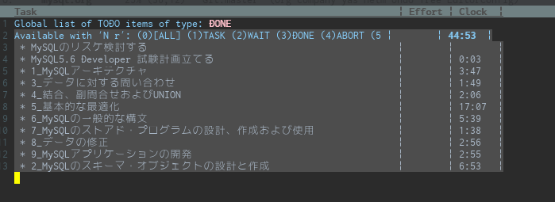

---
title: Oracle認定 MySQL 5.6 Developer 合格体験記
tags:
- MySQL
- 合格体験記
date: 2020-06-06T23:10:49+09:00
URL: https://wand-ta.hatenablog.com/entry/2020/06/06/231049
EditURL: https://blog.hatena.ne.jp/wand_ta/wand-ta.hatenablog.com/atom/entry/26006613579984547
----------------------------------bibliography: https://education.oracle.com/ja/mysql-56-developer/pexam_1Z0-882

# 動機 #

- OSS-DBはgoldまで取ってあるが、業務ではもっぱらMySQLしか使わなそうなので
  - 「PostgreSQLだったらこれがあるのに」的なのをなくしたい。MySQLを深く知ることでMySQLを愛せるようになるという期待
- 新CCNAの公式試験対策本の下巻がコロナ禍の影響でいつまで経っても届かないので、届くまでにちゃちゃっと取るか〜という気持ち

# 勉強期間 #

5/22~6/6の2週間くらい

# 勉強時間 #

45時間くらい

- 「基本的な最適化」でだいぶ時間を溶かしてしまった
  - DBA寄りのところまで踏み込みすぎた感
    - そのうちAdministrator資格も取るので無駄ではない
  - 実行計画改善まわりでサンプルデータの用意に難儀して時間を浪費した。`generate_series`関数が恋しい

# 勉強方法 #

- まともな対策本や教材の類が見つからなかったので、[試験公式](https://education.oracle.com/ja/mysql-56-developer/pexam_1Z0-882)の「試験内容 チェックリスト」と[5.6公式ドキュメント](https://dev.mysql.com/doc/refman/5.6/ja/)を突き合せながら、実際にSQLコマンドを打つ形で勉強した
- PostgreSQLとの対比をしながら学ぶことで、効果的に学習し、理解を深めることができたように思う。似て非なるものの食べ比べ、大事ですね

# 所感 #

> (CCNA本が)届くまでにちゃちゃっと取るか〜という気持ち

普通にクソムズでした。普段MySQLを結構使ってる人も、ちゃんと対策しないと落ちるんじゃないでしょうか

- 「試験内容 チェックリスト」から逸脱した出題は(当然)なかったように思う
- OSS-DBのsilver/goldほどアプリケーションエンジニアとDBAで分かれていないなぁ、という印象
  - まだMySQL 5.7 Administrator受けてないんですけどね
  - けっこうDBA的な知識が問われたように思う
- 「きみ、重箱の隅つつくのうまいねぇ〜」という感じの問題も多め
  - 実際に手を動かしていないとなかなか覚えていないような事柄も訊かれる

# 今後 #

- [MySQL 5.7 Administrator](https://education.oracle.com/ja/mysql-57-database-administrator/pexam_1Z0-888)、[MySQL 8.0 Administrator](https://education.oracle.com/ja/mysql-80-database-administrator/pexam_1Z0-908)も取りたいですね
  - DBA的なこともできるようになりたい
  - バージョン違いの食べ比べ大事
