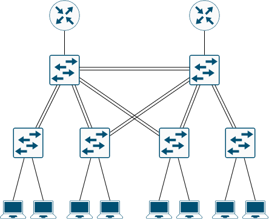
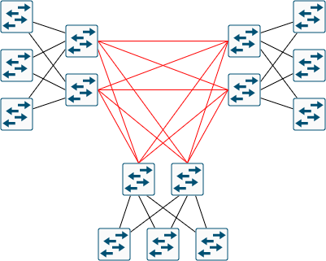
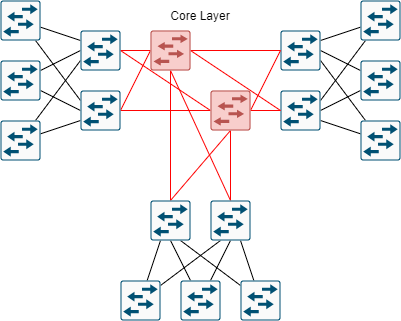

---
title: 'CCNA試験対策 下巻ch13: LAN Architecture'
tags:
- CCNA
- ネットワーク
- 勉強メモ
date: 2020-06-10T00:00:00+09:00
URL: https://wand-ta.hatenablog.com/entry/2020/06/10/000000
EditURL: https://blog.hatena.ne.jp/wand_ta/wand-ta.hatenablog.com/atom/entry/26006613587643664
bibliography: https://www.ciscopress.com/store/ccna-200-301-official-cert-guide-volume-2-9781587147135
-------------------------------------

# Analyzing Campus LAN Topologies #

## Two-Tier Campus Design (Collapsed Core) ##

### The Two-Tier Campus Design ###

- Access Switches
  - PCやサーバといった末端機器が接続されるやつ
- Distribution Switches
  - Access Switches間の通信経路の提供
    - Access Switchesどうしは直接接続していない
  - Access Switchesは冗長性のために2つ以上のDistribution SwitchesへのUplinkを形成するのがふつう
  - Distribution Switchesどうしは直接接続する

### Topology Terminology Seen Within a Two-Tier Design ###

- Two-Tier Designはそれ全体としてHybrid topology
- Access層: Star topology
- Distribution層: Partial Mesh topology

## Three-Tier Campus Design (Core) ##

- 3つの建物それぞれでTwo-Tier Designでネットワーク構築することを考える
- 3つのネットワークをつなぎたい

- Distribution層どうしをフルメッシュで接続すると接続数が甚大になる
  - Distribution層のスイッチ数をNとすると `N(N-1)/2`
- 建物間の接続は高くつきがちなので減らしたい
  - 敷設費用
  - ケーブルそのものの費用
    - ほぼ光ファイバー
  - 光ファイバーならSwitchポート側でそれに対応する必要がある
    - SFP+とか

- Distribution層どうしの接続はCore層を通すことで接続数を減らせる
  - 図の例だと15 -> 12
  

  

- Core層のスイッチは3つの建物のどれかに押し込むことが多い

# Small Office/Home Office #

- AP,Switch,Router,Firewall,Cable Modemもろもろ全部入りの機器を使ったりする

# Power over Ethernet (PoE) #

## PoE Basics ##

- PSE: Power Source Equipment
  - Switchとか
- PD: Powered Device
  - IP電話とかAPとか
- メリット
  - 電源のない場所に機器をおくときに有用
  - ケーブルたくさん要らない
  - DCを供給するので、PD側でAC/DC変換いらない

## PoE Operation ##

- trunkなどよろしくautonegotiationがある

| Name               | Standard | Watts | Powererd Wire Pairs |
|--------------------|----------|-------|---------------------|
| Cisco Inline Power | Cisco    | 7     | 2                   |
| PoE                | 802.3af  | 15    | 2                   |
| PoE+               | 802.3af  | 30    | 2                   |
| UPoE               | 802.3bt  | 60    | 4                   |
| UPoE+              | 802.3bt  | 100   | 4                   |

## PoE and LAN Design ##

- LANを構築する際、PoE込みでプランニングする必要がある
  - PD
    - Power Requirementsを考慮して機器を選定する
  - Power Requirements
    - 各wiring closetで必要な電力は？ (power budget)
  - Switch Ports
    - 全ポートがPoE対応とは限らない
  - Switch Power Supplies
    - PoEを使わなければSwitchに供給する電力はそのSwitch自身が消費する分だけ
    - PoEを使う場合、SwitchはPSEになるので、ぶら下がるPDぶんの電力が余分に必要になる
  - PoE Standards versus Actual
    - PoE+対応だが実際には9Wしか使わない、とかがある

----------------------------------------

# 英語 #

- proximity
  - 近接
- sift
  - ふるいにかける
