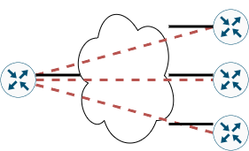
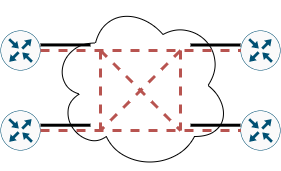
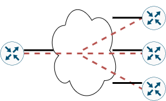

---
title: 'CCNA試験対策 下巻ch14: WAN Architecture (1/2)'
tags:
- CCNA
- ネットワーク
- 勉強メモ
date: 2020-06-11T00:00:00+09:00
URL: https://wand-ta.hatenablog.com/entry/2020/06/11/000000
EditURL: https://blog.hatena.ne.jp/wand_ta/wand-ta.hatenablog.com/atom/entry/26006613587736959
bibliography: https://www.ciscopress.com/store/ccna-200-301-official-cert-guide-volume-2-9781587147135
-------------------------------------

# Metro Ethernet #

- MetroEとも
- 提供するサービス
  - 顧客-ISP間の接続
  - 顧客-顧客間のEthernet Frameの伝送
- 概念的には巨大なL2スイッチ

## Metro Ethernet Physical Design and Topology ##

- PoP: Point of Presence (接続点)
  - 顧客の近くの物理的な接続点
    - IEEE802.3仕様に縛られる
- Access Link
  - 顧客と通信事業者との間の物理的接続
- UNI: User-Network Interface (ユーザ・網インタフェース)
  - 顧客と通信事業者との間を接続するインタフェース仕様
  - ISDNとかFTTHとかそういうの
- SP網内部は見えない
  - 802.1Q trunkingでVLANを切ってるんだろうけれど
- IEEE802.3仕様による伝送上限

| Name         | Speed    | Distance (km) |
|--------------|----------|---------------|
| 100BASE-LX10 | 100 Mbps | 10            |
| 100BASE-LX   | 1 Gbps   | 5             |
| 100BASE-LX10 | 1 Gbps   | 10            |
| 100BASE-ZX   | 1 Gbps   | 100           |
| 10GBASE-LR   | 10 Gbps  | 10            |
| 10GBASE-ER   | 10 Gbps  | 40            |

## Ethernet WAN Services and Topologies ##

### Ethernet Line Service (Point-to-Point) ###

- E-Lineとも
- 専用線のような感じ
- ある顧客の2拠点のルータ間は、1本のクロスオーバーケーブルで接続されているように振る舞う
  - 同一サブネット
  - ルーティングプロトコルのneighborになる
- EVC: Ethernet Virtual Connection
  - E-Lineのtrunk link版みたいなやつ
  - 例えばcentral site - remote site構成
  - central siteから3本のE-Lineに繋ぐとき、WAN edgeのルータに物理Ethernet接続は3つ要らない。1つですむ

### Ethernet LAN service (Full Mesh) ###

- full meshを組みたいときに
- nC2本のE-Lineを契約するのは酷なのでこういうサービスが提供される

### Ethernet Tree Service (Hub and Spoke) ###

- partial meshを組む
  - いろんな呼び方がある
    - hub and spoke
    - point-to-multipoint
- central site - remote sitesデザインで有用

## Layer 3 Design Using Metro Ethernet ##

- 選定するMetroEサービスにより、WAN edgeルータのルーティングテーブルが変わってくる

### Layer 3 Design with E-Line Service ###

- point-to-point
- E-Line1本ごとにサブネットを切る

### Layer 3 Design with E-LAN Service ###

- E-LAN全体で1つのサブネット
