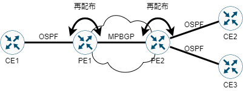

---
title: 'CCNA試験対策 下巻ch14: WAN Architecture 2/2'
tags:
- CCNA
- ネットワーク
- 勉強メモ
date: 2020-06-12T00:00:00+09:00
URL: https://wand-ta.hatenablog.com/entry/2020/06/12/000000
EditURL: https://blog.hatena.ne.jp/wand_ta/wand-ta.hatenablog.com/atom/entry/26006613587766305
bibliography: https://www.ciscopress.com/store/ccna-200-301-official-cert-guide-volume-2-9781587147135
-------------------------------------

# Multiprotocol Label Switch (MPLS) #

- SPからみたとき、全顧客のネットワークを同一のIPアドレス空間で管理するわけにはいかない
  - たとえば `10.0.0.0/8` を全顧客ぶん同じIPアドレス空間で管理したら、ルーティングテーブルが甚大になる
- MPLSを利用することで顧客ごとにルートを別々に分けられる
  - 【所感】IEE802.1Q trunkingのL3版みたいな
- L2.5プロトコルなどと呼ばれる
  - L2ヘッダとL3ヘッダの間にMPLSヘッダを加えるから
- VPN実装のひとつ
  - データを暗号化するタイプのVPNもある
  - MPLSによるVPNは、パケットをラベリングして顧客ごとのパケットを分離する

## MPLS VPN Physical Design and Topology ##

- MPLSはL3の技術なので、SPのネットワークについてrouterのことまで意識する必要が出てくる
  - CE: Customer Edge
  - PE: Provider Edge
- Access Link: CE-PE間のL3接続
  - L2のUNIは何でも良いことになる
    - 専用線
    - Metro-E
    - 4G/5G
    - CATV

## MPLS and Quality of Service ##

- DSCP: Differentiated Services Code Point
  - IPヘッダのToSフィールドに設定するQoS用の値(6bit)
  - VoIPならEF: Expedited Forwardingを設定する
- MPLS VPN上でも使えるよという話

## Layer 3 with MPLS VPN ##

- MetroEはL2なので顧客のroutingのことなどは知ったこっちゃない
- MPLS VPNは真逆 -- CEルータ間のルーティング情報の学習の世話をする

- CE間はneighborではないのでPEがルーティング情報をadvertiseする(CE2-PE2-CE3)
- CE-PE間のBGPとPE-PE間のBGPが異なるのでルートの再配布(redistribution)が行われる(CE1-PE1-PE2-CE2,CE3)
  - MPBGP: Multiprotocol BGP

# Internet VPNs #

- 顧客のネットワーク-ISPのネットワーク間、ならびにISPのネットワークどうしが接続されることでWWWを形成する
- コスト面やどこでも使えることなどから、企業がWANとしてインターネットを使うように

## Internet Access ##

- L2の接続方式

### Digital Subscriber Line ###

- 上り/下り帯域幅がAsymmetricなもの=ADSL
- 敷設済の電話回線で高速なインターネットを提供できるので電話会社は潤った
- 中央局のDSLAM: DSL access multiplexerでデジタル信号とアナログ音声信号とを分離する

### Cable Internet ###

- CATV
- DSLとそっくり

### Wireless WAN (3G, 4G, LTE, 5G) ###

- 携帯電話とかがこれ
- 電波塔からルーターを経てMobile ProviderもしくはISPへ

### Fiber (Ethernet) Internet Access ###

- ここまでに挙げたもの
  - DSL, CATVは銅線
  - WirelessはWireless
- 光ファイバーという選択肢
  - 高価かつ敷設に時間がかかるが高速

## Internet VPN Fundamentals ##

- Private WANのセキュリティ機能
  - Confidentiality (privacy)
    - 盗聴できない
  - Authentication
    - パケットの送信者の正当性
  - Data integrity
    - パケットが改竄されていない
  - Anti-replay
    - 正当なユーザにより送信されたパケットがコピーされ再送されるのを防ぐ
- 同じものを安価なpublicネットワーク上で実現したい -- Internet VPN

### Site-to-Site VPNs with IPsec ###

- 拠点-拠点間を1本のVPNトンネルで結び、拠点内のデバイスで共用する
  - edgeルータで設定を行う
- IPsec
  - ネットワーク層(L3)のセキュリティ**フレームワーク**
  - cf. SSL/TLS
    - OSIでいうL5
    - over TCP前提なのでUDPで使えない
  - 枠組みを規定しているだけで、実際に用いるプロトコルを選定する必要がある
- フレームワークの構成要素
  - ESP: Encapsulated Security Payload
    - 暗号化
    - AES, DESなどを選択
  - AH: Authentication Header
    - 認証
    - SHA, MD5などを選択
  - IKE: Internet Key Exchange
    - 共通鍵(session key)の交換
    - DH3,DH2,DH1などを選択
- GRE: Generic Routing Encapsulation
  - 暗号化をサポートしていないトンネリングプロトコル
- セキュアなSite-to-Site VPNを実現するにあたっては、GRE over IPsecのようなスタックを組む

### Remote Access VPNs with TLS ###

- 拠点-拠点間のVPN接続がないような場合に
  - 例: カフェのWi-Fiで作業
- 選択肢
  - Cisco AnyConnect Secure Mobility Client
    - TLS
    - 企業拠点側への任意のトラフィックをトンネル
  - Webブラウザ
    - HTTPS
    - 単一のWebブラウザセッションをトンネル
