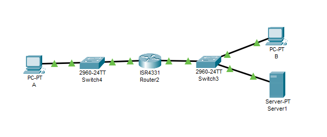
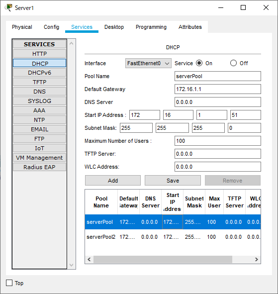

---
title: CCNA試験対策 下巻ch7 Implementing DHCP
tags:
- CCNA
- ネットワーク
- 勉強メモ
date: 2020-06-13T00:00:00+09:00
URL: https://wand-ta.hatenablog.com/entry/2020/06/13/000000
EditURL: https://blog.hatena.ne.jp/wand_ta/wand-ta.hatenablog.com/atom/entry/26006613588207557
bibliography: https://www.ciscopress.com/store/ccna-200-301-official-cert-guide-volume-2-9781587147135
-------------------------------------


# Dynamic Host Configuration Protocol #

## DHCP Concepts ##

- 4種類のメッセージ(DORA)をやりとりする
  - Discover
    - client -> server
    - DHCPサーバを探す
  - Offer
    - server -> client
    - ぼくDHCPサーバです
  - Request
    - client -> server
    - (OfferでリストされているIPv4アドレスの中から)IPv4アドレスをください
  - Acknowledgment
    - server -> client
    - アドレス、マスク、デフォルトルータ、DNSサーバのIPアドレスを教える
- IPアドレス未設定なのにIPパケットでメッセージをやり取りしなければならないという矛盾
- 下記アドレスを利用する:
  - 0.0.0.0
    - IPアドレス未設定の場合のsource IP address
  - 255.255.255.255
    - 今いるデータリンクでのブロードキャスト
      - ルータは越えない


### Supporting DHCP for Remote Subnets with DHCP Relay ###

- DHCPをどこで動かす
  - ルータ
  - サーバに一元化
    - Ciscoのドキュメント的にはこちらがベストプラクティス
- DHCPをサーバで動かす場合、DHCP DiscoverブロードキャストをDHCPサーバまで届けるためにDHCP relayの設定が必要
  - ルータで`from: 0.0.0.0 to: 255.255.255.255`のブロードキャストを `from:ルータ to:DHCPサーバ`ユニキャストに詰め替える
  - interfaceの`ip helper-address`コマンド

### Information Stored at the DHCP Server ###

- Acknowledgmentで返すための情報を設定しておく必要がある
  - Subnet ID and mask
  - Reserved (excluded) addresses
    - DHCPサーバ自身のIPアドレスとか
  - Default router(s)
  - DNS IP address(es)
- DHCPのIP割り当てモードは3種
  - Dynamic
    - いなくなったら回収する
  - Automatic
    - 配ったら回収せず永久にそのまま
  - Static
    - clientのMACアドレスに基づいて静的にIPアドレスを決めておく
- TFTPの設定とかも提供できる


## Configuring DHCP Features on Routers and Switches ##





- DHCPサーバの設定
  - 配布するIPアドレス最小値、デフォルトゲートウェイのアドレス、サブネットマスクの設定必須

### Configuring DHCP Relay ###

```
Router(config)#interface range g0/0/0-1
Router(config-if-range)#no shutdown

Router(config-if-range)#interface g0/0/0
Router(config-if)#ip address 172.16.1.1 255.255.255.0

Router(config-if)#interface g0/0/1
Router(config-if)#ip address 172.16.2.1 255.255.255.0

Router(config-if)#interface g0/0/0
Router(config-if)#ip helper-address 172.16.2.11
Router(config-if)#^Z
```

- DHCP relay設定部分
  - ブロードキャストをDHCPサーバへのユニキャストに詰め替える

```
Router(config-if)#ip helper-address 172.16.2.11
```


### Configuring a Switch as DHCP Client ###

- Switchの管理用IPアドレスの自動設定

```
Switch(config)#interface vlan 1
Switch(config-if)#ip address dhcp
Switch(config-if)#no shutdown

%LINK-5-CHANGED: Interface Vlan1, changed state to up

%LINEPROTO-5-UPDOWN: Line protocol on Interface Vlan1, changed state to up

%SYS-5-CONFIG_I: Configured from console by console

%DHCP-6-ADDRESS_ASSIGN: Interface Vlan1 assigned DHCP address 172.16.1.52, mask 255.255.255.0, hostname Switch4
```

- 172.16.1.52が配られた

```
Switch#show dhcp lease
Temp IP addr: 172.16.1.52 for peer on Interface: Vlan1
Temp sub net mask: 255.255.255.0
   DHCP Lease server: 172.16.2.11 , state: Bound
   DHCP Transaction id: 104DA91E
   Lease: 86400 secs,  Renewal: 43200 secs,  Rebind: 75600 secs
Temp default-gateway addr: 172.16.1.1
   Next timer fires after: 11:55:38
   Retry count: 0  Client-ID:cisco-0004.9AA3.4591-Vlan
   Client-ID hex dump: 636973636F2D303030342E394141332E
                       43539312D566C616E
   Hostname: Switch
```


### Configuring a Router as DHCP Client ###

- WAN edgeルータでISPからパブリックIPアドレスとnext hopを配ってもらうようなケース
- administrative distance 254のstatic defaultルートが設定される


# Identifying Host IPv4 Settings #

## Host Settings for IPv4 ##

## Host IP Settings on Windows ##

```
C:\>ipconfig /all

FastEthernet0 Connection:(default port)

   Connection-specific DNS Suffix..: 
   Physical Address................: 0007.EC70.C285
   Link-local IPv6 Address.........: FE80::207:ECFF:FE70:C285
   IP Address......................: 172.16.1.51
   Subnet Mask.....................: 255.255.255.0
   Default Gateway.................: 172.16.1.1
   DNS Servers.....................: 0.0.0.0
   DHCP Servers....................: 172.16.2.11
   DHCPv6 Client DUID..............: 00-01-00-01-5D-A1-5D-94-00-07-EC-70-C2-85

...
```

- また`netstat -rn`でルート一覧を見ることができる


```
C:\Users\wand>netstat -rn
===========================================================================
インターフェイス一覧
  4...00 15 5d 00 06 4c ......Hyper-V Virtual Ethernet Adapter #2
  8...00 15 5d 00 06 4a ......Hyper-V Virtual Ethernet Adapter #3
 15...4c ed fb 73 94 9b ......Realtek PCIe GbE Family Controller
  1...........................Software Loopback Interface 1
 20...00 15 5d 96 8c 20 ......Hyper-V Virtual Ethernet Adapter
 32...00 15 5d 64 c2 ea ......Hyper-V Virtual Ethernet Adapter #4
===========================================================================

IPv4 ルート テーブル
===========================================================================
アクティブ ルート:
ネットワーク宛先        ネットマスク          ゲートウェイ       インターフェイス  メトリック
          0.0.0.0          0.0.0.0      192.168.3.1      192.168.3.3     25
        10.0.75.0    255.255.255.0            リンク上         10.0.75.1    271
        10.0.75.1  255.255.255.255            リンク上         10.0.75.1    271
      10.0.75.255  255.255.255.255            リンク上         10.0.75.1    271
        127.0.0.0        255.0.0.0            リンク上         127.0.0.1    331
        127.0.0.1  255.255.255.255            リンク上         127.0.0.1    331
  127.255.255.255  255.255.255.255            リンク上         127.0.0.1    331
     172.18.208.0    255.255.240.0            リンク上      172.18.208.1   5256
     172.18.208.1  255.255.255.255            リンク上      172.18.208.1   5256
   172.18.223.255  255.255.255.255            リンク上      172.18.208.1   5256
      172.19.96.0    255.255.240.0            リンク上       172.19.96.1   5256
      172.19.96.1  255.255.255.255            リンク上       172.19.96.1   5256
   172.19.111.255  255.255.255.255            リンク上       172.19.96.1   5256
      192.168.3.0    255.255.255.0            リンク上       192.168.3.3    281
      192.168.3.3  255.255.255.255            リンク上       192.168.3.3    281
    192.168.3.255  255.255.255.255            リンク上       192.168.3.3    281
        224.0.0.0        240.0.0.0            リンク上         127.0.0.1    331
        224.0.0.0        240.0.0.0            リンク上         10.0.75.1    271
        224.0.0.0        240.0.0.0            リンク上       192.168.3.3    281
        224.0.0.0        240.0.0.0            リンク上       172.19.96.1   5256
        224.0.0.0        240.0.0.0            リンク上      172.18.208.1   5256
  255.255.255.255  255.255.255.255            リンク上         127.0.0.1    331
  255.255.255.255  255.255.255.255            リンク上         10.0.75.1    271
  255.255.255.255  255.255.255.255            リンク上       192.168.3.3    281
  255.255.255.255  255.255.255.255            リンク上       172.19.96.1   5256
  255.255.255.255  255.255.255.255            リンク上      172.18.208.1   5256
===========================================================================
固定ルート:
  なし
```


## Host IP Settings on macOS ##

- `ifconfig`
- `netstat -rn`

## Host IP Settings on Linux ##

- `ifconfig`
  - よりモダンな`ip address`コマンドがある
- `netstat -rn`
  - よりモダンな`ip route`コマンドがある
