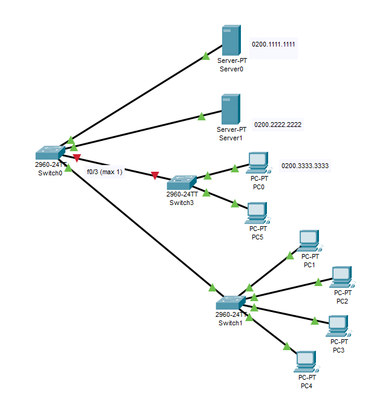

---
title: 'CCNA試験対策 下巻ch6: Implementing Switch Port Security'
tags:
- CCNA
- ネットワーク
- 勉強メモ
date: 2020-06-15T00:00:00+09:00
URL: https://wand-ta.hatenablog.com/entry/2020/06/15/000000
EditURL: https://blog.hatena.ne.jp/wand_ta/wand-ta.hatenablog.com/atom/entry/26006613588268134
bibliography: https://www.ciscopress.com/store/ccna-200-301-official-cert-guide-volume-2-9781587147135
-------------------------------------

# Port Security Concepts and Configuration #

- switchのポートごとに、Ehternetフレームのsource MAC addressに基づいて機器の接続を制限する


## Configuring Port Security ##


### static ###

- 特定のMACアドレスのみ

```
SW1(config)#interface f0/1
SW1(config-if)#switchport mode access
SW1(config-if)#switchport port-security
SW1(config-if)#switchport port-security mac-address 0200.1111.1111
SW1(config-if)#description static
```


### sticky ###

- staticでは大量の機器を登録するのが大変なときに使う

```
SW1(config-if)#interface f0/2
SW1(config-if)#switchport mode access
SW1(config-if)#switchport port-security
SW1(config-if)#switchport port-security mac-address sticky
SW1(config-if)#description sticky
```

- `switchport port-security mac-address sticky`設定直後


```
SW1#show running-config 
...
interface FastEthernet0/2
 description sticky
 switchport mode access
 switchport port-security
 switchport port-security mac-address sticky 
!
...
```

- `0200.2222.2222`からSW1のf0/2へトラフィックを流すと:


```diff
  SW1#show running-config 
  ...
  interface FastEthernet0/2
   description sticky
   switchport mode access
   switchport port-security
   switchport port-security mac-address sticky 
+  switchport port-security mac-address sticky 0200.2222.2222
  !
  ...
```

- startup-configには反映されないので適宜`copy running-config startup-config`する必要がある

### dynamic ###

```
SW1(config-if)#interface f0/3
SW1(config-if)#switchport mode access
SW1(config-if)#switchport port-security
SW1(config-if)#description dynamic

SW1(config-if)#interface f0/4
SW1(config-if)#switchport mode trunk
SW1(config-if)#switchport port-security
SW1(config-if)#switchport port-security maximum 8
SW1(config-if)#description maximum 8
```

- 最大接続可能台数で縛る
  - デフォルト1
  - 接続可能な機器は動的にきまる
- VoIPの場合は2を設定する
  - 電話で1 (voice)、その先のPCで1 (access)
- EtherChannelの場合は、物理interfaceではなくport channelに対してmaximumを設定する
  

## Verifying Port Security ##

```
SW1#show port-security interface f0/1
Port Security              : Enabled
Port Status                : Secure-up
Violation Mode             : Shutdown
Aging Time                 : 0 mins
Aging Type                 : Absolute
SecureStatic Address Aging : Disabled
Maximum MAC Addresses      : 1
Total MAC Addresses        : 1
Configured MAC Addresses   : 1
Sticky MAC Addresses       : 0
Last Source Address:Vlan   : 0200.1111.1111:1
Security Violation Count   : 0
```

- stickyの場合、stickyで設定されたMACアドレス数が集計される

```
SW1#show port-security interface f0/2
Port Security              : Enabled
Port Status                : Secure-up
Violation Mode             : Shutdown
Aging Time                 : 0 mins
Aging Type                 : Absolute
SecureStatic Address Aging : Disabled
Maximum MAC Addresses      : 1
Total MAC Addresses        : 1
Configured MAC Addresses   : 0
Sticky MAC Addresses       : 1
Last Source Address:Vlan   : 0200.2222.2222:1
Security Violation Count   : 0
```

- dynamicの場合

```
SW1#show port-security interface f0/4
Port Security              : Enabled
Port Status                : Secure-up
Violation Mode             : Shutdown
Aging Time                 : 0 mins
Aging Type                 : Absolute
SecureStatic Address Aging : Disabled
Maximum MAC Addresses      : 8
Total MAC Addresses        : 5
Configured MAC Addresses   : 0
Sticky MAC Addresses       : 0
Last Source Address:Vlan   : 00E0.B05A.6D01:1
Security Violation Count   : 0
```

> Total MAC Addresses        : 5

- 【疑問点】PCは4台しか繋いでいないのだが…
  - CDPか何かでのトラフィックでswitchのぶんも数えられている？詳細不明


## Port Security MAC Addresses ##

- port securityを設定しておらず、動的にMACアドレスを学習する場合のMACアドレステーブル:

```
Switch#show mac address-table 
          Mac Address Table
-------------------------------------------

Vlan    Mac Address       Type        Ports
----    -----------       --------    -----

   1    0030.a3a5.4904    DYNAMIC     Fa0/1
```

- TypeはDYNAMICとなる
- 対して、port securityを設定した場合:

```
SW1#show mac address-table 
          Mac Address Table
-------------------------------------------

Vlan    Mac Address       Type        Ports
----    -----------       --------    -----

   1    0001.438c.c589    STATIC      Fa0/4
   1    0002.1730.086b    STATIC      Fa0/4
   1    0003.e45c.894a    STATIC      Fa0/4
   1    0030.a3a0.a16b    STATIC      Fa0/4
   1    00e0.b05a.6d01    STATIC      Fa0/4
   1    0200.1111.1111    STATIC      Fa0/1
   1    0200.2222.2222    STATIC      Fa0/2
   1    0200.3333.3333    STATIC      Fa0/3
```

```
SW1#show mac address-table dynamic 
          Mac Address Table
-------------------------------------------

Vlan    Mac Address       Type        Ports
----    -----------       --------    -----

```

- MACアドレステーブルは全部STATICになる
  - たとえstickyやdynamicを設定したとしても

# Port Security Violation Modes #

- port securityのルールが破られたときにどうするか設定できる

|                          | Protect | Restrict | Shutdown(デフォルト) |
|--------------------------|---------|----------|----------------------|
| トラフィックを破棄       | o       | o        | o                    |
| ログとSNMPメッセージ送出 | x       | o        | o                    |
| 当該interfaceをshutdown  | x       | x        | o                    |


## Port Security Shutdown Mode ##

- f0/3 (dynamic, maximum 1) のところに2台繋いでみる





```
%LINK-5-CHANGED: Interface FastEthernet0/3, changed state to administratively down

%LINEPROTO-5-UPDOWN: Line protocol on Interface FastEthernet0/3, changed state to down
```

- f0/3がdown downになる

```
SW1#show ip interface brief 
Interface              IP-Address      OK? Method Status                Protocol 
FastEthernet0/1        unassigned      YES manual up                    up 
FastEthernet0/2        unassigned      YES manual up                    up 
FastEthernet0/3        unassigned      YES manual down                  down 
FastEthernet0/4        unassigned      YES manual up                    up 
FastEthernet0/5        unassigned      YES manual down                  down 
...
```

- ステータスは`err-disabled`

```
SW1#show interfaces f0/3 status
Port      Name               Status       Vlan       Duplex  Speed Type
Fa0/3                        err-disabled 1          auto    auto  10/100BaseTX
```

- port-securityルール違反の統計情報も見られる

```
SW1#show port-security 
Secure Port MaxSecureAddr CurrentAddr SecurityViolation Security Action
               (Count)       (Count)        (Count)
--------------------------------------------------------------------
        Fa0/1        1          1                 0         Shutdown
        Fa0/2        1          1                 0         Shutdown
        Fa0/3        1          0                 1         Shutdown
        Fa0/4        8          1                 0         Shutdown
----------------------------------------------------------------------
```

```
SW1#show port-security interface f0/3
Port Security              : Enabled
Port Status                : Secure-shutdown
Violation Mode             : Shutdown
Aging Time                 : 0 mins
Aging Type                 : Absolute
SecureStatic Address Aging : Disabled
Maximum MAC Addresses      : 1
Total MAC Addresses        : 0
Configured MAC Addresses   : 0
Sticky MAC Addresses       : 0
Last Source Address:Vlan   : 000A.418E.D86B:1
Security Violation Count   : 1
```

- err-disabled状態から復旧するには当該interfaceで `shutdown`/`no shutdown`


## Port Security Protect and Restrict Modes ##

```
SW1(config)#int f0/1
SW1(config-if)#
SW1(config-if)#switchport port-security violation protect
```

- f0/1に、許可されているMACアドレス以外の機器を繋いでみる


- protectモードを設定したので、port-securityルール違反のトラフィックは破棄しつつ、interfaceはup-upのままとなる
- PC5 (172.16.1.51)からPC0(172.16.1.3)へpingを試みる


```
Pinging 172.16.1.3 with 32 bytes of data:

Request timed out.
Request timed out.
Request timed out.
Request timed out.

Ping statistics for 172.16.1.3:
    Packets: Sent = 4, Received = 0, Lost = 4 (100% loss),
```

- Switch0 f0/0でブロックされるので到達しない
- Server0 (172.16.1.1)からPC0(172.16.1.3)にpingは通る

```
C:\>ping 172.16.1.3

Pinging 172.16.1.3 with 32 bytes of data:

Reply from 172.16.1.3: bytes=32 time=1ms TTL=128
Reply from 172.16.1.3: bytes=32 time<1ms TTL=128
Reply from 172.16.1.3: bytes=32 time<1ms TTL=128
Reply from 172.16.1.3: bytes=32 time<1ms TTL=128

Ping statistics for 172.16.1.3:
    Packets: Sent = 4, Received = 4, Lost = 0 (0% loss),
Approximate round trip times in milli-seconds:
    Minimum = 0ms, Maximum = 1ms, Average = 0ms
```


- Switch0を経由しないPC5 -> Server0は通る

```
C:\>ping 172.16.1.1

Pinging 172.16.1.1 with 32 bytes of data:

Reply from 172.16.1.1: bytes=32 time<1ms TTL=128
Reply from 172.16.1.1: bytes=32 time<1ms TTL=128
Reply from 172.16.1.1: bytes=32 time=3ms TTL=128
Reply from 172.16.1.1: bytes=32 time<1ms TTL=128

Ping statistics for 172.16.1.1:
    Packets: Sent = 4, Received = 4, Lost = 0 (0% loss),
Approximate round trip times in milli-seconds:
    Minimum = 0ms, Maximum = 3ms, Average = 0ms
```

