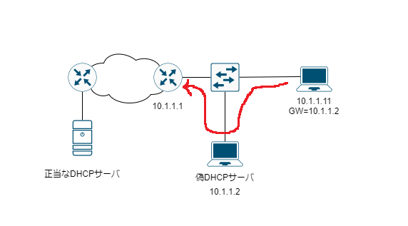
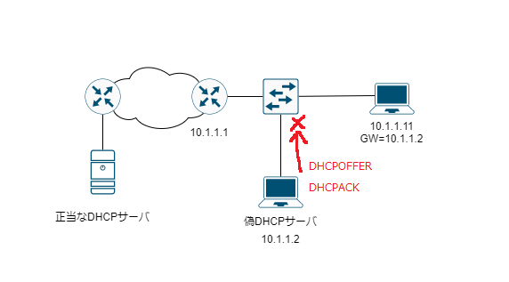
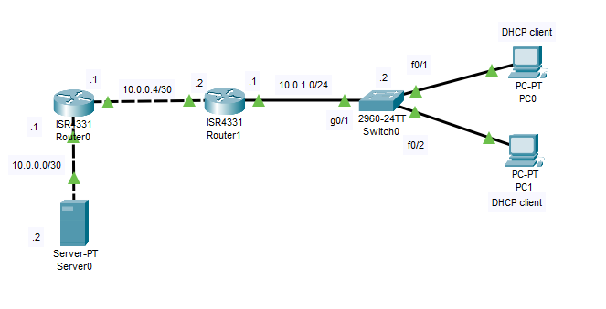
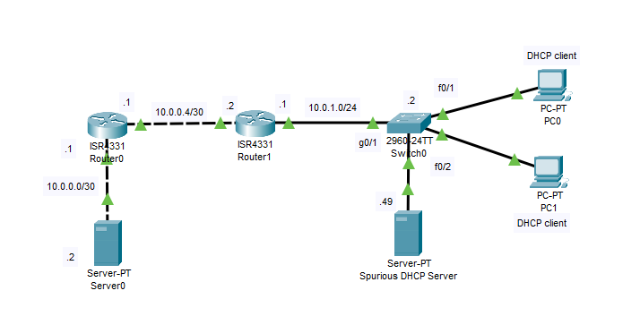

---
title: 'CCNA試験対策 下巻ch8: DHCP Snooping and ARP Inspection (1/2)'
tags:
- CCNA
- ネットワーク
- 勉強メモ
date: 2020-06-16T00:00:00+09:00
URL: https://wand-ta.hatenablog.com/entry/2020/06/16/000000
EditURL: https://blog.hatena.ne.jp/wand_ta/wand-ta.hatenablog.com/atom/entry/26006613588727980
bibliography: https://www.ciscopress.com/store/ccna-200-301-official-cert-guide-volume-2-9781587147135
-------------------------------------


# DHCP Snooping #

## DHCP Snooping Concepts ##

- L2ポート上で動作するACLやFirewallのような機能
  - DHCP自体はL3で動作することに注意
- DHCP Snoopingではポートを2つに分類する
  - trusted
    - switch,router,DHCPサーバなどが繋がっているポート
  - untrusted
    - PC、APなどが繋がっているポート
- DHCP Snooping概略
  - untrustedポートに、通常DHCPサーバから送られるメッセージが入ってきたら破棄する
    - DHCPOFFER, DHCPACKなど
  - untrustedポートに、通常DHCPクライアントから送られるメッセージが入ってきたら、攻撃の疑いのある場合破棄する
    - DHCPDISCOVERなど
  - trustedポートは素通り


### A Sample Attack: A Spurious DHCP Server ###



- 正当なDHCPサーバのDHCPOFFER/ACKよりも先に偽DHCPOFFER/ACKが受信されてしまう
- 利用可能なIPアドレス・デフォルトゲートウェイが配られるのでクライアントは攻撃に気づかない
- デフォルトゲートウェイに攻撃者のサーバが設定され、パケットを盗聴・改ざんされてしまう(中間者攻撃)


### DHCP Snooping Logic ###



- untrustedポートに入ってくるフレームを検査する
  - 通常サーバーから送られるメッセージ: 破棄
    - OFFER, ACK
  - 通常クライアントから送られるメッセージ:
    - DISDOVER,REQUESTはMACアドレスをチェックする
    - RELEASE,DECLINEはinterface,IPアドレスとDHCP Snooping binding tableとを突き合わせる
      - 悪いclientによって勝手にIPアドレスが返却されないよう
      - DHCP Snooping binding tableはleaseのたびに更新


### Filtering DISCOVER Messages Based on MAC Address ###

- 攻撃
  - IPアドレスプール枯渇攻撃
    - 悪いclientがCHADDR(client hardware address)フィールドを詐称して大量のREQUESTを送りつけ、IPアドレスをすべてleaseしてしまう
- 対策
  - - DISDOVER,REQUESTについてはIEEE802.3 Frameのsource MACフィールドと照合して、攻撃の疑いのあるフレームを破棄する

### Filtering Messages that Release IP Addresses ###

- 攻撃
  - RELEASEメッセージのADDRフィールドに他人のIPアドレスを設定して、勝手にIPアドレスを解放させることができる
  - 解放させたIPアドレスを横取りできる
- 対策
  - RELEASE,DECLINEについてはDHCP Snooping binding tableとの照合を行う
  - DHCP Snooping binding table
    - どのMAC,VLAN,interfaceのデバイスにどのIPアドレスをリースしました、というテーブル
    - 異なるinterfaceからのRELEASE等については破棄する


## DHCP Snooping Configuration ##

### Configuring DHCP Snooping on a Layer 2 Switch ###




- 設定

```
Switch(config)#ip dhcp snooping vlan 1
Switch(config)#no ip dhcp snooping information option
Switch(config)#interface g0/1
Switch(config-if)#ip dhcp snooping trust
```

- DHCP Snoopingの状態確認

```
Switch#show ip dhcp snooping
Switch DHCP snooping is enabled
DHCP snooping is configured on following VLANs:
1
Insertion of option 82 is disabled
Option 82 on untrusted port is not allowed
Verification of hwaddr field is enabled
Interface                  Trusted    Rate limit (pps)
-----------------------    -------    ----------------
GigabitEthernet0/1         yes        unlimited       
FastEthernet0/1            no         unlimited       
FastEthernet0/2            no         unlimited       
```

- `Option 82 on untrusted port is not allowed`
  - `no ip dhcp snooping information option` が反映されている
- 何これ
  - DHCP relay agentがbroadcastをunicastに詰め替えるときに付与されるフィールド
    - RFC3046
  - L3SWのときに有効にすべき設定
  - 今回はL2SWなので切る
- DHCP Spoofingして動作検証してみる



- DHCP Snoopingを設定していないとき

from PC0

```
C:\>ipconfig /renew

   IP Address......................: 10.0.1.53
   Subnet Mask.....................: 255.255.255.0
   Default Gateway.................: 10.0.1.49
   DNS Server......................: 255.255.255.252
```

- デフォルトゲートウェイに攻撃者のIPアドレス`10.0.1.49`が設定されてしまった
  - MITM攻撃の餌食
- DHCP Snoopingを設定しているとき


```
C:\>ipconfig /renew

   IP Address......................: 10.0.1.53
   Subnet Mask.....................: 255.255.255.0
   Default Gateway.................: 10.0.1.1
   DNS Server......................: 255.255.255.252

```

- デフォルトゲートウェイに正当なDHCPサーバによる設定`10.0.1.1`が設定された。OK


### Limiting DHCP Message Rates ###

- DHCP snoopingは汎用CPUを食うのでそれ自体が攻撃対象になりうる
  - 大量のDHCPメッセージを送りつけるDoS攻撃など
- この対策として、DHCPのレートリミット機能がある
  - switch-port securityよろしく、portをerr-disabledにする


```
Switch(config-if)#ip dhcp snooping limit rate 10
Switch(config-if)#int f0/1
Switch(config-if)#ip dhcp snooping limit rate 2
Switch(config-if)#int f0/2
Switch(config-if)#ip dhcp snooping limit rate 2
```

```
Switch#show ip dhcp snooping
Switch DHCP snooping is enabled
DHCP snooping is configured on following VLANs:
1
Insertion of option 82 is disabled
Option 82 on untrusted port is not allowed
Verification of hwaddr field is enabled
Interface                  Trusted    Rate limit (pps)
-----------------------    -------    ----------------
FastEthernet0/2            no         2               
FastEthernet0/1            no         2               
GigabitEthernet0/1         yes        10              
```

- `errdisable recovery` global configコマンドで自動復旧も設定できるらしいがPacket Tracerでは動作しなかった


-------------------------------------------------------------------------------

# 英語 #

- backdrop
  - 背景
- spurious
  - 偽の
    - legitimate(正当な)の対義のように用いられている
