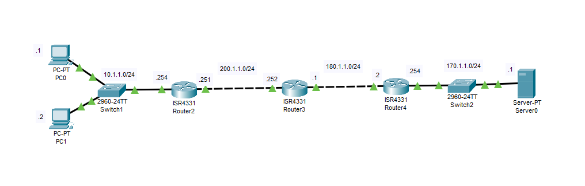
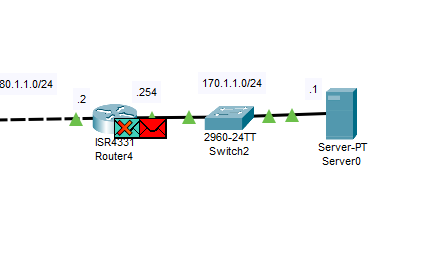
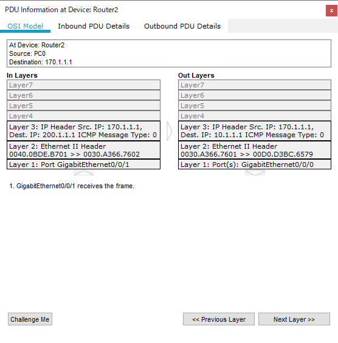

---
title: 'CCNA試験対策 下巻ch10: Network Address Translation'
tags:
- CCNA
- ネットワーク
- 勉強メモ
date: 2020-06-19T00:00:00+09:00
URL: https://wand-ta.hatenablog.com/entry/2020/06/19/000000
EditURL: https://blog.hatena.ne.jp/wand_ta/wand-ta.hatenablog.com/atom/entry/26006613591255331
bibliography: https://www.ciscopress.com/store/ccna-200-301-official-cert-guide-volume-2-9781587147135
-------------------------------------


# Perspectives on IPv4 Address Scalability #

- IPv4アドレス空間枯渇の話
  - long-term solution: IPv6
  - short-term solution:
    - NAT & private addressing
      - LAN内でユニークなIPアドレスの定義
    - CIDR
      - 捨てる部分を少なく


## CIDR ##

- RFC4632
- 知ってるので略

## Private Addressing ##

- RFC1918
- 知ってるので略


# Network Address Translation Concepts #

- RFC3022
- private networkのprivate IPv4 addressはインターネットでは通用しない
- ので、インターネットにパケットを送出する際に、source IPv4 addressをISPから買ったpublic registered IPv4 addressに変換する必要がある
- 逆に、インターネットから入ってくるパケットのdestination IPv4 addressをprivate networkのprivate IPv4 addressに変換する必要もある
- private network -> public networkにおいて…
  - Inside Local: 変換前のsource address
  - Inside Global: 変換後のsource address
  - Outside Local: 変換前のdestination address
  - Outside Global: 変換後のdestination address


## Static NAT ##

- NAT Tableを静的に設定するやつ
  - localとglobalのIPアドレスは1対1

## Dynamic NAT ##

- NAT Tableが動的に設定されるやつ
  - localとglobalのIPアドレスの1対1関係自体は変わらない
  - 利用可能なinside global addressのPoolを設定しておく


## Overloading NAT with Port Address Translation ##

- localとglobalのIPアドレスがN対M(N>M)になるやつ
  - portも併用する
- 【補】NAPTとかIPマスカレードとも呼ばれるやつ


# NAT Configuration and Troubleshooting #

## Static NAT Configuration ##




- `10.1.1.1`から`170.1.1.1`へpingする場合
- NATを設定しない場合、`170.1.1.1`のデフォルトゲートウェイ`170.1.1.254`で応答パケットが破棄される
  - `10.*.*.*` (class A private address)へのroutingがないので



- NATを設定する
- まず、どのinterfaceがinside、どのinterfaceがoutsideかを設定
  - Static,Dynamic,PAT 共通

```
NAT(config)#interface g0/0/0
NAT(config-if)#ip nat inside
NAT(config-if)#
NAT(config-if)#interface g0/0/1
NAT(config-if)#ip nat outside
NAT(config-if)#exit
```

- NATを静的に設定

```
NAT(config)#ip nat inside source static 10.1.1.2 200.1.1.2
NAT(config)#ip nat inside source static 10.1.1.1 200.1.1.1
```

- NATテーブル確認
  - staticなので設定時点でNATテーブルにエントリが追加されている

```
NAT#show ip nat translations
Pro  Inside global     Inside local       Outside local      Outside global
---  200.1.1.1         10.1.1.1           ---                ---
---  200.1.1.2         10.1.1.2           ---                ---
```

- アドレス変換の統計情報

```
NAT#show ip nat statistics
Total translations: 2 (2 static, 0 dynamic, 0 extended)
Outside Interfaces: GigabitEthernet0/0/1
Inside Interfaces: GigabitEthernet0/0/0
Hits: 0  Misses: 0
Expired translations: 0
Dynamic mappings:
```

- pingしてみる

```
C:\>ping 170.1.1.1

Pinging 170.1.1.1 with 32 bytes of data:

Request timed out.
Reply from 170.1.1.1: bytes=32 time=12ms TTL=125
Reply from 170.1.1.1: bytes=32 time<1ms TTL=125
Reply from 170.1.1.1: bytes=32 time<1ms TTL=125

Ping statistics for 170.1.1.1:
    Packets: Sent = 4, Received = 3, Lost = 1 (25% loss),
Approximate round trip times in milli-seconds:
    Minimum = 0ms, Maximum = 12ms, Average = 4ms
```

- 統計情報に反映された

```
NAT#show ip nat statistics
Total translations: 10 (2 static, 8 dynamic, 8 extended)
Outside Interfaces: GigabitEthernet0/0/1
Inside Interfaces: GigabitEthernet0/0/0
Hits: 7  Misses: 8
Expired translations: 0
Dynamic mappings:
```

- パケットのIPv4アドレスが書き換わっていることも確認できる
- pingのsource


- pongのdestination




## Dynamic NAT Configuration ##

- NATを行うrouterでinside/outsideを設定するのは同じ
- insideはACLでマッチして、outsideは利用可能なpublic registered ip addressesのpoolを定義しておく


```
NAT(config)#ip nat pool hoge 200.1.1.1 200.1.1.2 netmask 255.255.255.252
NAT(config)#ip nat inside source list 1 pool hoge
NAT(config)#
NAT(config)#access-list 1 permit 10.1.1.2
NAT(config)#access-list 1 permit 10.1.1.1
```

- ping from 10.1.1.1

```
C:\>ping 170.1.1.1

Pinging 170.1.1.1 with 32 bytes of data:

Reply from 170.1.1.1: bytes=32 time=1ms TTL=125
Reply from 170.1.1.1: bytes=32 time<1ms TTL=125
Reply from 170.1.1.1: bytes=32 time<1ms TTL=125
Reply from 170.1.1.1: bytes=32 time<1ms TTL=125

Ping statistics for 170.1.1.1:
    Packets: Sent = 4, Received = 4, Lost = 0 (0% loss),
Approximate round trip times in milli-seconds:
    Minimum = 0ms, Maximum = 1ms, Average = 0ms
```

## Dynamic NAT Verification ##


- `10.1.1.1 <-> 200.1.1.1`の変換だけがNATテーブルに追加される


```
NAT#show ip nat translations 
Pro  Inside global     Inside local       Outside local      Outside global
icmp 200.1.1.1:18      10.1.1.1:18        170.1.1.1:18       170.1.1.1:18
icmp 200.1.1.1:19      10.1.1.1:19        170.1.1.1:19       170.1.1.1:19
icmp 200.1.1.1:20      10.1.1.1:20        170.1.1.1:20       170.1.1.1:20
icmp 200.1.1.1:21      10.1.1.1:21        170.1.1.1:21       170.1.1.1:21
```

- 統計情報には `Dynamic mappings:`に情報が追加される

```
NAT#show ip nat statistics
Total translations: 0 (0 static, 0 dynamic, 0 extended)
Outside Interfaces: GigabitEthernet0/0/1
Inside Interfaces: GigabitEthernet0/0/0
Hits: 11  Misses: 12
Expired translations: 12
Dynamic mappings:
-- Inside Source
access-list 1 pool hoge refCount 0
 pool hoge: netmask 255.255.255.252
       start 200.1.1.1 end 200.1.1.2
       type generic, total addresses 2 , allocated 0 (0%), misses 0
```

- NATテーブルの動的に追加されたエントリは `clear ip nat translation`コマンドで削除できる

```
NAT#clear ip nat translation *
NAT#show ip nat translations 
(空)
```


## NAT Overload (PAT) Configuration ##

- `overload`をつけるだけ
- poolのエントリが1件しかないケースを考える


```
NAT(config)#ip nat pool hoge 200.1.1.1 200.1.1.1 netmask 255.255.255.252
NAT(config)#ip nat inside source list 1 pool hoge overload 
```


- `10.1.1.1`, `10.1.1.2` からpingした直後

```
NAT#show ip nat translations 
Pro  Inside global     Inside local       Outside local      Outside global
icmp 200.1.1.1:10      10.1.1.2:10        170.1.1.1:10       170.1.1.1:10
icmp 200.1.1.1:11      10.1.1.2:11        170.1.1.1:11       170.1.1.1:11
icmp 200.1.1.1:12      10.1.1.2:12        170.1.1.1:12       170.1.1.1:12
icmp 200.1.1.1:30      10.1.1.1:30        170.1.1.1:30       170.1.1.1:30
icmp 200.1.1.1:31      10.1.1.1:31        170.1.1.1:31       170.1.1.1:31
icmp 200.1.1.1:32      10.1.1.1:32        170.1.1.1:32       170.1.1.1:32
icmp 200.1.1.1:33      10.1.1.1:33        170.1.1.1:33       170.1.1.1:33
icmp 200.1.1.1:9       10.1.1.2:9         170.1.1.1:9        170.1.1.1:9
```

- 両IPアドレスが`200.1.1.1`に変換されていることがわかる
- PATではport番号でmultiplexできるので、pool自体不要で、NAT routerのoutside側interfaceのIPアドレスを利用することもできる


```
ip nat inside source list 1 interface g0/0/1 overload
```

- NAT routerのoutside側、つまり`200.1.1.251`との変換が行われる

```
NAT#show ip nat translations 
Pro  Inside global     Inside local       Outside local      Outside global
icmp 200.1.1.251:13    10.1.1.2:13        170.1.1.1:13       170.1.1.1:13
icmp 200.1.1.251:14    10.1.1.2:14        170.1.1.1:14       170.1.1.1:14
icmp 200.1.1.251:15    10.1.1.2:15        170.1.1.1:15       170.1.1.1:15
icmp 200.1.1.251:16    10.1.1.2:16        170.1.1.1:16       170.1.1.1:16
icmp 200.1.1.251:34    10.1.1.1:34        170.1.1.1:34       170.1.1.1:34
icmp 200.1.1.251:35    10.1.1.1:35        170.1.1.1:35       170.1.1.1:35
icmp 200.1.1.251:36    10.1.1.1:36        170.1.1.1:36       170.1.1.1:36
icmp 200.1.1.251:37    10.1.1.1:37        170.1.1.1:37       170.1.1.1:37
```

- poolは使わなくなったのでDynamic mappings:の項は無くなった

```
NAT#show ip nat statistics
Total translations: 8 (0 static, 8 dynamic, 8 extended)
Outside Interfaces: GigabitEthernet0/0/1
Inside Interfaces: GigabitEthernet0/0/0
Hits: 49  Misses: 52
Expired translations: 32
Dynamic mappings:
```

