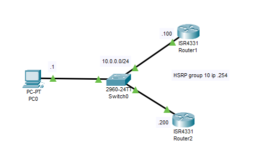
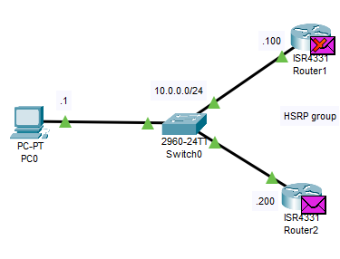

---
title: 'CCNA試験対策 下巻ch12: Miscellaneous IP Services'
date: 2020-06-25T00:00:00+09:00
URL: https://wand-ta.hatenablog.com/entry/2020/06/25/000000
EditURL: https://blog.hatena.ne.jp/wand_ta/wand-ta.hatenablog.com/atom/entry/26006613593570775
bibliography: https://www.ciscopress.com/store/ccna-200-301-official-cert-guide-volume-2-9781587147135
-------------------------------------

# First Hop Redundancy Protocol #

- FHRP: First Hop Redundancy Protocol
  - デフォルトゲートウェイの冗長化に用いるプロトコル群の総称
- cf. L2冗長化時にブロードキャストストームを回避するためのプロトコルはSTP

## The Need for Redundancy in Networks ##

## The Need for a First Hop Redundancy Protocol ##

- デフォルトゲートウェイが物理的にSPOFになるのを避ける
- ホストのデフォルトゲートウェイは1つしか設定できないので、ルータ側で冗長化する必要がある
- FHRPのやること
  - 複数の物理router間で仮想IPアドレスを共有する
    - ホストはこの仮想IPアドレスをデフォルトゲートウェイに設定する
  - 複数の物理router間でactive/standbyやロードバランシングの合意をとる
  - フェイルオーバー

## The Three Solutions for First-Hop Redundancy ##

|                       | HSRP                                                            | VRRP                                                           | GLBP                                                                            |
|-----------------------|-----------------------------------------------------------------|----------------------------------------------------------------|---------------------------------------------------------------------------------|
| Full Name             | Hot Standby Router Protocol                                     | Virtual Router Redundancy Protocol                             | Gateway Load Balancing Protocol                                                 |
| Origin                | Cisco                                                           | RFC 6798                                                       | Cisco                                                                           |
| Redundancy Approach   | active/standby                                                  | active/standby                                                 | active/active                                                                   |
| Load Balancing per... | subnet                                                          | subnet                                                         | host                                                                            |
| 仮想MACアドレス       | `0000.0c07.acxx` <br>`xx`はHSRPのグループ番号を16進数にしたもの | `0000.5e00.01xx`<br>`xx`はVRRPのグループ番号を16進数にしたもの | `0007.b400.xxyy`<br>`xx`はGLBPグループ番号<br>`yy`はその中でのシーケンス(01-04) |

- `00000c`はCiscoのOUI
- `00005e`はICANNのOUI
- `0007b4`はCiscoのOUI

## HSRP Concepts ##




```
R2(config)#interface g0/0/0
R2(config-if)#
R2(config-if)#ip address 10.0.0.200 255.255.255.0
R2(config-if)#
R2(config-if)#standby 10 ip 10.0.0.254
R2(config-if)#
R2(config-if)#no shutdown
```

- PCから確認
  - 仮想IPv4アドレス`10.0.0.254`にpingが通っている
  - 仮想MACアドレス`0000.0c07.ac0a`が振られている
    - HSRPグループ番号`10` -> `0x0a`

```
C:\>ping 10.0.0.254

Pinging 10.0.0.254 with 32 bytes of data:

Reply from 10.0.0.254: bytes=32 time=1ms TTL=255
Reply from 10.0.0.254: bytes=32 time<1ms TTL=255
Reply from 10.0.0.254: bytes=32 time<1ms TTL=255
Reply from 10.0.0.254: bytes=32 time<1ms TTL=255

Ping statistics for 10.0.0.254:
    Packets: Sent = 4, Received = 4, Lost = 0 (0% loss),
Approximate round trip times in milli-seconds:
    Minimum = 0ms, Maximum = 1ms, Average = 0ms

C:\>arp -a
  Internet Address      Physical Address      Type
  10.0.0.254            0000.0c07.ac0a        dynamic
```

- echoは両routerに届くが、echo-replyはactive routerからのみ帰る (今回はR2)



- active/standby
  - priority値でどのrouterがactiveになるか決まる
    - tie-breakerは物理IPアドレス
    - 最も大きいものがactiveになる
  - 後からpriority値の高いrouterを追加しても、OSPFのDR/BDRよろしくpreemptionはおきない
  - インタフェースコンフィグで`standby <group-number> preempt`を設定することでpreemptionを有効化できる


### HSRP Failover ###

- MACアドレスを仮想化するのでホストのARPテーブルに変更は生じない

### HSRP Load Balancing ###

- HSRPではVLANごとにHSRPグループを作成し、仮想IPアドレスを割り当てる
  - 各HSRPグループでpriority値を調整し、「VLAN1ではR1をactive」「VLAN2ではR2をactive」という形で負荷分散を実現できる
- cf. GLBPは1つの仮想IPアドレスに対して複数の仮想MACアドレスをARP応答し、負荷分散を実現する


# Simple Network Management Protocol #

- interface, IPアドレス、バッファといった変数を標準化したデータベースを作ることで、監視や管理を簡単にするという思想のもと生まれた
- 機器上でagentを動かし、managerから操作を行う
- MIB: Management Information Base
  - 「変数のデータベース」
  - ツリー構造
- NMS: Network Management Station
  - managerが動作するPCやサーバ

## SNMP Variable Reading and Writing: SNMP Get and Set ##

## SNMP Notifications: Traps and Informs ##

## The Management Information Base ##

- MIB上の変数はOID: Object IDとして定義される
  - RFC標準
  - ベンダープロプライエタリ

## Securing SNMP ##

- SNMPv3でようやく本格的なセキュリティが搭載された
  - Message integrity
  - Authentication
  - Encryption


# FTP and TFTP #

## Managing Cisco IOS Images with FTP/TFTP ##

### The IOS File System ###

```
Router#show file systems
File Systems:

       Size(b)       Free(b)      Type  Flags  Prefixes
*   3249049600    2761893909     flash     rw  flash:
         29688         23590     nvram     rw  nvram:
```

- NVRAM: startup configが格納されている
- FLASH: IOSなどが格納される

```
Router#show flash:

System flash directory:
File  Length   Name/status
  3   486899872isr4300-universalk9.16.06.04.SPA.bin
  2   28282    sigdef-category.xml
  1   227537   sigdef-default.xml
[487155691 bytes used, 2761893909 available, 3249049600 total]
3.17338e+06K bytes of processor board System flash (Read/Write)
```

### Upgrading IOS Images ###

### Copying a New IOS Image to a Local IOS File System Using TFTP ###


- TFTPサーバからコピーする

```
Router#copy tftp flash
Address or name of remote host []? 10.0.0.1
Source filename []? c2960-lanbasek9-mz.150-2.SE4.bin
Destination filename [c2960-lanbasek9-mz.150-2.SE4.bin]? 

Accessing tftp://10.0.0.1/c2960-lanbasek9-mz.150-2.SE4.bin...
Loading c2960-lanbasek9-mz.150-2.SE4.bin from 10.0.0.1: !!!!!!!!!!!!!!!!!!!!!!!!!!!!!!!!!!!!!!!!!!!!!!!!!!!!!!!!!!!!!!!!!!!!!!!!!!!!!!!!!!!!!!!!!!!!
[OK - 4670455 bytes]

4670455 bytes copied in 0.058 secs (6473925 bytes/sec)
```

- コピーしたファイルを確認

```
Router#show flash:

System flash directory:
File  Length   Name/status
  4   4670455  c2960-lanbasek9-mz.150-2.SE4.bin
  3   486899872isr4300-universalk9.16.06.04.SPA.bin
  2   28282    sigdef-category.xml
  1   227537   sigdef-default.xml
[491826146 bytes used, 2757223454 available, 3249049600 total]
3.17338e+06K bytes of processor board System flash (Read/Write)


Router#dir flash0:
Directory of flash:/

    4  -rw-     4670455          <no date>  c2960-lanbasek9-mz.150-2.SE4.bin
    3  -rw-   486899872          <no date>  isr4300-universalk9.16.06.04.SPA.bin
    2  -rw-       28282          <no date>  sigdef-category.xml
    1  -rw-      227537          <no date>  sigdef-default.xml

3249049600 bytes total (2757223454 bytes free)
```


### Verifying IOS Code Integrity with MD5 ###

### Copying Images with FTP ###

```
Router#copy ?
  flash:          Copy from flash: file system
  ftp:            Copy from ftp: file system
  running-config  Copy from current system configuration
  scp:            Copy from scp: file system
  startup-config  Copy from startup configuration
  tftp:           Copy from tftp: file system
```

- ftpやscpも使える


## The FTP and TFTP Protocols ##

### FTP Protocol Basics ###

- over TCP
- 認証がある

### FTP Active and Passive Modes ###

- 2本のTCPコネクションを用いる
- FTP control connection
  - TCP21番
- FTP data connection
  - TCP20番が予約されているが、client/serverともにephemeral portを使うことが多い
  - active mode
    1. clientはdata connectionに用いるephemeral portを確保する
    2. clientはcontrol connection上でserverにFTP PORTコマンドを送信し、clientのIPとephemeral portを伝える
    3. serverはclientにTCP SYNを送信し、data connectionの確立を開始する
  - passive mode
    1. clientはserverにFTP PASVコマンドを送る
    1. serverはdata connectionに用いるephemeral portを確保する
    2. serverはcontrol connection上でclientにFTP PORTコマンドを送信し、serverのIPとephemeral portを伝える
    3. clientはserverにTCP SYNを送信し、data connectionの確立を開始する
- active mode誕生の経緯
  - TCP20番を決めて使ってしまうと、複数のFTP clientを動かせない
- passive mode誕生の経緯
  - サーバー側からTCPコネクションを確立してしまうとファイアウォールに阻まれる
    - ランダムなEphemeral Port全部開けるわけにもいかない
  - クライアント側からTCPコネクションを確立すればファイアウォールに阻まれない


### FTP over TLS (FTP Secure) ###

- FTP自体に暗号化がないのでTLSで補う
  - FTP AUTHコマンド

## TFTP Protocol Basics ##

- Trivial File Transfer Protocol
- over UDP
- 認証なし
