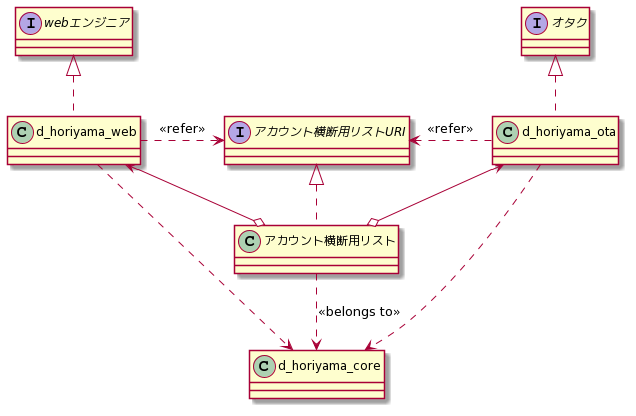
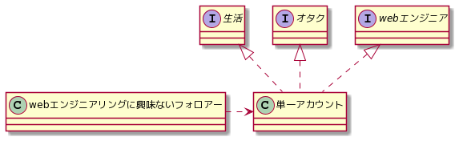
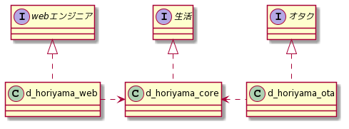
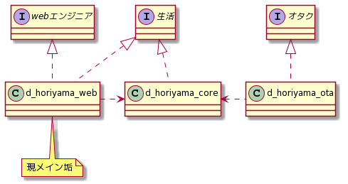
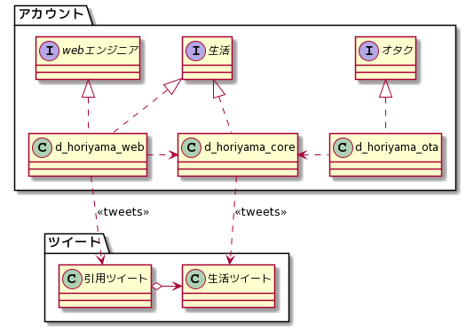
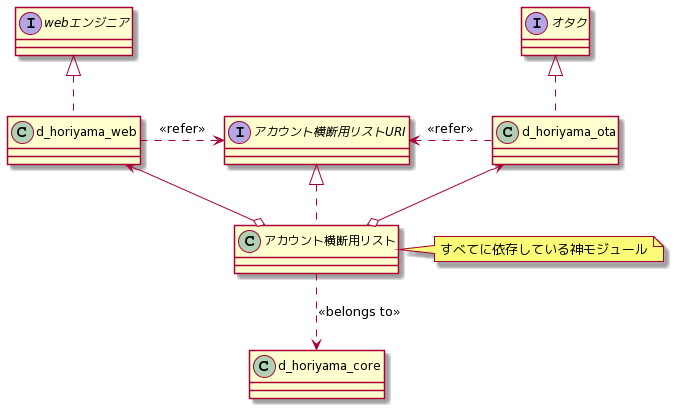

# こうした #

# 背景 #

- 最近ツイカス気味でやるべきことが進まないのでSNSデトックスを思い立った
- デトックスついでにアカウント運用を見直そうと思った
- 運用以前に設計が終わっているのでその改善にあたった

# 改善前 #

- 一言でいうと、**「単一責任原則違反」** (?)
  - アカウントのフォロー理由は一つであるべき
- 従来の運用では、単一アカウントの発信が「るつぼ」と化していた
  - 生業のWebエンジニアリング
  - 趣味のオタク活動
  - 誰得な生活ツイート
  - エロリツイート
- 例えば、オタク活動が活発な時期にフォローしてくれたフォロアーさんにとって、Webエンジニアリングのツイートは邪魔でしかない

# 改善後 #

- 自分の発信を顧みて、だいたいインタフェースが見えてきたので、それらに応じてアカウントを分けた
- `d_horiyama_core` は人生や生活、健康にかかることだけをつぶやく。死ぬまで使う想定
- 他のもの(`d_horiyama_web`, `d_horiyama_ota`)は、長い人生の中で爆破する想定で使う
  - 爆破後にも残したいような発信はcoreで行い引用・リツイートする

# 運用 #

## メインアカウント ##

- 当面はwebエンジニアリングを生業とし、それが生活の中心になるはずなので、`d_horiyama_web`は生活に関する発信を兼ねると思う

- そういう場合は、生活ツイート等をcoreで行い、それを`d_horiyama_web`で引用・リツイートする運用とする

## アカウント横断の知識の一元化 ##

- アカウント横断のためにbioにIDを直接書いたりフォロー・フォロアー関係をつくのは、以下の観点から望ましくない: 
  - 管理が煩雑になる。新しいアカウントを作るたびに、既存の全アカウントを編集しないといけない
  - 美少女TLに技術の話が流入するなど、興ざめなことがおこる

- そこで、アカウント横断の知識を「リスト」として一元化することとした
  - GoFのMediator Patternに近い
- coreで公開リストを作成し、それを各アカウントから参照する
- URIをインタフェース、リスト本体を実装と解釈すれば、各アカウントは疎結合に保たれる
  - アカウントを追加するたびに各アカウントのbioを編集したりフォロー作業を行う必要がない

---

ひとまずこれで運用してみようと思う。

