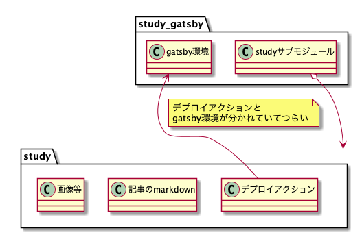
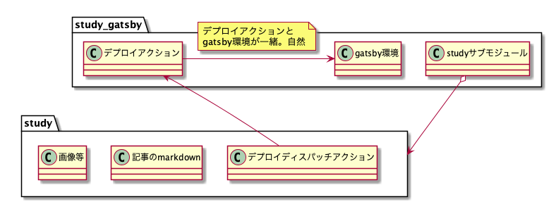

# 背景

- `study`: 本SSGの記事repo
  - https://github.com/wand2016/study
- `study_gatsby`: 本SSGのビルド環境repo
  - https://github.com/wand2016/study_gatsby

`study_gatsby`からsubmoduleで`study`を参照している。


# before



`study`リポジトリにデプロイアクションを記述していたのだが、gatsbyビルド環境は`study_gatsby`リポジトリにあり、分かれていて辛い状態だった。


# after



デプロイアクションを`study_gatsby`リポジトリに移し、`study`リポジトリpush時に`study_gatsby`リポジトリのデプロイアクションをディスパッチするように変更した。  
これによりgatsbyビルド環境とデプロイアクションが一箇所にまとまり管理しやすくなった。

## 詳細

https://docs.github.com/en/free-pro-team@latest/actions/reference/events-that-trigger-workflows#repository_dispatch

## `study_gatsby`のワークフローyaml

```diff
  on:
    push:
      branches:
        - master
+   repository_dispatch:
+     types:
+       - "study blog contents updated"
```

`repository_dispatch` で`"study blog contents updated"`イベントをサブスクライブする。

## `study`のワークフローyaml

```yaml
name: "dispatch study_gatsby repo's Actions"

on:
  push:
    branches:
      - master

jobs:
  publish:
    runs-on: ubuntu-16.04
    steps:
    - name: Create GitHub dispatch event
      run: |
        curl --request POST 'https://api.github.com/repos/wand2016/study_gatsby/dispatches' \
        --header 'Authorization: Bearer ${{secrets.ACCESS_TOKEN_FOR_DISPATCH}}' \
        --header 'Content-Type: application/json' \
        --data-raw '{
          "event_type": "study blog contents updated"
        }'
```

GitHubアカウントの設定からrepo権限で[Personal Access Token](https://docs.github.com/ja/free-pro-team@latest/github/authenticating-to-github/creating-a-personal-access-token )を発行して  
`study`リポジトリのsecretsに登録しておく。  


```
        --header 'Authorization: Bearer ${{secrets.ACCESS_TOKEN_FOR_DISPATCH}}' \
```

`event_type`には`study_gatsby` でサブスクライブしたイベントと同名のものを指定する。

```
        --data-raw '{
          "event_type": "study blog contents updated"
        }'
```
