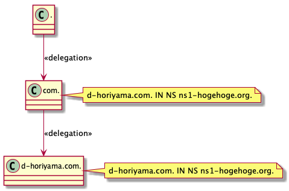
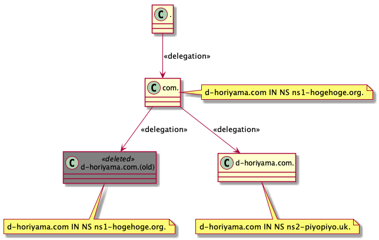
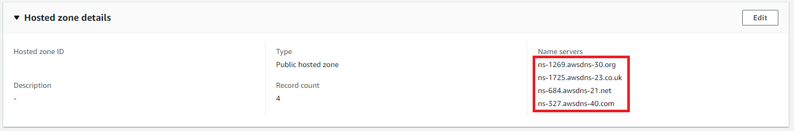
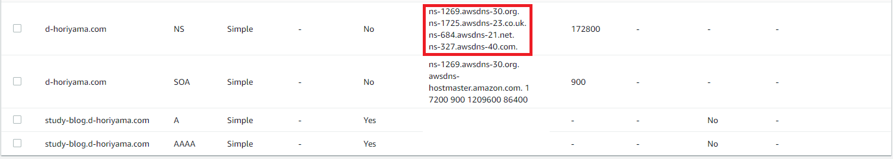
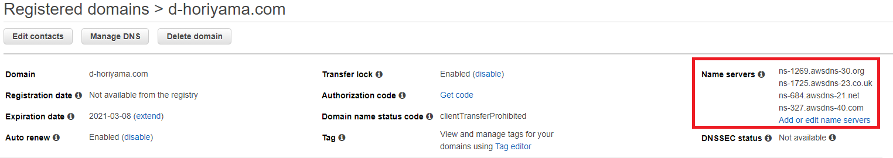

# おきたこと

半年前買ったドメインをdigるとSERVFAIL

```sh
dig A study-blog.d-horiyama.com
```

```
; <<>> DiG 9.10.6 <<>> A study-blog.d-horiyama.com
;; global options: +cmd
;; Got answer:
;; ->>HEADER<<- opcode: QUERY, status: SERVFAIL, id: 60862
;; flags: qr rd ra; QUERY: 1, ANSWER: 0, AUTHORITY: 0, ADDITIONAL: 1

;; OPT PSEUDOSECTION:
; EDNS: version: 0, flags:; udp: 1232
; OPT=15: 00 16 ("..")
;; QUESTION SECTION:
;study-blog.d-horiyama.com.	IN	A

;; Query time: 443 msec
;; SERVER: 1.1.1.1#53(1.1.1.1)
;; WHEN: Wed Oct 28 01:34:51 JST 2020
;; MSG SIZE  rcvd: 60
```

NXDOMAINではないのでドメインは確実に存在している。

SERVFAILはどういうときに起きるか: [Route53 公式doc](https://aws.amazon.com/jp/premiumsupport/knowledge-center/partial-dns-failures/)

> 権威あるネームサーバが応答しないか、予期しない情報で応答する場合、ローカルリゾルバーは SERVFAIL メッセージを返します。

権威のある応答がない、つまり委任が失敗している可能性が高い。いわゆる「lame delegation」というやつ

[JPRS/lame delegation](https://jprs.jp/glossary/index.php?ID=0176)

> DNSにおいて、権威サーバー（権威DNSサーバー）がゾーンを委任されているにもかかわらず、そのゾーンの情報を適切に返さない状態です。

# どうしてこうなった




今回使った`d-horiyama.com`ドメインは半年前にTerraform勉強用に取得したもの。(年12ドル)
  
同時にHosted Zone (月額50セント)も作って遊んだ後、お金の無駄なのでHosted Zoneのみ削除していた。



今回新しくHosted Zoneを作った際、親(`com.`)から子(`d-horiyama.com.`)への委任情報が腐ったままだった。
lame delegationの完成である。

# 腐っている委任情報の確認

親から子、すなわち`com.`から`d-horiyama.com.`への委任情報は`whois`コマンドで確認できる

```sh
whois d-horiyama.com | grep ns-
```

```
Name Server: ns-1313.awsdns-36.org
Name Server: ns-162.awsdns-20.com
Name Server: ns-1859.awsdns-40.co.uk
Name Server: ns-937.awsdns-53.net
```

これを新しく作ったHost ZoneのNSレコードの値で更新してやる必要がある。  
Route53で買ったドメインなのでAWSマネジメントコンソールから行う。

# 修正

 



`d-horiyama.com.` Hosted ZoneのNSレコードの4つを



d-horiyama.comドメインのName Serversに設定する。以上。


# 修正確認

委任情報確認

```sh
whois d-horiyama.com | grep ns-
```

```
Name Server: ns-1269.awsdns-30.org
Name Server: ns-1725.awsdns-23.co.uk
Name Server: ns-327.awsdns-40.com
Name Server: ns-684.awsdns-21.net
```

ちゃんと反映されている。

名前解決の動作確認も行う。  
普段遣いのフルリゾルバーのキャッシュがなかなか消えないので別の(8.8.8.8)で試す:

```sh
dig +trace @8.8.8.8 A study-blog.d-horiyama.com
```

```
...
study-blog.d-horiyama.com. 60	IN	A	13.35.46.36
study-blog.d-horiyama.com. 60	IN	A	13.35.46.110
study-blog.d-horiyama.com. 60	IN	A	13.35.46.2
study-blog.d-horiyama.com. 60	IN	A	13.35.46.16
d-horiyama.com.		172800	IN	NS	ns-1269.awsdns-30.org.
d-horiyama.com.		172800	IN	NS	ns-1725.awsdns-23.co.uk.
d-horiyama.com.		172800	IN	NS	ns-327.awsdns-40.com.
d-horiyama.com.		172800	IN	NS	ns-684.awsdns-21.net.
;; Received 255 bytes from 205.251.198.189#53(ns-1725.awsdns-23.co.uk) in 5 ms
```

ちゃんと降ってきた。ok
