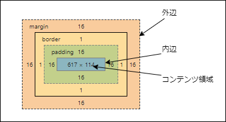

だいたい知ってるので知らなかったやつだけ

# 3-1 HTMLとCSSの基礎 #

- 略

# 3-2 文書要素の制御 #

知らなかった言葉

- 終点側アンカー
- 始点側アンカー

```
<a href="終点側アンカーのURL">始点側アンカーとなる内容</a>
```


# 3-3 文字の装飾 #

- 絶対単位
  - in
  - cm
  - mm
  - pt
  - pc
- 相対単位
  - em
  - ex
  - px
  - %
- **pxはcg検定的には「相対単位」**
  - dpiありきで長さの絶対値が変わるので
- 【補】[mozilla](https://developer.mozilla.org/ja/docs/Learn/CSS/Building_blocks/Values_and_units)的にはpxは「絶対単位」

> 1px = 1inの1/96

- 日本語フォントを指定する場合、「日本語フォント名のみ有効」「日本語フォント名無効」の場合があるので留意する


```
<div style="font-family:'ＭＳ Ｐ明朝';">あいうえお</div>
```

<div style="font-family:'ＭＳ Ｐ明朝';">あいうえお</div>
<br>


```
<div style="font-family:'MS PMincho';">あいうえお</div>
```

<div style="font-family:'MS PMincho';">あいうえお</div>

- 総称ファミリ
  - <span style="font-family: serif">serif</span>
  - <span style="font-family: san-serif">san-serif</span>
  - <span style="font-family: cursive">cursive</span>
  - <span style="font-family: fantasy">fantasy</span>
  - <span style="font-family: monospace">monospace</span>
- 文字装飾
  - <span style="text-decoration: none">none</span>
  - <span style="text-decoration: underline">underline</span>
  - <span style="text-decoration: overline">overline</span>
  - <span style="text-decoration: line-through">line-through</span>
  - <span style="text-decoration: blink">blink</span>
  - 【補】blinkは現在どのブラウザでも実装されていない: [mozilla](https://developer.mozilla.org/ja/docs/Web/CSS/text-decoration)
  
  
  
# 3-4 フォーム #

- inputとかtextareaとかは「コントロール」という
  - 【補】[HTML5.2仕様](https://www.w3.org/TR/html52/sec-forms.html)


# 3-5 CSSレイアウト #

## boxの語彙 ##



コンテンツ領域にある子から見て、親のコンテンツ領域を**包含ブロック**とよぶ


## 上下マージンの相殺 ##

```css
<style>
#A {
  width: 240px;
  background-color: silver;
  border: 1px solid orange;
}

#B,#C {
  width: 200px;
  height: 200px;
  margin: 20px 20px 15px
}
#B {
  background-color: yellow;
}
#C {
  background-color: green;
}
</style>
```

```html
<div style="text-align: center">
  <div id="A">
    <div id="B"></div>
    <div id="C"></div>
  </div>
</div>
```

<style>
#A {
  display: inline-block; /* 中央揃え用 */
  width: 240px;
  background-color: silver;
  border: 1px solid orange;
}

#B,#C {
  width: 200px;
  height: 200px;
  margin: 20px 20px 15px
}
#B {
  background-color: yellow;
}
#C {
  background-color: green;
}
</style>

<div style="text-align: center">
  <div id="A">
    <div id="B"></div>
    <div id="C"></div>
  </div>
</div>


矩形B(黄)と矩形C(緑)の間のマージンが`15px + 25px = 35px`ではなく`max(15px,20px) = 20px`になる

【補】`display: inline-block`だと起きない


``` html
<div style="text-align: center">
  <div id="A">
    <div id="B" style="display:inline-block"></div>
    <div id="C" style="display:inline-block"></div>
  </div>
</div>
```

<div style="text-align: center">
  <div id="A">
    <div id="B" style="display:inline-block"></div>
    <div id="C" style="display:inline-block"></div>
  </div>
</div>

