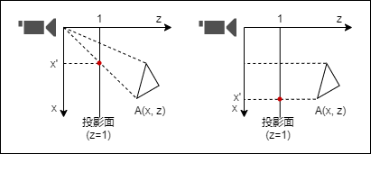

# 1-1 ビジュアル情報処理とディジタルカメラモデル #

## 1-1-1 ビジュアル情報処理 ##

- CGと画像処理は別々の分野として発展してきたが、今日では密接な関係があると考えられている
  - 例: AR: Augmented Realit_y (拡張現実感)
- **ビジュアル情報処理**
  - 両者ひっくるめた呼び方


## 1-1-2 ディジタルカメラモデル ##

| 肉眼   | ディジタルカメラ |
|--------|------------------|
| 光     | 光               |
| 水晶体 | レンズ           |
| 脳     | CCD,CMOS         |


| ディジタルカメラ | ディジタルカメラモデル             |
|------------------|------------------------------------|
| 被写体           | モデリング                         |
| カメラアングル   | ビジュアル情報処理の幾何学的モデル |
| ライティング     | ビジュアル情報処理の光学的モデル   |
| ディジタル画像   | ディジタル画像                     |
| 画像編集         | 画像処理                           |

- 3次元復元
  - CGの逆回し
  - ディジタル画像からモデリング・幾何学的モデル・光学的モデルを復元
- コンピュータビジョン
  - 被写体の形状ばかりでなく、シーンの情報を得ようとする技術


# 1-2 座標系とモデリング #

高校大学の数学の復習。略


# 1-3 ビジュアル情報処理の幾何学的モデル #

## 1-3-1 幾何学的変換の必要性 ##

- 対称図形を効率よくつくる
  - 扇風機の羽(回転対称)とか

## 1-3-2 2次元図形の基本変換 ##

アフィン変換の話

- `(t_x, t_y)`平行移動 (translate)

```
1 0 t_x
0 1 t_y
```

- 拡大・縮小 (scale)

```
s_x 0 0
0 s_y 0
```

- 回転

```
+conθ -sinθ 0
+sinθ +conθ 0
```

- 鏡映
- x軸対称

```
+1  0 0
 0 -1 0
```

- y軸対称

```
-1  0 0
 0 +1 0
```

- y=x対称

```
0 1 0
1 0 0
```

- スキュー(せん断)
- x軸方向 (a = tanα)

```
1 a 0
0 1 0
```

- y軸方向 (b = tanβ)

```
1 0 0
b 1 0
```


### 幾何学的変換の2つの意味 ###

```
x' = x + t_x
y' = y + t_y
```

- 意味1: x-y座標系上の点`(x,y)`をx軸方向に`t_x`, y軸方向に`t_y`移動すると`(x',y')`になる、の意
- 意味2: x-y座標系をx軸方向に`-t_x`, y軸方向に`-t_y`移動したx'-y'座標系での座標に変換する、の意


## 1-3-4 投影変換 ##

透視投影と平行投影の話




- 透視投影

```
x' = x/z
y' = y/z
```

- 平行投影

```
x' = x
y' = y
```

- **ビューボリューム**
  - z=0で無限大に発散してしまうし無限遠まで描写できないのでz方向にクリッピングした六面体領域のみ描画する
  - 前方クリッピング面 (z=0側)
  - 後方クリッピング面 (z->+∞側)

## 1-3-5 いろいな座標系と変換 ##

- モデリング座標系
  - モデリング形状を定義しやすい座標系
  - 回転対称なら円柱座標系とか
- ワールド座標系
    - 世界
    - モデリング変換
        - 物体を配置するときに定義する、モデリング座標系からワールド座標系への変換
        - どこにどんな大きさでどんな角度で置くよ、みたいな
- カメラ座標系(アイ座標系)
  - ワールド座標系とカメラ座標系の関係を決めることがカメラワークに相当する
  - 「アップベクトル」とか
  - 視野変換
    - ワールド座標系からカメラ座標系への変換
- 投影変換
  - 2次元画像化
  - 隠面消去とか
- ウィンドウとビューポート
    - ウィンドウ
        - 投影面上で実際に画像が表示される部分
        - 投影面から切り出したやつ
    - ビューポート
        - デバイス座標系上で画像が表示される部分

## 1-3-6 投影図の生成と解釈 ##

- 前述の座標変換のパイプラインを**ビューイングパイプライン**という
- 求まるのはあくまで形状だけ
- 明るさや色は光学的モデルで求める
