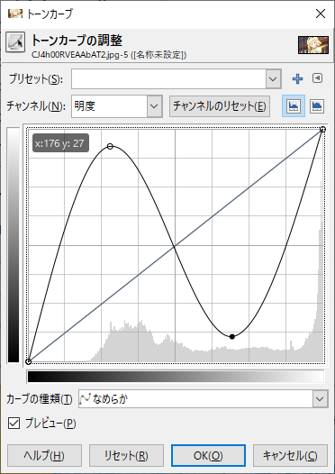
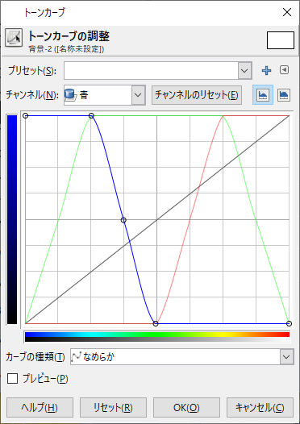

# 5-1 画像の性質を表す諸量 #


## 5-1-1 ヒストグラム ##

- 濃淡ヒストグラム
  - 画像全体の画素値の分布を棒グラフで表したもの
- コントラスト
  - ヒストグラムの分布が狭い: コントラストが低い
  - ヒストグラムの分布が広い: コントラストが高い


## 5-1-2 画像の統計量 ##

- ヒストグラムからさらに諸量を導出できる
  - 平均値
  - 分散
  - 標準偏差
  - 最大/最小値
  - 中央値
  - 最頻値


# 5-2 画素ごとの濃淡変換 #

## 5-2-1 トーンカーブ ##

- トーンカーブ、階長変換関数
  - 画素値の入出力の写像
  - 横軸: 入力
  - 縦軸: 出力

## 5-2-2 折れ線型のトーンカーブ ##

- 単純
- 水平な部分では出力画素値が一定
  - 入力値の濃淡変化の情報は完全に失われる


## 5-2-3 ガンマ補正 ##

```
y = 255 * (x/255)^(1/γ)
```

γ = 2で平方根、γ = 0.5で放物線

- 歴史的にはCRT:Cathode-Ray Tube(ブラウン管)の入力電圧-ディスプレイモニタ輝度特性を相殺するために用いられた
  - γ=22といわれる


## 5-2-4 S字トーンカーブ ##

- コントラストを強める

## 5-2-5 ヒストグラム平坦化 ##

- 高コントラスト化
- X線写真等に応用される


## 5-2-6 濃淡の反転 ##

```
y = 255 - x
```


## 5-2-7 ポスタリゼーションと2値化 ##

- ステップ状


## 5-2-8 ソラリゼーション ##



- ネガポジ混ざりあったような特殊な効果を得る
- もともとは写真制作時の暗室テクニックから
  - 「太陽光線にさらす」の意
  - 露出が極端に過度になると、現像した画像の明暗が逆転する


## 5-2-9 カラー画像の変換 ##

- RGB各成分について画素値変換


## 5-2-10 疑似カラー ##



- ユースケース例: 赤外線カメラ映像など
  - 直感的に温度分布を把握できる


## 5-2-11 色相、彩度、明度の変換 ##

- RGBよりも人間が直感的に理解しやすいHSIに変換してから各成分調整

