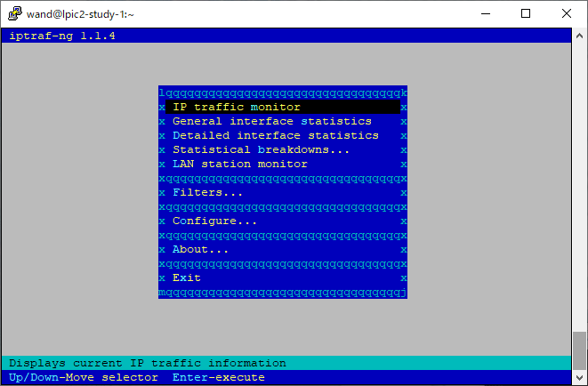
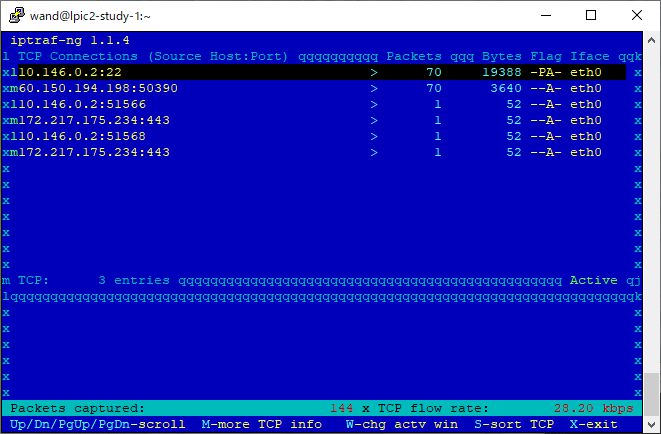

# 1.2つづき #

## 1.2.2 CPU使用率の測定 ##

- これまで挙げたtop,vmstat,iostat,sadc/sarコマンドなどでも確認できる

### ps ###

プロセス単位で詳細

全プロセス表示


```sh
ps aux
```

```
USER       PID %CPU %MEM    VSZ   RSS TTY      STAT START   TIME COMMAND
root         1  0.3  0.6 127988  6616 ?        Ss   13:04   0:01 /usr/lib/systemd/sys
root         2  0.0  0.0      0     0 ?        S    13:04   0:00 [kthreadd]
root         4  0.0  0.0      0     0 ?        S<   13:04   0:00 [kworker/0:0H]
```

- a: 端末上のすべてのプロセス
- u: 実行ユーザー名など表示
- x: 制御端末のないもの
- r: 実行中のプロセスのみ


```sh
ps auxr
```

```
USER       PID %CPU %MEM    VSZ   RSS TTY      STAT START   TIME COMMAND
wand      1293  0.0  0.1 155440  1692 pts/1    R+   13:15   0:00 ps auxr
```

- l: 長いフォーマット

```sh
ps ar
```

```
  PID TTY      STAT   TIME COMMAND
 1300 pts/1    R+     0:00 ps ar
```
 
```sh
ps alr
```
 
```
F   UID   PID  PPID PRI  NI    VSZ   RSS WCHAN  STAT TTY        TIME COMMAND
0  1000  1301  1261  20   0 153316  1340 -      R+   pts/1      0:00 ps alr
```


- U ユーザー名: ユーザー名で選択

```sh
ps U root
```

```
  PID TTY      STAT   TIME COMMAND
    1 ?        Ss     0:02 /usr/lib/systemd/systemd --switched-root --system --deser
    2 ?        S      0:00 [kthreadd]
    4 ?        S<     0:00 [kworker/0:0H]
...
```

ユーザーIDでもいける

```sh
ps U 1000
```

```
  PID TTY      STAT   TIME COMMAND
 1221 ?        S      0:00 sshd: wand@pts/0
 1222 pts/0    Ss+    0:00 -bash
 1260 ?        S      0:00 sshd: wand@pts/1
 1261 pts/1    Ss     0:00 -bash
 1360 pts/1    R+     0:00 ps U 1000
```


- -C コマンド名: コマンド名で検索

```sh
ps -C systemd
```

```
  PID TTY          TIME CMD
    1 ?        00:00:02 systemd
```

- -e: すべてのプロセス
- -f: 引数等含めた完全なフォーマット

```sh
ps -ef
```

```
UID        PID  PPID  C STIME TTY          TIME CMD
root         1     0  0 13:04 ?        00:00:02 /usr/lib/systemd/systemd --switched-
root         2     0  0 13:04 ?        00:00:00 [kthreadd]
root         4     2  0 13:04 ?        00:00:00 [kworker/0:0H]
```

- -l: ロング形式
  - lとは微妙に違う

```sh
ps -l
```

```
F S   UID   PID  PPID  C PRI  NI ADDR SZ WCHAN  TTY          TIME CMD
0 S  1000  1261  1260  0  80   0 - 28878 do_wai pts/1    00:00:00 bash
0 R  1000  1338  1261  0  80   0 - 38330 -      pts/1    00:00:00 ps
```

```sh
ps l
```

```
F   UID   PID  PPID PRI  NI    VSZ   RSS WCHAN  STAT TTY        TIME COMMAND
0  1000  1222  1221  20   0 115516  1900 n_tty_ Ss+  pts/0      0:00 -bash
0  1000  1261  1260  20   0 115512  1896 do_wai Ss   pts/1      0:00 -bash
0  1000  1339  1261  20   0 153320  1596 -      R+   pts/1      0:00 ps l
```

- -p PID: PIDで選択

```sh
ps -p 1
```

```
  PID TTY          TIME CMD
    1 ?        00:00:02 systemd
```

- -t tty: 端末名で選択

```sh
ps -t pts/1
```

```
  PID TTY          TIME CMD
 1261 pts/1    00:00:00 bash
 1342 pts/1    00:00:00 ps
```

- -u UID: ユーザーIDで検索
  - effective user. 実行権限

```sh
ps -u 1000
```

```
  PID TTY          TIME CMD
 1221 ?        00:00:00 sshd
 1222 pts/0    00:00:00 bash
 1260 ?        00:00:00 sshd
 1261 pts/1    00:00:00 bash
 1343 pts/1    00:00:00 ps
```

-uはユーザ名もいける

```sh
ps -u root
```

```
  PID TTY          TIME CMD
    1 ?        00:00:02 systemd
    2 ?        00:00:00 kthreadd
    4 ?        00:00:00 kworker/0:0H
```


#### 表示項目の意味 ####

```sh
ps l
```

```
F   UID   PID  PPID PRI  NI    VSZ   RSS WCHAN  STAT TTY        TIME COMMAND
...
```

```sh
ps -l
```

```
F S   UID   PID  PPID  C PRI  NI ADDR SZ WCHAN  TTY          TIME CMD
...
```

```sh
ps u
```

```
USER       PID %CPU %MEM    VSZ   RSS TTY      STAT START   TIME COMMAND
...
```

- USER: 実効ユーザー名 (effective user)
  - 実行時の権限
  - cf. real user
- PID: プロセスID
- PPID: 親プロセスID
- VSZ: プロセスが使用するメモリ量 (virtual memory size)
- RSS: 現時点で使用中のメモリ量 (resident set size)
- STAT: プロセスの状態と優先度


- S: 割り込み可能なスリープ状態
- D: 割り込み不可能なスリープ状態 (IOなど)
- R: running
- T: トレース中
- Z: zombie
- W: スワップアウトしたプロセス

- <: 優先度高い
- N: 優先度低い
- s: セッションリーダー
- l: マルチスレッド
- +: フォアグラウンドプロセスグループ

### pstree ###

#### インストール ####

```sh
yum provides pstree
```

```
Failed to set locale, defaulting to C
Loaded plugins: fastestmirror
Loading mirror speeds from cached hostfile
 * base: ty1.mirror.newmediaexpress.com
 * epel: d2lzkl7pfhq30w.cloudfront.net
 * extras: ty1.mirror.newmediaexpress.com
 * updates: ty1.mirror.newmediaexpress.com
psmisc-22.20-17.el7.x86_64 : Utilities for managing processes on your system
Repo        : base
Matched from:
Filename    : /usr/bin/pstree
```

```sh
sudo yum install -y psmisc
```

#### つかう ####

```sh
pstree
```

```
systemd-+-NetworkManager-+-dhclient
        |                `-2*[{NetworkManager}]
        |-acpid
        |-2*[agetty]
        |-auditd---{auditd}
        |-chronyd
        |-crond
        |-dbus-daemon---{dbus-daemon}
        |-firewalld---{firewalld}
        |-google_guest_ag---10*[{google_guest_ag}]
        |-google_osconfig---9*[{google_osconfig}]
        |-master-+-pickup
        |        `-qmgr
        |-polkitd---6*[{polkitd}]
        |-rsyslogd---2*[{rsyslogd}]
        |-sshd-+-sshd---sshd---bash
        |      `-sshd---sshd---bash---pstree
        |-systemd-journal
        |-systemd-logind
        |-systemd-udevd
        `-tuned---4*[{tuned}]
```


### lsof ###

#### インストール ####

```sh
yum provides lsof
```

```
Failed to set locale, defaulting to C
Loaded plugins: fastestmirror
Loading mirror speeds from cached hostfile
 * base: ty1.mirror.newmediaexpress.com
 * epel: d2lzkl7pfhq30w.cloudfront.net
 * extras: ty1.mirror.newmediaexpress.com
 * updates: ty1.mirror.newmediaexpress.com
lsof-4.87-6.el7.x86_64 : A utility which lists open files on a Linux/UNIX system
Repo        : base
```

```sh
sudo yum install -y lsof
```

#### 使う ####

一般ユーザで実行すると権限が足りなくていろいろ見れない

```sh
$ lsof
```

```
COMMAND    PID  TID    USER   FD      TYPE DEVICE  SIZE/OFF     NODE NAME
systemd      1         root  cwd   unknown                           /proc/1/cwd (readlink: Permission denied)
systemd      1         root  rtd   unknown                           /proc/1/root (readlink: Permission denied)
systemd      1         root  txt   unknown                           /proc/1/exe (readlink: Permission denied)
systemd      1         root NOFD                                     /proc/1/fd (opendir: Permission denied)
kthreadd     2         root  cwd   unknown                           /proc/2/cwd (readlink: Permission denied)
kthreadd     2         root  rtd   unknown                           /proc/2/root (readlink: Permission denied)
kthreadd     2         root  txt   unknown                           /proc/2/exe (readlink: Permission denied)
kthreadd     2         root NOFD                                     /proc/2/fd (opendir: Permission denied)
kworker/0    4         root  cwd   unknown                           /proc/4/cwd (readlink: Permission denied)
...
```

管理者権限


```sh
# lsof
```

```
COMMAND    PID  TID    USER   FD      TYPE             DEVICE  SIZE/OFF       NODE NAME
systemd      1         root  cwd       DIR                8,2       224         96 /
systemd      1         root  rtd       DIR                8,2       224         96 /
systemd      1         root  txt       REG                8,2   1628608   34222559 /usr/lib/systemd/systemd
systemd      1         root  mem       REG                8,2     20064   16778597 /usr/lib64/libuuid.so.1.3.0
systemd      1         root  mem       REG                8,2    265576   16814562 /usr/lib64/libblkid.so.1.1.0
systemd      1         root  mem       REG                8,2     90248   16778583 /usr/lib64/libz.so.1.2.7
systemd      1         root  mem       REG                8,2    157424   16778589 /usr/lib64/liblzma.so.5.2.2
systemd      1         root  mem       REG                8,2     23968   16778707 /usr/lib64/libcap-ng.so.0.0.0
systemd      1         root  mem       REG                8,2     19896   16778667 /usr/lib64/libattr.so.1.1.0
...
```

-i: select IPv[46] files

```sh
sudo lsof -i
```

```
COMMAND    PID   USER   FD   TYPE DEVICE SIZE/OFF NODE NAME
chronyd    468 chrony    5u  IPv4  14166      0t0  UDP localhost:323 
chronyd    468 chrony    6u  IPv6  14167      0t0  UDP localhost:323 
dhclient   627   root    6u  IPv4  15922      0t0  UDP *:bootpc 
google_os  869   root    3u  IPv4  16622      0t0  TCP lpic2-study-1.asia-northeast1-b.c.lpic2-study.internal:57646->metadata.google.internal:http (ESTABLISHED)
google_os  869   root    6u  IPv4  25661      0t0  TCP lpic2-study-1.asia-northeast1-b.c.lpic2-study.internal:45548->nrt12s01-in-f138.1e100.net:https (ESTABLISHED)
google_gu  878   root    3u  IPv4  17777      0t0  TCP lpic2-study-1.asia-northeast1-b.c.lpic2-study.internal:57654->metadata.google.internal:http (ESTABLISHED)
google_gu  878   root    6u  IPv4  23837      0t0  TCP lpic2-study-1.asia-northeast1-b.c.lpic2-study.internal:48200->nrt20s09-in-f10.1e100.net:https (ESTABLISHED)
sshd      1091   root    3u  IPv4  17964      0t0  TCP *:ssh (LISTEN)
sshd      1091   root    4u  IPv6  17966      0t0  TCP *:ssh (LISTEN)
master    1126   root   13u  IPv4  18042      0t0  TCP localhost:smtp (LISTEN)
master    1126   root   14u  IPv6  18043      0t0  TCP localhost:smtp (LISTEN)
sshd      1217   root    3u  IPv4  17209      0t0  TCP lpic2-study-1.asia-northeast1-b.c.lpic2-study.internal:ssh->softbank060150194198.bbtec.net:50390 (ESTABLISHED)
sshd      1221   wand    3u  IPv4  17209      0t0  TCP lpic2-study-1.asia-northeast1-b.c.lpic2-study.internal:ssh->softbank060150194198.bbtec.net:50390 (ESTABLISHED)
sshd      1257   root    3u  IPv4  18467      0t0  TCP lpic2-study-1.asia-northeast1-b.c.lpic2-study.internal:ssh->softbank060150194198.bbtec.net:50422 (ESTABLISHED)
sshd      1260   wand    3u  IPv4  18467      0t0  TCP lpic2-study-1.asia-northeast1-b.c.lpic2-study.internal:ssh->softbank060150194198.bbtec.net:50422 (ESTABLISHED)
```


## 1.2.3 メモリおよびスワップ使用量の測定 ##

- top, sadc/sarなどのほか

### free ###

```sh
free
```

```
              total        used        free      shared  buff/cache   available
Mem:        1013796      194904      480960        6808      337932      672404
Swap:             0           0           0
```

- freeが小さくてもキャッシュの割り当てが大きければLinux的には正常
  - Linuxは使われていない物理メモリをできるだけキャッシュに割り当てようとする
  - 起動時間が長くなるにつれfreeは小さくなる


### /proc/meminfo ###

freeよりも詳細


```sh
cat /proc/meminfo 
```

```
MemTotal:        1013796 kB
MemFree:          481008 kB
MemAvailable:     672472 kB
Buffers:              16 kB
Cached:           314120 kB
SwapCached:            0 kB
Active:           261056 kB
Inactive:         157880 kB
Active(anon):     105024 kB
Inactive(anon):     6584 kB
Active(file):     156032 kB
Inactive(file):   151296 kB
Unevictable:           0 kB
Mlocked:               0 kB
SwapTotal:             0 kB
SwapFree:              0 kB
Dirty:                 0 kB
Writeback:             0 kB
AnonPages:        104832 kB
Mapped:            36408 kB
Shmem:              6808 kB
Slab:              48836 kB
SReclaimable:      23816 kB
SUnreclaim:        25020 kB
KernelStack:        2096 kB
PageTables:         5724 kB
NFS_Unstable:          0 kB
Bounce:                0 kB
WritebackTmp:          0 kB
CommitLimit:      506896 kB
Committed_AS:     496456 kB
VmallocTotal:   34359738367 kB
VmallocUsed:        5412 kB
VmallocChunk:   34359730176 kB
Percpu:              504 kB
HardwareCorrupted:     0 kB
AnonHugePages:     30720 kB
CmaTotal:              0 kB
CmaFree:               0 kB
HugePages_Total:       0
HugePages_Free:        0
HugePages_Rsvd:        0
HugePages_Surp:        0
Hugepagesize:       2048 kB
DirectMap4k:       56540 kB
DirectMap2M:      991232 kB
DirectMap1G:           0 kB
```


## 1.2.4 ディスク使用量の測定 ##

### df ###

```sh
df
```

```
Filesystem     1K-blocks    Used Available Use% Mounted on
devtmpfs          498768       0    498768   0% /dev
tmpfs             506896       0    506896   0% /dev/shm
tmpfs             506896    6808    500088   2% /run
tmpfs             506896       0    506896   0% /sys/fs/cgroup
/dev/sda2       20754432 3266688  17487744  16% /
/dev/sda1         204580   11440    193140   6% /boot/efi
tmpfs             101380       0    101380   0% /run/user/1000
tmpfs             101380       0    101380   0% /run/user/0
```

- -a: すべてのファイルシステムの情報を表示
  - /sys, /proc なども

```sh
df -a
```

```
Filesystem     1K-blocks    Used Available Use% Mounted on
sysfs                  0       0         0    - /sys
proc                   0       0         0    - /proc
devtmpfs          498768       0    498768   0% /dev
```

- -h/-H: human-readable (MiB/MB)

```sh
df -h
```

```
Filesystem      Size  Used Avail Use% Mounted on
devtmpfs        488M     0  488M   0% /dev
...
```

```sh
df -H
```

```
Filesystem      Size  Used Avail Use% Mounted on
devtmpfs        511M     0  511M   0% /dev
...
```

- -i: iノード残量確認
  - ext2,ext3,ext4ファイルシステムで重要

```sh
df -i
```

```
Filesystem       Inodes IUsed    IFree IUse% Mounted on
devtmpfs         124692   317   124375    1% /dev
tmpfs            126724     1   126723    1% /dev/shm
tmpfs            126724   394   126330    1% /run
tmpfs            126724    16   126708    1% /sys/fs/cgroup
/dev/sda2      10382336 66999 10315337    1% /
/dev/sda1             0     0        0     - /boot/efi
tmpfs            126724     1   126723    1% /run/user/1000
tmpfs            126724     1   126723    1% /run/user/0
```


## 1.2.5 ネットワークトラフィックの測定 ##

### netstat ###

- -i: interfaceをリスト

```sh
netstat -i
```

```
Kernel Interface table
Iface             MTU    RX-OK RX-ERR RX-DRP RX-OVR    TX-OK TX-ERR TX-DRP TX-OVR Flg
eth0             1460     4590      0      0 0          4334      0      0      0 BMRU
lo              65536        0      0      0 0             0      0      0      0 LRU
```

- -s: プロトコルごとの統計情報

```sh
netstat -s
```

```
Ip:
    4520 total packets received
    0 forwarded
    0 incoming packets discarded
    4518 incoming packets delivered
    4249 requests sent out
    3 dropped because of missing route
Icmp:
    1 ICMP messages received
    0 input ICMP message failed.
    ICMP input histogram:
        echo requests: 1
    1 ICMP messages sent
    0 ICMP messages failed
    ICMP output histogram:
        echo replies: 1
IcmpMsg:
        InType8: 1
        OutType0: 1
Tcp:
    137 active connections openings
    8 passive connection openings
    1 failed connection attempts
    2 connection resets received
    6 connections established
    4264 segments received
    4183 segments send out
    34 segments retransmited
    0 bad segments received.
    13 resets sent
Udp:
    252 packets received
    0 packets to unknown port received.
    0 packet receive errors
    253 packets sent
    0 receive buffer errors
    0 send buffer errors
...
```

1発pingしてみる

```sh
ping 1.1.1.1  -c 1
```

```
PING 1.1.1.1 (1.1.1.1) 56(84) bytes of data.
64 bytes from 1.1.1.1: icmp_seq=1 ttl=57 time=3.11 ms

--- 1.1.1.1 ping statistics ---
1 packets transmitted, 1 received, 0% packet loss, time 0ms
rtt min/avg/max/mdev = 3.112/3.112/3.112/0.000 ms
```

再度統計情報を確認

```sh
netstat -s
```

```
...
Icmp:
    2 ICMP messages received
    0 input ICMP message failed.
    ICMP input histogram:
        echo requests: 1
        echo replies: 1
    2 ICMP messages sent
    0 ICMP messages failed
    ICMP output histogram:
        echo request: 1
        echo replies: 1
...
```

ICMP messages receivedが1から2に増えた


### ss ###

netstatはもう古い

```sh
ss -s
```

```
Total: 201 (kernel 0)
TCP:   10 (estab 6, closed 0, orphaned 0, synrecv 0, timewait 0/0), ports 0

Transport Total     IP        IPv6
*	  0         -         -        
RAW	  1         0         1        
UDP	  3         2         1        
TCP	  10        8         2        
INET	  14        10        4        
FRAG	  0         0         0        
```

### netperf ###

- ネットワークのスループット調査
- クライアント-サーバー型アーキテクチャ

https://github.com/HewlettPackard/netperf

HewlettPackard製らしい

#### インストール ####

```sh
yum provides netperf
```

```
Failed to set locale, defaulting to C
Loaded plugins: fastestmirror
Loading mirror speeds from cached hostfile
 * base: ty1.mirror.newmediaexpress.com
 * epel: d2lzkl7pfhq30w.cloudfront.net
 * extras: ty1.mirror.newmediaexpress.com
 * updates: ty1.mirror.newmediaexpress.com
No matches found
```

ない

自分でビルドしましょうか

必要なものインストール

```sh
sudh yum install -y git autoconf automake gcc texinfo
```

```sh
git clone https://github.com/HewlettPackard/netperf.git
cd netperf/

./autogen.sh
./configure
make
sudo make install
```

クライアントを動かしてみる

```sh
netperf
```

- デフォルト12865番ポート
- サーバーが動いていないので終了

```
establish control: are you sure there is a netserver listening on localhost at port 12865?
establish_control could not establish the control connection from 0.0.0.0 port 0 address family AF_UNSPEC to localhost port 12865 address family AF_UNSPEC
```


サーバー動かす


```sh
netserver
```

```
Starting netserver with host 'IN(6)ADDR_ANY' port '12865' and family AF_UNSPEC
```

サーバーが待ち構えていること確認

```sh
lsof -i
```

```
COMMAND    PID USER   FD   TYPE DEVICE SIZE/OFF NODE NAME
netserver 8282 wand    3u  IPv6  30118      0t0  TCP *:netperf (LISTEN)
```

プライベートIPアドレスに対して接続してみる

```sh
ifconfig | grep 'inet '
```

```
        inet 10.146.0.2  netmask 255.255.255.255  broadcast 10.146.0.2
        inet 127.0.0.1  netmask 255.0.0.0
```

```sh
netperf -H 10.146.0.2
```

```
MIGRATED TCP STREAM TEST from 0.0.0.0 (0.0.0.0) port 0 AF_INET to 10.146.0.2 () port 0 AF_INET
Recv   Send    Send                          
Socket Socket  Message  Elapsed              
Size   Size    Size     Time     Throughput  
bytes  bytes   bytes    secs.    10^6bits/sec  

 87380  16384  16384    10.00    20950.99   
```

### iptables ###

- パケットフィルタリングを行える
- ルールにマッチしたパケット数やバイト数を確認できる

通常ユーザだと権限が足りない

```sh
$ iptables -L -v
```

```
iptables v1.4.21: can't initialize iptables table `filter': Permission denied (you must be root)
Perhaps iptables or your kernel needs to be upgraded.
```


```sh
# iptables -L -v
```

```
Chain INPUT (policy ACCEPT 0 packets, 0 bytes)
 pkts bytes target     prot opt in     out     source               destination         
4488K  104G ACCEPT     all  --  any    any     anywhere             anywhere             ctstate RELATED,ESTABLISHED
   10   600 ACCEPT     all  --  lo     any     anywhere             anywhere            
   33  1686 INPUT_direct  all  --  any    any     anywhere             anywhere            
   33  1686 INPUT_ZONES_SOURCE  all  --  any    any     anywhere             anywhere            
   33  1686 INPUT_ZONES  all  --  any    any     anywhere             anywhere            
    0     0 DROP       all  --  any    any     anywhere             anywhere             ctstate INVALID
    0     0 REJECT     all  --  any    any     anywhere             anywhere             reject-with icmp-host-prohibited

Chain FORWARD (policy ACCEPT 0 packets, 0 bytes)
...
```


### iptraf ###

#### インストール ####

```sh
yum provides iptraf
```

```
Failed to set locale, defaulting to C
Loaded plugins: fastestmirror
Loading mirror speeds from cached hostfile
 * base: ty1.mirror.newmediaexpress.com
 * epel: d2lzkl7pfhq30w.cloudfront.net
 * extras: ty1.mirror.newmediaexpress.com
 * updates: ty1.mirror.newmediaexpress.com
iptraf-ng-1.1.4-7.el7.x86_64 : A console-based network monitoring utility
Repo        : base
Matched from:
Provides    : iptraf = 3.1
```

```sh
sudo yum install -y iptraf
```

#### つかう ####

管理者権限必要

```sh
$ iptraf-ng
```

```
fatal: This program can be run only by the system administrator
```

```sh
# iptraf-ng
```





なんかすごい

