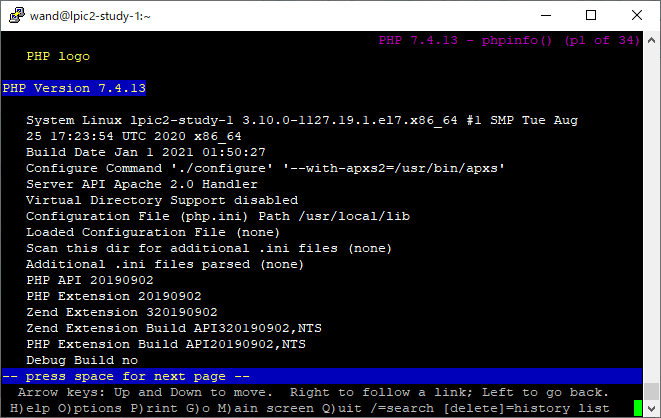
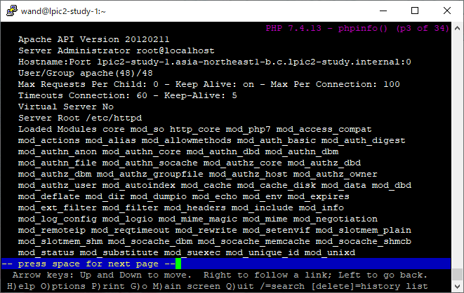
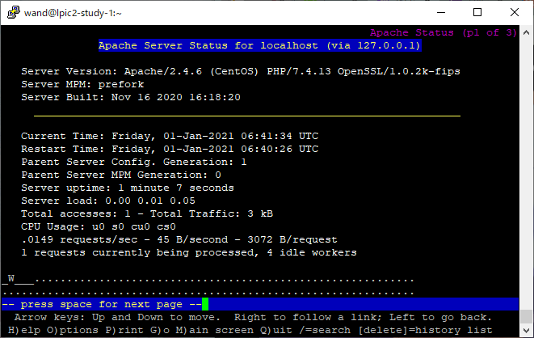
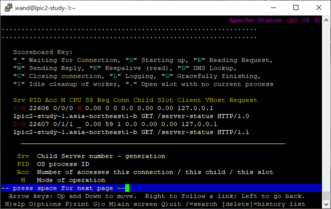
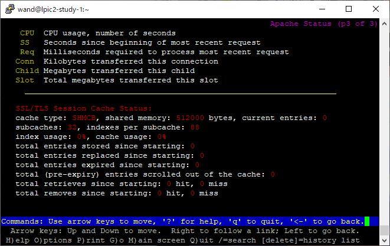
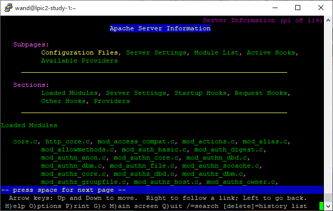
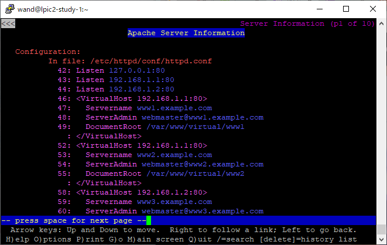

# 10.1 Webサーバの設定 つづき #

## 10.1.5 Apacheの制御 ##

### service/systemctl ###

SysVinit

```sh
# /etc/init.d/httpd start
```

systemd Red Hat系

``` sh
# systemctl start httpd
```

systemd Debian系

``` sh
# systemctl start apache2
```


### apachectl ###

```sh
apachectl status
```

```
* httpd.service - The Apache HTTP Server
   Loaded: loaded (/usr/lib/systemd/system/httpd.service; disabled; vendor preset: disabled)
   Active: active (running) since Fri 2021-01-01 00:18:00 UTC; 3s ago
     Docs: man:httpd(8)
           man:apachectl(8)
 Main PID: 1325 (httpd)
   Status: "Processing requests..."
   CGroup: /system.slice/httpd.service
           |-1325 /usr/sbin/httpd -DFOREGROUND
           |-1326 /usr/sbin/httpd -DFOREGROUND
           |-1327 /usr/sbin/httpd -DFOREGROUND
           |-1328 /usr/sbin/httpd -DFOREGROUND
           |-1329 /usr/sbin/httpd -DFOREGROUND
           `-1330 /usr/sbin/httpd -DFOREGROUND

Jan 01 00:17:59 lpic2-study-1 systemd[1]: Starting The Apache HTTP Server...
Jan 01 00:18:00 lpic2-study-1 systemd[1]: Started The Apache HTTP Server.
```

```sh
systemctl status httpd
```

```
● httpd.service - The Apache HTTP Server
   Loaded: loaded (/usr/lib/systemd/system/httpd.service; disabled; vendor preset: disabled)
   Active: active (running) since Fri 2021-01-01 00:18:00 UTC; 23s ago
     Docs: man:httpd(8)
           man:apachectl(8)
 Main PID: 1325 (httpd)
   Status: "Total requests: 0; Current requests/sec: 0; Current traffic:   0 B/sec"
   CGroup: /system.slice/httpd.service
           ├─1325 /usr/sbin/httpd -DFOREGROUND
           ├─1326 /usr/sbin/httpd -DFOREGROUND
           ├─1327 /usr/sbin/httpd -DFOREGROUND
           ├─1328 /usr/sbin/httpd -DFOREGROUND
           ├─1329 /usr/sbin/httpd -DFOREGROUND
           └─1330 /usr/sbin/httpd -DFOREGROUND

Jan 01 00:17:59 lpic2-study-1 systemd[1]: Starting The Apache HTTP Server...
Jan 01 00:18:00 lpic2-study-1 systemd[1]: Started The Apache HTTP Server.
```

`systemctl`のラッパ:


- start
- stop
- restart
- reload


apachectl特有:

- graceful
  - Apacheを安全に再起動
  - 停止中なら単に起動
  - 稼働中なら、リクエストの処理を待って再起動
- configtest
  - 設定ファイルの構文チェック
  - `httpd -t`と同じ


## 10.1.6 モジュールの利用 ##

`httpd -l`: 静的リンクされているモジュール一覧

``` sh
httpd -l
```

```
Compiled in modules:
  core.c
  mod_so.c
  http_core.c
```

`mod_so.c`: DSOモジュール読み込み機能

- DSO: Dynamic Shared Object. 要するに動的リンク
- これすらモジュールで実現されている

`httpd -M`: 静的/動的リンクされているモジュール一覧 + 設定ファイル構文チェック


```sh
httpd -M
```

```
Loaded Modules:
 core_module (static)
 so_module (static)
 http_module (static)
 access_compat_module (shared)
 actions_module (shared)
 alias_module (shared)
...
```

### apxs ###

APache eXtenSion tool

Apacheインストール後にモジュールを組み込む

```sh
apxs
```

```
-bash: apxs: command not found
```

```sh
yum provides apxs
```

```
Failed to set locale, defaulting to C
Loaded plugins: fastestmirror
Loading mirror speeds from cached hostfile
 * base: ty1.mirror.newmediaexpress.com
 * epel: d2lzkl7pfhq30w.cloudfront.net
 * extras: ty1.mirror.newmediaexpress.com
 * updates: ty1.mirror.newmediaexpress.com
httpd-devel-2.4.6-95.el7.centos.x86_64 : Development interfaces for the Apache HTTP
                                       : server
Repo        : base
Matched from:
Filename    : /usr/bin/apxs


httpd-devel-2.4.6-97.el7.centos.x86_64 : Development interfaces for the Apache HTTP
                                       : server
Repo        : updates
Matched from:
Filename    : /usr/bin/apxs
```

`httpd-devel`パッケージでインストールされる


``` sh
sudo yum install -y httpd-devel
which apxs
```

```
/usr/bin/apxs
```

### 【補】phpモジュールをインストールしてみる ###

PHPerのはしくれとして押さえておきたい

依存インストール

```sh
sudo yum -y install gcc libxml2-devel sqlite-devel
```


phpモジュール本体インストール

```sh
mkdir ~/tmp/
cd ~/tmp/

wget https://www.php.net/distributions/php-7.4.13.tar.gz
tar xzvf php-7.4.13.tar.gz
cd php-7.4.13

./configure --with-apxs2=$(which apxs)
make
sudo make install
```

内部的にたぶんこれを叩いている


```sh
sudo apxs -i -a -c mod_php7.c
```

- `-i`: DSOをinstallするの意
- `-a`: httpd.confにLoadModuleディレクティブを自動追加するの意
- `-c`: compilation operation


`libphp7.so`がインストールされ、`httpd.conf`に`LoadModule`ディレクティブが追記された

```
...
chmod 755 /usr/lib64/httpd/modules/libphp7.so
[activating module `php7' in /etc/httpd/conf/httpd.conf]
...
```

```sh
sudo diff -u  /etc/httpd/conf/httpd.conf.bak /etc/httpd/conf/httpd.conf
```

```diff
--- /etc/httpd/conf/httpd.conf.bak	2021-01-01 03:09:47.471624330 +0000
+++ /etc/httpd/conf/httpd.conf	2021-01-01 03:09:47.473624461 +0000
@@ -71,6 +71,7 @@
 #
 # Example:
 # LoadModule foo_module modules/mod_foo.so
+LoadModule php7_module        /usr/lib64/httpd/modules/libphp7.so
 #
 Include conf.modules.d/*.conf
```

さらにphpファイルとして実行すべきファイルパスパターンを指定

```diff
+<FilesMatch \.php$>
+  SetHandler application/x-httpd-php
+</FilesMatch>
```

設定反映

```sh
sudo apachectl restart

httpd -M | grep php
```

`php7_module`DSOがロードされた

```
 php7_module (shared)
```

いつものを表示

```sh
echo '<?php phpinfo(); ?>'  | sudo tee /var/www/html/index.php
lynx localhost/index.php
```






### a2enmod/a2dismod ###

Debian系で使える

引数で指定のモジュール有効化/無効化

引数なしでa2enmodを実行した場合、利用可能なモジュール確認・対話的にモジュール有効化


## 10.1.7 クライアントアクセスの認証 ##

### 基本認証 ###

平文パスワード

SSL/TLSによる経路暗号化は別途必須

```sh
sudo diff -u  /etc/httpd/conf/httpd.conf.bak /etc/httpd/conf/httpd.conf
```

```diff
--- /etc/httpd/conf/httpd.conf.bak	2021-01-01 04:17:21.942865866 +0000
+++ /etc/httpd/conf/httpd.conf	2021-01-01 04:19:37.099678526 +0000
@@ -374,6 +374,12 @@
 
 ServerTokens Prod
 
+<Directory "/var/www/html/private-area">
+  AuthType Basic
+  AuthName "Please Enter Your ID and Password!"
+  AuthUserFile /etc/httpd/conf/htpasswd
+  Require valid-user
+</Directory>
 # Supplemental configuration
 #
 # Load config files in the "/etc/httpd/conf.d" directory, if any.
```

アクセス制限下におくドキュメント配置

```sh
sudo mkdir /var/www/html/private-area/
echo 'private' | sudo tee /var/www/html/private-area/index.html
```

ユーザ登録: `htpasswd`コマンド

- `-c`: create -- htpasswdファイル作成
- `-m`: MD5ハッシュ (2.2.18以降のデフォルト)
- `-s`: SHA-1ハッシュ
- `-D`: ユーザ削除

```sh
sudo htpasswd -c /etc/httpd/conf/htpasswd wand
```

```
New password: wand
Re-type new password: wand
Adding password for user wand
```

```sh
cat /etc/httpd/conf/htpasswd
```

```
wand:$apr1$ifKfDDb6$52cO6A4VX2OLh2cZKC.3I0
```

接頭辞 `$apr1$`がmd5のしるし

反映するには、reloadではなくrestart必要っぽい

``` sh
sudo apachectl restart

curl localhost/private-area/
```

```
<!DOCTYPE HTML PUBLIC "-//IETF//DTD HTML 2.0//EN">
<html><head>
<title>401 Unauthorized</title>
</head><body>
<h1>Unauthorized</h1>
<p>This server could not verify that you
are authorized to access the document
requested.  Either you supplied the wrong
credentials (e.g., bad password), or your
browser doesn't understand how to supply
the credentials required.</p>
</body></html>
```

Basic認証通す

```sh
curl --basic --user "wand:wand" http://localhost/private-area/
```

```
private
```

OK


### ダイジェスト認証 ###

チャレンジ・レスポンス形式

盗聴されてもただちにパスワードが漏洩するということはない

設定

```diff
+<Directory "/var/www/html/secret-area">
+  AuthType Digest
+  AuthName "secret-area"
+  AuthUserFile /etc/httpd/conf/htdigestfile
+  Require valid-user
+</Directory>
+
+<Directory "/var/www/html/another-secret-area">
+  AuthType Digest
+  AuthName "another-secret-area"
+  AuthUserFile /etc/httpd/conf/htdigestfile
+  Require valid-user
+</Directory>
```

Basic認証と異なり、AuthNameにはrealmを指定する

``` sh
sudo htdigest -c /etc/httpd/conf/htdigestfile secret-area wand
```

```
Adding password for wand in realm secret-area.
New password: wand
Re-type new password: wand
```

ドキュメント配置

```sh
sudo mkdir /var/www/html/secret-area
sudo mkdir /var/www/html/another-secret-area
echo secret | sudo tee /var/www/html/secret-area/index.html
echo another-secret | sudo tee /var/www/html/another-secret-area/index.html
```

設定反映・動作確認

``` sh
apachectl configtest
sudo apachectl restart

curl http://localhost/secret-area/
```

```
<!DOCTYPE HTML PUBLIC "-//IETF//DTD HTML 2.0//EN">
<html><head>
<title>401 Unauthorized</title>
</head><body>
<h1>Unauthorized</h1>
<p>This server could not verify that you
are authorized to access the document
requested.  Either you supplied the wrong
credentials (e.g., bad password), or your
browser doesn't understand how to supply
the credentials required.</p>
</body></html>
```

Digest認証通す

```sh
curl --digest --user "wand:wand" http://localhost/secret-area/
```

```
secret
```

OK

ユーザ名パスワードが合っていても別のrealmだと401


```sh
curl --digest --user "wand:wand" http://localhost/another-secret-area/
```

```
<!DOCTYPE HTML PUBLIC "-//IETF//DTD HTML 2.0//EN">
<html><head>
<title>401 Unauthorized</title>
</head><body>
<h1>Unauthorized</h1>
<p>This server could not verify that you
are authorized to access the document
requested.  Either you supplied the wrong
credentials (e.g., bad password), or your
browser doesn't understand how to supply
the credentials required.</p>
</body></html>
```


### ホストベースのアクセス制御(1) ###

Order,Allow,DenyディレクティブによるIPアドレス・ホスト名ベースのアクセスコントロールを行う

- `mod_access_compat`モジュールの機能
- **非推奨**

```sh
httpd -M | grep -e access_compat_module
```

一応デフォルト有効になってる…

```
 access_compat_module (shared)
```


例1

```
Order allow,deny
Allow from all
Deny from 172.31.0.0/16
```

- 原則すべてのアクセス許可
- 例外的に172.31.0.0/16からのアクセスは拒否

例2

```
Order deny,allow
Deny from 172.31.0.0/16
Allow from 172.31.0.1
```


- 172.31.0.0/16からのアクセスは原則拒否
- 例外的に 172.31.0.1 からのアクセスは許可
- 他のアクセスは許可


### ホストベースのアクセス制御(2) ###

`authz_host_module`モジュールの機能

- Requireディレクティブ
- Apache2.4ではこちら推奨

``` sh
httpd -M | grep -e authz_host_module
```

```
 authz_host_module (shared)
```

例

```
Require all granted
Require not ip 172.31
```

- 原則すべてのアクセス許可
- 例外的に172.31.0.0/16からのアクセスは拒否


## 10.1.8 バーチャルホスト ##

1台のサーバで複数のWebサイトを管理


### 名前ベースのバーチャルホスト ###

1つのIPアドレス・ポート番号に対して複数のドメイン名を割り当てる


### IPベースのバーチャルホスト ###

複数のIPアドレス・ポート番号を使用


### サンプル ###


IP設定

```sh
sudo ifconfig eth0:0 192.168.1.1
sudo ifconfig eth0:1 192.168.1.2
```

名前設定

- 実際にはDNSを使うことになるがひとまず手っ取り早く`/etc/hosts`


```sh
cat /etc/hosts
```

```
192.168.1.1  www1.example.com www2.example.com
192.168.1.2  www3.example.com
```

疎通確認

```sh
ping -c 1 www1.example.com
ping -c 1 www2.example.com
ping -c 1 www3.example.com
```

```
PING www1.example.com (192.168.1.1) 56(84) bytes of data.
64 bytes from www1.example.com (192.168.1.1): icmp_seq=1 ttl=64 time=0.053 ms

--- www1.example.com ping statistics ---
1 packets transmitted, 1 received, 0% packet loss, time 0ms
rtt min/avg/max/mdev = 0.053/0.053/0.053/0.000 ms

PING www1.example.com (192.168.1.1) 56(84) bytes of data.
64 bytes from www1.example.com (192.168.1.1): icmp_seq=1 ttl=64 time=0.045 ms

--- www1.example.com ping statistics ---
1 packets transmitted, 1 received, 0% packet loss, time 0ms
rtt min/avg/max/mdev = 0.045/0.045/0.045/0.000 ms

PING www3.example.com (192.168.1.2) 56(84) bytes of data.
64 bytes from www3.example.com (192.168.1.2): icmp_seq=1 ttl=64 time=0.038 ms

--- www3.example.com ping statistics ---
1 packets transmitted, 1 received, 0% packet loss, time 0ms
rtt min/avg/max/mdev = 0.038/0.038/0.038/0.000 ms
```

VirtualHost設定

``` sh
sudo diff -u  /etc/httpd/conf/httpd.conf.bak /etc/httpd/conf/httpd.conf
```

```diff
--- /etc/httpd/conf/httpd.conf.bak	2021-01-01 03:00:21.050691856 +0000
+++ /etc/httpd/conf/httpd.conf	2021-01-01 02:53:03.448158758 +0000
@@ -39,7 +39,26 @@
 # prevent Apache from glomming onto all bound IP addresses.
 #
 #Listen 12.34.56.78:80
-Listen 80
+Listen 192.168.1.1:80
+Listen 192.168.1.2:80
+
+<VirtualHost 192.168.1.1:80>
+  Servername www1.example.com
+  ServerAdmin webmaster@www1.example.com
+  DocumentRoot /var/www/virtual/www1
+</VirtualHost>
+
+<VirtualHost 192.168.1.1:80>
+  Servername www2.example.com
+  ServerAdmin webmaster@www2.example.com
+  DocumentRoot /var/www/virtual/www2
+</VirtualHost>
+
+<VirtualHost 192.168.1.2:80>
+  Servername www3.example.com
+  ServerAdmin webmaster@www3.example.com
+  DocumentRoot /var/www/virtual/www3
+</VirtualHost>
 
 #
 # Dynamic Shared Object (DSO) Support
```

コンフィグ書式確認

```sh
apachectl configtest
```

ドキュメントルートのディレクトリが無いぞと警告してくれる。優しい

```
AH00112: Warning: DocumentRoot [/var/www/virtual/www1] does not exist
AH00112: Warning: DocumentRoot [/var/www/virtual/www2] does not exist
AH00112: Warning: DocumentRoot [/var/www/virtual/www3] does not exist
Syntax OK
```

ドキュメント配置

```sh
sudo mkdir -p /var/www/virtual/www{1,2,3}/
echo www1 | sudo tee /var/www/virtual/www1/index.html
echo www2 | sudo tee /var/www/virtual/www2/index.html
echo www3 | sudo tee /var/www/virtual/www3/index.html
```

再度確認

```sh
apachectl configtest
```

```
Syntax OK
```

設定反映してcurlしてみる

```sh
sudo apachectl restart

curl http://www1.example.com
curl http://www2.example.com
curl http://www3.example.com
```

```
www1
www2
www3
```

それぞれのWebサイトを独立して運用できた


## 10.1.9 SSL/TLS ##

### `ssl_module`(`mod_ssl.so`)導入 ###


``` sh
httpd -M | grep ssl
```

```
(空)
```

ないのでインストール・ロードする

``` sh
yum provides mod_ssl
```

```
Failed to set locale, defaulting to C
Loaded plugins: fastestmirror
Loading mirror speeds from cached hostfile
 * base: ty1.mirror.newmediaexpress.com
 * epel: d2lzkl7pfhq30w.cloudfront.net
 * extras: ty1.mirror.newmediaexpress.com
 * updates: ty1.mirror.newmediaexpress.com
1:mod_ssl-2.4.6-95.el7.centos.x86_64 : SSL/TLS module for the Apache HTTP Server
Repo        : base


1:mod_ssl-2.4.6-97.el7.centos.x86_64 : SSL/TLS module for the Apache HTTP Server
Repo        : updates
```

```sh
sudo yum -y install mod_ssl
```

設定ファイルも作ってくれる

```sh
ls -l /etc/httpd/conf.d
ls -l /etc/httpd/conf.modules.d/
```

```diff
  total 32
  -rw-r--r--. 1 root root  366 Nov 16 16:19 README
  -rw-r--r--. 1 root root 2926 Nov 16 16:18 autoindex.conf
+ -rw-r--r--. 1 root root 9443 Nov 16 14:44 ssl.conf
  -rw-r--r--. 1 root root 1253 Dec 31 07:04 userdir.conf
  -rw-r--r--. 1 root root 1252 Dec 31 07:03 userdir.conf.bak
  -rw-r--r--. 1 root root  824 Nov 16 14:44 welcome.conf
   
  total 32
  -rw-r--r--. 1 root root 3739 Nov 16 14:44 00-base.conf
  -rw-r--r--. 1 root root  139 Nov 16 14:44 00-dav.conf
  -rw-r--r--. 1 root root   41 Nov 16 14:44 00-lua.conf
  -rw-r--r--. 1 root root  742 Nov 16 14:44 00-mpm.conf
  -rw-r--r--. 1 root root  957 Nov 16 14:44 00-proxy.conf
+ -rw-r--r--. 1 root root   41 Nov 16 14:44 00-ssl.conf
  -rw-r--r--. 1 root root   88 Nov 16 14:44 00-systemd.conf
  -rw-r--r--. 1 root root  451 Nov 16 14:44 01-cgi.conf
```

``` sh
cat /etc/httpd/conf.modules.d/00-ssl.conf
```

```
LoadModule ssl_module modules/mod_ssl.so
```

``` sh
cat /etc/httpd/conf.d/ssl.conf
```

```
#
# When we also provide SSL we have to listen to the 
# the HTTPS port in addition.
#
Listen 443 https

##
##  SSL Global Context
##
##  All SSL configuration in this context applies both to
##  the main server and all SSL-enabled virtual hosts.
##

#   Pass Phrase Dialog:
#   Configure the pass phrase gathering process.
#   The filtering dialog program (`builtin' is a internal
#   terminal dialog) has to provide the pass phrase on stdout.
SSLPassPhraseDialog exec:/usr/libexec/httpd-ssl-pass-dialog

#   Inter-Process Session Cache:
#   Configure the SSL Session Cache: First the mechanism 
#   to use and second the expiring timeout (in seconds).
SSLSessionCache         shmcb:/run/httpd/sslcache(512000)
SSLSessionCacheTimeout  300

#   Pseudo Random Number Generator (PRNG):
#   Configure one or more sources to seed the PRNG of the 
#   SSL library. The seed data should be of good random quality.
#   WARNING! On some platforms /dev/random blocks if not enough entropy
#   is available. This means you then cannot use the /dev/random device
#   because it would lead to very long connection times (as long as
#   it requires to make more entropy available). But usually those
#   platforms additionally provide a /dev/urandom device which doesn't
#   block. So, if available, use this one instead. Read the mod_ssl User
#   Manual for more details.
SSLRandomSeed startup file:/dev/urandom  256
SSLRandomSeed connect builtin
#SSLRandomSeed startup file:/dev/random  512
#SSLRandomSeed connect file:/dev/random  512
#SSLRandomSeed connect file:/dev/urandom 512

#
# Use "SSLCryptoDevice" to enable any supported hardware
# accelerators. Use "openssl engine -v" to list supported
# engine names.  NOTE: If you enable an accelerator and the
# server does not start, consult the error logs and ensure
# your accelerator is functioning properly. 
#
SSLCryptoDevice builtin
#SSLCryptoDevice ubsec

##
## SSL Virtual Host Context
##

<VirtualHost _default_:443>

# General setup for the virtual host, inherited from global configuration
#DocumentRoot "/var/www/html"
#ServerName www.example.com:443

# Use separate log files for the SSL virtual host; note that LogLevel
# is not inherited from httpd.conf.
ErrorLog logs/ssl_error_log
TransferLog logs/ssl_access_log
LogLevel warn

#   SSL Engine Switch:
#   Enable/Disable SSL for this virtual host.
SSLEngine on

#   SSL Protocol support:
# List the enable protocol levels with which clients will be able to
# connect.  Disable SSLv2 access by default:
SSLProtocol all -SSLv2 -SSLv3

#   SSL Cipher Suite:
#   List the ciphers that the client is permitted to negotiate.
#   See the mod_ssl documentation for a complete list.
SSLCipherSuite HIGH:3DES:!aNULL:!MD5:!SEED:!IDEA

#   Speed-optimized SSL Cipher configuration:
#   If speed is your main concern (on busy HTTPS servers e.g.),
#   you might want to force clients to specific, performance
#   optimized ciphers. In this case, prepend those ciphers
#   to the SSLCipherSuite list, and enable SSLHonorCipherOrder.
#   Caveat: by giving precedence to RC4-SHA and AES128-SHA
#   (as in the example below), most connections will no longer
#   have perfect forward secrecy - if the server's key is
#   compromised, captures of past or future traffic must be
#   considered compromised, too.
#SSLCipherSuite RC4-SHA:AES128-SHA:HIGH:MEDIUM:!aNULL:!MD5
#SSLHonorCipherOrder on 

#   Server Certificate:
# Point SSLCertificateFile at a PEM encoded certificate.  If
# the certificate is encrypted, then you will be prompted for a
# pass phrase.  Note that a kill -HUP will prompt again.  A new
# certificate can be generated using the genkey(1) command.
SSLCertificateFile /etc/pki/tls/certs/localhost.crt

#   Server Private Key:
#   If the key is not combined with the certificate, use this
#   directive to point at the key file.  Keep in mind that if
#   you've both a RSA and a DSA private key you can configure
#   both in parallel (to also allow the use of DSA ciphers, etc.)
SSLCertificateKeyFile /etc/pki/tls/private/localhost.key

#   Server Certificate Chain:
#   Point SSLCertificateChainFile at a file containing the
#   concatenation of PEM encoded CA certificates which form the
#   certificate chain for the server certificate. Alternatively
#   the referenced file can be the same as SSLCertificateFile
#   when the CA certificates are directly appended to the server
#   certificate for convinience.
#SSLCertificateChainFile /etc/pki/tls/certs/server-chain.crt

#   Certificate Authority (CA):
#   Set the CA certificate verification path where to find CA
#   certificates for client authentication or alternatively one
#   huge file containing all of them (file must be PEM encoded)
#SSLCACertificateFile /etc/pki/tls/certs/ca-bundle.crt

#   Client Authentication (Type):
#   Client certificate verification type and depth.  Types are
#   none, optional, require and optional_no_ca.  Depth is a
#   number which specifies how deeply to verify the certificate
#   issuer chain before deciding the certificate is not valid.
#SSLVerifyClient require
#SSLVerifyDepth  10

#   Access Control:
#   With SSLRequire you can do per-directory access control based
#   on arbitrary complex boolean expressions containing server
#   variable checks and other lookup directives.  The syntax is a
#   mixture between C and Perl.  See the mod_ssl documentation
#   for more details.
#<Location />
#SSLRequire (    %{SSL_CIPHER} !~ m/^(EXP|NULL)/ \
#            and %{SSL_CLIENT_S_DN_O} eq "Snake Oil, Ltd." \
#            and %{SSL_CLIENT_S_DN_OU} in {"Staff", "CA", "Dev"} \
#            and %{TIME_WDAY} >= 1 and %{TIME_WDAY} <= 5 \
#            and %{TIME_HOUR} >= 8 and %{TIME_HOUR} <= 20       ) \
#           or %{REMOTE_ADDR} =~ m/^192\.76\.162\.[0-9]+$/
#</Location>

#   SSL Engine Options:
#   Set various options for the SSL engine.
#   o FakeBasicAuth:
#     Translate the client X.509 into a Basic Authorisation.  This means that
#     the standard Auth/DBMAuth methods can be used for access control.  The
#     user name is the `one line' version of the client's X.509 certificate.
#     Note that no password is obtained from the user. Every entry in the user
#     file needs this password: `xxj31ZMTZzkVA'.
#   o ExportCertData:
#     This exports two additional environment variables: SSL_CLIENT_CERT and
#     SSL_SERVER_CERT. These contain the PEM-encoded certificates of the
#     server (always existing) and the client (only existing when client
#     authentication is used). This can be used to import the certificates
#     into CGI scripts.
#   o StdEnvVars:
#     This exports the standard SSL/TLS related `SSL_*' environment variables.
#     Per default this exportation is switched off for performance reasons,
#     because the extraction step is an expensive operation and is usually
#     useless for serving static content. So one usually enables the
#     exportation for CGI and SSI requests only.
#   o StrictRequire:
#     This denies access when "SSLRequireSSL" or "SSLRequire" applied even
#     under a "Satisfy any" situation, i.e. when it applies access is denied
#     and no other module can change it.
#   o OptRenegotiate:
#     This enables optimized SSL connection renegotiation handling when SSL
#     directives are used in per-directory context. 
#SSLOptions +FakeBasicAuth +ExportCertData +StrictRequire
<Files ~ "\.(cgi|shtml|phtml|php3?)$">
    SSLOptions +StdEnvVars
</Files>
<Directory "/var/www/cgi-bin">
    SSLOptions +StdEnvVars
</Directory>

#   SSL Protocol Adjustments:
#   The safe and default but still SSL/TLS standard compliant shutdown
#   approach is that mod_ssl sends the close notify alert but doesn't wait for
#   the close notify alert from client. When you need a different shutdown
#   approach you can use one of the following variables:
#   o ssl-unclean-shutdown:
#     This forces an unclean shutdown when the connection is closed, i.e. no
#     SSL close notify alert is send or allowed to received.  This violates
#     the SSL/TLS standard but is needed for some brain-dead browsers. Use
#     this when you receive I/O errors because of the standard approach where
#     mod_ssl sends the close notify alert.
#   o ssl-accurate-shutdown:
#     This forces an accurate shutdown when the connection is closed, i.e. a
#     SSL close notify alert is send and mod_ssl waits for the close notify
#     alert of the client. This is 100% SSL/TLS standard compliant, but in
#     practice often causes hanging connections with brain-dead browsers. Use
#     this only for browsers where you know that their SSL implementation
#     works correctly. 
#   Notice: Most problems of broken clients are also related to the HTTP
#   keep-alive facility, so you usually additionally want to disable
#   keep-alive for those clients, too. Use variable "nokeepalive" for this.
#   Similarly, one has to force some clients to use HTTP/1.0 to workaround
#   their broken HTTP/1.1 implementation. Use variables "downgrade-1.0" and
#   "force-response-1.0" for this.
BrowserMatch "MSIE [2-5]" \
         nokeepalive ssl-unclean-shutdown \
         downgrade-1.0 force-response-1.0

#   Per-Server Logging:
#   The home of a custom SSL log file. Use this when you want a
#   compact non-error SSL logfile on a virtual host basis.
CustomLog logs/ssl_request_log \
          "%t %h %{SSL_PROTOCOL}x %{SSL_CIPHER}x \"%r\" %b"

</VirtualHost>                                  
```

設定反映

```sh
apachectl configtest
sudo apachectl restart

httpd -M | grep ssl
```

```
 ssl_module (shared)
```


### 認証局作成 ###

``` sh
sudo /etc/pki/tls/misc/CA -newca
```

```
CA certificate filename (or enter to create)

Making CA certificate ...
Generating a 2048 bit RSA private key
..............................................................................................................+++
.....................+++
writing new private key to '/etc/pki/CA/private/./cakey.pem'
Enter PEM pass phrase:
Verifying - Enter PEM pass phrase:
-----
You are about to be asked to enter information that will be incorporated
into your certificate request.
What you are about to enter is what is called a Distinguished Name or a DN.
There are quite a few fields but you can leave some blank
For some fields there will be a default value,
If you enter '.', the field will be left blank.
-----
Country Name (2 letter code) [XX]:JP
JP
State or Province Name (full name) []:Tokyo
Tokyo
Locality Name (eg, city) [Default City]:Akihabara
Akihabara
Organization Name (eg, company) [Default Company Ltd]:Example Corp
Example Corp
Organizational Unit Name (eg, section) []:Network
Network
Common Name (eg, your name or your server's hostname) []:www1.example.com
www1.example.com
Email Address []:info@example.com
info@example.com

Please enter the following 'extra' attributes
to be sent with your certificate request
A challenge password []:
An optional company name []:

Using configuration from /etc/pki/tls/openssl.cnf
Enter pass phrase for /etc/pki/CA/private/./cakey.pem:
Check that the request matches the signature
Signature ok
Certificate Details:
        Serial Number:
            84:29:49:5d:b2:93:a4:7a
        Validity
            Not Before: Jan  1 05:36:02 2021 GMT
            Not After : Jan  1 05:36:02 2024 GMT
        Subject:
            countryName               = JP
            stateOrProvinceName       = Tokyo
            organizationName          = Example Corp
            organizationalUnitName    = Network
            commonName                = www1.example.com
            emailAddress              = info@example.com
        X509v3 extensions:
            X509v3 Subject Key Identifier: 
                C7:6D:B2:73:49:BA:04:AB:2D:C8:87:F2:63:EE:3A:2C:DD:05:18:53
            X509v3 Authority Key Identifier: 
                keyid:C7:6D:B2:73:49:BA:04:AB:2D:C8:87:F2:63:EE:3A:2C:DD:05:18:53

            X509v3 Basic Constraints: 
                CA:TRUE
Certificate is to be certified until Jan  1 05:36:02 2024 GMT (1095 days)

Write out database with 1 new entries
Data Base Updated
```

`/etc/pki/CA/private/cakey.pem`に秘密鍵ができる

``` sh
sudo ls -ld /etc/pki/CA/private
```

```
drwx------. 2 root root 23 Jan  1 05:33 /etc/pki/CA/private
```

```sh
sudo ls -l /etc/pki/CA/private/cakey.pem
```

```
-rw-r--r--. 1 root root 1834 Jan  1 05:35 cakey.pem
```

`/etc/pki/CA/cacert.pem`に自己署名証明書ができる


``` sh
ls -l /etc/pki/CA/cacert.pem
```

```
-rw-r--r--. 1 root root 4527 Jan  1 05:36 /etc/pki/CA/cacert.pem
```


### サーバ秘密鍵作成 ###

以下、`/etc/pki/CA/`で作業


```sh
$ sudo -i
# cd /etc/pki/CA/

# openssl genrsa -out server.key 2048
```

```
Generating RSA private key, 2048 bit long modulus
...................................................+++
.+++
e is 65537 (0x10001)
```

### 証明書発行要求書(CSR)生成 ###


``` sh
# openssl req -new -key server.key -out server.csr
```

```
You are about to be asked to enter information that will be incorporated
into your certificate request.
What you are about to enter is what is called a Distinguished Name or a DN.
There are quite a few fields but you can leave some blank
For some fields there will be a default value,
If you enter '.', the field will be left blank.
-----
Country Name (2 letter code) [XX]:JP
State or Province Name (full name) []:Tokyo
Locality Name (eg, city) [Default City]:Akihabara
Organization Name (eg, company) [Default Company Ltd]:Example Corp
Organizational Unit Name (eg, section) []:Network
Common Name (eg, your name or your server's hostname) []:www1.example.com
Email Address []:info@example.com

Please enter the following 'extra' attributes
to be sent with your certificate request
A challenge password []:
An optional company name []:
```


### 自己署名証明書発行 ###

``` sh
# openssl ca -out server.crt -infiles /etc/pki/CA/server.csr
```

```
Using configuration from /etc/pki/tls/openssl.cnf
Enter pass phrase for /etc/pki/CA/private/cakey.pem:
Check that the request matches the signature
Signature ok
Certificate Details:
        Serial Number:
            84:29:49:5d:b2:93:a4:7b
        Validity
            Not Before: Jan  1 05:58:40 2021 GMT
            Not After : Jan  1 05:58:40 2022 GMT
        Subject:
            countryName               = JP
            stateOrProvinceName       = Tokyo
            organizationName          = Example Corp
            organizationalUnitName    = Network
            commonName                = www1.example.com
            emailAddress              = info@example.com
        X509v3 extensions:
            X509v3 Basic Constraints: 
                CA:FALSE
            Netscape Comment: 
                OpenSSL Generated Certificate
            X509v3 Subject Key Identifier: 
                FD:B0:40:61:96:53:ED:C0:FC:3F:7A:89:4D:1B:D3:9E:81:5C:B5:87
            X509v3 Authority Key Identifier: 
                keyid:C7:6D:B2:73:49:BA:04:AB:2D:C8:87:F2:63:EE:3A:2C:DD:05:18:53

Certificate is to be certified until Jan  1 05:58:40 2022 GMT (365 days)
Sign the certificate? [y/n]:y


1 out of 1 certificate requests certified, commit? [y/n]y
Write out database with 1 new entries
Data Base Updated
```


### サーバ証明書配置 ###

``` sh
# mkdir /etc/httpd/conf/ssl.crt/ /etc/httpd/conf/ssl.key/
# mv server.crt /etc/httpd/conf/ssl.crt/
# mv server.key /etc/httpd/conf/ssl.key/
```

設定ファイルでサーバ証明書・サーバ秘密鍵の場所を設定


```diff
--- /etc/httpd/conf.d/ssl.conf.bak	2021-01-01 06:01:43.640932052 +0000
+++ /etc/httpd/conf.d/ssl.conf	2021-01-01 06:09:52.429744401 +0000
@@ -56,6 +56,8 @@
 <VirtualHost _default_:443>
 
 # General setup for the virtual host, inherited from global configuration
 #DocumentRoot "/var/www/html"
 #ServerName www.example.com:443
+DocumentRoot "/var/www/html"
+ServerName www1.example.com:443
 
@@ -97,14 +99,16 @@
 # the certificate is encrypted, then you will be prompted for a
 # pass phrase.  Note that a kill -HUP will prompt again.  A new
 # certificate can be generated using the genkey(1) command.
-SSLCertificateFile /etc/pki/tls/certs/localhost.crt
+# SSLCertificateFile /etc/pki/tls/certs/localhost.crt
+SSLCertificateFile /etc/httpd/conf/ssl.crt/server.crt
 
 #   Server Private Key:
 #   If the key is not combined with the certificate, use this
 #   directive to point at the key file.  Keep in mind that if
 #   you've both a RSA and a DSA private key you can configure
 #   both in parallel (to also allow the use of DSA ciphers, etc.)
-SSLCertificateKeyFile /etc/pki/tls/private/localhost.key
+# SSLCertificateKeyFile /etc/pki/tls/private/localhost.key
+SSLCertificateKeyFile /etc/httpd/conf/ssl.key/server.key
 
 #   Server Certificate Chain:
 #   Point SSLCertificateChainFile at a file containing the
```


### クライアント側トラストアンカー設定 ###

オレオレ認証局の証明書をトラストアンカーとして登録

``` sh
sudo cp /etc/pki/CA/cacert.pem /usr/share/pki/ca-trust-source/anchors/
sudo update-ca-trust
```

### 動作確認 ###

``` sh
echo 'index.html dayo' | sudo tee /var/www/html/index.html

curl https://www1.example.com/
```

``` sh
index.html dayo
```

OK

- 80番ポートでないので、`<VirtualHost 192.168.1.1:80>`にマッチせず、トップレベルのDocumentRootで設定されている`/var/www/html`のファイルが表示される

今回の証明書は`www1.example.com`に対して発行したので、`https://www2.example.com/`は通信できないことも確認する

``` sh
curl https://www2.example.com/
```

```
curl: (51) Unable to communicate securely with peer: requested domain name does not match the server's certificate.
```

OK

### Column: SNI(Server Name Indication) ###

もともと1グローバルアドレスに対してSSL/TLS証明書は1ドメインしか運用できなかった

SNIでこの問題を解消

- SSL/TLS拡張
- RFC6066
- クライアントがサーバにアクセスしたいホスト名を伝えることで、サーバが異なる証明書を使い分けることができる


# 10.2 Webサーバの監視とメンテナンス #

## 10.2.1 サーバ情報の取得 ##

- `mod_status`モジュールにより稼働状況取得
- `mod_info`モジュールにより設定に関する情報取得


```sh
httpd -M | grep -e status
```

```
 status_module (shared)
```


```sh
httpd -M | grep -e info
```

```
 info_module (shared)
```

デフォルト有効だったので`httpd.conf`の追記のみ

```diff
+<Location /server-status>
+  SetHandler server-status
+</Location>
+
+<Location /server-info>
+  SetHandler server-info
+</Location>
```

設定反映して確認

``` sh
apachectl configtest
sudo apachectl restart

lynx localhost/server-status
lynx localhost/server-info
```

server-status








server-info






## 10.2.2 ログファイル ##

略 ([1/3](/2020/12/31/133900/#エラーログ)にて済)
