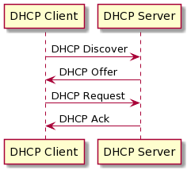
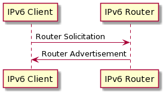

# 12.1 DHCPの設定 #

## 12.1.1 DHCPの仕組み ##




## 12.1.2 DHCPサーバdhcpdの設定 ##

- サーバ代表例
  - ISCDHCP (dhcpd)
- クライアント代表例
  - dhclient
  - pump
  - dhcpcd

```sh
yum provides dhcpd
```

```
Failed to set locale, defaulting to C
Loaded plugins: fastestmirror
Loading mirror speeds from cached hostfile
 * base: ty1.mirror.newmediaexpress.com
 * epel: d2lzkl7pfhq30w.cloudfront.net
 * extras: ty1.mirror.newmediaexpress.com
 * updates: ty1.mirror.newmediaexpress.com
12:dhcp-4.2.5-82.el7.centos.x86_64 : Dynamic host configuration protocol software
Repo        : base
Matched from:
Filename    : /usr/sbin/dhcpd
```

`dhcp`パッケージで入る


``` sh
sudo yum -y install dhcp
```

設定ファイルを見てみる

```sh
sudo cat /etc/dhcp/dhcpd.conf
```

```
#
# DHCP Server Configuration file.
#   see /usr/share/doc/dhcp*/dhcpd.conf.example
#   see dhcpd.conf(5) man page
#
```

何も書いてない

```sh
ls /usr/share/doc/dhcp*
```

```
/usr/share/doc/dhcp-4.2.5:
dhcpd.conf.example  dhcpd6.conf.example  ldap

/usr/share/doc/dhcp-common-4.2.5:
LICENSE  README  RELNOTES  References.txt
```


サンプルは`/usr/share/doc/dhcp-${バージョン}/`にあるもよう

``` sh
cat /usr/share/doc/dhcp-4.2.5/dhcpd.conf.example
```

```
# dhcpd.conf
#
# Sample configuration file for ISC dhcpd
#

# option definitions common to all supported networks...
option domain-name "example.org";
option domain-name-servers ns1.example.org, ns2.example.org;

default-lease-time 600;
max-lease-time 7200;

# Use this to enble / disable dynamic dns updates globally.
#ddns-update-style none;

# If this DHCP server is the official DHCP server for the local
# network, the authoritative directive should be uncommented.
#authoritative;

# Use this to send dhcp log messages to a different log file (you also
# have to hack syslog.conf to complete the redirection).
log-facility local7;

# No service will be given on this subnet, but declaring it helps the 
# DHCP server to understand the network topology.

subnet 10.152.187.0 netmask 255.255.255.0 {
}

# This is a very basic subnet declaration.

subnet 10.254.239.0 netmask 255.255.255.224 {
  range 10.254.239.10 10.254.239.20;
  option routers rtr-239-0-1.example.org, rtr-239-0-2.example.org;
}

# This declaration allows BOOTP clients to get dynamic addresses,
# which we don't really recommend.

subnet 10.254.239.32 netmask 255.255.255.224 {
  range dynamic-bootp 10.254.239.40 10.254.239.60;
  option broadcast-address 10.254.239.31;
  option routers rtr-239-32-1.example.org;
}

# A slightly different configuration for an internal subnet.
subnet 10.5.5.0 netmask 255.255.255.224 {
  range 10.5.5.26 10.5.5.30;
  option domain-name-servers ns1.internal.example.org;
  option domain-name "internal.example.org";
  option routers 10.5.5.1;
  option broadcast-address 10.5.5.31;
  default-lease-time 600;
  max-lease-time 7200;
}

# Hosts which require special configuration options can be listed in
# host statements.   If no address is specified, the address will be
# allocated dynamically (if possible), but the host-specific information
# will still come from the host declaration.

host passacaglia {
  hardware ethernet 0:0:c0:5d:bd:95;
  filename "vmunix.passacaglia";
  server-name "toccata.fugue.com";
}

# Fixed IP addresses can also be specified for hosts.   These addresses
# should not also be listed as being available for dynamic assignment.
# Hosts for which fixed IP addresses have been specified can boot using
# BOOTP or DHCP.   Hosts for which no fixed address is specified can only
# be booted with DHCP, unless there is an address range on the subnet
# to which a BOOTP client is connected which has the dynamic-bootp flag
# set.
host fantasia {
  hardware ethernet 08:00:07:26:c0:a5;
  fixed-address fantasia.fugue.com;
}

# You can declare a class of clients and then do address allocation
# based on that.   The example below shows a case where all clients
# in a certain class get addresses on the 10.17.224/24 subnet, and all
# other clients get addresses on the 10.0.29/24 subnet.

class "foo" {
  match if substring (option vendor-class-identifier, 0, 4) = "SUNW";
}

shared-network 224-29 {
  subnet 10.17.224.0 netmask 255.255.255.0 {
    option routers rtr-224.example.org;
  }
  subnet 10.0.29.0 netmask 255.255.255.0 {
    option routers rtr-29.example.org;
  }
  pool {
    allow members of "foo";
    range 10.17.224.10 10.17.224.250;
  }
  pool {
    deny members of "foo";
    range 10.0.29.10 10.0.29.230;
  }
}
```

- `option`から始まるものはRFC2132等で定義されているもの
- それ以外はDHCPプロトコルで未定義のものやDHCPサーバの制御用


### サブネットごとの設定 ###

```
# A slightly different configuration for an internal subnet.
subnet 10.5.5.0 netmask 255.255.255.224 {
  range 10.5.5.26 10.5.5.30;
  option domain-name-servers ns1.internal.example.org;
  option domain-name "internal.example.org";
  option routers 10.5.5.1;
  option broadcast-address 10.5.5.31;
  default-lease-time 600;
  max-lease-time 7200;
}
```

- `range 10.5.5.26 10.5.5.30`
  - IPアドレスプールの範囲

所与のMACアドレスに対して固定のIPアドレスを割り当てることもできる

```
host fantasia {
  hardware ethernet 08:00:07:26:c0:a5;
  fixed-address fantasia.fugue.com;
}
```


### リース期間 ###

```
default-lease-time 600;
max-lease-time 7200;
```

`max-lease-time`で指定の秒数までリース延長要求を受け入れる

リースはファイルで管理される

教科書的には`/var/lib/dhcp/dhcpd.leases`ファイルだがCentOS7で実際にインストールしたものは `/var/lib/dhcpd/`だった

```sh
ls -l /var/lib/dhcpd/
```

```
total 0
-rw-r--r--. 1 dhcpd dhcpd 0 Oct  1 16:28 dhcpd.leases
-rw-r--r--. 1 dhcpd dhcpd 0 Oct  1 16:28 dhcpd6.leases
```


## 12.1.3 DHCPクライアントの設定 ##

Red Hat系: `/etc/sysconfig/network-scripts/`

```sh
ls -l /etc/sysconfig/network-scripts/
```

```
ifcfg-eth0	 ifdown-eth   ifdown-routes  ifup-aliases  ifup-plip	ifup-tunnel
ifcfg-lo	 ifdown-ippp  ifdown-sit     ifup-bnep	   ifup-plusb	ifup-wireless
ifdown		 ifdown-ipv6  ifdown-tunnel  ifup-eth	   ifup-post	init.ipv6-global
ifdown-Team	 ifdown-isdn  ifup	     ifup-ippp	   ifup-ppp	network-functions
ifdown-TeamPort  ifdown-post  ifup-Team      ifup-ipv6	   ifup-routes	network-functions-ipv6
ifdown-bnep	 ifdown-ppp   ifup-TeamPort  ifup-isdn	   ifup-sit
```

``` sh
cat /etc/sysconfig/network-scripts/ifcfg-eth0
```

```
# Generated by parse-kickstart
IPV6INIT="no"
DHCP_HOSTNAME="localhost"
BOOTPROTO="dhcp"
DEVICE="eth0"
ONBOOT="yes"
UUID="dc63451f-28c0-45e0-99c3-30e97939fb92"
MTU=1460
PERSISTENT_DHCLIENT="y"
IPV6INIT=yes
```

この部分:

```
BOOTPROTO="dhcp"
```

システム起動時にDHCPが有効になる設定がされている

---

Debian系: `/etc/network/interfaces`や、後発の`/etc/netplan`で設定するっぽい

`/etc/network/interfaces`

```
iface eth0 inet dhcp
```

`/etc/netplan`


```yaml
network
    version: 2
    renderer: networkd
    ethernets:
        enp3s0:
            dhcp4: true
            dhcp6: true
```


---

ネットワークインタフェース指定して手動でクライアント起動することもできる

```sh
sudo dhclient -d eth0
```


## 12.1.4 DHCPリレーエージェント ##

CCNAで学んだやつ (`ip helper-address`)

- DHCPはIPアドレスを配るための仕組みなので、はじめクライアントのIPまわりは未設定(当然)
- この状態でDHCP DISCOVER UDPセグメントをDHCPサーバに届けるために、ブロードキャストを用いる
- ブロードキャストはブロードキャストドメインを超えては届かない
- DHCPサーバーがブロードキャストドメインの外にある場合、DHCP DISCOVERを届けるためにリレーエージェントが必要

CCNAではrouterのインタフェースに`ip helper-address`を設定していた

LPICではDHCPサーバーを知っているLinux端末でリレーエージェントを動かす

```sh
dhcrelay -i eth1 172.17.01
```


## 12.1.5 IPv6アドレスの自動設定 ##

IPv6にはSLAACがあるのでDHCP不要

- SLAACではDNSサーバーのIPアドレス等は配れないので、別途DHCPを使うこともある
- ルータからの情報(prefix)と自身のMACアドレスから生成される情報(interface ID)に基づいてIPv6アドレス生成
  - 【補】modified EUI-64



- RS: Router Solicitation (ルータ要請)
- RA: Router Advertisement (ルータ通知)

Linuxでは radvd: Router ADVertisement Daemon for IPv6 パッケージを利用してRouter Advertisementを送信できる

```sh
yum provides radvd
```

```
Failed to set locale, defaulting to C
Loaded plugins: fastestmirror
Loading mirror speeds from cached hostfile
 * base: ty1.mirror.newmediaexpress.com
 * epel: d2lzkl7pfhq30w.cloudfront.net
 * extras: ty1.mirror.newmediaexpress.com
 * updates: ty1.mirror.newmediaexpress.com
radvd-2.17-3.el7.x86_64 : A Router Advertisement daemon
Repo        : base
```


```sh
sudo yum -y install radvd
```


```sh
cat /etc/radvd.conf
```

```
# NOTE: there is no such thing as a working "by-default" configuration file. 
#       At least the prefix needs to be specified.  Please consult the radvd.conf(5)
#       man page and/or /usr/share/doc/radvd-*/radvd.conf.example for help.
#
#
#interface eth0
#{
#	AdvSendAdvert on;
#	MinRtrAdvInterval 30;
#	MaxRtrAdvInterval 100;
#	prefix 2001:db8:1:0::/64
#	{
#		AdvOnLink on;
#		AdvAutonomous on;
#		AdvRouterAddr off;
#	};
#
#};
```


# 12.2 PAM #

PAM: Pluggable Authentication Modules

## 12.2.1 PAMの仕組み ##


- 認証を一元管理し、実装詳細を隠蔽する間接層
  - `/etc/passwd`
  - シャドウパスワード
  - 別ホスト
  - etc.

## 12.2.2 PAMの設定 ##

`pam`パッケージがもともと入っている

```sh
ls -F /etc/pam.d/
```

プログラム名と同名の設定ファイルがずらり


```
atd		   fingerprint-auth-ac	polkit-1      smartcard-auth@	 su		 systemd-user
chfn		   login		postlogin@    smartcard-auth-ac  su-l		 vlock
chsh		   other		postlogin-ac  smtp@		 sudo
config-util	   passwd		remote	      smtp.postfix	 sudo-i
crond		   password-auth@	runuser       squid		 system-auth@
fingerprint-auth@  password-auth-ac	runuser-l     sshd		 system-auth-ac
```

`su`コマンドの認証認可設定:


```sh
cat /etc/pam.d/su
```

```
#%PAM-1.0
auth		sufficient	pam_rootok.so
# Uncomment the following line to implicitly trust users in the "wheel" group.
#auth		sufficient	pam_wheel.so trust use_uid
# Uncomment the following line to require a user to be in the "wheel" group.
#auth		required	pam_wheel.so use_uid
auth		substack	system-auth
auth		include		postlogin
account		sufficient	pam_succeed_if.so uid = 0 use_uid quiet
account		include		system-auth
password	include		system-auth
session		include		system-auth
session		include		postlogin
session		optional	pam_xauth.so
```

書式

```
モジュールタイプ コントロール モジュールのパス [引数]
```

### モジュールタイプ ###

- auth
  - ユーザー認証を行う
- account
  - ユーザー認証ができるか確認
  - パスワードが期限切れでないか、サービスにアクセスすることが許可されているか等
- password
  - パスワードの設定・変更
- session
  - 認証前後の処理
  - ロギング、ユーザが使用するディレクトリのマウント等

### コントロール ###


- `requisite`
  - 「必要条件」
  - 失敗したら後続を評価しない
- `required`
  - 失敗しても後続を評価する
  - どれに失敗したか隠したいときに使用する
- `sufficient`
  - 「十分条件」
  - 成功したら後続を評価しない
- `optional`
  - 失敗しても成功しても後続を評価する
  - つまり、単体指定しない限り、全体の成否には影響しない
- `include`
  - 指定したファイルの設定を読み込んで処理
- `substack`
  - 指定したファイルの設定を読み込んで処理
  - 成否は指定したファイル内で完結


### モジュール・引数 ###

- 認証の実装詳細を吸収する部分
- 例: `pam_pwdb.so`
  - `/etc/passwd`, `/etc/shadow`, NIS等を使ってユーザ認証・パスワード変更を実施


### PAM設定ファイルを読み解く -- 例: su ###

```sh
cat /etc/pam.d/su
```

```
#%PAM-1.0
auth		sufficient	pam_rootok.so
# Uncomment the following line to implicitly trust users in the "wheel" group.
#auth		sufficient	pam_wheel.so trust use_uid
# Uncomment the following line to require a user to be in the "wheel" group.
#auth		required	pam_wheel.so use_uid
auth		substack	system-auth
auth		include		postlogin
account		sufficient	pam_succeed_if.so uid = 0 use_uid quiet
account		include		system-auth
password	include		system-auth
session		include		system-auth
session		include		postlogin
session		optional	pam_xauth.so
```

1行目

```
auth		sufficient	pam_rootok.so
```

- 「rootであれば許可し、以降の評価を行わない」

2行目

```
# Uncomment the following line to implicitly trust users in the "wheel" group.
#auth		sufficient	pam_wheel.so trust use_uid
```

コメントアウトを解除した場合...

- 「wheelグループに所属するユーザのみ許可し、以降の評価を行わない」
- 「wheelグループに所属しないユーザは拒否し、全体としての成否は以降の評価に委ねる」
  - wheelグループに属していなくてもsuできる可能性はある


3行目

```
# Uncomment the following line to require a user to be in the "wheel" group.
#auth		required	pam_wheel.so use_uid
```

コメントアウトを解除した場合...

- 「wheelグループに所属するユーザのみ許可し、全体としての成否は以降の評価に委ねる」
- 「wheelグループに所属しないユーザは拒否し、以降の評価を行わない」
  - wheelグループに属さないとsuできない
  - wheelグループに属していてもsuできない可能性はある


4,5行目

```
auth		substack	system-auth
auth		include		postlogin
```

外部ファイル

```sh
cat /etc/pam.d/system-auth
```

```
#%PAM-1.0
# This file is auto-generated.
# User changes will be destroyed the next time authconfig is run.
auth        required      pam_env.so
auth        required      pam_faildelay.so delay=2000000
auth        sufficient    pam_unix.so nullok try_first_pass
auth        requisite     pam_succeed_if.so uid >= 1000 quiet_success
auth        required      pam_deny.so

account     required      pam_unix.so
account     sufficient    pam_localuser.so
account     sufficient    pam_succeed_if.so uid < 1000 quiet
account     required      pam_permit.so

password    requisite     pam_pwquality.so try_first_pass local_users_only retry=3 authtok_type=
password    sufficient    pam_unix.so sha512 shadow nullok try_first_pass use_authtok
password    required      pam_deny.so

session     optional      pam_keyinit.so revoke
session     required      pam_limits.so
-session     optional      pam_systemd.so
session     [success=1 default=ignore] pam_succeed_if.so service in crond quiet use_uid
session     required      pam_unix.so
```

ユーザログイン時の環境変数を初期設定し、パスワード入力を1度求め、失敗したら2,000,000マイクロ秒 = 2秒待って拒否する

``` sh
cat /etc/pam.d/postlogin
```

```#%PAM-1.0
# This file is auto-generated.
# User changes will be destroyed the next time authconfig is run.


session     [success=1 default=ignore] pam_succeed_if.so service !~ gdm* service !~ su* quiet
session     [default=1]   pam_lastlog.so nowtmp showfailed
session     optional      pam_lastlog.so silent noupdate showfailed
```

ログイン後のロギング


# 12.3 LDAP #

LDAP: Lightweight Directory Access Protocol

ディレクトリサービス -- 各種リソースの名前と属性をツリー状に系統的にまとめて管理するサービス

用例: 

- Active Directory
- SSO


## 12.3.1 LDAPの仕組み ##

### ディレクトリ情報ツリーと識別名 ###

- DIT: Directory Information Tree (ディレクトリ情報ツリー)
  - 情報を格納する階層構造

```
root
`-- dc=jp
    `-- dc=lpic
        `-- ou=Education
            `-- uid=d-horiyama
```

- DN: Distinguished Name (識別名)
  - `属性名=相対識別名`をツリー構造の末尾から`,`で連結したもの
  - 【所感】DNSにおけるFQDNに似ている

```
uid=d-horiyama,ou=Education,dc=lpic,dc=jp
```

「`lpic.jp`ドメインの`Education`部門の`d-horiyama`ユーザ」


### LDIF ###

LDIF: Ldap Data Interchange Format

ディレクトリ内の情報を`属性名: 値`形式で列挙

例: スキーマ定義 (「スキーマ」については後述)

```sh
cat /etc/openldap/schema/inetorgperson.ldif
```


```
# InetOrgPerson (RFC2798)
# $OpenLDAP$
## This work is part of OpenLDAP Software <http://www.openldap.org/>.
##
## Copyright 1998-2016 The OpenLDAP Foundation.
## All rights reserved.
##
## Redistribution and use in source and binary forms, with or without
## modification, are permitted only as authorized by the OpenLDAP
## Public License.
##
## A copy of this license is available in the file LICENSE in the
## top-level directory of the distribution or, alternatively, at
## <http://www.OpenLDAP.org/license.html>.
#
# InetOrgPerson (RFC2798)
#
# Depends upon
#   Definition of an X.500 Attribute Type and an Object Class to Hold
#   Uniform Resource Identifiers (URIs) [RFC2079]
#	(core.ldif)
#
#   A Summary of the X.500(96) User Schema for use with LDAPv3 [RFC2256]
#	(core.ldif)
#
#   The COSINE and Internet X.500 Schema [RFC1274] (cosine.ldif)
#
# This file was automatically generated from inetorgperson.schema; see
# that file for complete references.
#
dn: cn=inetorgperson,cn=schema,cn=config
objectClass: olcSchemaConfig
cn: inetorgperson
olcAttributeTypes: ( 2.16.840.1.113730.3.1.1 NAME 'carLicense' DESC 'RFC279
 8: vehicle license or registration plate' EQUALITY caseIgnoreMatch SUBSTR cas
 eIgnoreSubstringsMatch SYNTAX 1.3.6.1.4.1.1466.115.121.1.15 )
olcAttributeTypes: ( 2.16.840.1.113730.3.1.2 NAME 'departmentNumber' DESC '
 RFC2798: identifies a department within an organization' EQUALITY caseIgnoreM
 atch SUBSTR caseIgnoreSubstringsMatch SYNTAX 1.3.6.1.4.1.1466.115.121.1.15 )
olcAttributeTypes: ( 2.16.840.1.113730.3.1.241 NAME 'displayName' DESC 'RFC
 2798: preferred name to be used when displaying entries' EQUALITY caseIgnoreM
 atch SUBSTR caseIgnoreSubstringsMatch SYNTAX 1.3.6.1.4.1.1466.115.121.1.15 SI
 NGLE-VALUE )
olcAttributeTypes: ( 2.16.840.1.113730.3.1.3 NAME 'employeeNumber' DESC 'RF
 C2798: numerically identifies an employee within an organization' EQUALITY ca
 seIgnoreMatch SUBSTR caseIgnoreSubstringsMatch SYNTAX 1.3.6.1.4.1.1466.115.12
 1.1.15 SINGLE-VALUE )
olcAttributeTypes: ( 2.16.840.1.113730.3.1.4 NAME 'employeeType' DESC 'RFC2
 798: type of employment for a person' EQUALITY caseIgnoreMatch SUBSTR caseIgn
 oreSubstringsMatch SYNTAX 1.3.6.1.4.1.1466.115.121.1.15 )
olcAttributeTypes: ( 0.9.2342.19200300.100.1.60 NAME 'jpegPhoto' DESC 'RFC2
 798: a JPEG image' SYNTAX 1.3.6.1.4.1.1466.115.121.1.28 )
olcAttributeTypes: ( 2.16.840.1.113730.3.1.39 NAME 'preferredLanguage' DESC
  'RFC2798: preferred written or spoken language for a person' EQUALITY caseIg
 noreMatch SUBSTR caseIgnoreSubstringsMatch SYNTAX 1.3.6.1.4.1.1466.115.121.1.
 15 SINGLE-VALUE )
olcAttributeTypes: ( 2.16.840.1.113730.3.1.40 NAME 'userSMIMECertificate' D
 ESC 'RFC2798: PKCS#7 SignedData used to support S/MIME' SYNTAX 1.3.6.1.4.1.14
 66.115.121.1.5 )
olcAttributeTypes: ( 2.16.840.1.113730.3.1.216 NAME 'userPKCS12' DESC 'RFC2
 798: personal identity information, a PKCS #12 PFX' SYNTAX 1.3.6.1.4.1.1466.1
 15.121.1.5 )
olcObjectClasses: ( 2.16.840.1.113730.3.2.2 NAME 'inetOrgPerson' DESC 'RFC2
 798: Internet Organizational Person' SUP organizationalPerson STRUCTURAL MAY 
 ( audio $ businessCategory $ carLicense $ departmentNumber $ displayName $ em
 ployeeNumber $ employeeType $ givenName $ homePhone $ homePostalAddress $ ini
 tials $ jpegPhoto $ labeledURI $ mail $ manager $ mobile $ o $ pager $ photo 
 $ roomNumber $ secretary $ uid $ userCertificate $ x500uniqueIdentifier $ pre
 ferredLanguage $ userSMIMECertificate $ userPKCS12 ) )
```

### スキーマ ###

一般的な用途向けにあらかじめ用意されている属性やオブジェクトクラス

``` sh
cat /etc/openldap/schema/inetorgperson.schema
```

```
# inetorgperson.schema -- InetOrgPerson (RFC2798)
# $OpenLDAP$
## This work is part of OpenLDAP Software <http://www.openldap.org/>.
##
## Copyright 1998-2016 The OpenLDAP Foundation.
## All rights reserved.
##
## Redistribution and use in source and binary forms, with or without
## modification, are permitted only as authorized by the OpenLDAP
## Public License.
##
## A copy of this license is available in the file LICENSE in the
## top-level directory of the distribution or, alternatively, at
## <http://www.OpenLDAP.org/license.html>.
#
# InetOrgPerson (RFC2798)
#
# Depends upon
#   Definition of an X.500 Attribute Type and an Object Class to Hold
#   Uniform Resource Identifiers (URIs) [RFC2079]
#	(core.schema)
#
#   A Summary of the X.500(96) User Schema for use with LDAPv3 [RFC2256]
#	(core.schema)
#
#   The COSINE and Internet X.500 Schema [RFC1274] (cosine.schema)

# carLicense
# This multivalued field is used to record the values of the license or
# registration plate associated with an individual.
attributetype ( 2.16.840.1.113730.3.1.1
	NAME 'carLicense'
	DESC 'RFC2798: vehicle license or registration plate'
	EQUALITY caseIgnoreMatch
	SUBSTR caseIgnoreSubstringsMatch
	SYNTAX 1.3.6.1.4.1.1466.115.121.1.15 )

# departmentNumber
# Code for department to which a person belongs.  This can also be
# strictly numeric (e.g., 1234) or alphanumeric (e.g., ABC/123).
attributetype ( 2.16.840.1.113730.3.1.2
	NAME 'departmentNumber'
	DESC 'RFC2798: identifies a department within an organization'
	EQUALITY caseIgnoreMatch
	SUBSTR caseIgnoreSubstringsMatch
	SYNTAX 1.3.6.1.4.1.1466.115.121.1.15 )

# displayName
# When displaying an entry, especially within a one-line summary list, it
# is useful to be able to identify a name to be used.  Since other attri-
# bute types such as 'cn' are multivalued, an additional attribute type is
# needed.  Display name is defined for this purpose.
attributetype ( 2.16.840.1.113730.3.1.241
	NAME 'displayName'
	DESC 'RFC2798: preferred name to be used when displaying entries'
	EQUALITY caseIgnoreMatch
	SUBSTR caseIgnoreSubstringsMatch
	SYNTAX 1.3.6.1.4.1.1466.115.121.1.15
	SINGLE-VALUE )

# employeeNumber
# Numeric or alphanumeric identifier assigned to a person, typically based
# on order of hire or association with an organization.  Single valued.
attributetype ( 2.16.840.1.113730.3.1.3
	NAME 'employeeNumber'
	DESC 'RFC2798: numerically identifies an employee within an organization'
	EQUALITY caseIgnoreMatch
	SUBSTR caseIgnoreSubstringsMatch
	SYNTAX 1.3.6.1.4.1.1466.115.121.1.15
	SINGLE-VALUE )

# employeeType
# Used to identify the employer to employee relationship.  Typical values
# used will be "Contractor", "Employee", "Intern", "Temp", "External", and
# "Unknown" but any value may be used.
attributetype ( 2.16.840.1.113730.3.1.4
	NAME 'employeeType'
	DESC 'RFC2798: type of employment for a person'
	EQUALITY caseIgnoreMatch
	SUBSTR caseIgnoreSubstringsMatch
	SYNTAX 1.3.6.1.4.1.1466.115.121.1.15 )

# jpegPhoto
# Used to store one or more images of a person using the JPEG File
# Interchange Format [JFIF].
# Note that the jpegPhoto attribute type was defined for use in the
# Internet X.500 pilots but no referencable definition for it could be
# located.
attributetype ( 0.9.2342.19200300.100.1.60
	NAME 'jpegPhoto'
	DESC 'RFC2798: a JPEG image'
	SYNTAX 1.3.6.1.4.1.1466.115.121.1.28 )

# preferredLanguage
# Used to indicate an individual's preferred written or spoken
# language.  This is useful for international correspondence or human-
# computer interaction.  Values for this attribute type MUST conform to
# the definition of the Accept-Language header field defined in
# [RFC2068] with one exception:  the sequence "Accept-Language" ":"
# should be omitted.  This is a single valued attribute type.
attributetype ( 2.16.840.1.113730.3.1.39
	NAME 'preferredLanguage'
	DESC 'RFC2798: preferred written or spoken language for a person'
	EQUALITY caseIgnoreMatch
	SUBSTR caseIgnoreSubstringsMatch
	SYNTAX 1.3.6.1.4.1.1466.115.121.1.15
	SINGLE-VALUE )

# userSMIMECertificate
# A PKCS#7 [RFC2315] SignedData, where the content that is signed is
# ignored by consumers of userSMIMECertificate values.  It is
# recommended that values have a `contentType' of data with an absent
# `content' field.  Values of this attribute contain a person's entire
# certificate chain and an smimeCapabilities field [RFC2633] that at a
# minimum describes their SMIME algorithm capabilities.  Values for
# this attribute are to be stored and requested in binary form, as
# 'userSMIMECertificate;binary'.  If available, this attribute is
# preferred over the userCertificate attribute for S/MIME applications.
## OpenLDAP note: ";binary" transfer should NOT be used as syntax is binary
attributetype ( 2.16.840.1.113730.3.1.40
	NAME 'userSMIMECertificate'
	DESC 'RFC2798: PKCS#7 SignedData used to support S/MIME'
	SYNTAX 1.3.6.1.4.1.1466.115.121.1.5 )

# userPKCS12
# PKCS #12 [PKCS12] provides a format for exchange of personal identity
# information.  When such information is stored in a directory service,
# the userPKCS12 attribute should be used. This attribute is to be stored
# and requested in binary form, as 'userPKCS12;binary'.  The attribute
# values are PFX PDUs stored as binary data.
## OpenLDAP note: ";binary" transfer should NOT be used as syntax is binary
attributetype ( 2.16.840.1.113730.3.1.216
	NAME 'userPKCS12'
	DESC 'RFC2798: personal identity information, a PKCS #12 PFX'
	SYNTAX 1.3.6.1.4.1.1466.115.121.1.5 )


# inetOrgPerson
# The inetOrgPerson represents people who are associated with an
# organization in some way.  It is a structural class and is derived
# from the organizationalPerson which is defined in X.521 [X521].
objectclass	( 2.16.840.1.113730.3.2.2
    NAME 'inetOrgPerson'
	DESC 'RFC2798: Internet Organizational Person'
    SUP organizationalPerson
    STRUCTURAL
	MAY (
		audio $ businessCategory $ carLicense $ departmentNumber $
		displayName $ employeeNumber $ employeeType $ givenName $
		homePhone $ homePostalAddress $ initials $ jpegPhoto $
		labeledURI $ mail $ manager $ mobile $ o $ pager $
		photo $ roomNumber $ secretary $ uid $ userCertificate $
		x500uniqueIdentifier $ preferredLanguage $
		userSMIMECertificate $ userPKCS12 )
	)
```


### オブジェクト識別子(OID: Object IDentifier) ###

属性やオブジェクトクラスに割り当てられるGlobally UniqueなID


```
# carLicense
# This multivalued field is used to record the values of the license or
# registration plate associated with an individual.
attributetype ( 2.16.840.1.113730.3.1.1
	NAME 'carLicense'
	DESC 'RFC2798: vehicle license or registration plate'
	EQUALITY caseIgnoreMatch
	SUBSTR caseIgnoreSubstringsMatch
	SYNTAX 1.3.6.1.4.1.1466.115.121.1.15 )
```

```
# inetOrgPerson
# The inetOrgPerson represents people who are associated with an
# organization in some way.  It is a structural class and is derived
# from the organizationalPerson which is defined in X.521 [X521].
objectclass	( 2.16.840.1.113730.3.2.2
    NAME 'inetOrgPerson'
	DESC 'RFC2798: Internet Organizational Person'
    SUP organizationalPerson
    STRUCTURAL
	MAY (
		audio $ businessCategory $ carLicense $ departmentNumber $
		displayName $ employeeNumber $ employeeType $ givenName $
		homePhone $ homePostalAddress $ initials $ jpegPhoto $
		labeledURI $ mail $ manager $ mobile $ o $ pager $
		photo $ roomNumber $ secretary $ uid $ userCertificate $
		x500uniqueIdentifier $ preferredLanguage $
		userSMIMECertificate $ userPKCS12 )
	)
```

上記の例では:

 - `carLicense`属性: `2.16.840.1.113730.3.1.1`
 - `inetOrgPerson`オブジェクトクラス:  `2.16.840.1.113730.3.2.2`

新しい属性やオブジェクトクラスを定義してディレクトリサービスを外部公開する場合は、IANAにOID割り当て申請が必要


### ホワイトページ ###

- white pages: 「個人名別電話帳」の意
  - cf. yellow pages: 「職業別電話帳」
- LDAPでホワイトページを作成し、個人別データを登録しておくことで、メーラなどと連携してN/W経由で情報検索できる
- inetorgperson.schemaで定義されている`inetOrgPerson`クラスを使うのが一般的


```
# inetOrgPerson
# The inetOrgPerson represents people who are associated with an
# organization in some way.  It is a structural class and is derived
# from the organizationalPerson which is defined in X.521 [X521].
objectclass	( 2.16.840.1.113730.3.2.2
    NAME 'inetOrgPerson'
	DESC 'RFC2798: Internet Organizational Person'
    SUP organizationalPerson
    STRUCTURAL
	MAY (
		audio $ businessCategory $ carLicense $ departmentNumber $
		displayName $ employeeNumber $ employeeType $ givenName $
		homePhone $ homePostalAddress $ initials $ jpegPhoto $
		labeledURI $ mail $ manager $ mobile $ o $ pager $
		photo $ roomNumber $ secretary $ uid $ userCertificate $
		x500uniqueIdentifier $ preferredLanguage $
		userSMIMECertificate $ userPKCS12 )
	)
```

core.schemaで定義されている`organizationalPerson`を継承している

```
objectclass ( 2.5.6.7 NAME 'organizationalPerson'
	DESC 'RFC2256: an organizational person'
	SUP person STRUCTURAL
	MAY ( title $ x121Address $ registeredAddress $ destinationIndicator $
		preferredDeliveryMethod $ telexNumber $ teletexTerminalIdentifier $
		telephoneNumber $ internationaliSDNNumber $ 
		facsimileTelephoneNumber $ street $ postOfficeBox $ postalCode $
		postalAddress $ physicalDeliveryOfficeName $ ou $ st $ l ) )
```

さらにpersonを継承

```
objectclass ( 2.5.6.6 NAME 'person'
	DESC 'RFC2256: a person'
	SUP top STRUCTURAL
	MUST ( sn $ cn )
	MAY ( userPassword $ telephoneNumber $ seeAlso $ description ) )
```

ほか、cosine.schemaで定義されているaudio属性にも依存している

```
attributetype ( 0.9.2342.19200300.100.1.55 NAME 'audio'
	DESC 'RFC1274: audio (u-law)'
	SYNTAX 1.3.6.1.4.1.1466.115.121.1.4{25000} )
```


#### inetOrgPersonクラスの主な属性 ####

- `cn`: 一般名(common name)

```
# system schema
#attributetype ( 2.5.4.3 NAME ( 'cn' 'commonName' )
#	DESC 'RFC2256: common name(s) for which the entity is known by'
#	SUP name )
```

- `sn`: 名字(surname)

```
attributetype ( 2.5.4.4 NAME ( 'sn' 'surname' )
	DESC 'RFC2256: last (family) name(s) for which the entity is known by'
	SUP name )
```

- `mail`: メールアドレス
  - `email`もあるがdeprecated

```
attributetype ( 0.9.2342.19200300.100.1.3
	NAME ( 'mail' 'rfc822Mailbox' )
	DESC 'RFC1274: RFC822 Mailbox'
    EQUALITY caseIgnoreIA5Match
    SUBSTR caseIgnoreIA5SubstringsMatch
    SYNTAX 1.3.6.1.4.1.1466.115.121.1.26{256} )
```

- `dc`: domain component
  - ドメイン名を構成するもの(`dc=lpic,dc=jp`とか)

```
# RFC 1274 + RFC 2247
attributetype ( 0.9.2342.19200300.100.1.25
	NAME ( 'dc' 'domainComponent' )
	DESC 'RFC1274/2247: domain component'
	EQUALITY caseIgnoreIA5Match
	SUBSTR caseIgnoreIA5SubstringsMatch
	SYNTAX 1.3.6.1.4.1.1466.115.121.1.26 SINGLE-VALUE )
```

- `o`: 組織名

```
attributetype ( 2.5.4.10 NAME ( 'o' 'organizationName' )
	DESC 'RFC2256: organization this object belongs to'
	SUP name )
```

- `ou`: 組織単位名
  - 部門のこと

```
attributetype ( 2.5.4.11 NAME ( 'ou' 'organizationalUnitName' )
	DESC 'RFC2256: organizational unit this object belongs to'
	SUP name )
```

- `street`: 住所

```
attributetype ( 2.5.4.9 NAME ( 'street' 'streetAddress' )
	DESC 'RFC2256: street address of this object'
	EQUALITY caseIgnoreMatch
	SUBSTR caseIgnoreSubstringsMatch
	SYNTAX 1.3.6.1.4.1.1466.115.121.1.15{128} )
```

- `postalCode`: 郵便番号

```
attributetype ( 2.5.4.17 NAME 'postalCode'
	DESC 'RFC2256: postal code'
	EQUALITY caseIgnoreMatch
	SUBSTR caseIgnoreSubstringsMatch
	SYNTAX 1.3.6.1.4.1.1466.115.121.1.15{40} )
```

- `telephoneNumber`: 電話番号

```
attributetype ( 2.5.4.20 NAME 'telephoneNumber'
	DESC 'RFC2256: Telephone Number'
	EQUALITY telephoneNumberMatch
	SUBSTR telephoneNumberSubstringsMatch
	SYNTAX 1.3.6.1.4.1.1466.115.121.1.50{32} )
```

- `description`: 説明

```
# system schema
#attributetype ( 2.5.4.13 NAME 'description'
#	DESC 'RFC2256: descriptive information'
#	EQUALITY caseIgnoreMatch
#	SUBSTR caseIgnoreSubstringsMatch
#	SYNTAX 1.3.6.1.4.1.1466.115.121.1.15{1024} )
```


## 12.3.2 LDAPサーバの設定 ##

### slapdインストール ###

slapd: Stand-alone LDAP Daemon (manより)


CentOS7:

```sh
sudo yum -y install openldap openldap-clients openldap-servers
```

Ubuntu:

``` sh
sudo apt-get install -y slapd ldap-utils
```

Ubuntuの場合パスワードの設定を求められる

```
Please enter the password for the admin entry in your LDAP directory.
Administrator password: wand

Please enter the admin password for your LDAP directory again to verify that you have typed it correctly.
Confirm password: wand
```

---


設定ファイル: `/etc/openldap/slapd.conf` ということになっているが無かった

``` sh
ls /etc/openldap/slapd.conf
```

```
ls: cannot access /etc/openldap/slapd.conf: No such file or directory
```

- OLC: OnLine Configuration 
  - きょうびは `/etc/openldap/slapd.d/`内に設定が格納され、設定自体もLDAPで動的に変更できるらしい

``` sh
sudo ls -lF /etc/openldap/slapd.d/
```

```
total 4
drwxr-x---. 3 ldap ldap 182 Jan  2 12:25 cn=config/
-rw-------. 1 ldap ldap 589 Jan  2 12:25 cn=config.ldif
```


``` sh
sudo cat /etc/openldap/slapd.d/cn=config.ldif
```

```
# AUTO-GENERATED FILE - DO NOT EDIT!! Use ldapmodify.
# CRC32 19f2912e
dn: cn=config
objectClass: olcGlobal
cn: config
olcArgsFile: /var/run/openldap/slapd.args
olcPidFile: /var/run/openldap/slapd.pid
olcTLSCACertificatePath: /etc/openldap/certs
olcTLSCertificateFile: "OpenLDAP Server"
olcTLSCertificateKeyFile: /etc/openldap/certs/password
structuralObjectClass: olcGlobal
entryUUID: 66bba40e-e141-103a-9b58-7b99d11165d6
creatorsName: cn=config
createTimestamp: 20210102122553Z
entryCSN: 20210102122553.691409Z#000000#000#000000
modifiersName: cn=config
modifyTimestamp: 20210102122553Z
```


### アクセス制御 ###

``` sh
sudo cat '/etc/openldap/slapd.d/cn=config/olcDatabase={0}config.ldif'
```

```
# AUTO-GENERATED FILE - DO NOT EDIT!! Use ldapmodify.
# CRC32 26f9b443
dn: olcDatabase={0}config
objectClass: olcDatabaseConfig
olcDatabase: {0}config
olcAccess: {0}to * by dn.base="gidNumber=0+uidNumber=0,cn=peercred,cn=extern
 al,cn=auth" manage by * none
structuralObjectClass: olcDatabaseConfig
entryUUID: 66bbf7b0-e141-103a-9b5c-7b99d11165d6
creatorsName: cn=config
createTimestamp: 20210102122553Z
entryCSN: 20210102122553.693654Z#000000#000#000000
modifiersName: cn=config
modifyTimestamp: 20210102122553Z
```

この部分:

```
olcAccess: {0}to * by dn.base="gidNumber=0+uidNumber=0,cn=peercred,cn=extern
 al,cn=auth" manage by * none
```

旧`slapd.conf`における下記設定に相当:

```
access to *
       by dn.base="gidNumber=0+uidNumber=0,cn=peercred,cn=external,cn=auth" manage 
       by * none
```

- `to *`
  - すべてのエントリについて
- `by dn.base="gidNumber=0+uidNumber=0,cn=peercred,cn=external,cn=auth" manage`
  - このユーザーたちは属性値変更・参照・検索・比較・認証もろもろ全て可能
- `by * none`
  - それ以外のユーザーの全てのアクセスを禁ずる

`man 5 slapd.access`に詳しい


### LDAPサーバの管理コマンド ###

サービス開始

``` sh
sudo systemctl start slapd 
```

#### `slappasswd` ####

管理者パスワード生成

```sh
sudo slappasswd

New password: wand
Re-enter new password: wand
```

```
{SSHA}wR9Hugk83CY1rDA16ehejZpKLwY3DdfG
```

生成してくれるだけなので別途設定が必要

- 昔はslapd.confのrootpwパラメータを設定するだけでよかったみたい
- OLCが採用され、`/etc/openldap/slapd.d/`下でコンフィグもLDAP管理されるようになった今では`ldapadd`コマンドで設定する(後述):


#### `slapcat` ####

ダンプ

```sh
sudo slapcat
```

```
5ff07c67 The first database does not allow slapcat; using the first available one (2)
5ff07c67 hdb_db_open: warning - no DB_CONFIG file found in directory /var/lib/ldap: (2).
Expect poor performance for suffix "dc=my-domain,dc=com".
```

「2番目のDBを使え」と言われる

- 0番目: OLC用
- 1番目: モニターデータベース


```sh
sudo cat '/etc/openldap/slapd.d/cn=config/olcDatabase={1}monitor.ldif'
```

```
# AUTO-GENERATED FILE - DO NOT EDIT!! Use ldapmodify.
# CRC32 6ae3a39a
dn: olcDatabase={1}monitor
objectClass: olcDatabaseConfig
olcDatabase: {1}monitor
olcAccess: {0}to * by dn.base="gidNumber=0+uidNumber=0,cn=peercred,cn=extern
 al,cn=auth" read by dn.base="cn=Manager,dc=my-domain,dc=com" read by * none
structuralObjectClass: olcDatabaseConfig
entryUUID: 66bbfc2e-e141-103a-9b5d-7b99d11165d6
creatorsName: cn=config
createTimestamp: 20210102122553Z
entryCSN: 20210102122553.693769Z#000000#000#000000
modifiersName: cn=config
modifyTimestamp: 20210102122553Z
```

これらが予約されているので2番目から使いましょう、ということ


```sh
sudo slapcat -n 2
```

```
5ff07f34 hdb_db_open: warning - no DB_CONFIG file found in directory /var/lib/ldap: (2).
Expect poor performance for suffix "dc=my-domain,dc=com".
```

コンフィグが設定されていないそう

exampleが用意されているのでひとまずそのまま使う

```sh
cat  /usr/share/openldap-servers/DB_CONFIG.example
```

```
# $OpenLDAP$
# Example DB_CONFIG file for use with slapd(8) BDB/HDB databases.
#
# See the Oracle Berkeley DB documentation
#   <http://www.oracle.com/technology/documentation/berkeley-db/db/ref/env/db_config.html>
# for detail description of DB_CONFIG syntax and semantics.
#
# Hints can also be found in the OpenLDAP Software FAQ
#	<http://www.openldap.org/faq/index.cgi?file=2>
# in particular:
#   <http://www.openldap.org/faq/index.cgi?file=1075>

# Note: most DB_CONFIG settings will take effect only upon rebuilding
# the DB environment.

# one 0.25 GB cache
set_cachesize 0 268435456 1

# Data Directory
#set_data_dir db

# Transaction Log settings
set_lg_regionmax 262144
set_lg_bsize 2097152
#set_lg_dir logs

# Note: special DB_CONFIG flags are no longer needed for "quick"
# slapadd(8) or slapindex(8) access (see their -q option). 
```

```sh
sudo cp /usr/share/openldap-servers/DB_CONFIG.example /var/lib/ldap/DB_CONFIG

sudo slapcat -n 2
```

```
5ff07f92 hdb_db_open: DB_CONFIG for suffix "dc=my-domain,dc=com" has changed.
5ff07f92 Performing database recovery to activate new settings.
5ff07f92 hdb_db_open: database "dc=my-domain,dc=com": recovery skipped in read-only mode. Run manual recovery if errors are encountered.
```

もう一度

```sh
sudo slapcat -n 2 
```

```
(空)
```

エラーや警告なく、空がダンプされるようになった。OK


#### `slapadd` ####

リストア等に使う

`slapadd -l ファイル名`: リストア

#### `slapindex` ####


インデックス再構築


## 12.3.3 LDAPクライアントの利用 ##

### ldapadd ###

- 設定追加・変更・削除
- データ投入


サンプルデータ

``` sh
vi sample.ldif
```

```ldif
dn: dc=lpic,dc=jp
objectClass: dcObject
objectClass: organization
o: lpic2sample
dc: lpic

dn: ou=People,dc=lpic,dc=jp
objectClass: organizationalUnit
ou: People

dn: cn=d-horiyama,ou=People,dc=lpic,dc=jp
objectClass: inetOrgPerson
sn: horiyama
cn: daiki
mail: info@example.com
```


`inetOrgPerson`クラスを用いるためのスキーマが足りてないので追加する


``` sh
sudo ls '/etc/openldap/slapd.d/cn=config/cn=schema/'
```

```
cn={0}core.ldif
```

`-Y EXTERNAL`で管理パスワード無しでねじ込む


``` sh
sudo ldapadd -Y EXTERNAL -H ldapi:// -f /etc/openldap/schema/cosine.ldif
sudo ldapadd -Y EXTERNAL -H ldapi:// -f /etc/openldap/schema/inetorgperson.ldif
```

``` sh
sudo ls '/etc/openldap/slapd.d/cn=config/cn=schema/'
```

```
cn={0}core.ldif  cn={1}cosine.ldif  cn={2}inetorgperson.ldif
```


データベース2のセットアップ (rootpwの設定等)


``` sh
vi hdbconfig.ldif
```

```ldif
dn: olcDatabase={2}hdb,cn=config
changetype: modify
replace: olcSuffix
olcSuffix: dc=lpic,dc=jp
-
replace: olcRootDN
olcRootDN: cn=Manager,dc=lpic,dc=jp
-
add: olcRootPW
olcRootPW: {SSHA}wR9Hugk83CY1rDA16ehejZpKLwY3DdfG
-
add: olcDbIndex
olcDbIndex: uid eq
olcDbIndex: entryCSN,entryUUID eq
-
replace: olcAccess
olcAccess: to *
  by dn.base="gidNumber=0+uidNumber=0,cn=peercred,cn=external,cn=auth" manage
  by * none
```

設定反映


``` sh
sudo ldapadd -Y EXTERNAL -H ldapi:// -f ./hdbconfig.ldif
```


サンプルデータ投入

``` sh
ldapadd -x -D "cn=Manager,dc=lpic,dc=jp" -W -f ./sample.ldif

Enter LDAP Password: wand
```

管理コマンドでデータ確認

```sh
sudo slapcat -n 2
```

```
dn: dc=lpic,dc=jp
objectClass: dcObject
objectClass: organization
o: lpic2sample
dc: lpic
structuralObjectClass: organization
entryUUID: 138e9c8e-e158-103a-8521-471b31b7d784
creatorsName: cn=Manager,dc=lpic,dc=jp
createTimestamp: 20210102150812Z
entryCSN: 20210102150812.570283Z#000000#000#000000
modifiersName: cn=Manager,dc=lpic,dc=jp
modifyTimestamp: 20210102150812Z

dn: ou=People,dc=lpic,dc=jp
objectClass: organizationalUnit
ou: People
structuralObjectClass: organizationalUnit
entryUUID: 139d1232-e158-103a-8522-471b31b7d784
creatorsName: cn=Manager,dc=lpic,dc=jp
createTimestamp: 20210102150812Z
entryCSN: 20210102150812.665052Z#000000#000#000000
modifiersName: cn=Manager,dc=lpic,dc=jp
modifyTimestamp: 20210102150812Z

dn: cn=d-horiyama,ou=People,dc=lpic,dc=jp
objectClass: inetOrgPerson
sn: horiyama
cn: daiki
cn: d-horiyama
mail: info@example.com
structuralObjectClass: inetOrgPerson
entryUUID: 7197fe04-e15a-103a-8528-471b31b7d784
creatorsName: cn=Manager,dc=lpic,dc=jp
createTimestamp: 20210102152509Z
entryCSN: 20210102152509.331057Z#000000#000#000000
modifiersName: cn=Manager,dc=lpic,dc=jp
modifyTimestamp: 20210102152509Z
```

### ldapsearch ###

検索

```sh
ldapsearch -LLL -x -D "cn=Manager,dc=lpic,dc=jp" -W -b "dc=lpic,dc=jp"

Enter LDAP Password: wand
```

```
dn: dc=lpic,dc=jp
objectClass: dcObject
objectClass: organization
o: lpic2sample
dc: lpic

dn: ou=People,dc=lpic,dc=jp
objectClass: organizationalUnit
ou: People

dn: cn=d-horiyama,ou=People,dc=lpic,dc=jp
objectClass: inetOrgPerson
sn: horiyama
cn: daiki
cn: d-horiyama
mail: info@example.com
```

名字が`horiyama`の人を探してみる

``` sh
ldapsearch -LLL -x -D "cn=Manager,dc=lpic,dc=jp" -W -b "dc=lpic,dc=jp" "(sn=horiyama)"

Enter LDAP Password: wand
```

```
dn: cn=d-horiyama,ou=People,dc=lpic,dc=jp
objectClass: inetOrgPerson
sn: horiyama
cn: daiki
cn: d-horiyama
mail: info@example.com
```

### 他コマンド ###

- `ldapdelete`
  - エントリ削除
- `ldapmodify`
  - エントリ変更
- `ldappasswd`
  - パスワード変更


削除・変更についてもldifファイルで`add:`の代わりに`replace:`や`delete:`を書けば`ldapadd`でできるっぽい


## 12.3.4 SSSD ##

- LDAPで認証を一元管理できる
- しかしLDAPサーバに負荷が集中し障害が起きると影響が大きい

SSSD: System Security Service Daemon

- LDAPサーバの情報をキャッシュ
- LDAPサーバ停止時の可用性を高める


``` sh
yum provides sssd
```

```
Failed to set locale, defaulting to C
Loaded plugins: fastestmirror
Loading mirror speeds from cached hostfile
 * base: ty1.mirror.newmediaexpress.com
 * epel: d2lzkl7pfhq30w.cloudfront.net
 * extras: ty1.mirror.newmediaexpress.com
 * updates: ty1.mirror.newmediaexpress.com
sssd-1.16.5-10.el7.x86_64 : System Security Services Daemon
Repo        : base


sssd-1.16.5-10.el7_9.5.x86_64 : System Security Services Daemon
Repo        : updates


sssd-1.16.5-10.el7_9.6.x86_64 : System Security Services Daemon
Repo        : updates
```

`sssd`パッケージで入る

```sh
sudo yum -y install sssd
```

教科書的には`/etc/sssd/sssd.conf`で設定することになっているが…

```sh
sudo ls -lFR /etc/sssd/
/etc/sssd/:
total 0
drwx--x--x. 2 sssd sssd 6 Dec 15 16:44 conf.d/

/etc/sssd/conf.d:
total 0
```

空っぽなんですけど

https://qiita.com/s5601026/items/8c5f16a2935ccd7fb305


> /etc/sssd/sssd.confを作成します。なお元となるファイルはないため、以下をベースに1から作成します。

ないらしい

おそらく出題範囲外だと当面使わなそうなので省略…

sssdを使用するときは `/etc/nsswitch.conf`で`sss`を指定する


``` sh
cat /etc/nsswitch.conf
```

```
...
passwd:     files sss
shadow:     files sss
group:      files sss
#initgroups: files sss
...
```
