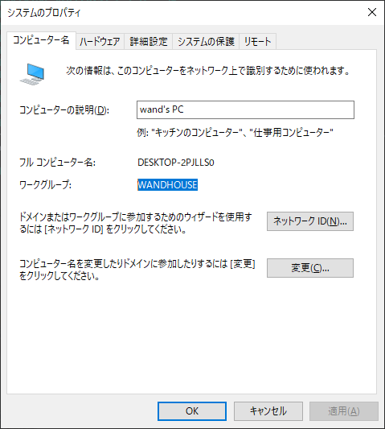
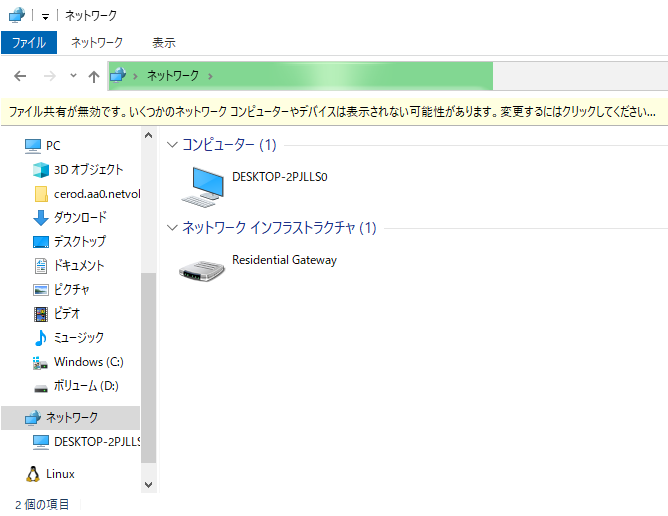

# 11.1 Microsoftネットワーク #

## 11.1.1 Microsoftネットワークで使われる概念 ##

### ワークグループとドメイン ###

- ワークグループ
  - コンピュータをひとくくり




### マスターブラウザ ###



- 同一ネットワークセグメント内のホストのリストを取りまとめる特別なホスト
- セグ内で必ず1つ以上選出される
  - 32台ごとに1台のバックアップブラウザが選出される


### NTドメインとADドメイン ###

**DNSとは関係ない**

- NTドメイン
  - Windowsホストをグループ化する単位
- AD(Active Directory)ドメイン
  - NTドメインと異なり、複数のドメインを階層構造で管理できるのが特徴
  - SambaではADのドメインコントローラ機能の一部をサポート


### ドメインコントローラ

- ドメインを管理するサーバ
  - ドメイン内のユーザに対してログオン認証する
  - ユーザアカウントやグループなどの情報を登録


### NetBIOS ###

- NetBIOS
  - Microsoftネットワーク用API
- NetBIOS名
  - 15バイト以内の名前
  - 1バイト通信アプリケーション情報
- NetBIOS over TCP/IP
  - NetBIOSをTCP/IP上で使えるようにする仕組み
  - 例: NetBIOS名名前解決はUDP137番
  - TCP/IP以前はNetBEUIやIPX/SPX上で動作させていた
- WINS
  - NetBIOS名をIPアドレスに名前解決する仕組み
  - winbind等の実装が知られている


### SMB, CIFS ###

- SMB: Server Message Block
- CIFS: Common Internet File System

プロトコルスタック

```
SMB
---
NetBIOSインタフェース
---
TCP/IP, NetBEUI, IPX/SPX
---
ネットワークインタフェース
```

```
CIFS
---
TCP/IP
---
ネットワークインタフェース
```

CIFS

- SMB拡張
- NetBIOSインタフェースを使用せず、TCP/IPに直接乗っかる


### WINSサーバ ###

WINS: Windows Internet Naming Service

NetBIOS名とIPアドレスの名前解決


lmhostsファイル: `/etc/hosts`のNetBIOS名版

``` sh
cat /etc/samba/lmhosts
```

```
127.0.0.1 localhost
```

windowsのやつ

```
C:\WINDOWS\System32\drivers\etc\lmhosts.sam
```

```
# Copyright (c) 1993-1999 Microsoft Corp.
#
# This is a sample LMHOSTS file used by the Microsoft TCP/IP for Windows.
#
# This file contains the mappings of IP addresses to computernames
# (NetBIOS) names.  Each entry should be kept on an individual line.
# The IP address should be placed in the first column followed by the
# corresponding computername. The address and the computername
# should be separated by at least one space or tab. The "#" character
# is generally used to denote the start of a comment (see the exceptions
# below).
#
# This file is compatible with Microsoft LAN Manager 2.x TCP/IP lmhosts
# files and offers the following extensions:
#
#      #PRE
#      #DOM:<domain>
#      #INCLUDE <filename>
#      #BEGIN_ALTERNATE
#      #END_ALTERNATE
#      \0xnn (non-printing character support)
#
# Following any entry in the file with the characters "#PRE" will cause
# the entry to be preloaded into the name cache. By default, entries are
# not preloaded, but are parsed only after dynamic name resolution fails.
#
# Following an entry with the "#DOM:<domain>" tag will associate the
# entry with the domain specified by <domain>. This affects how the
# browser and logon services behave in TCP/IP environments. To preload
# the host name associated with #DOM entry, it is necessary to also add a
# #PRE to the line. The <domain> is always preloaded although it will not
# be shown when the name cache is viewed.
#
# Specifying "#INCLUDE <filename>" will force the RFC NetBIOS (NBT)
# software to seek the specified <filename> and parse it as if it were
# local. <filename> is generally a UNC-based name, allowing a
# centralized lmhosts file to be maintained on a server.
# It is ALWAYS necessary to provide a mapping for the IP address of the
# server prior to the #INCLUDE. This mapping must use the #PRE directive.
# In addtion the share "public" in the example below must be in the
# LanManServer list of "NullSessionShares" in order for client machines to
# be able to read the lmhosts file successfully. This key is under
# \machine\system\currentcontrolset\services\lanmanserver\parameters\nullsessionshares
# in the registry. Simply add "public" to the list found there.
#
# The #BEGIN_ and #END_ALTERNATE keywords allow multiple #INCLUDE
# statements to be grouped together. Any single successful include
# will cause the group to succeed.
#
# Finally, non-printing characters can be embedded in mappings by
# first surrounding the NetBIOS name in quotations, then using the
# \0xnn notation to specify a hex value for a non-printing character.
#
# The following example illustrates all of these extensions:
#
# 102.54.94.97     rhino         #PRE #DOM:networking  #net group's DC
# 102.54.94.102    "appname  \0x14"                    #special app server
# 102.54.94.123    popular            #PRE             #source server
# 102.54.94.117    localsrv           #PRE             #needed for the include
#
# #BEGIN_ALTERNATE
# #INCLUDE \\localsrv\public\lmhosts
# #INCLUDE \\rhino\public\lmhosts
# #END_ALTERNATE
#
# In the above example, the "appname" server contains a special
# character in its name, the "popular" and "localsrv" server names are
# preloaded, and the "rhino" server name is specified so it can be used
# to later #INCLUDE a centrally maintained lmhosts file if the "localsrv"
# system is unavailable.
#
# Note that the whole file is parsed including comments on each lookup,
# so keeping the number of comments to a minimum will improve performance.
# Therefore it is not advisable to simply add lmhosts file entries onto the
# end of this file.
```


# 11.2 Sambaサーバの構築 #

## 11.2.1 Sambaとは ##

SMB/CIFSプロトコルのLinux実装

機能

- ファイルサーバ機能
- プリントサーバ機能
- WINSサーバ機能
- ドメインコントローラ
- Active Directoryメンバーサーバ
- Microsoftネットワーククライアント

デーモン名は`smbd`/`nmbd`

```sh
yum provides smbd
```

```
Failed to set locale, defaulting to C
Loaded plugins: fastestmirror
Loading mirror speeds from cached hostfile
 * base: ty1.mirror.newmediaexpress.com
 * epel: d2lzkl7pfhq30w.cloudfront.net
 * extras: ty1.mirror.newmediaexpress.com
 * updates: ty1.mirror.newmediaexpress.com
samba-4.10.16-5.el7.x86_64 : Server and Client software to interoperate with Windows machines
Repo        : base
Matched from:
Filename    : /usr/sbin/smbd


samba-4.10.16-7.el7_9.x86_64 : Server and Client software to interoperate with Windows
                             : machines
Repo        : updates
Matched from:
Filename    : /usr/sbin/smbd


samba-4.10.16-9.el7_9.x86_64 : Server and Client software to interoperate with Windows
                             : machines
Repo        : updates
Matched from:
Filename    : /usr/sbin/smbd
```

`samba`パッケージで入る


``` sh
sudo yum -y install samba
```


## 11.2.2 Sambaの基本動作 ##

複数のデーモンからなる

```sh
sudo systemctl start smb
sudo systemctl start nmb
```


``` sh
ps auxw | grep smb
```

```
root      2133  0.7  1.2 456464 12912 ?        Ss   14:47   0:00 /usr/sbin/smbd --foreground --no-process-group
root      2135  0.0  0.3 450224  3896 ?        S    14:47   0:00 /usr/sbin/smbd --foreground --no-process-group
root      2136  0.0  0.3 450216  3616 ?        S    14:47   0:00 /usr/sbin/smbd --foreground --no-process-group
root      2137  0.0  0.4 456464  4176 ?        S    14:47   0:00 /usr/sbin/smbd --foreground --no-process-group
wand      2140  0.0  0.0 112780   688 pts/0    S+   14:48   0:00 grep --color=auto smb
```

``` sh
ps auxw | grep nmb
```

```
root      2155  0.0  0.8 393172  8264 ?        Ss   14:48   0:00 /usr/sbin/nmbd --foreground --no-process-group
wand      2196  0.0  0.0 112780   688 pts/0    S+   14:55   0:00 grep --color=auto nmb
```

- smbd: ファイル共有、認証等
- nmbd: ブラウジング機能、NetBIOS名前解決、WINSサーバ等
- winbindd: Winbind機能 (今回は入れてない)


``` sh
sudo lsof -i:137
```

```
COMMAND  PID USER   FD   TYPE DEVICE SIZE/OFF NODE NAME
nmbd    1688 root   15u  IPv4  23101      0t0  UDP *:netbios-ns 
nmbd    1688 root   17u  IPv4  23111      0t0  UDP lpic2-study-1.asia-northeast1-b.c.lpic2-study.internal:netbios-ns 
nmbd    1688 root   18u  IPv4  23112      0t0  UDP lpic2-study-1.asia-northeast1-b.c.lpic2-study.internal:netbios-ns 
```

```sh
sudo lsof -i:138
```

```
COMMAND  PID USER   FD   TYPE DEVICE SIZE/OFF NODE NAME
nmbd    1688 root   16u  IPv4  23102      0t0  UDP *:netbios-dgm 
nmbd    1688 root   19u  IPv4  23113      0t0  UDP lpic2-study-1.asia-northeast1-b.c.lpic2-study.internal:netbios-dgm 
nmbd    1688 root   20u  IPv4  23114      0t0  UDP lpic2-study-1.asia-northeast1-b.c.lpic2-study.internal:netbios-dgm 
```

- 137/UDP: NetBIOS名前解決、ブラウジング
- 138/UDP: NetBIOS名前解決、ドメインログオン


## 11.2.3 smb.conf ##

``` sh
cat /etc/samba/smb.conf
```

```
# See smb.conf.example for a more detailed config file or
# read the smb.conf manpage.
# Run 'testparm' to verify the config is correct after
# you modified it.

[global]
	workgroup = SAMBA
	security = user

	passdb backend = tdbsam

	printing = cups
	printcap name = cups
	load printers = yes
	cups options = raw

[homes]
	comment = Home Directories
	valid users = %S, %D%w%S
	browseable = No
	read only = No
	inherit acls = Yes

[printers]
	comment = All Printers
	path = /var/tmp
	printable = Yes
	create mask = 0600
	browseable = No

[print$]
	comment = Printer Drivers
	path = /var/lib/samba/drivers
	write list = @printadmin root
	force group = @printadmin
	create mask = 0664
	directory mask = 0775
```

デフォルト値含めると:

```
Load smb config files from /etc/samba/smb.conf
Loaded services file OK.
Server role: ROLE_STANDALONE

# Global parameters
[global]
	abort shutdown script = 
	add group script = 
	additional dns hostnames = 
	add machine script = 
	addport command = 
	addprinter command = 
	add share command = 
	add user script = 
	add user to group script = 
	afs token lifetime = 604800
	afs username map = 
	aio max threads = 100
	algorithmic rid base = 1000
	allow dcerpc auth level connect = No
	allow dns updates = secure only
	allow insecure wide links = No
	allow nt4 crypto = No
	allow trusted domains = Yes
	allow unsafe cluster upgrade = No
	apply group policies = No
	async smb echo handler = No
	auth event notification = No
	auto services = 
	binddns dir = /var/lib/samba/bind-dns
	bind interfaces only = No
	browse list = Yes
	cache directory = /var/lib/samba
	change notify = Yes
	change share command = 
	check password script = 
	cldap port = 389
	client ipc max protocol = default
	client ipc min protocol = default
	client ipc signing = default
	client lanman auth = No
	client ldap sasl wrapping = sign
	client max protocol = default
	client min protocol = CORE
	client NTLMv2 auth = Yes
	client plaintext auth = No
	client schannel = Yes
	client signing = default
	client use spnego principal = No
	client use spnego = Yes
	cluster addresses = 
	clustering = No
	config backend = file
	config file = 
	create krb5 conf = Yes
	ctdbd socket = 
	ctdb locktime warn threshold = 0
	ctdb timeout = 0
	cups connection timeout = 30
	cups encrypt = No
	cups server = 
	dcerpc endpoint servers = epmapper, wkssvc, rpcecho, samr, netlogon, lsarpc, drsuapi, dssetup, unixinfo, browser, eventlog6, backupkey, dnsserver
	deadtime = 0
	debug class = No
	debug hires timestamp = Yes
	debug pid = No
	debug prefix timestamp = No
	debug uid = No
	dedicated keytab file = 
	default service = 
	defer sharing violations = Yes
	delete group script = 
	deleteprinter command = 
	delete share command = 
	delete user from group script = 
	delete user script = 
	dgram port = 138
	disable netbios = No
	disable spoolss = No
	dns forwarder = 
	dns proxy = Yes
	dns update command = /usr/sbin/samba_dnsupdate
	dns zone scavenging = No
	domain logons = No
	domain master = Auto
	dos charset = CP850
	dsdb event notification = No
	dsdb group change notification = No
	dsdb password event notification = No
	enable asu support = No
	enable core files = Yes
	enable privileges = Yes
	encrypt passwords = Yes
	enhanced browsing = Yes
	enumports command = 
	eventlog list = 
	get quota command = 
	getwd cache = Yes
	gpo update command = /usr/sbin/samba-gpupdate
	guest account = nobody
	homedir map = auto.home
	host msdfs = Yes
	hostname lookups = No
	idmap backend = tdb
	idmap cache time = 604800
	idmap gid = 
	idmap negative cache time = 120
	idmap uid = 
	include system krb5 conf = Yes
	init logon delay = 100
	init logon delayed hosts = 
	interfaces = 
	iprint server = 
	keepalive = 300
	kerberos encryption types = all
	kerberos method = default
	kernel change notify = Yes
	kpasswd port = 464
	krb5 port = 88
	lanman auth = No
	large readwrite = Yes
	ldap admin dn = 
	ldap connection timeout = 2
	ldap debug level = 0
	ldap debug threshold = 10
	ldap delete dn = No
	ldap deref = auto
	ldap follow referral = Auto
	ldap group suffix = 
	ldap idmap suffix = 
	ldap machine suffix = 
	ldap max anonymous request size = 256000
	ldap max authenticated request size = 16777216
	ldap max search request size = 256000
	ldap page size = 1000
	ldap passwd sync = no
	ldap replication sleep = 1000
	ldap server require strong auth = Yes
	ldap ssl = start tls
	ldap ssl ads = No
	ldap suffix = 
	ldap timeout = 15
	ldap user suffix = 
	lm announce = Auto
	lm interval = 60
	load printers = Yes
	local master = Yes
	lock directory = /var/lib/samba/lock
	lock spin time = 200
	log file = 
	logging = 
	log level = 1
	log nt token command = 
	logon drive = 
	logon home = \\%N\%U
	logon path = \\%N\%U\profile
	logon script = 
	log writeable files on exit = No
	lpq cache time = 30
	lsa over netlogon = No
	machine password timeout = 604800
	mangle prefix = 1
	mangling method = hash2
	map to guest = Never
	max disk size = 0
	max log size = 5000
	max mux = 50
	max open files = 16384
	max smbd processes = 0
	max stat cache size = 512
	max ttl = 259200
	max wins ttl = 518400
	max xmit = 16644
	mdns name = netbios
	message command = 
	min receivefile size = 0
	min wins ttl = 21600
	mit kdc command = 
	multicast dns register = Yes
	name cache timeout = 660
	name resolve order = lmhosts wins host bcast
	nbt client socket address = 0.0.0.0
	nbt port = 137
	ncalrpc dir = /run/samba/ncalrpc
	netbios aliases = 
	netbios name = LPIC2-STUDY-1
	netbios scope = 
	neutralize nt4 emulation = No
	NIS homedir = No
	nmbd bind explicit broadcast = Yes
	nsupdate command = /usr/bin/nsupdate -g
	ntlm auth = ntlmv2-only
	nt pipe support = Yes
	ntp signd socket directory = /var/lib/samba/ntp_signd
	nt status support = Yes
	null passwords = No
	obey pam restrictions = No
	old password allowed period = 60
	oplock break wait time = 0
	os2 driver map = 
	os level = 20
	pam password change = No
	panic action = 
	passdb backend = tdbsam
	passdb expand explicit = No
	passwd chat = *new*password* %n\n *new*password* %n\n *changed*
	passwd chat debug = No
	passwd chat timeout = 2
	passwd program = 
	password hash gpg key ids = 
	password hash userPassword schemes = 
	password server = *
	perfcount module = 
	pid directory = /run
	preferred master = Auto
	prefork backoff increment = 10
	prefork children = 4
	prefork maximum backoff = 120
	preload modules = 
	printcap cache time = 750
	printcap name = cups
	private dir = /var/lib/samba/private
	raw NTLMv2 auth = No
	read raw = Yes
	realm = 
	registry shares = No
	reject md5 clients = No
	reject md5 servers = No
	remote announce = 
	remote browse sync = 
	rename user script = 
	require strong key = Yes
	reset on zero vc = No
	restrict anonymous = 0
	rndc command = /usr/sbin/rndc
	root directory = 
	rpc big endian = No
	rpc server dynamic port range = 49152-65535
	rpc server port = 0
	samba kcc command = /usr/sbin/samba_kcc
	security = USER
	server max protocol = SMB3
	server min protocol = LANMAN1
	server multi channel support = No
	server role = auto
	server schannel = Yes
	server services = s3fs, rpc, nbt, wrepl, ldap, cldap, kdc, drepl, winbindd, ntp_signd, kcc, dnsupdate, dns
	server signing = default
	server string = Samba 4.10.16
	set primary group script = 
	set quota command = 
	share backend = classic
	show add printer wizard = Yes
	shutdown script = 
	smb2 leases = Yes
	smb2 max credits = 8192
	smb2 max read = 8388608
	smb2 max trans = 8388608
	smb2 max write = 8388608
	smbd profiling level = off
	smb passwd file = /var/lib/samba/private/smbpasswd
	smb ports = 445 139
	socket options = TCP_NODELAY
	spn update command = /usr/sbin/samba_spnupdate
	stat cache = Yes
	state directory = /var/lib/samba
	svcctl list = 
	syslog = 1
	syslog only = No
	template homedir = /home/%D/%U
	template shell = /bin/false
	time server = No
	timestamp logs = Yes
	tls cafile = tls/ca.pem
	tls certfile = tls/cert.pem
	tls crlfile = 
	tls dh params file = 
	tls enabled = Yes
	tls keyfile = tls/key.pem
	tls priority = NORMAL:-VERS-SSL3.0
	tls verify peer = as_strict_as_possible
	unicode = Yes
	unix charset = UTF-8
	unix extensions = Yes
	unix password sync = No
	use mmap = Yes
	username level = 0
	username map = 
	username map cache time = 0
	username map script = 
	usershare allow guests = No
	usershare max shares = 0
	usershare owner only = Yes
	usershare path = /var/lib/samba/usershares
	usershare prefix allow list = 
	usershare prefix deny list = 
	usershare template share = 
	utmp = No
	utmp directory = 
	web port = 901
	winbind cache time = 300
	winbindd socket directory = /run/samba/winbindd
	winbind enum groups = No
	winbind enum users = No
	winbind expand groups = 0
	winbind max clients = 200
	winbind max domain connections = 1
	winbind nested groups = Yes
	winbind normalize names = No
	winbind nss info = template
	winbind offline logon = No
	winbind reconnect delay = 30
	winbind refresh tickets = No
	winbind request timeout = 60
	winbind rpc only = No
	winbind scan trusted domains = Yes
	winbind sealed pipes = Yes
	winbind separator = \
	winbind use default domain = No
	winbind use krb5 enterprise principals = No
	wins hook = 
	wins proxy = No
	wins server = 
	wins support = No
	workgroup = SAMBA
	write raw = Yes
	wtmp directory = 
	idmap config * : backend = tdb
	access based share enum = No
	acl allow execute always = No
	acl check permissions = Yes
	acl group control = No
	acl map full control = Yes
	administrative share = No
	admin users = 
	afs share = No
	aio read size = 1
	aio write behind = 
	aio write size = 1
	allocation roundup size = 1048576
	available = Yes
	blocking locks = Yes
	block size = 1024
	browseable = Yes
	case sensitive = Auto
	check parent directory delete on close = No
	comment = 
	copy = 
	create mask = 0744
	csc policy = manual
	cups options = raw
	default case = lower
	default devmode = Yes
	delete readonly = No
	delete veto files = No
	dfree cache time = 0
	dfree command = 
	directory mask = 0755
	directory name cache size = 100
	dmapi support = No
	dont descend = 
	dos filemode = No
	dos filetime resolution = No
	dos filetimes = Yes
	durable handles = Yes
	ea support = Yes
	fake directory create times = No
	fake oplocks = No
	follow symlinks = Yes
	force create mode = 0000
	force directory mode = 0000
	force group = 
	force printername = No
	force unknown acl user = No
	force user = 
	fstype = NTFS
	guest ok = No
	guest only = No
	hide dot files = Yes
	hide files = 
	hide new files timeout = 0
	hide special files = No
	hide unreadable = No
	hide unwriteable files = No
	hosts allow = 
	hosts deny = 
	include = 
	inherit acls = No
	inherit owner = no
	inherit permissions = No
	invalid users = 
	kernel oplocks = No
	kernel share modes = Yes
	level2 oplocks = Yes
	locking = Yes
	lppause command = 
	lpq command = %p
	lpresume command = 
	lprm command = 
	magic output = 
	magic script = 
	mangled names = yes
	mangling char = ~
	map acl inherit = No
	map archive = Yes
	map hidden = No
	map readonly = no
	map system = No
	max connections = 0
	max print jobs = 1000
	max reported print jobs = 0
	min print space = 0
	msdfs proxy = 
	msdfs root = No
	msdfs shuffle referrals = No
	nt acl support = Yes
	ntvfs handler = unixuid, default
	oplocks = Yes
	path = 
	posix locking = Yes
	postexec = 
	preexec = 
	preexec close = No
	preserve case = Yes
	printable = No
	print command = 
	printer name = 
	printing = cups
	printjob username = %U
	print notify backchannel = No
	queuepause command = 
	queueresume command = 
	read list = 
	read only = Yes
	root postexec = 
	root preexec = 
	root preexec close = No
	short preserve case = Yes
	smbd async dosmode = No
	smbd getinfo ask sharemode = Yes
	smbd max async dosmode = 0
	smbd search ask sharemode = Yes
	smb encrypt = default
	spotlight = No
	store dos attributes = Yes
	strict allocate = No
	strict locking = Auto
	strict rename = No
	strict sync = Yes
	sync always = No
	use client driver = No
	use sendfile = No
	valid users = 
	veto files = 
	veto oplock files = 
	vfs objects = 
	volume = 
	wide links = No
	write cache size = 0
	write list = 


[homes]
	browseable = No
	comment = Home Directories
	inherit acls = Yes
	read only = No
	valid users = %S %D%w%S


[printers]
	browseable = No
	comment = All Printers
	create mask = 0600
	path = /var/tmp
	printable = Yes


[print$]
	comment = Printer Drivers
	create mask = 0664
	directory mask = 0775
	force group = @printadmin
	path = /var/lib/samba/drivers
	write list = @printadmin root
```

### globalセクションの設定 ###

globalセクションに変更を加えた場合はsambaデーモンの再起動必要

教科書で取り上げられている主要パラメータ

```
...
# Global parameters
[global]
	server role = auto
	netbios name = LPIC2-STUDY-1
	server string = Samba 4.10.16
	hosts allow = 
	hosts deny = 
	guest account = nobody
	map to guest = Never
	log file = 
	max log size = 5000
	encrypt passwords = Yes
	smb passwd file = /var/lib/samba/private/smbpasswd
	unix password sync = No
	passwd program = 
	passwd chat = *new*password* %n\n *new*password* %n\n *changed*
	username map = 
	logon script = 
	wins support = No
	wins server = 
...
```


- `server role = ...` 
  - Sambaサーバの動作モード指定
  - `AUTO`: securityパラメータの設定に従う(後述)
  - `STANDALONE`: スタンドアローンのサーバ
  - `MEMBER SERVER`: ドメインのメンバーサーバ
  - `CLASSIC PRIMARY DOMAIN CONTROLLER`: NTドメインのPDC(プライマリドメインコントローラ)
  - `CLASSIC BACKUP DOMAIN CONTROLLER`: NTドメインのBDC(バックアップドメインコントローラ)
  - `ACTIVE DIRECTORY DOMAIN CONTROLLER`: ADドメインのドメインコントローラ
- `netbios name = LPIC2-STUDY-1`
  - SambaサーバのNetBIOS名
- `server string = Samba 4.10.16`
    サーバの名前等
  - ブラウズリストのコンピュータ名に併記されるなど
- `hosts allow`, `hosts deny`
  - 接続許可/拒否するホストのリスト
  - allowを使用すると、リストで指定していないものは暗黙に拒否される
  - 逆も然り
- `guest account = nobody`
  - アカウントが存在しないユーザのゲストアクセス用アカウント定義
  - 共有ごとにも定義可能(後述)
- `map to guest = Never|Bad User|Bad Password`
  - Sambaユーザとして認証できなかった場合どうするか
  - `Never`:認証しない
  - `Bad User`: 存在しないユーザをゲスト認証とみなす
  - `Bad Password`: パスワード入力ミスもゲスト認証とみなす
- `log file = `
  - ログファイル名指定
    - なおSyslog不使用(後述)
    - `%m`を用いて接続元ホスト名ごとにログファイルを分けられる
- `max log size = 5000`
  - KB単位
  - `0`: unlimited
- `encrypt passwords = Yes|No`
  - NetBIOS認証でパスワードをハッシュ化する/平文
  - `Yes`以外使うな
- `smb passwd file = /var/lib/samba/private/smbpasswd`
  - パスワード認証をsmbpasswd方式で行う場合のパスワードファイル
- `unix password sync = No|Yes`
- `passwd program = `
- `passwd chat = *new*password* %n\n *new*password* %n\n *changed*`
  - SambaのパスワードをLinuxのと同期するかどうか
  - 同期する場合、Linux側パスワードを追従するために使用するプログラム(`passwd`等)
  - 応答内容
- `username map = `
  - `unixユーザ名 = windowsユーザ名`形式で1エントリ1行で名前マッピング定義
- `logon script = `
  - Windowsログオン時に実行するWindowsバッチファイル
  - `%m.bat`とか
- `wins support = No|Yes`
  - WINSサーバ(NetBIOS名とIPアドレスを名前解決する)として動作させる場合Yes
- `wins server = `
  - (外部)WINSサーバのIPアドレス


### 共有の設定 ###


```
[homes]
	browseable = No
	comment = Home Directories
	inherit acls = Yes
	read only = No
	valid users = %S %D%w%S


[printers]
	browseable = No
	comment = All Printers
	create mask = 0600
	path = /var/tmp
	printable = Yes


[print$]
	comment = Printer Drivers
	create mask = 0664
	directory mask = 0775
	force group = @printadmin
	path = /var/lib/samba/drivers
	write list = @printadmin root
```


- `comment = Home Directories`
  - ブラウジング時に表示される
- `browseable = Yes|No`
  - ブラウジング時に表示するかどうか
- `read only = Yes|No`, `writable = No|Yes`
    逆の意味。背反
- `write list = @printadmin root`
  - 例外的に書き込み可能にする`ユーザ名`or`@グループ名` (スペース区切り)
- `path = ディレクトリのパス`
  - ファイル共有ならば共有ディレクトリのパス
  - プリンタ共有ならばスプールディレクトリのパス(後述)
- `force group = @printadmin`
- `force user = ユーザ名`
  - 共有内で作成するファイルやディレクトリの所有者・所有グループを強制設定
- `hide files = /ファイル名/`
  - Windowsの隠しファイル属性を与えたいファイル/ディレクトリ名パターン
  - `/`区切り
  - `?`や`*`が使える
- `veto files = /ファイル名/`
  - 表示もアクセスもさせたくないもの設定
- `create mask = 0664`, `directory mask = 0775`
  - umask的なやつ
  - umaskと異なり、単に論理積 (反転もしくは差をとったりしない)
- `force create mode = 0000`, `force directory mode = 0000`
  - 必ず適用される
  - 論理和
- `valid users = %S %D%w%S`
  - アクセス可能な`ユーザ名`、`@グループ名`
  - `%S`: 現在のサービス名
  - `%D`: 現ユーザが所属するドメインorワークグループ名
  - `%w`: Winbindのセパレータ
- `guest ok = Yes|No`, `public = Yes|No`
  - ゲストログインを許可するかどうか
  - **後述の「隠し共有」とは関係ない**

### homesセクションの設定 ###

UNIXユーザの各ホームディレクトリ一括共有

- ユーザごとに共有を定義する必要がない

```
[homes]
	comment = Home Directories
	valid users = %S, %D%w%S
	browseable = No
	read only = No
	inherit acls = Yes
```


### printersセクションの設定 ###

プリンタ一括共有設定

- プリンタごとに共有を定義する必要がない
  - してもいい

```
[printers]
	comment = All Printers
	path = /var/tmp
	printable = Yes
	create mask = 0600
	browseable = No
```


- `printable = Yes|No`, `print ok = Yes|No`
  - いずれかがyesならばファイル共有ではなくプリンタ共有
- `path = /var/tmp`
  - `/var/spool/samba`等のスプールディレクトリを設定する


### 個々の共有の設定 ###

- 共有名
  - `[printers]`←これの `[]`内の部分
  - `global`, `homes`, `printers`は予約済
  - 他のものを自由につけられる
- 隠し共有
  - 例: `[secret$]`
  - 末尾が`$`の共有名は隠し共有として扱われる
  - Wi-FiのESSIDステルス的なやつ
  - `browsable = No`を設定するのと同義


### 構文チェック ###

`testparm`という自己中きわまりないコマンドで`smb.conf`の構文チェックを行う

- `-s`: 構文チェック後、enterしなくてもsmb.confをdump
- `-v`: デフォルト値も表示

``` sh
testparm -sv
```

```
Load smb config files from /etc/samba/smb.conf
Loaded services file OK.
Server role: ROLE_STANDALONE

# Global parameters
[global]
	abort shutdown script = 
	add group script = 
	additional dns hostnames = 
	add machine script = 
	addport command = 
...
```

### ログ ###

Sambaはsyslog不使用


```sh
sudo cat /var/log/samba/log.smbd
```

```
[2021/01/05 14:47:52.032619,  0] ../../source3/smbd/server.c:1788(main)
  smbd version 4.10.16 started.
  Copyright Andrew Tridgell and the Samba Team 1992-2019
[2021/01/05 14:47:52.211117,  0] ../../lib/util/become_daemon.c:136(daemon_ready)
  daemon_ready: daemon 'smbd' finished starting up and ready to serve connections
```

```sh
sudo cat /var/log/samba/log.nmbd
```

```
[2021/01/05 14:48:52.101315,  0] ../../source3/nmbd/nmbd.c:906(main)
  nmbd version 4.10.16 started.
  Copyright Andrew Tridgell and the Samba Team 1992-2019
[2021/01/05 14:48:52.108425,  0] ../../lib/util/become_daemon.c:136(daemon_ready)
  daemon_ready: daemon 'nmbd' finished starting up and ready to serve connections
[2021/01/05 14:49:23.146785,  0] ../../source3/nmbd/nmbd_become_lmb.c:397(become_local_master_stage2)
  *****
  
  Samba name server LPIC2-STUDY-1 is now a local master browser for workgroup SAMBA on subnet 10.146.0.4
  
  *****
```


## 11.2.4 設定に関する諸注意 ##

### マスターブラウザ ###

マスターブラウザはワークグループかドメイン単位で存在する

- ワークグループ単位: ローカルマスターブラウザ
- ドメイン単位: ドメインマスターブラウザ

マスターブラウザ選出基準: OSレベル大きい順

ほか、マスターブラウザ選出関連パラメータを`testparm -sv`結果より抜粋

```
# Global parameters
[global]
...
	local master = Yes
	domain master = Auto
	preferred master = Auto
	os level = 20
...
```

- `local master` (Yes/No)
  - noならばローカルマスターブラウザに選出されない
- `domain master`(Yes/No)
  - noならばドメインマスターブラウザに選出されない
- `preferred master` (Yes/No/Auto)
  - 選定を促す
- `os level`
  - 大きいほど優先度が上がる
  - Windows 9x: 1
  - ドメインコントローラ以外 16
  - ドメインコントローラ 32
  - 33以上ならばドメインコントローラよりも優先度が上がる


### 認証の設定 ###


```
# Global parameters
[global]
...
	security = user
...
```

- `USER`: sambaユーザアカウントとパスワードで認証
  - `smbpasswd`コマンド等使用
- `DOMAIN`: 既存のドメインコントローラで認証
  - NTLM認証
- `ADS`: Active Directoryドメインで認証
  - にKerberos認証


## 11.2.5 Sambaユーザー管理 ##

```
[global]
...
	passdb backend = tdbsam
...
```

- `smbpasswd`
  - `/etc/samba/smbpasswd`等にテキスト形式でパスワード格納
- `tdbsam`
  - `/etc/samba/passdb.tdb`等にバイナリ形式でパスワード格納
  - `tdbsam:/etc/samba/passdb.tdb`
- `ldapsam`
  - LDAPサーバにユーザ情報格納
  - 多数ユーザを扱う場合に適する
  - `ldapsam:ldap://<host>:<port>`
- ほか、MySQL,PostgreSQL等のバックエンドを指定できる
- 複数指定もできる


### pdbeditコマンドによるSambaユーザー管理 ###

`pdbedit`: 前述の全バックエンドデータベースに対応するユーザ管理コマンド


- `-a`,`--create`: Sambaユーザー追加

``` sh
sudo pdbedit -a wand
new password:
retype new password:
```

```
Unix username:        wand
NT username:          
Account Flags:        [U          ]
User SID:             S-1-5-21-3259522272-4096304196-1811483390-1000
Primary Group SID:    S-1-5-21-3259522272-4096304196-1811483390-513
Full Name:            
Home Directory:       \\lpic2-study-1\wand
HomeDir Drive:        
Logon Script:         
Profile Path:         \\lpic2-study-1\wand\profile
Domain:               LPIC2-STUDY-1
Account desc:         
Workstations:         
Munged dial:          
Logon time:           0
Logoff time:          Wed, 06 Feb 2036 15:06:39 UTC
Kickoff time:         Wed, 06 Feb 2036 15:06:39 UTC
Password last set:    Tue, 05 Jan 2021 15:37:50 UTC
Password can change:  Tue, 05 Jan 2021 15:37:50 UTC
Password must change: never
Last bad password   : 0
Bad password count  : 0
Logon hours         : FFFFFFFFFFFFFFFFFFFFFFFFFFFFFFFFFFFFFFFFFF
```

- `-L`, `--list`: Sambaユーザ一覧

```sh
sudo pdbedit -L
```

```
wand:1000:
```

- `-x`, `--delete`: Sambaユーザ削除

```sh
sudo pdbedit -x wand

sudo pdbedit -L
```

```
(空)
```


### smbpasswdコマンドによるSambaユーザー管理 ###

`smbpasswd`: Sambaユーザのパスワード変更+α

``` sh
sudo smbpasswd wand
New SMB password:
Retype new SMB password:
```

ユーザがいないと失敗する

```
Failed to find entry for user wand.
```

ユーザを作っておいてパスワード変更

```sh
sudo pdbedit --create wand
new password:
retype new password:

sudo smbpasswd wand
New SMB password:
Retype new SMB password:
```

- `-d`: disable Sambaユーザ無効化

```sh
sudo smbpasswd -d wand
```

```
Disabled user wand.
```

- `-e`: enable 無効化していたSambaユーザ有効化

```sh
sudo smbpasswd -e wand
```

```
Enabled user wand.
```

`-x`: Sambaユーザ削除

```sh
sudo smbpasswd -x wand
```

```
Deleted user wand.
```

```sh
sudo pdbedit --list
```

```
(空)
```


## 11.2.6 Samba管理コマンド ##

### `smbstatus` ###

Sambaサーバに接続されているクライアント、使用中の共有・ロックされているファイル表示

``` sh
smbstatus
```

```
smbstatus only works as root!
```

```sh
sudo smbstatus
```

```
Samba version 4.10.16
PID     Username     Group        Machine                                   Protocol Version  Encryption           Signing              
----------------------------------------------------------------------------------------------------------------------------------------

Service      pid     Machine       Connected at                     Encryption   Signing     
---------------------------------------------------------------------------------------------

No locked files
```

### `nmblookup` ###

- NetBIOS名問い合わせ
- IPアドレスに名前解決
- マスターブラウザ検索


``` sh
nmblookup localhost
```

```
-bash: nmblookup: command not found
```

ないので入れる

``` sh
yum provides nmblookup
```

```
Failed to set locale, defaulting to C
Loaded plugins: fastestmirror
Loading mirror speeds from cached hostfile
 * base: ty1.mirror.newmediaexpress.com
 * epel: d2lzkl7pfhq30w.cloudfront.net
 * extras: ty1.mirror.newmediaexpress.com
 * updates: ty1.mirror.newmediaexpress.com
samba-client-4.10.16-5.el7.x86_64 : Samba client programs
Repo        : base
Matched from:
Filename    : /usr/bin/nmblookup


samba-client-4.10.16-7.el7_9.x86_64 : Samba client programs
Repo        : updates
Matched from:
Filename    : /usr/bin/nmblookup


samba-client-4.10.16-9.el7_9.x86_64 : Samba client programs
Repo        : updates
Matched from:
Filename    : /usr/bin/nmblookup
```

`samba-client`パッケージで入る


``` sh
sudo yum -y install samba-client
```

- `-A`: 引数をIPアドレスとみなす
  - つまり、NetBIOS名を逆引きする


``` sh
nmblookup -A 127.0.0.1
```

```
Looking up status of 127.0.0.1
	LPIC2-STUDY-1   <00> -         B <ACTIVE> 
	LPIC2-STUDY-1   <03> -         B <ACTIVE> 
	LPIC2-STUDY-1   <20> -         B <ACTIVE> 
	..__MSBROWSE__. <01> - <GROUP> B <ACTIVE> 
	SAMBA           <00> - <GROUP> B <ACTIVE> 
	SAMBA           <1d> -         B <ACTIVE> 
	SAMBA           <1e> - <GROUP> B <ACTIVE> 

	MAC Address = 00-00-00-00-00-00
```

正引き

```sh
nmblookup LPIC2-STUDY-1
```

```
10.146.0.4 LPIC2-STUDY-1<00>
```

```sh
nmblookup SAMBA
```

```
10.146.0.4 SAMBA<00>
```


`-M`: ワークグループ指定してマスターブラウザ検索

``` sh
nmblookup -M SAMBA
```

```
10.146.0.4 SAMBA<1d>
```


## 11.2.7 Sambaクライアント ##

- Linux上でCIFS/SMBサーバを提供するだけではない
- Microsoftネットワーク上の共有リソースにアクセスするためのクライアント機能も有する

### 準備 ###

ユーザ作っとく

```sh
sudo pdbedit -a wand 
new password:
retype new password:
```


```
Unix username:        wand
NT username:          
Account Flags:        [U          ]
User SID:             S-1-5-21-3259522272-4096304196-1811483390-1002
Primary Group SID:    S-1-5-21-3259522272-4096304196-1811483390-513
Full Name:            
Home Directory:       \\lpic2-study-1\wand
HomeDir Drive:        
Logon Script:         
Profile Path:         \\lpic2-study-1\wand\profile
Domain:               LPIC2-STUDY-1
Account desc:         
Workstations:         
Munged dial:          
Logon time:           0
Logoff time:          Wed, 06 Feb 2036 15:06:39 UTC
Kickoff time:         Wed, 06 Feb 2036 15:06:39 UTC
Password last set:    Wed, 06 Jan 2021 14:49:32 UTC
Password can change:  Wed, 06 Jan 2021 14:49:32 UTC
Password must change: never
Last bad password   : 0
Bad password count  : 0
Logon hours         : FFFFFFFFFFFFFFFFFFFFFFFFFFFFFFFFFFFFFFFFFF
```


キャッシュディレクトリ作成失敗でバチクソ怒られるのでディレクトリ掘っておく

```sh
mkdir ~wand/.cache
```

ブラウジング有効にしておく

```diff
--- /etc/samba/smb.conf.bak	2021-01-06 14:40:02.867920036 +0000
+++ /etc/samba/smb.conf	2021-01-06 15:00:34.990163726 +0000
@@ -17,7 +17,7 @@
 [homes]
 	comment = Home Directories
 	valid users = %S, %D%w%S
-	browseable = No
+	browseable = Yes
 	read only = No
 	inherit acls = Yes
```

```sh
sudo systemctl reload smb
```

SELinux無効化しておく

``` sh
sudo setenforce Permissive
```

### smbclientコマンド ###


`-L`: 共有一覧


``` sh
smbclient -L LPIC2-STUDY-1
Enter SAMBA\wand's password: 
```

```
	Sharename       Type      Comment
	---------       ----      -------
	homes           Disk      Home Directories
	print$          Disk      Printer Drivers
	IPC$            IPC       IPC Service (Samba 4.10.16)
	wand            Disk      Home Directories
Reconnecting with SMB1 for workgroup listing.

	Server               Comment
	---------            -------

	Workgroup            Master
	---------            -------
	SAMBA                LPIC2-STUDY-1
```

`wand`ユーザのホームディレクトリにアクセス

```sh
smbclient '\\lpic2-study-1\wand'
Enter SAMBA\wand's password: 
```

smbシェルに入る

```
Try "help" to get a list of possible commands.
smb: \> help
?              allinfo        altname        archive        backup         
blocksize      cancel         case_sensitive cd             chmod          
chown          close          del            deltree        dir            
du             echo           exit           get            getfacl        
geteas         hardlink       help           history        iosize         
lcd            link           lock           lowercase      ls             
l              mask           md             mget           mkdir          
more           mput           newer          notify         open           
posix          posix_encrypt  posix_open     posix_mkdir    posix_rmdir    
posix_unlink   posix_whoami   print          prompt         put            
pwd            q              queue          quit           readlink       
rd             recurse        reget          rename         reput          
rm             rmdir          showacls       setea          setmode        
scopy          stat           symlink        tar            tarmode        
timeout        translate      unlock         volume         vuid           
wdel           logon          listconnect    showconnect    tcon           
tdis           tid            utimes         logoff         ..             
!              
smb: \> dir
  .                                   D        0  Wed Jan  6 14:57:08 2021
  ..                                  D        0  Mon Dec 21 15:10:51 2020
  .bash_logout                        H       18  Wed Apr  1 02:17:30 2020
  .bash_profile                       H      193  Wed Apr  1 02:17:30 2020
  .bashrc                             H      231  Wed Apr  1 02:17:30 2020
  .ssh                               DH        0  Wed Jan  6 09:45:11 2021
  .lesshst                            H      363  Tue Jan  5 16:09:24 2021
  .bash_history                       H    28408  Tue Jan  5 18:12:02 2021
  .pki                               DH        0  Sat Dec 19 14:38:06 2020
  public_html                         D        0  Thu Dec 31 07:21:21 2020
  .libs                              DH        0  Fri Jan  1 01:18:19 2021
  tmp                                 D        0  Wed Jan  6 14:54:11 2021
  lo                                  N 1073741824  Fri Jan  1 01:44:00 2021
  httpd                               D        0  Fri Jan  1 05:50:43 2021
  .rnd                                H     1024  Fri Jan  1 05:50:36 2021
  ldap                                D        0  Sat Jan  2 15:50:30 2021
  Maildir                             D        0  Mon Jan  4 16:41:12 2021
  .procmailrc                         H        0  Wed Jan  6 14:56:19 2021
  .viminfo                            H     5740  Tue Jan  5 16:09:46 2021
  .cache                             DH        0  Wed Jan  6 14:58:07 2021

		20754432 blocks of size 1024. 15358704 blocks available
smb: \> get .procmailrc
getting file \.procmailrc of size 0 as .procmailrc (0.0 KiloBytes/sec) (average 0.0 KiloBytes/sec)
smb: \> exit
```

### cifsマウント ###

`cifs-utils`パッケージで入る

``` sh
sudo yum -y install cifs-utils
```
ファイルシステム

``` sh
sudo mount -t cifs //lpic2-study-1/wand /mnt/public -o user=wand
```

```
Password for wand@//lpic2-study-1/wand:  wand
****
```

``` sh
ls /mnt/public
```

```
Maildir  httpd	ldap  lo  public_html  tmp
```

マウントできた


### column: netコマンド ###

lmhostsによるNetBIOS名前解決を試してみる

``` sh
cat /etc/samba/lmhosts
```

```
127.0.0.1 localhost
10.146.0.4 MYSAMBA
```

``` sh
net lookup MYSAMBA
```

```
10.146.0.4
```

`/etc/hosts`によるNetBIOS名前解決

``` sh
cat /etc/hosts
```

```
127.0.0.1   localhost localhost.localdomain localhost4 localhost4.localdomain4
::1         localhost localhost.localdomain localhost6 localhost6.localdomain6

192.168.1.1  www1.example.com
```

``` sh
net lookup www1.example.com
```

```
192.168.1.1
```


`smb.conf`の`[global]`の`name resolve order`を絞ってみる

```diff
--- /etc/samba/smb.conf.bak	2021-01-05 17:43:12.623426062 +0000
+++ /etc/samba/smb.conf	2021-01-05 17:44:22.360719236 +0000
@@ -6,7 +6,7 @@
 [global]
 	workgroup = SAMBA
 	security = user
-
+	name resolve order = lmhosts
 	passdb backend = tdbsam
 
 	printing = cups
```

NetBIOS名の名前解決に`lmhosts`のみを使用するようにした(`/etc/hosts`を使用しない)

設定反映して、`www1.example.com`を再度NetBIOS名として名前解決試行する

``` sh
testparm
sudo systemctl restart nmb

net lookup www1.example.com
```

```
Didn't find www1.example.com#20
```

見つからない。OK

ほか

- `net lookup dc <domainname>`: ドメインコントローラのIPアドレス取得
- `net lookup master`: マスターブラウザのIPアドレス取得

``` sh
net lookup master
```

```
10.146.0.4
```

- `net domain`: ワークグループ一覧表示

``` sh
net domain
Enter wand's password:
```

```
Enumerating domains:

	Domain name          Server name of Browse Master
	-------------        ----------------------------
smb1cli_req_writev_submit: called for dialect[SMB3_11] server[127.0.0.1]
```

- `net status sessions`: セッション一覧

``` sh
net status sessions
```

```
PID     Username      Group         Machine                        
-------------------------------------------------------------------
Failed to initialize session_global: NT_STATUS_ACCESS_DENIED
```

セッション取得は管理者権限必要

```sh
sudo net status sessions
```

```
PID     Username      Group         Machine                        
-------------------------------------------------------------------
   3619   wand          wand          10.146.0.4   (ipv4:10.146.0.4:43698)
```


- `net status shares`: 共有ごとのアクセス一覧

``` sh
net status shares
```

```
Service      pid     machine       Connected at
-------------------------------------------------------
Failed to initialize session_global: NT_STATUS_ACCESS_DENIED
Failed to traverse sessions: NT_STATUS_ACCESS_DENIED
```

```sh
sudo net status shares
```

```
Service      pid     machine       Connected at
-------------------------------------------------------
wand         3619   10.146.0.4    Wed Jan  6 15:07:20 2021
```

などなど


### 後始末 ###

``` sh
sudo umount -at cifs
sudo setenforce Enforcing
```
