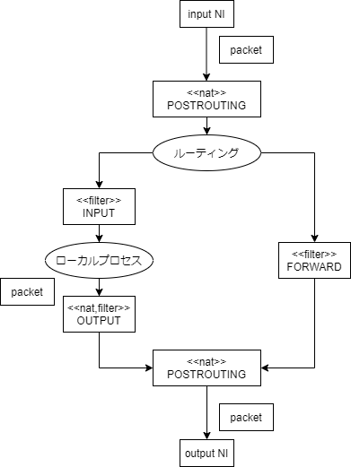

# 14.1 パケットフィルタリング #

- テーブル: 用途別にチェインが複数まとまったもの

| ↓テーブル\チェイン→ | PREROUTING | INPUT | OUTPUT | POSTROUTING | FORWARD |
|-----------------------|------------|-------|--------|-------------|---------|
| filter                |            | o     | o      |             | o       |
| nat                   | o          |       | o      | o           |         |
| mangle                | o          | o     | o      | o           | o       |





チェイン: パケットフィルタリングを行う場所

チェインにルール、ターゲットを記述してパケットフィルタリングを実現する


## 14.1.1 iptablesコマンド ##

CentOS7だとあえて入れないとない

``` sh
sudo yum -y install iptables-services
```

firewalldと競合するのでそちらはstop

``` sh
sudo systemctl stop firewalld && sudo systemctl start iptables
```

一覧

```sh
sudo iptables -L
```

```
Chain INPUT (policy ACCEPT)
target     prot opt source               destination         
ACCEPT     all  --  anywhere             anywhere             state RELATED,ESTABLISHED
ACCEPT     icmp --  anywhere             anywhere            
ACCEPT     all  --  anywhere             anywhere            
ACCEPT     tcp  --  anywhere             anywhere             state NEW tcp dpt:ssh
REJECT     all  --  anywhere             anywhere             reject-with icmp-host-prohibited

Chain FORWARD (policy ACCEPT)
target     prot opt source               destination         
REJECT     all  --  anywhere             anywhere             reject-with icmp-host-prohibited

Chain OUTPUT (policy ACCEPT)
target     prot opt source               destination         
```


FORWARDチェインのPOLICY(デフォルトのターゲット)をDROPに

- いずれのルールにもマッチしなかった時に適用されるターゲット
- DROP: クライアントに通知しない
- cf. REJECTはクライアントに通知する

``` sh
sudo iptables -P FORWARD DROP

sudo iptables -L FORWARD
```

```
Chain FORWARD (policy DROP)
target     prot opt source               destination         
REJECT     all  --  anywhere             anywhere             reject-with icmp-host-prohibited
```


``` sh
sudo iptables -A INPUT -p icmp -s 127.0.0.1/32 -j REJECT

sudo iptables -L INPUT
```

```
Chain INPUT (policy ACCEPT)
target     prot opt source               destination         
ACCEPT     all  --  anywhere             anywhere             state RELATED,ESTABLISHED
ACCEPT     icmp --  anywhere             anywhere            
ACCEPT     all  --  anywhere             anywhere            
ACCEPT     tcp  --  anywhere             anywhere             state NEW tcp dpt:ssh
REJECT     all  --  anywhere             anywhere             reject-with icmp-host-prohibited
REJECT     icmp --  localhost            anywhere             reject-with icmp-port-unreachable
```

CentOS7ではfirewalldが入っているのでうまく動かなかった

Ubuntuで遊んでみる

``` sh
sudo iptables -A INPUT -p icmp -s 127.0.0.1/32 -j REJECT
ping -c 1 127.0.0.1
```

```
PING 127.0.0.1 (127.0.0.1) 56(84) bytes of data.
PING 127.0.0.1 (127.0.0.1) 56(84) bytes of data.  C-c C-c
--- 127.0.0.1 ping statistics ---
1 packets transmitted, 0 received, 100% packet loss, time 0ms
```

ちゃんとパケットがロスしている、OK

戻しとく

``` sh
sudo iptables -D INPUT -p icmp -s 127.0.0.1/32 -j REJECT
```


## 14.1.2 ポート転送 ##


``` sh
# iptables -A FORWARD -d 172.16.0.2 -p tcp --dport 80 -j ACCEPT
# iptables -t nat -A PREROUTING -p tcp --dport 8080 -i eth1 -j DNAT --to 172.16.0.2:80
```

WANからeth1インタフェース8080/TCPに入ってきたパケットをLANの172.16.0.2:80に転送する例


## 14.1.3 ip6tablesコマンド ##

``` sh
sudo ip6tables -L INPUT
```

```
Chain INPUT (policy ACCEPT)
target     prot opt source               destination         
ACCEPT     all      anywhere             anywhere             ctstate RELATED,ESTABLISHED
ACCEPT     all      anywhere             anywhere            
INPUT_direct  all      anywhere             anywhere            
INPUT_ZONES_SOURCE  all      anywhere             anywhere            
INPUT_ZONES  all      anywhere             anywhere            
DROP       all      anywhere             anywhere             ctstate INVALID
REJECT     all      anywhere             anywhere             reject-with icmp6-adm-prohibited
```

- 文法等は同じ
- IPv6アドレス自体がIPv4と機能面で異なるので注意を要する


# 14.2 ルータの構成 #

## 14.2.1 ルーティングテーブル ##

表示

```sh
route
```

```
Kernel IP routing table
Destination     Gateway         Genmask         Flags Metric Ref    Use Iface
default         gateway         0.0.0.0         UG    100    0        0 eth0
gateway         0.0.0.0         255.255.255.255 UH    100    0        0 eth0
lpic2-study-1.a 0.0.0.0         255.255.255.255 UH    100    0        0 eth0
```

```sh
netstat -r
```

```
Kernel IP routing table
Destination     Gateway         Genmask         Flags   MSS Window  irtt Iface
default         gateway         0.0.0.0         UG        0 0          0 eth0
gateway         0.0.0.0         255.255.255.255 UH        0 0          0 eth0
lpic2-study-1.a 0.0.0.0         255.255.255.255 UH        0 0          0 eth0
```

``` sh
ip route
```

```
default via 10.146.0.1 dev eth0 proto dhcp metric 100 
10.146.0.1 dev eth0 proto dhcp scope link metric 100 
10.146.0.4 dev eth0 proto kernel scope link src 10.146.0.4 metric 100 
```

Linuxをルータとして使用するにはパケットをセグメントを超えてフォワーディングする設定が必要


``` sh
cat /proc/sys/net/ipv4/ip_forward
cat /proc/sys/net/ipv6/conf/all/forwarding
```

```
0
0
```

``` sh
echo 1 | sudo tee /proc/sys/net/ipv4/ip_forward
echo 1 | sudo tee /proc/sys/net/ipv6/conf/all/forwarding
```

- 再起動後も永続化するには`sysctl`等使用する
  - Ret Hat系では`/etc/sysconfig/network`ファイルも使える

## 14.2.2 IPマスカレード ##


`nat`テーブルの`POSTROUTING`チェインで出力インタフェースを指定し、`MASQUERADE`ターゲット指定

``` sh
sudo iptables -t nat -A POSTROUTING -o eth1 -j MASQUERADE
```

WAN側IPアドレスが固定されている場合は`MASQUERADE`ではなく`SNAT`推奨


``` sh
sudo iptables -t nat -A POSTROUTING -s 192.168.0.0/24  -o eth1 -j SNAT 10.1.2.3
```


# 14.3 FTPサーバのセキュリティ #

FTPサーバ有名どころ

- wu-ftpd: UNIX古参
- ProFTPD: httpdみたいに設定できる
- vsftpd: 安全
- Pure-FTPD: セキュリティと実用性重視


## 14.3.1 ProFTPDの設定 ##

``` sh
sudo yum -y install proftpd
```

設定

- `/etc/`直下に入っている

``` sh
sudo cat /etc/proftpd.conf
```

```
# This is the ProFTPD configuration file
#
# See: http://www.proftpd.org/docs/directives/linked/by-name.html

# Security-Enhanced Linux (SELinux) Notes:
#
# In Fedora and Red Hat Enterprise Linux, ProFTPD runs confined by SELinux
# in order to mitigate the effects of an attacker taking advantage of an
# unpatched vulnerability and getting control of the ftp server. By default,
# ProFTPD cannot read or write most files on a system nor connect to many
# external network services, but these restrictions can be relaxed by
# setting SELinux booleans as follows:
#
# setsebool -P allow_ftpd_anon_write=1
#   This allows the ftp daemon to write to files and directories labelled
#   with the public_content_rw_t context type; the daemon would only have
#   read access to these files normally. Files to be made available by ftp
#   but not writeable should be labelled public_content_t.
#
# setsebool -P allow_ftpd_full_access=1
#   This allows the ftp daemon to read and write all files on the system.
#
# setsebool -P allow_ftpd_use_cifs=1
#   This allows the ftp daemon to read and write files on CIFS-mounted
#   filesystems.
#
# setsebool -P allow_ftpd_use_nfs=1
#   This allows the ftp daemon to read and write files on NFS-mounted
#   filesystems.
#
# setsebool -P ftp_home_dir=1
#   This allows the ftp daemon to read and write files in users' home
#   directories.
#
# setsebool -P ftpd_connect_all_unreserved=1
#   This setting is only available from Fedora 16/RHEL-7 onwards, and is
#   necessary for active-mode ftp transfers to work reliably with non-Linux
#   clients (see http://bugzilla.redhat.com/782177), which may choose to
#   use port numbers outside the "ephemeral port" range of 32768-61000.
#
# setsebool -P ftpd_connect_db=1
#   This setting allows the ftp daemon to connect to commonly-used database
#   ports over the network, which is necessary if you are using a database
#   back-end for user authentication, etc.
#
# setsebool -P ftpd_is_daemon=1
#   This setting is available only in Fedora releases 4 to 6 and Red Hat
#   Enterprise Linux 5. It should be set if ProFTPD is running in standalone
#   mode, and unset if running in inetd mode.
#
# setsebool -P ftpd_disable_trans=1
#   This setting is available only in Fedora releases 4 to 6 and Red Hat
#   Enterprise Linux 5, and when set it removes the SELinux confinement of the
#   ftp daemon. Needless to say, its use is not recommended.
#
# All of these booleans are unset by default.
#
# See also the "ftpd_selinux" manpage.
#
# Note that the "-P" option to setsebool makes the setting permanent, i.e.
# it will still be in effect after a reboot; without the "-P" option, the
# effect only lasts until the next reboot.
#
# Restrictions imposed by SELinux are on top of those imposed by ordinary
# file ownership and access permissions; in normal operation, the ftp daemon
# will not be able to read and/or write a file unless *all* of the ownership,
# permission and SELinux restrictions allow it.

# Server Config - config used for anything outside a <VirtualHost> or <Global> context
# See: http://www.proftpd.org/docs/howto/Vhost.html

# Trace logging, disabled by default for performance reasons
# (http://www.proftpd.org/docs/howto/Tracing.html)
#TraceLog			/var/log/proftpd/trace.log
#Trace				DEFAULT:0

ServerName			"ProFTPD server"
ServerIdent			on "FTP Server ready."
ServerAdmin			root@localhost
DefaultServer			on

# Cause every FTP user except adm to be chrooted into their home directory
DefaultRoot			~ !adm

# Use pam to authenticate (default) and be authoritative
AuthPAMConfig			proftpd
AuthOrder			mod_auth_pam.c* mod_auth_unix.c
# If you use NIS/YP/LDAP you may need to disable PersistentPasswd
#PersistentPasswd		off

# Don't do reverse DNS lookups (hangs on DNS problems)
UseReverseDNS			off

# Set the user and group that the server runs as
User				nobody
Group				nobody

# To prevent DoS attacks, set the maximum number of child processes
# to 20.  If you need to allow more than 20 concurrent connections
# at once, simply increase this value.  Note that this ONLY works
# in standalone mode; in inetd mode you should use an inetd server
# that allows you to limit maximum number of processes per service
# (such as xinetd)
MaxInstances			20

# Disable sendfile by default since it breaks displaying the download speeds in
# ftptop and ftpwho
UseSendfile			off

# Define the log formats
LogFormat			default	"%h %l %u %t \"%r\" %s %b"
LogFormat			auth	"%v [%P] %h %t \"%r\" %s"

# Dynamic Shared Object (DSO) loading
# See README.DSO and howto/DSO.html for more details
#
# General database support (http://www.proftpd.org/docs/contrib/mod_sql.html)
#   LoadModule mod_sql.c
#
# Support for base-64 or hex encoded MD5 and SHA1 passwords from SQL tables
# (contrib/mod_sql_passwd.html)
#   LoadModule mod_sql_passwd.c
#
# Mysql support (requires proftpd-mysql package)
# (http://www.proftpd.org/docs/contrib/mod_sql.html)
#   LoadModule mod_sql_mysql.c
#
# Postgresql support (requires proftpd-postgresql package)
# (http://www.proftpd.org/docs/contrib/mod_sql.html)
#   LoadModule mod_sql_postgres.c
#
# SQLite support (requires proftpd-sqlite package)
# (http://www.proftpd.org/docs/contrib/mod_sql.html,
#  http://www.proftpd.org/docs/contrib/mod_sql_sqlite.html)
#   LoadModule mod_sql_sqlite.c
#
# Quota support (http://www.proftpd.org/docs/contrib/mod_quotatab.html)
#   LoadModule mod_quotatab.c
#
# File-specific "driver" for storing quota table information in files
# (http://www.proftpd.org/docs/contrib/mod_quotatab_file.html)
#   LoadModule mod_quotatab_file.c
#
# SQL database "driver" for storing quota table information in SQL tables
# (http://www.proftpd.org/docs/contrib/mod_quotatab_sql.html)
#   LoadModule mod_quotatab_sql.c
#
# LDAP support (requires proftpd-ldap package)
# (http://www.proftpd.org/docs/directives/linked/config_ref_mod_ldap.html)
#   LoadModule mod_ldap.c
#
# LDAP quota support (requires proftpd-ldap package)
# (http://www.proftpd.org/docs/contrib/mod_quotatab_ldap.html)
#   LoadModule mod_quotatab_ldap.c
#
# Support for authenticating users using the RADIUS protocol
# (http://www.proftpd.org/docs/contrib/mod_radius.html)
#   LoadModule mod_radius.c
#
# Retrieve quota limit table information from a RADIUS server
# (http://www.proftpd.org/docs/contrib/mod_quotatab_radius.html)
#   LoadModule mod_quotatab_radius.c
#
# SITE CPFR and SITE CPTO commands (analogous to RNFR and RNTO), which can be
# used to copy files/directories from one place to another on the server
# without having to transfer the data to the client and back
# (http://www.castaglia.org/proftpd/modules/mod_copy.html)
#   LoadModule mod_copy.c
#
# Administrative control actions for the ftpdctl program
# (http://www.proftpd.org/docs/contrib/mod_ctrls_admin.html)
LoadModule mod_ctrls_admin.c
#
# Support for MODE Z commands, which allows FTP clients and servers to
# compress data for transfer
# (http://www.castaglia.org/proftpd/modules/mod_deflate.html)
#   LoadModule mod_deflate.c
#
# Execute external programs or scripts at various points in the process
# of handling FTP commands
# (http://www.castaglia.org/proftpd/modules/mod_exec.html)
#   LoadModule mod_exec.c
#
# Support for POSIX ACLs
# (http://www.proftpd.org/docs/modules/mod_facl.html)
#   LoadModule mod_facl.c
#
# Support for using the GeoIP library to look up geographical information on
# the connecting client and using that to set access controls for the server
# (http://www.castaglia.org/proftpd/modules/mod_geoip.html)
#   LoadModule mod_geoip.c
#
# Allow for version-specific configuration sections of the proftpd config file,
# useful for using the same proftpd config across multiple servers where
# different proftpd versions may be in use
# (http://www.castaglia.org/proftpd/modules/mod_ifversion.html)
#   LoadModule mod_ifversion.c
#
# Configure server availability based on system load
# (http://www.proftpd.org/docs/contrib/mod_load.html)
#   LoadModule mod_load.c
#
# Limit downloads to a multiple of upload volume (see README.ratio)
#   LoadModule mod_ratio.c
#
# Rewrite FTP commands sent by clients on-the-fly,
# using regular expression matching and substitution 
# (http://www.proftpd.org/docs/contrib/mod_rewrite.html)
#   LoadModule mod_rewrite.c
#
# Support for the SSH2, SFTP, and SCP protocols, for secure file transfer over
# an SSH2 connection (http://www.castaglia.org/proftpd/modules/mod_sftp.html)
#   LoadModule mod_sftp.c
#
# Use PAM to provide a 'keyboard-interactive' SSH2 authentication method for
# mod_sftp (http://www.castaglia.org/proftpd/modules/mod_sftp_pam.html)
#   LoadModule mod_sftp_pam.c
#
# Use SQL (via mod_sql) for looking up authorized SSH2 public keys for user
# and host based authentication
# (http://www.castaglia.org/proftpd/modules/mod_sftp_sql.html)
#   LoadModule mod_sftp_sql.c
#
# Provide data transfer rate "shaping" across the entire server
# (http://www.castaglia.org/proftpd/modules/mod_shaper.html)
#   LoadModule mod_shaper.c
#
# Support for miscellaneous SITE commands such as SITE MKDIR, SITE SYMLINK,
# and SITE UTIME (http://www.proftpd.org/docs/contrib/mod_site_misc.html)
#   LoadModule mod_site_misc.c
#
# Provide an external SSL session cache using shared memory
# (contrib/mod_tls_shmcache.html)
#   LoadModule mod_tls_shmcache.c
#
# Provide a memcached-based implementation of an external SSL session cache
# (contrib/mod_tls_memcache.html)
#   LoadModule mod_tls_memcache.c
#
# Use the /etc/hosts.allow and /etc/hosts.deny files, or other allow/deny
# files, for IP-based access control
# (http://www.proftpd.org/docs/contrib/mod_wrap.html)
#   LoadModule mod_wrap.c
#
# Use the /etc/hosts.allow and /etc/hosts.deny files, or other allow/deny
# files, as well as SQL-based access rules, for IP-based access control
# (http://www.proftpd.org/docs/contrib/mod_wrap2.html)
#   LoadModule mod_wrap2.c
#
# Support module for mod_wrap2 that handles access rules stored in specially
# formatted files on disk
# (http://www.proftpd.org/docs/contrib/mod_wrap2_file.html)
#   LoadModule mod_wrap2_file.c
#
# Support module for mod_wrap2 that handles access rules stored in SQL
# database tables (http://www.proftpd.org/docs/contrib/mod_wrap2_sql.html)
#   LoadModule mod_wrap2_sql.c
#
# Implement a virtual chroot capability that does not require root privileges
# (http://www.castaglia.org/proftpd/modules/mod_vroot.html)
# Using this module rather than the kernel's chroot() system call works
# around issues with PAM and chroot (http://bugzilla.redhat.com/506735)
LoadModule mod_vroot.c
#
# Provide a flexible way of specifying that certain configuration directives
# only apply to certain sessions, based on credentials such as connection
# class, user, or group membership
# (http://www.proftpd.org/docs/contrib/mod_ifsession.html)
#   LoadModule mod_ifsession.c

# Allow only user root to load and unload modules, but allow everyone
# to see which modules have been loaded
# (http://www.proftpd.org/docs/modules/mod_dso.html#ModuleControlsACLs)
ModuleControlsACLs		insmod,rmmod allow user root
ModuleControlsACLs		lsmod allow user *

# Enable basic controls via ftpdctl
# (http://www.proftpd.org/docs/modules/mod_ctrls.html)
ControlsEngine			on
ControlsACLs			all allow user root
ControlsSocketACL		allow user *
ControlsLog			/var/log/proftpd/controls.log

# Enable admin controls via ftpdctl
# (http://www.proftpd.org/docs/contrib/mod_ctrls_admin.html)
<IfModule mod_ctrls_admin.c>
  AdminControlsEngine		on
  AdminControlsACLs		all allow user root
</IfModule>

# Enable mod_vroot by default for better compatibility with PAM
# (http://bugzilla.redhat.com/506735)
<IfModule mod_vroot.c>
  VRootEngine			on
</IfModule>

# TLS (http://www.castaglia.org/proftpd/modules/mod_tls.html)
<IfDefine TLS>
  TLSEngine			on
  TLSRequired			on
  TLSRSACertificateFile		/etc/pki/tls/certs/proftpd.pem
  TLSRSACertificateKeyFile	/etc/pki/tls/certs/proftpd.pem
  TLSCipherSuite		ALL:!ADH:!DES
  TLSOptions			NoCertRequest
  TLSVerifyClient		off
  #TLSRenegotiate		ctrl 3600 data 512000 required off timeout 300
  TLSLog			/var/log/proftpd/tls.log
  <IfModule mod_tls_shmcache.c>
    TLSSessionCache		shm:/file=/var/run/proftpd/sesscache
  </IfModule>
</IfDefine>

# Dynamic ban lists (http://www.proftpd.org/docs/contrib/mod_ban.html)
# Enable this with PROFTPD_OPTIONS=-DDYNAMIC_BAN_LISTS in /etc/sysconfig/proftpd
<IfDefine DYNAMIC_BAN_LISTS>
  LoadModule			mod_ban.c
  BanEngine			on
  BanLog			/var/log/proftpd/ban.log
  BanTable			/var/run/proftpd/ban.tab

  # If the same client reaches the MaxLoginAttempts limit 2 times
  # within 10 minutes, automatically add a ban for that client that
  # will expire after one hour.
  BanOnEvent			MaxLoginAttempts 2/00:10:00 01:00:00

  # Inform the user that it's not worth persisting
  BanMessage			"Host %a has been banned"

  # Allow the FTP admin to manually add/remove bans
  BanControlsACLs		all allow user ftpadm
</IfDefine>

# Set networking-specific "Quality of Service" (QoS) bits on the packets used
# by the server (contrib/mod_qos.html)
<IfDefine QOS>
  LoadModule			mod_qos.c
  # RFC791 TOS parameter compatibility
  QoSOptions			dataqos throughput ctrlqos lowdelay
  # For a DSCP environment (may require tweaking)
  #QoSOptions			dataqos CS2 ctrlqos AF41
</IfDefine>

# Global Config - config common to Server Config and all virtual hosts
# See: http://www.proftpd.org/docs/howto/Vhost.html
<Global>

  # Umask 022 is a good standard umask to prevent new dirs and files
  # from being group and world writable
  Umask				022

  # Allow users to overwrite files and change permissions
  AllowOverwrite		yes
  <Limit ALL SITE_CHMOD>
    AllowAll
  </Limit>

</Global>

# A basic anonymous configuration, with an upload directory
# Enable this with PROFTPD_OPTIONS=-DANONYMOUS_FTP in /etc/sysconfig/proftpd
<IfDefine ANONYMOUS_FTP>
  <Anonymous ~ftp>
    User			ftp
    Group			ftp
    AccessGrantMsg		"Anonymous login ok, restrictions apply."

    # We want clients to be able to login with "anonymous" as well as "ftp"
    UserAlias			anonymous ftp

    # Limit the maximum number of anonymous logins
    MaxClients			10 "Sorry, max %m users -- try again later"

    # Put the user into /pub right after login
    #DefaultChdir		/pub

    # We want 'welcome.msg' displayed at login, '.message' displayed in
    # each newly chdired directory and tell users to read README* files. 
    DisplayLogin		/welcome.msg
    DisplayChdir		.message
    DisplayReadme		README*

    # Cosmetic option to make all files appear to be owned by user "ftp"
    DirFakeUser			on ftp
    DirFakeGroup		on ftp

    # Limit WRITE everywhere in the anonymous chroot
    <Limit WRITE SITE_CHMOD>
      DenyAll
    </Limit>

    # An upload directory that allows storing files but not retrieving
    # or creating directories.
    #
    # Directory specification is slightly different if mod_vroot is in
    # use: see http://sourceforge.net/p/proftp/mailman/message/31728570/
    #          https://bugzilla.redhat.com/show_bug.cgi?id=1045922
    <IfModule mod_vroot.c>
      <Directory /uploads/*>
        AllowOverwrite		no
        <Limit READ>
          DenyAll
        </Limit>
  
        <Limit STOR>
          AllowAll
        </Limit>
      </Directory>
    </IfModule>
    <IfModule !mod_vroot.c>
      <Directory uploads/*>
        AllowOverwrite		no
        <Limit READ>
          DenyAll
        </Limit>
  
        <Limit STOR>
          AllowAll
        </Limit>
      </Directory>
    </IfModule>

    # Don't write anonymous accesses to the system wtmp file (good idea!)
    WtmpLog			off

    # Logging for the anonymous transfers
    ExtendedLog			/var/log/proftpd/access.log WRITE,READ default
    ExtendedLog			/var/log/proftpd/auth.log AUTH auth

  </Anonymous>
</IfDefine>
```


## 14.3.2 vsftpdの設定 ##

``` sh
sudo yum -y install vsftpd
```

設定

``` sh
sudo cat /etc/vsftpd/vsftpd.conf
```

```
# Example config file /etc/vsftpd/vsftpd.conf
#
# The default compiled in settings are fairly paranoid. This sample file
# loosens things up a bit, to make the ftp daemon more usable.
# Please see vsftpd.conf.5 for all compiled in defaults.
#
# READ THIS: This example file is NOT an exhaustive list of vsftpd options.
# Please read the vsftpd.conf.5 manual page to get a full idea of vsftpd's
# capabilities.
#
# Allow anonymous FTP? (Beware - allowed by default if you comment this out).
anonymous_enable=YES
#
# Uncomment this to allow local users to log in.
# When SELinux is enforcing check for SE bool ftp_home_dir
local_enable=YES
#
# Uncomment this to enable any form of FTP write command.
write_enable=YES
#
# Default umask for local users is 077. You may wish to change this to 022,
# if your users expect that (022 is used by most other ftpd's)
local_umask=022
#
# Uncomment this to allow the anonymous FTP user to upload files. This only
# has an effect if the above global write enable is activated. Also, you will
# obviously need to create a directory writable by the FTP user.
# When SELinux is enforcing check for SE bool allow_ftpd_anon_write, allow_ftpd_full_access
#anon_upload_enable=YES
#
# Uncomment this if you want the anonymous FTP user to be able to create
# new directories.
#anon_mkdir_write_enable=YES
#
# Activate directory messages - messages given to remote users when they
# go into a certain directory.
dirmessage_enable=YES
#
# Activate logging of uploads/downloads.
xferlog_enable=YES
#
# Make sure PORT transfer connections originate from port 20 (ftp-data).
connect_from_port_20=YES
#
# If you want, you can arrange for uploaded anonymous files to be owned by
# a different user. Note! Using "root" for uploaded files is not
# recommended!
#chown_uploads=YES
#chown_username=whoever
#
# You may override where the log file goes if you like. The default is shown
# below.
#xferlog_file=/var/log/xferlog
#
# If you want, you can have your log file in standard ftpd xferlog format.
# Note that the default log file location is /var/log/xferlog in this case.
xferlog_std_format=YES
#
# You may change the default value for timing out an idle session.
#idle_session_timeout=600
#
# You may change the default value for timing out a data connection.
#data_connection_timeout=120
#
# It is recommended that you define on your system a unique user which the
# ftp server can use as a totally isolated and unprivileged user.
#nopriv_user=ftpsecure
#
# Enable this and the server will recognise asynchronous ABOR requests. Not
# recommended for security (the code is non-trivial). Not enabling it,
# however, may confuse older FTP clients.
#async_abor_enable=YES
#
# By default the server will pretend to allow ASCII mode but in fact ignore
# the request. Turn on the below options to have the server actually do ASCII
# mangling on files when in ASCII mode. The vsftpd.conf(5) man page explains
# the behaviour when these options are disabled.
# Beware that on some FTP servers, ASCII support allows a denial of service
# attack (DoS) via the command "SIZE /big/file" in ASCII mode. vsftpd
# predicted this attack and has always been safe, reporting the size of the
# raw file.
# ASCII mangling is a horrible feature of the protocol.
#ascii_upload_enable=YES
#ascii_download_enable=YES
#
# You may fully customise the login banner string:
#ftpd_banner=Welcome to blah FTP service.
#
# You may specify a file of disallowed anonymous e-mail addresses. Apparently
# useful for combatting certain DoS attacks.
#deny_email_enable=YES
# (default follows)
#banned_email_file=/etc/vsftpd/banned_emails
#
# You may specify an explicit list of local users to chroot() to their home
# directory. If chroot_local_user is YES, then this list becomes a list of
# users to NOT chroot().
# (Warning! chroot'ing can be very dangerous. If using chroot, make sure that
# the user does not have write access to the top level directory within the
# chroot)
#chroot_local_user=YES
#chroot_list_enable=YES
# (default follows)
#chroot_list_file=/etc/vsftpd/chroot_list
#
# You may activate the "-R" option to the builtin ls. This is disabled by
# default to avoid remote users being able to cause excessive I/O on large
# sites. However, some broken FTP clients such as "ncftp" and "mirror" assume
# the presence of the "-R" option, so there is a strong case for enabling it.
#ls_recurse_enable=YES
#
# When "listen" directive is enabled, vsftpd runs in standalone mode and
# listens on IPv4 sockets. This directive cannot be used in conjunction
# with the listen_ipv6 directive.
listen=NO
#
# This directive enables listening on IPv6 sockets. By default, listening
# on the IPv6 "any" address (::) will accept connections from both IPv6
# and IPv4 clients. It is not necessary to listen on *both* IPv4 and IPv6
# sockets. If you want that (perhaps because you want to listen on specific
# addresses) then you must run two copies of vsftpd with two configuration
# files.
# Make sure, that one of the listen options is commented !!
listen_ipv6=YES

pam_service_name=vsftpd
userlist_enable=YES
tcp_wrappers=YES
```


## 14.3.3 FTPサーバのアクセス制御 ##

`/etc/ftpusers`ファイルでFTPログイン**を許可しない**ユーザを設定

``` sh
cat /etc/ftpusers
```

```
root
bin
daemon
adm
lp
sync
shutdown
halt
mail
operator
nobody
dbus
ntp
sshd
postfix
tcpdump
named
apache
saslauth
squid
radvd
ldap
tss
dovecot
rpc
rpcuser
```


``` sh
sudo cat /etc/vsftpd/ftpusers
```

```
# Users that are not allowed to login via ftp
root
bin
daemon
adm
lp
sync
shutdown
halt
mail
news
uucp
operator
games
nobody
```


加えてディレクトリ制限: chroot jail


`/etc/proftpd.conf`


DefaultRoot			~ !adm


`/etc/vsftpd.conf`

```
# You may specify an explicit list of local users to chroot() to their home
# directory. If chroot_local_user is YES, then this list becomes a list of
# users to NOT chroot().
# (Warning! chroot'ing can be very dangerous. If using chroot, make sure that
# the user does not have write access to the top level directory within the
# chroot)
#chroot_local_user=YES
#chroot_list_enable=YES
# (default follows)
#chroot_list_file=/etc/vsftpd/chroot_list
```


## 14.3.4 Pure-FTPDの設定 ##

```sh
sudo yum -y install pure-ftpd
```

設定ファイル

```sh
ls /etc/pure-ftpd/
```

```
pure-ftpd.conf	pureftpd-ldap.conf  pureftpd-mysql.conf  pureftpd-pgsql.conf
```

``` sh
cat /etc/pure-ftpd/pure-ftpd.conf
```

```

############################################################
#                                                          #
#             Configuration file for pure-ftpd             #
#                                                          #
############################################################

# If you want to run Pure-FTPd with this configuration
# instead of command-line options, please run the
# following command :
#
# /usr/sbin/pure-ftpd /etc/pure-ftpd/pure-ftpd.conf
#
# Online documentation:
# https://www.pureftpd.org/project/pure-ftpd/doc


# Restrict users to their home directory

ChrootEveryone               yes


# If the previous option is set to "no", members of the following group
# won't be restricted. Others will be. If you don't want chroot()ing anyone,
# just comment out ChrootEveryone and TrustedGID.

# TrustedGID                   100


# Turn on compatibility hacks for broken clients

BrokenClientsCompatibility   no


# Maximum number of simultaneous users

MaxClientsNumber             50


# Run as a background process

Daemonize                    yes


# Maximum number of simultaneous clients with the same IP address

MaxClientsPerIP              8


# If you want to log all client commands, set this to "yes".
# This directive can be specified twice to also log server responses.

VerboseLog                   no


# List dot-files even when the client doesn't send "-a".

DisplayDotFiles              yes


# Disallow authenticated users - Act only as a public FTP server.

AnonymousOnly                no


# Disallow anonymous connections. Only accept authenticated users.

NoAnonymous                  no


# Syslog facility (auth, authpriv, daemon, ftp, security, user, local*)
# The default facility is "ftp". "none" disables logging.

SyslogFacility               ftp


# Display fortune cookies

# FortunesFile                 /usr/share/fortune/zippy


# Don't resolve host names in log files. Recommended unless you trust
# reverse host names, and don't care about DNS resolution being possibly slow.

DontResolve                  yes


# Maximum idle time in minutes (default = 15 minutes)

MaxIdleTime                  15


# LDAP configuration file (see README.LDAP)

# LDAPConfigFile                /etc/pure-ftpd/pureftpd-ldap.conf


# MySQL configuration file (see README.MySQL)

# MySQLConfigFile               /etc/pure-ftpd/pureftpd-mysql.conf


# PostgreSQL configuration file (see README.PGSQL)

# PGSQLConfigFile               /etc/pure-ftpd/pureftpd-pgsql.conf


# PureDB user database (see README.Virtual-Users)

# PureDB                        /etc/pure-ftpd/pureftpd.pdb


# Path to pure-authd socket (see README.Authentication-Modules)

# ExtAuth                       /var/run/ftpd.sock


# If you want to enable PAM authentication, uncomment the following line

PAMAuthentication             yes


# If you want simple Unix (/etc/passwd) authentication, uncomment this

# UnixAuthentication           yes


# Please note that LDAPConfigFile, MySQLConfigFile, PAMAuthentication and
# UnixAuthentication can be used specified once, but can be combined
# together. For instance, if you use MySQLConfigFile, then UnixAuthentication,
# the SQL server will be used first. If the SQL authentication fails because the
# user wasn't found, a new attempt will be done using system authentication.
# If the SQL authentication fails because the password didn't match, the
# authentication chain stops here. Authentication methods are chained in
# the order they are given.


# 'ls' recursion limits. The first argument is the maximum number of
# files to be displayed. The second one is the max subdirectories depth.

LimitRecursion               10000 8


# Are anonymous users allowed to create new directories?

AnonymousCanCreateDirs       no


# If the system load is greater than the given value, anonymous users
# aren't allowed to download.

MaxLoad                      4


# Port range for passive connections - keep it as broad as possible.

# PassivePortRange             30000 50000


# Force an IP address in PASV/EPSV/SPSV replies. - for NAT.
# Symbolic host names are also accepted for gateways with dynamic IP
# addresses.

# ForcePassiveIP               192.168.0.1


# Upload/download ratio for anonymous users.

# AnonymousRatio               1 10


# Upload/download ratio for all users.
# This directive supersedes the previous one.

# UserRatio                    1 10


# Disallow downloads of files owned by the "ftp" system user;
# files that were uploaded but not validated by a local admin.

AntiWarez                    yes


# IP address/port to listen to (default=all IP addresses, port 21).

# Bind                         127.0.0.1,21


# Maximum bandwidth for anonymous users in KB/s

# AnonymousBandwidth           8


# Maximum bandwidth for *all* users (including anonymous) in KB/s
# Use AnonymousBandwidth *or* UserBandwidth, not both.

# UserBandwidth                8


# File creation mask. <umask for files>:<umask for dirs> .
# 177:077 if you feel paranoid.

Umask                        133:022


# Minimum UID for an authenticated user to log in.
# For example, a value of 100 prevents all users whose user id is below
# 100 from logging in. If you want "root" to be able to log in, use 0.

MinUID                      1000


# Do not use the /etc/ftpusers file to disable accounts. We're already
# using MinUID to block users with uid < 1000

UseFtpUsers no


# Allow FXP transfers for authenticated users.

AllowUserFXP                 no


# Allow anonymous FXP for anonymous and non-anonymous users.

AllowAnonymousFXP            no


# Users can't delete/write files starting with a dot ('.')
# even if they own them. But if TrustedGID is enabled, that group
# will exceptionally have access to dot-files.

ProhibitDotFilesWrite        no


# Prohibit *reading* of files starting with a dot (.history, .ssh...)

ProhibitDotFilesRead         no


# Don't overwrite files. When a file whose name already exist is uploaded,
# it gets automatically renamed to file.1, file.2, file.3, ...

AutoRename                   no


# Prevent anonymous users from uploading new files (no = upload is allowed)

AnonymousCantUpload         yes


# Only connections to this specific IP address are allowed to be
# non-anonymous. You can use this directive to open several public IPs for
# anonymous FTP, and keep a private firewalled IP for remote administration.
# You can also only allow a non-routable local IP (such as 10.x.x.x) for
# authenticated users, and run a public anon-only FTP server on another IP.

# TrustedIP                    10.1.1.1


# To add the PID to log entries, uncomment the following line.

# LogPID                       yes


# Create an additional log file with transfers logged in a Apache-like format :
# fw.c9x.org - jedi [13/Apr/2017:19:36:39] "GET /ftp/linux.tar.bz2" 200 21809338
# This log file can then be processed by common HTTP traffic analyzers.

AltLog                     clf:/var/log/pureftpd.log


# Create an additional log file with transfers logged in a format optimized
# for statistic reports.

# AltLog                     stats:/var/log/pureftpd.log


# Create an additional log file with transfers logged in the standard W3C
# format (compatible with many HTTP log analyzers)

# AltLog                     w3c:/var/log/pureftpd.log


# Disallow the CHMOD command. Users cannot change perms of their own files.

# NoChmod                      yes


# Allow users to resume/upload files, but *NOT* to delete them.

# KeepAllFiles                 yes


# Automatically create home directories if they are missing

# CreateHomeDir                yes


# Enable virtual quotas. The first value is the max number of files.
# The second value is the maximum size, in megabytes.
# So 1000:10 limits every user to 1000 files and 10 MB.

# Quota                        1000:10


# If your pure-ftpd has been compiled with standalone support, you can change
# the location of the pid file. The default is /var/run/pure-ftpd.pid

#PIDFile                     /var/run/pure-ftpd.pid


# If your pure-ftpd has been compiled with pure-uploadscript support,
# this will make pure-ftpd write info about new uploads to
# /var/run/pure-ftpd.upload.pipe so pure-uploadscript can read it and
# spawn a script to handle the upload.
# Don't enable this option if you don't actually use pure-uploadscript.

# CallUploadScript             yes


# This option is useful on servers where anonymous upload is
# allowed. When the partition is more that percententage full,
# new uploads are disallowed.

MaxDiskUsage                   99


# Set to 'yes' to prevent users from renaming files.

# NoRename                     yes


# Be 'customer proof': forbids common customer mistakes such as
# 'chmod 0 public_html', that are valid, but can cause customers to
# unintentionally shoot themselves in the foot.

CustomerProof                yes


# Per-user concurrency limits. Will only work if the FTP server has
# been compiled with --with-peruserlimits.
# Format is: <max sessions per user>:<max anonymous sessions>
# For example, 3:20 means that an authenticated user can have up to 3 active
# sessions, and that up to 20 anonymous sessions are allowed.

# PerUserLimits                3:20


# When a file is uploaded and there was already a previous version of the file
# with the same name, the old file will neither get removed nor truncated.
# The file will be stored under a temporary name and once the upload is
# complete, it will be atomically renamed. For example, when a large PHP
# script is being uploaded, the web server will keep serving the old version and
# later switch to the new one as soon as the full file will have been
# transferred. This option is incompatible with virtual quotas.

# NoTruncate                   yes


# This option accepts three values:
# 0: disable SSL/TLS encryption layer (default).
# 1: accept both cleartext and encrypted sessions.
# 2: refuse connections that don't use the TLS security mechanism,
#    including anonymous sessions.
# Do _not_ uncomment this blindly. Double check that:
# 1) The server has been compiled with TLS support (--with-tls),
# 2) A valid certificate is in place,
# 3) Only compatible clients will log in.

# TLS                          1


# Cipher suite for TLS sessions.
# The default suite is secure and setting this property is usually
# only required to *lower* the security to cope with legacy clients.
# Prefix with -C: in order to require valid client certificates.
# If -C: is used, make sure that clients' public keys are present on
# the server.

# TLSCipherSuite               HIGH


# Certificate file, for TLS

# CertFile                     /etc/ssl/private/pure-ftpd.pem


# Listen only to IPv4 addresses in standalone mode (ie. disable IPv6)
# By default, both IPv4 and IPv6 are enabled.

# IPV4Only                     yes


# Listen only to IPv6 addresses in standalone mode (i.e. disable IPv4)
# By default, both IPv4 and IPv6 are enabled.

# IPV6Only                     yes


# UTF-8 support for file names (RFC 2640)
# Set the charset of the server filesystem and optionally the default charset
# for remote clients that don't use UTF-8.
# Works only if pure-ftpd has been compiled with --with-rfc2640

# FileSystemCharset                big5
# ClientCharset                    big5
```

後述のパッシブモードに関連するオプション(抜粋)

```
# Port range for passive connections - keep it as broad as possible.

# PassivePortRange             30000 50000


# Force an IP address in PASV/EPSV/SPSV replies. - for NAT.
# Symbolic host names are also accepted for gateways with dynamic IP
# addresses.

# ForcePassiveIP               192.168.0.1
```

## 14.3.5 パッシブモード ##

FTPはサーバ側TCP/20,21ポートを使うといわれる

- 20: データ転送
- 21: 制御用

実際には20は使わなかったりするよという話

https://www.infraexpert.com/study/tcpip20.html

アクティブモード

1. c:ephemeral1 -> server:21 制御TCPコネクション
    - クライアントはデータコネクションで使用するephemeral portをサーバに通知
1. c:ephemeral2 <- server:20 データTCPコネクション
    - クライアントのLISTENポートは毎回変わる
    - inboundファイアウォールを越えられないことがある

パッシブモード

1. c:ephemeral1 -> server:21 制御TCPコネクション
   - サーバはデータコネクションで使用するephemeral portをクライアントに通知
1. c:ephemeral2 -> server:ephemeral データTCPコネクション
    - クライアントからoutboundなのでファイアウォールに阻まれない


## 14.3.6 匿名FTPサーバ ##

- wu-ftpd: chroot jailで実現する
- ProFTPD: Anonymousディレクティブで設定

```
# A basic anonymous configuration, with an upload directory
# Enable this with PROFTPD_OPTIONS=-DANONYMOUS_FTP in /etc/sysconfig/proftpd
<IfDefine ANONYMOUS_FTP>
  <Anonymous ~ftp>
    User			ftp
    Group			ftp

...
    # Limit WRITE everywhere in the anonymous chroot
    <Limit WRITE SITE_CHMOD>
      DenyAll
    </Limit>

    # An upload directory that allows storing files but not retrieving
    # or creating directories.
    #
    # Directory specification is slightly different if mod_vroot is in
    # use: see http://sourceforge.net/p/proftp/mailman/message/31728570/
    #          https://bugzilla.redhat.com/show_bug.cgi?id=1045922
    <IfModule mod_vroot.c>
      <Directory /uploads/*>
        AllowOverwrite		no
        <Limit READ>
          DenyAll
        </Limit>
  
        <Limit STOR>
          AllowAll
        </Limit>
      </Directory>
    </IfModule>
```

- Anonymousディレクティブ内のLimitディレクティブでアクセス制御
  - READ: ダウンロード
  - WRITE: 書き込み
  - STOR: アップロード


- vsftpd

```
# Allow anonymous FTP? (Beware - allowed by default if you comment this out).
anonymous_enable=YES

# Uncomment this to allow the anonymous FTP user to upload files. This only
# has an effect if the above global write enable is activated. Also, you will
# obviously need to create a directory writable by the FTP user.
# When SELinux is enforcing check for SE bool allow_ftpd_anon_write, allow_ftpd_full_access
#anon_upload_enable=YES
#
# Uncomment this if you want the anonymous FTP user to be able to create
# new directories.
#anon_mkdir_write_enable=YES
```

- `anonymous_enable=YES`: 匿名FTP許可
- `anon_upload_enable=YES`: 匿名ユーザによるアップロード許可
- `anon_mkdir_write_enable=YES`: 匿名ユーザによるディレクトリ作成等許可


