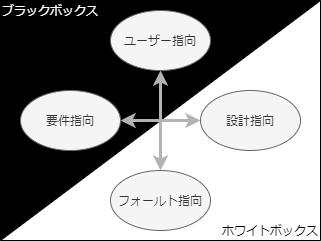
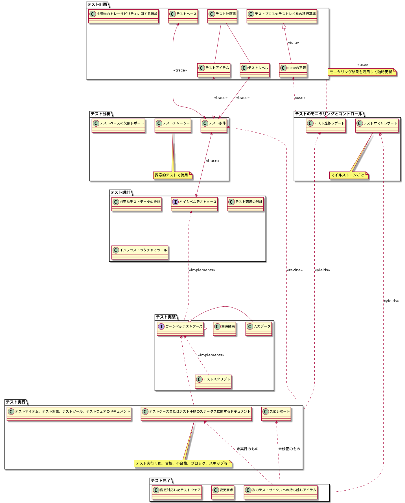

# 1.4 基本的なテストプロセス #

## 1.4.1 状況に応じたテストプロセス ##

### テストプロセス ###

万能なものはないという大前提のもと、テストの目的を達しやすい活動のセット

以下のような変数に応じてテーラリングして使用する:

- ソフトウェア開発ライフサイクルモデルとプロジェクト方法論
  - 組織の規模、体制による
  - プロジェクト管理が独自かPMBOK等をテーラリングしたものか
- プロダクトとプロジェクトのリスク
  - Webか産業機械のソフトウェアか等によって違ってくる(人が死ぬかどうかとか)
- ビジネスドメイン
- プロジェクト個別の運用上の制約
  - 予算規模
  - 開発期間
  - 複雑さ
  - 契約上、法律上の要件や標準

テストベースに対して計測可能なカバレッジ基準を定義し、KPIとして仕様すると効果的

- テストベース: コンポーネント要件やシステム要件を推測できるすべてのドキュメント

## 1.4.2 テストの活動とタスク ##

- テスト計画
- テストのモニタリングとコントロール
- テスト分析
- テスト設計
- テスト実装
- テスト実行
- テスト完了

### テスト計画 ###

これをしないと:

- 漏れる
- 時間が足りなくなる
- 故障を見落とす

合理的で効率的なテストにするためにテスト計画が欠かせない

- 制約の中でテストの目的を達成するためのアプローチを定義する
- 「テストのモニタリング」のメトリクスを定義する
- 「テストのモニタリングとコントロール」からのフィードバックに応じて、計画を随時更新
- 「テストのモニタリングとコントロール」の終了基準(doneの定義)を定義する

### テストのモニタリングとコントロール ###

doneの定義に達するまで継続する(か、ステークホルダーの判断で中止する)

#### モニタリング ####

- テスト計画で定義したメトリクスに基づいて、テストの進捗の計画値・実績値を継続的に比較する
- モニタリング結果に基づいて計画からの逸脱を発見する
- テスト進捗レポートをステークホルダーへ伝える
  - テストの中止等を意志決定する

#### コントロール ####

- テスト計画に沿うように軌道修正する
- テスト計画そのものを継続的に更新する

### テスト分析 ###

「何をテストするか」

後続の「テスト設計」の入力となるテストベースをここで分析し欠陥検出する

- 例: BDDやATDDではユーザーストーリーや受け入れ基準からテスト条件やテストケースを作成し、要件の妥当性確認ができる

ホワイトボックス、ブラックボックス、経験ベースのテスト技法が有用

- 重要なテスト条件の欠落防止
- 精度と正確性の高いテスト条件の特定

#### テストベースを分析 ####

テストレベルごとに適切なものが異なる

- 要件仕様
- 設計・実装情報
- 実装そのもの
- リスク分析レポート

##### テストベースの欠陥の種類 #####

- 曖昧
  - テスト実施者の主観によりテスト結果が変わってしまわないか？
- 欠落
- 不整合
- 不正確
- 矛盾
- 冗長なステートメント
  - どこまで仕様でどこまで制約かが不明瞭、といったことが起こりがち

#### テスト可能なフィーチャとフィーチャのセットを識別 ####

- フィーチャ: 要求仕様ドキュメントで、明示的、暗示的に規定したコンポーネントやシステムの機能的価値(たとえば、信頼性、使用性、設計上の制約など)
- 【所感】featureなのに非機能要件…？訳が怪しい

#### 各フィーチャのテスト条件を決めて優先度を割り当てる ####

- テスト条件: コンポーネントやシステムのアイテムやイベントで、テストケースにより検証できるもの
  - 例: 機能、トランザクション、フィーチャ、品質の属性、構造要素等
- 機能/非機能/構造の特性、ビジネス/技術的要因、リスクのレベルを考慮して決める

#### テストベースの各要素と関連するテスト条件の間に双方向のトレーサビリティを確立する ####

### テスト設計 ###

テスト分析の結果を「どうテストするか」

後続の「テスト実装」の入力の欠陥を検出する

#### テストケースとテストケースのセットを設計し優先度を割り当てる ####

- テストケース: 入力値、実行事前条件、期待結果、実行事後条件のセット
  - 【補】xUnitのtestメソッドがこれにあたる
  - ただし、この時点では入力データ・期待結果のないハイレベルテストケースとする
- 上流で識別したテスト条件を網羅するようにテストケースを設計する
  - 要件や仕様に対するカバレッジ
  - ソフトウェアの構造に対するカバレッジ

#### テスト設計の視点 ####

Ostrandの区分け

- ユーザー指向/フォールト指向
  - 利用する視点で見るか、欠陥を見つける視点で見るか
- 要件指向/設計指向
  - 要件の妥当性を見るか、設計通りにテスト対象が動作することを見るか

#### テスト条件とテストケースを支援するために必要なテストデータを識別する ####

- コンポーネントテストでは自動生成データ、システムテストでは実測データや本番データを用いる等

#### テスト環境を設計し、必要なインフラストラクチャやツールを識別する ####

- 開発環境/テスト環境の分離の検討
- 組み込み分野の場合、そもそもテストに「冶具」が必要だったりする
- 品質とコストのトレードオフで、「やらない」という判断もありうる

#### テストベース、テスト条件、テストケースの間で双方向のトレーサビリティを確立する ####

### テスト実装 ###

テスト設計の結果を受けて「テストの実行に必要なものすべての準備」を行う

テスト実装者・実行者の必要スキルの定義がまず必要

- テストツールやテストスクリプトを実装するためのプログラミングスキル
- 特定のドメインスキル

テスト設計と同時に行うこともある

- とくに探索的テストの場合、テストチャーターをもとに後述のテスト実行と一緒に行う

#### テスト手順を開発して優先度を割り当てる。自動化テストスクリプトを作成することもある ####

自動化にもいろいろなアプローチがある

- 手作業を自動化
- テストケースやテスト手順の自動生成

#### テスト手順や自動化テストスクリプトからテストスイートを作成する ####

- テストスイート: あるSUTに対するテストケースのセット
- テストハーネスの用意もここ
  - テストハーネス: スタブやドライバからなるテスト環境

#### 効率的にテスト実行ができるように、テスト実行スケジュール内でテストスイートを調整する ####

基本は前工程までで定めた優先度に準拠するがその限りではない

- 複数のテスト条件を1つのテストケースでまかなうことがある
- 前準備・後始末の都合を考えて効率が良くなるよう組み立てる
- 異常パターン検証用にテストケースをまとめるなどする

テスト実行効率に影響するのでテスト実行責任者がテストスイートを作ることが多い

#### テスト環境構築 ####

- テストハーネス、サービスの仮想化、シミュレーター、およびその他のインフラストラクチャアイテム含み、すべてが正しくセットアップされていること

#### テストデータを準備し、テスト環境に適切に読み込ませてあることを確認 ####

- 本番環境のデータを使うのか
- 個人情報は隠すのか
- ソースコードから入力データを自動生成するのか

など

#### テストベース、テスト条件、テストケース、テスト手順、テストスイートの間での双方向トレーサビリティ検証・更新 ####

### テスト実行 ###

テスト実行スケジュールにしたがってテストスイートを実行する

#### テストアイテムまたはテスト対象、テストツール、テストウェアのIDとバージョンを記録する ####

- テスト対象: いわゆるSUTのこと
- テストアイテム: SUTの個々の要素

きょうび全部自動でログに残せたりする

#### 手動で、またはテスト実行ツールを使用してテスト実行する ####

#### 実行結果と期待する結果を比較する ####

#### 不正を分析して、可能性のある原因を特定する ####

- 不正(anomaly): 期待する結果と異なること
- 偽陽性が発生することもある

#### 故障を観察し、観察に基づいて欠陥を報告する ####

- ISTQB用語では「**欠陥**レポート」という
- つまり、報告内容は故障として観察された直接的な事象にとどまらない
  - 他の要因で同一の問題が起きるか
  - 当該テストケース以外にも影響が出ていないか
 

#### テスト実行の結果を記録する(合格、不合格、ブロック) ####

- ブロック: テストが外部要因により阻まれている

#### 不正への対応の結果、または計画したテストの一環として、テスト活動を繰り返す ####

- 修正したテストケースによるテスト
- 確認テスト
  - 欠陥の修正後、故障が起きなくなったことを確認するためのテスト
- リグレッションテスト

#### テストベース、テスト条件、テストケース、テスト手順、テスト結果の間で双方向のトレーサビリティを検証し更新する ####

### テスト完了 ###

情報すべてをまとめる

- 完了したテストの全活動のデータ
- プロジェクトから得たこと
- テストウェア

テスト終了基準の例

- カバレッジ(要件/仕様、コード)
- 非機能要件に対するテストは実稼働を想定したものとなっているか
- 組み合わせ要因を十分に網羅できているか
- バグ管理図上、テストケースの消化率と欠陥の検出が想定どおりであるか
- 欠陥が収束しているか
- 検出した欠陥はテストの目的で狙ったとおりのものか。例えばコンポーネントテストで検出されるべき故障が統合テストで多く出ていないか

テスト計画段階で定められた終了基準自体が進捗いかんで見直されることも当然ある

テスト完了プロセスの実施タイミングの例

- リリース時
- テストプロジェクト完了/打ち切り時
- アジャイルのイテレーション完了時
- テストレベルが完了時
- メンテナンス版リリース完了時

#### すべての欠陥レポートがクローズしていることを確認する。またはテスト実行の終了時に未解決として残されている欠陥について変更要求またはプロダクトバックログアイテムを作成する ####

#### テストサマリーレポートを作成して、ステークホルダーに提出する ####

- 「テスト完了レポート」
- テストレベルにを終わらせた後に影響を受ける関係各位への状況報告
- 「開発者」のこともある

#### テスト環境、テストデータ、テストインフラストラクチャ、その他のテストウェアを次回も使えるように整理し保管する ####

#### テストウェアをメンテナンスチーム、他のプロジェクトチーム、その使用により利益を得る可能性のある他のステークホルダーに引き継ぐ ####

#### 完了したテスト活動から得られた教訓を分析し、次回のイテレーションやリリース、プロジェクトのために必要な変更を決定する、収集した情報をテストプロセスの成熟度を改善するために利用する ####

- 当該テストレベルのステークホルダー各位が集まりpostmortemを開催する
- 「その場限りの振り返り」で終わらせず、改善につなげる
  - 議事録やアクションアイテムリストの作成
  - 組織ぐるみでとりくむ

## 1.4.3 テスト作業成果物 ##

各テストプロセスの成果物の概念クラス図

### テスト計画の作業成果物 ###

- テスト計画書
  - テストベースに関する情報
- テストのモニタリングとコントロールで使用するdoneの定義

### テストのモニタリングとコントロールの作業成果物 ###

- 種々のテストレポート
  - テスト進捗レポート
  - テストサマリレポート

### テスト分析の作業成果物 ###

- 優先順位をつけたテスト条件
- 探索的テストの場合: テストチャーター(テストの目的・目標)
- テストベースの欠陥レポート

### テスト設計の作業成果物 ###

- ハイレベルテストケース(のセット)
  - 具体的な入力データ/期待結果のないテストケース
  - テストサイクルに応じて具体的な値を設定して再利用できる
- 必要なテストデータの設計、識別
- テスト環境の設計
- インフラストラクチャとツールの識別

### テスト実装の作業成果物 ###

- テスト手順、順序付け
- テストスイート
  - 実行可能なローレベルテストケースからなる
- テスト実行スケジュール
- より洗練されたテスト条件

### テスト実行の作業成果物 ###

- テストケース・テスト手順のステータスに関するドキュメント
  - テスト実行可能
  - 合格
  - 不合格
  - ブロック
  - スキップ
  - etc.
- 欠陥レポート
- テストアイテム、テスト対象、テストツール、テストウェアに関するドキュメント

### テスト完了の作業成果物 ###

- テストサマリーレポート
- 後続するプロジェクトやイテレーションを改善するための...
  - アクションアイテム
  - 変更要求
  - プロダクトバックログアイテム
  - 変更対応版テストウェア

## 1.4.4 テストベースとテスト作業成果物との間のトレーサビリティ ##

トレーサビリティマトリクス、要求管理ツール、ALM: Application Lifecycle Managementツールで確保

得られる情報

- 変更の影響度分析・整合性
  - トレーサビリティがあれば、要求仕様書に変更があったときどのテストケースを変更すべきかわかる
- 合理性
  - 監査を可能にする
- 健全性
  - ITガバナンス基準を満足
- 十分性
  - テストベースのカバレッジ進捗の証明
- 理解性
  - プロダクトの品質やプロジェクトの目的をテストによりどれだけ達成できているか
  - ステークホルダーになじみのある言葉で説明できる

# 1.5 テストの心理学 #

立場によりはたらくバイアスの話

## 1.5.1 人の心理とテスト ##

信頼関係を強化し、心理的なバイアスを軽減する

### 対決ではなく協調姿勢で開始する ###

- 全員のゴールは高品質のシステムであることを再認識するとよい

### テストの利点を強調する ###

> ?「自分の書いたコードは正しいはずだ」(確証バイアス)  
> ?「生産性に寄与していない」  

- 動作確認も兼ねている
- 開発担当者のスキル向上に役立つ
- 時間と経費の節約になる
- プロダクト品質の全体的なリスクが減る

### 中立な立場で事実に焦点をあてて伝える ###

- 個人を非難しない
- 欠陥の発見を誇張しない

客観的かつ事実ベースの欠陥レポートで、欠陥修正の動機づけ・優先度に関する情報を伝える

### 他人の気持ちを理解する ###

- 納期が迫り、すべての欠陥を修正できない場合などがある

### 自分の言ったことを他人が理解し、他人の言ったことを自分が理解していることを確認する ###

- 例えば、故障として観察された事象だけでなく、テスト担当者の期待値や、そのよりどころのテストベースも伝える

## 1.5.2 テスト担当者と開発担当者のマインドセット ##

テスト担当者のマインドセット

- 好奇心
- 悲観的な考え
- 批判的な視点
- 細部まで見逃さない注意力
- 開発者にとって否定的な活動をしつつも良好な関係を維持するためのコミュニケーションスキル

開発担当者は自身でコンポーネントテストを回すことからもある程度テスト担当者のマインドセットに似通っているが...

- 解決策を悲観・批判するというよりは解決策の設計・構築への関心が大きい
- 確証バイアスにより、犯したエラーに気づきづらい

ソフトウェア開発ライフサイクルの違いやプロダクトとプロジェクトのリスクによっても変わってくる

- 岡目八目 -- 大規模開発では、成果物作成者とは独立した異なるテスト担当者がテストを実施すると効果的
  - 異なる観点・認知バイアスをもつ
- セキュリティ、パフォーマンス、ミッションクリティカル等の場合、テスト担当者が専門知識を有していると効果的

