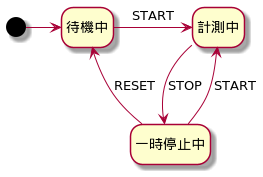

# 4.2 ブラックボックステスト技法つづき #

## 4.2.3 デシジョンテーブルテスト ##

複雑なビジネスロジックの表現に有効

### デシジョンテーブル ###

例: サガフロンティアのアセルス編のエンディング分岐

[参考: アセルス編ED分岐調査報告 (2021/01/29現在)](http://www.uri.sakura.ne.jp/~saga/sf1/story/asellus/tyosa.html)


|                                                           |   |   |   |   |   |   |   |   |   |   |   |   |   |   |   |   |
|-----------------------------------------------------------|---|---|---|---|---|---|---|---|---|---|---|---|---|---|---|---|
| --- 条件 ---                                              |   |   |   |   |   |   |   |   |   |   |   |   |   |   |   |   |
| 1. ラスタバンとの会話時点で妖魔の具足に何か憑依している   | Y | Y | Y | Y | Y | Y | Y | Y | N | N | N | N | N | N | N | N |
| 2. ラスタバンとの会話時点で妖魔の剣に何か憑依している     | Y | Y | Y | Y | N | N | N | N | Y | Y | Y | Y | N | N | N | N |
| 3. ジーナ救出を実行した                                   | Y | Y | N | N | Y | Y | N | N | Y | Y | N | N | Y | Y | N | N |
| 4. オルロワージュとの会話時点で妖魔の剣に何か憑依している | Y | N | Y | N | Y | N | Y | N | Y | N | Y | N | Y | N | Y | N |
| --- アクション ---                                        |   |   |   |   |   |   |   |   |   |   |   |   |   |   |   |   |
| 人間END                                                   |   |   |   |   |   |   |   |   |   |   |   |   |   | X |   |   |
| 半妖END                                                   | X | X |   |   | X | X |   |   | X | X | X | X |   |   | X | X |
| 妖魔END                                                   |   |   | X | X |   |   | X | X |   |   |   |   | X |   |   |   |

記号のゆれ

- `Y`: Yesの意
  - `T`,`1`とも
- `N`: Noの意
  - `F`,`0`とも
- `X`: eXecutableの意
  - `Y`,`T`,`1`とも
- (空白): アクションが発生しないの意
  - `-`,`N`,`F`,`0`とも


言葉の定義

- 行: 条件とアクション
- 列: 規則(ルール)
  - 【所感】列がそのままxUnitのdataProviderになる

booleanか離散値が一般的だが、値の範囲も可


### テーブルの簡単化 ###

列数は最大で(2^条件数)にもなる

間引きたい

- 不可能な条件の組み合わせを含む列
- 可能ではあるが現実的でない条件の組み合わせを含む列
- 結果に影響しない条件の組み合わせをテストする列


#### 例 ####

- 1.から順に判定される
- 1.が成立する場合は、2.が無視される
- 1.が成立しない場合
  - 2.が成立する場合、3.,4.は無視される

という情報が与えられた場合


|                                                           |   |   |   |   |   |   |   |   |   |   |   |   |   |   |   |   |
|-----------------------------------------------------------|---|---|---|---|---|---|---|---|---|---|---|---|---|---|---|---|
| --- 条件 ---                                              |   |   |   |   |   |   |   |   |   |   |   |   |   |   |   |   |
| 1. ラスタバンとの会話時点で妖魔の具足に何か憑依している   | Y | Y | Y | Y | Y | Y | Y | Y | N | N | N | N | N | N | N | N |
| 2. ラスタバンとの会話時点で妖魔の剣に何か憑依している     | - | - | - | - | - | - | - | - | Y | Y | Y | Y | N | N | N | N |
| 3. ジーナ救出を実行した                                   | Y | Y | N | N | Y | Y | N | N | - | - | - | - | Y | Y | N | N |
| 4. オルロワージュとの会話時点で妖魔の剣に何か憑依している | Y | N | Y | N | Y | N | Y | N | - | - | - | - | Y | N | Y | N |
| --- アクション ---                                        |   |   |   |   |   |   |   |   |   |   |   |   |   |   |   |   |
| 人間END                                                   |   |   |   |   |   |   |   |   |   |   |   |   |   | X |   |   |
| 半妖END                                                   | X | X |   |   | X | X |   |   | X | X | X | X |   |   | X | X |
| 妖魔END                                                   |   |   | X | X |   |   | X | X |   |   |   |   | X |   |   |   |

- `-`は「判定に影響しない」の意
  - `N/A`とも(Not Applicable)


|                                                           |   |   |   |   |   |   |   |   |   |
|-----------------------------------------------------------|---|---|---|---|---|---|---|---|---|
| --- 条件 ---                                              |   |   |   |   |   |   |   |   |   |
| 1. ラスタバンとの会話時点で妖魔の具足に何か憑依している   | Y | Y | Y | Y | N | N | N | N | N |
| 2. ラスタバンとの会話時点で妖魔の剣に何か憑依している     | - | - | - | - | Y | N | N | N | N |
| 3. ジーナ救出を実行した                                   | Y | Y | N | N | - | Y | Y | N | N |
| 4. オルロワージュとの会話時点で妖魔の剣に何か憑依している | Y | N | Y | N | - | Y | N | Y | N |
| --- アクション ---                                        |   |   |   |   |   |   |   |   |   |
| 人間END                                                   |   |   |   |   |   |   | X |   |   |
| 半妖END                                                   | X | X |   |   | X |   |   | X | X |
| 妖魔END                                                   |   |   | X | X |   | X |   |   |   |

9列にまで簡単化された


### デシジョンテーブルテスト ###

利点

- 条件の重要な組み合わせのすべてを識別できる
- 要件の欠陥も検出できる


### テストレベル ###

すべてのテストレベルに適用可能

### カバレッジ ###

```
1つ以上のテストケースでテスト実行した規則数/全規則数
```


## 4.2.4 状態遷移テスト ##

テストオブジェクトによっては入力に対して出力が一意に定まらないことがある

- 現在の条件依存
- 過去の履歴依存

### 状態遷移図 ###



有効な遷移だけを表現するのに適する

### 状態遷移表 ###


| E\S   | 待機中 | 計測中     | 一時停止中 |
|-------|--------|------------|------------|
| START | 計測中 | -          | 計測中     |
| STOP  | -      | 一時停止中 | -          |
| RESET | -      | -          | 待機中     |

- 無効な遷移も表現するのに適する
- ほとんどが無効な遷移となる

### 状態遷移テスト ###

代表的な適用例

- メニューベースのアプリケーション
- 組み込み
- 特定の状態をもつビジネスシナリオのモデリング
  - 例: 注文・発送・キャンセル・返金とか
- 画面遷移

「状態」は抽象的

- 数行のコード
- ビジネスプロセス全体(ワークフローなど)


### テストレベル ###

すべてのテストレベルに適用可能


### カバレッジ ###

**2通りのカバレッジ基準がある**

#### 状態のカバレッジ ####

```
テスト実行した状態数/全状態数
```

#### 遷移のカバレッジ ####

```
テスト実行した遷移数/全遷移数
```


## 4.2.5 ユースケーステスト ##

【所感】ICONIXプロセス的なやつ

### ユースケース ###

略

### ユースケースの種類 ###

【補】ユースケースのレベル(水準)の話

cloud/kiteはちょっと違うかも

- Cloud
  - プロジェクト全体の目的に相当
  - 例: 「儲ける」
- Kite
  - Cloud-levelを実現するためのもの
  - 例: 「広告」「注文」「請求」
- Sea
  - ユーザの目的に相当
  - 例: 「商品を注文する」
- Fish
  - Sea-levelを構成するようなsubfunction
  - 例: 「商品カタログを読む」
  - ユーザはカタログを読みたいわけじゃない
- Clam
  - さらに低水準
  - 例: 「注文レコードを永続化する」

ユースケーステストのテスト対象は

- ビジネスレベルで顧客と企業との相互作用を記述するユースケース
- ユーザーとテスト対象のシステムとの相互作用を記述するユースケース

とのこと

Kite,Sea,Fishあたりをテストするのかな多分

### ユースケース記述 ###

略

### ユースケーステスト ###

- ユースケース記述をもとにテストケースを設計する
  - 【補】ICONIXプロセスではさらにユースケース記述と等価なロバストネス図を作図することで、ユースケース記述自体の抜け漏れや曖昧さといった欠陥を検出・修正しながら進める
- 定義済みの振る舞いを実行するようにテスト設計する
  - 基本フロー
  - 代替フロー
  - 例外フロー

### テストレベル ###

下記のテストレベルで効果的

- 受け入れテスト
  - ユースケースのアクターであるユーザーや顧客が参画
- 統合テスト
  - ユースケースのアクターである外部システムとのインタフェース起因の欠陥検出

### カバレッジ ###

```
テスト実行したユースケースの振る舞い数/ユースケースの振る舞い総数
```

