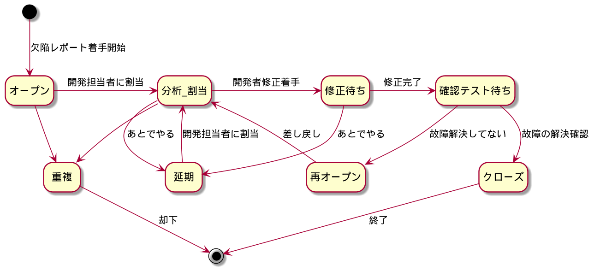

# 5.4 構成管理 #

## 5.4.1 構成管理 ##

CM: Configuration Management

例えば「ソフトウェアプロダクトAのバージョン1.1」を指定して、構成物が間違いなく取り出せる(トレーサビリティがある)状態にコントロールし、記録する

- 実行形式
- その他必要なファイル
- ヘルプ
- マニュアル
- 構築のための情報
  - ソースコード
  - ビルド環境
  - テスト環境
  - ユーザーマニュアル
  - ヘルプ
  - その他パッケージ情報


ソースコードのバージョンコントロールは構成管理を実現するための1つの手段

【所感】ドキュメントにGitのコミットハッシュやrelease tagを記載して紐付けてもよいのかも

### 構成管理の目的 ###

JSTQBシラバスより:

> プロジェクトやプロダクトのライフサイクルを通じて、コンポーネントやシステムの完全性、テストウェア、およびそれら相互の関係を確立し、維持すること

CMMIより:

> 『構成管理』(CM)の目的は、構成の特性、構成制御、構成状況の記録と報告、および構成監査を行って、作業成果物の一貫性を確立し維持することである。

「作業成果物の一貫性を確立し、維持する」とは: 

- 間違ったバージョンのプロダクトを出荷しない
- 違った欠陥の報告を行わない
- 開発のベースバージョンを間違えない
- etc.


もう一つの目的として「差分と履歴の把握」もある


### テストにおける構成管理 ###

構成管理がなってない例

- テスト手順に対してテストデータが見当たらない
- 間違えて古いテスト手順で確認テストして欠陥を見逃した

テストの構成管理もおろそかにしない

【所感】「テストデータどこ？」「これ使ったよ」とかslack上で雑にやりとりするのはCMがなっていない


### テストでの構成管理での対象 ###

- テスト対象(開発側CM)
- ソフトウェアの動作環境
- テストスクリプト、テストデータ
- 欠陥、故障、インシデント
- テスト結果
- ドキュメント
  - テスト計画書
  - 仕様書(開発側CM)
  - マニュアル
  - 評価仕様書
  - テスト手順書
  - 報告書
  - etc.
  
  
CMMIによる例示

- 設計
- テスト計画及び手順
- テスト結果
- インタフェース記述
- 図面
- ソースコード
- ユーザーストーリーまたはストーリーカード
- 宣言された投資対効果の説明、宣言された論理、または宣言された価値
- ツール(例えば、コンパイラ)
- プロセス記述
- 要件


## 5.4.2 テストウェア構成管理の手順 ##

1. 構成管理対象を決める
   - いきなり全部は大変なので規模に応じてできる範囲で
2. 構成管理方法を決める
   - ツールを使用するか
   - 専任者をおくか
   - etc.
3. 記録を残す
4. きちんと管理し、必要なときに参照できるようにする
   - 半端だと恩恵がなく労力だけが残る


# 5.5 リスクとテスト #

## 5.5.1 リスクの定義 ##

書籍によって定義はいろいろ

```
(脅威の)リスク = pair{否定的な結果となる事象が起きる確率, 起きた場合の影響度}
```

とりうる戦略

- 回避
- 転嫁
- 軽減
- 受容

【補】PMBOKなんかでは「好機のリスク」も定義している

- 活用
- 強化
- 共有
- 受容

評価指標としてリスクエクスポージャーや影響度を用いる

```
リスクエクスポージャー = リスクが現実のものとなったときのコスト * 確率
```

【所感】確率が高いものはこれが適していそう。逆に、確率は低いが会社が潰れるようなものは影響度そのもので評価するのが良さそう

## 5.5.2 プロダクトリスクとプロジェクトリスク ##

リスクは2つに大別できる

### プロダクトリスク ###

作業成果物がユーザーやステークホルダーの正当なニーズを満たさないおそれ

つまり、テストが漏れたことにより発生し得る損失や損害に他するリスク

- 仕様通り動かない(incorrect)
  - 損害賠償
- 仕様どおり動くがニーズを満たさない(invalid)、非機能要件を満たさない
  - 信頼感や魅力喪失
- 故障の起きやすいソフトウェアの出荷
  - 改修のコスト
- 人や会社に対する損失
  - PL法にもとづいて瑕疵担保責任を負わされる

### プロジェクトリスク ###

現実のものとなったらプロジェクトの目的達成に悪影響を与えるようなリスク

ヒト・モノ・カネにまつわるようなもの

- プロジェクトの懸念事項
  - 遅延(*)
  - 別プロジェクトに予算とられる
  - 終盤の大規模やり直し(*)
- 組織の懸念事項
  - 人員不足、トレーニング不足(*)
  - 人間関係の衝突(*)
  - 専門家の都合がつかない
- 政治的な懸念事項
  - テストの必要性やテスト結果の十分性が偉い人に伝わらない
  - 組織的にプロセス改善フォローアップできない(*)
  - テスト結果を真摯に受け止めない
- 技術的な懸念事項
  - 要件を十分に定義できない
  - 制約により要件を満たさない(*)
  - テスト環境が予定した期限までに用意できない
  - データ移行の遅れ
  - 開発プロセスの弱点が作業成果物間の整合性や品質に悪影響を与える(*)
  - 不適切な欠陥マネジメントおよび類似の問題によって、欠陥や他の技術的負債が累積する(*)
- 供給者側の懸念事項
  - サードパーティが必要なプロダクトまたはサービスを提供できない、撤退
  - 契約上の懸念事項


【所感】(*)付きは先日までの業務で感じていた問題


## 5.5.3 リスクベースドテストとプロダクト品質 ##

リスクベースのアプローチ: プロダクトリスク分析の結果を使用して以下を行う

- 適用するテスト技法を決める
  - リスクの高いものは網羅率も高く
- 実施するテストレベルおよびテストタイプを決める(「セキュリティテスト」「アクセシビリティテスト」等)
  - テストレベルごとの欠陥密度、欠陥修正のプロジェクトへのインパクト等勘案
- テストを実行する範囲を決める
  - IEサポートすんの？とか
- 重要な欠陥をなるべく早い時期に検出するため、テストの優先順位を決める
  - リリース間際に重大欠陥が出てきた場合、直して遅延するしかなくなる
  - どうでもいいものを後に回すことでQCDのトレードオフの制約を弱める
- テスト以外の活動でリスクを減らす方法があるか検討する
  - 予防措置
  - 例: 開発プロセス定義
  - 例: 経験の少ない設計者に教育を実施する等


# 5.6 欠陥マネジメント #

### 欠陥の特徴 ###

## 5.6.1 欠陥マネジメントの必要性 ##

不正(anomaly): 期待結果と異なる結果

- 欠陥起因の故障であるとは限らないことに留意する(偽陽性)
- テスト担当者は偽陽性を最小限にする必要がある

だいたいこんな流れ

1. 不正が発生したことを認識する
2. 不正を記録する
3. 不正の原因を調査する
4. 影響範囲を分析し、欠陥を分類する
5. 修正が完了するまで待機する
6. 修正が終わったことを確認する


### 欠陥レポート ###

ISO/IEC/IEEE 29119-3 では「インシデントレポート」と呼ばれるが同一のもの

目的

- 開発担当者向け: 期待に反する事象についてのあらゆる情報
  - 開発担当者が欠陥を見つけやすいよう
- テストマネージャ向け: 欠陥の数や状態、修正状況等
  - 作業成果物の品質やテストへの影響を追跡できるよう
- 開発プロセス・テストプロセスの改善のためのヒント


### 欠陥レポートの構成 ###

ISO/IEC/IEEE 29119-3 による典型的な記載事項

- 識別子
- レポート対象の欠陥の件名と概要
- 欠陥レポートの作成日付、作成した組織、作成者
- テストアイテムおよび環境を識別する情報
- 欠陥を観察した開発ライフサイクルフェーズ
- 欠陥の再現と解決のための説明資料
  - ログ
  - DBダンプ
  - スクリーンショット
  - etc.
- 期待結果と実際の結果
  - 【所感】「実際の結果」に主観が混ざって上がってくると切り分けがつらい…
- ステークホルダーに与えるインパクトの範囲や程度(重要度)
- 修正の緊急度/優先度
- 欠陥レポートのステータス(後述)
- 結論、アドバイス、承認
- 広範囲にわたる懸念事項(他の領域へのリグレッション等)
- プロジェクトチームのメンバーによる欠陥の切り分け、修正、確認といった一連の修正履歴
- 問題を明らかにしたテストケースを含む参照情報
  - 【所感】期待結果の基となるテストベースはここからトレーサビリティを辿るのがよいのかな？


### 欠陥マネジメントのプロセス ###

例




