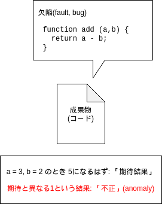

# 教材 #

http://jstqb.jp/syllabus.html#syllabus_foundation

「ISTQBテスト技術者資格制度Foundation Level シラバス 日本語版 Version 2018V3.1.J02」

# 今日の範囲 #

「1. テストの基礎」(175分) (pp.14-27)

会が105分

キリよく「1.3 テストの7原則」くらいまで (p.19)

# 1.1 テストとは何か？ #

### テストをする理由 ###

- 品質未達のリスク

### テストとは何か -- よくある誤解 ###

- 動的テストだけではない
    - <-> 静的テスト
- verification(検証)だけではない
    - verification
        - correct or incorrect (正しいか、正しくないか)
    - validation(妥当性確認)
        - valid or invalid (妥当か、妥当でないか)

参考文献: SEC BOOKS：高信頼化ソフトウェアのための開発手法ガイドブック (2021/02/25現在)

https://www.ipa.go.jp/files/000005144.pdf

> 品質レビューは上流工程の要件定義・基本設計になるほど、  
> テストは下流工程のシステムテストになるほど
> 「妥当性確認」（品質特性での合目的性など）の要素が強くなり、  
> プログラム製造の品質レビューおよび単体テストは  
> 「検証」（品質特性での正確性など）の要素が強くなります。

> テスト活動の編成と実行方法は、ライフサイクルに応じて異なる
 
実際に作ってステークホルダーに触ってもらわないと妥当性が判断つかないこともある -> アジャイル

## 1.1.1 テストに共通する目的 ##

## 1.1.2 テストとデバッグ ##

言葉の定義

言葉の定義から...

- 「故障」はソフトウェアを実行しない限り発生しない
- 「欠陥」は、ソフトウェア以外の「実行しない成果物」についても生じる
  - 「要件同士が不整合を起こしてる」「仕様がバグってる」とか…
  - こぼれ話: 「要件同士の不整合」をなくすための営みとして、開発・設計界隈では **RDRA2.0** や **ICONIX** が知られています 

# 1.2 テストの必要性 #

## 1.2.1 成功に対するテストの貢献 ##

**シフトレフト** の話

あとで詳しく出てきます

## 1.2.2 品質保証とテスト ##

QAとは

- 「このプロセスにのっとって作ればおのずと品質高まるよ」というプロセスを作れるという仮定のもと
- テスト結果を活用して、そのようなプロセスを育てる

ような営み

## 1.2.3 エラー、欠陥、および故障 ##

言葉の定義つづき

--- 

- 不正が見つかったからといって、故障とは限らない

偽陽性(false positive): テストケースの期待結果側が間違っている 

- 欠陥の検出がもれることがある

期待結果も実装と対称に間違っていて、不正としてあらわれない

実装をコピペして作った自動テストなんかで起こりがち…

# 1.3 テストの7原則
