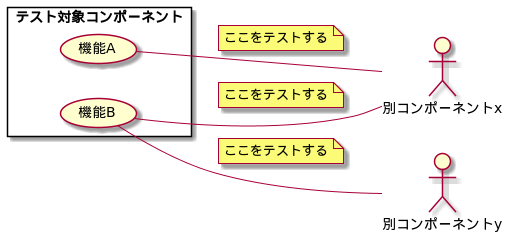
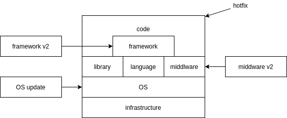

# 教材 #

http://jstqb.jp/syllabus.html#syllabus_foundation

「ISTQBテスト技術者資格制度Foundation Level シラバス 日本語版 Version 2018V3.1.J02」

[ch2 1/2](/2021/01/17/200800/)

[ch2 2/2](/2021/01/18/233300/)

# 今日の範囲 #

「2. ソフトウェア開発ライフサイクル全体を通してのテスト」(100分) (pp.28-44)

会が105分

# 2.2 テストレベル #

## 2.2.2 統合テスト ##

「何を」統合する？

## 2.2.4 受け入れテスト ##

「誰が」「なにを」受け入れる？

- ユーザーがカスタムメイドのシステムを
- 運用担当者がシステムを
- 規制機関がカスタムメイドのシステムの契約・規制準拠を
- 客が市販ソフトを
- システムに市販ソフトウェアを組み込む場合、購入者が市販ソフトウェアを(相互運用性テスト)

V字上は最後ということになっているが、上記のようにさまざまなテストの総称なので実行タイミングもまちまち

# 2.3 テストタイプ #

| レベル\タイプ      | 機能 | 非機能 | WB | 変更関連 |
|--------------------|------|--------|----|----------|
| コンポーネント     |      |        |    |          |
| コンポーネント統合 |      |        |    |          |
| システム           |      |        |    |          |
| システム統合       |      |        |    |          |
| 受け入れ           |      |        |    |          |

全部の組み合わせが可能

cf. 「テスト技法」となると不適な組み合わせは出てくる。

「ユースケーステスト」はコンポーネントテストには適さないとされる

# 2.4 メンテナンス(保守)テスト #

リリース後の変更・移行・廃棄時に実施するテスト

影響を分析してリグレッションを防ぐ
